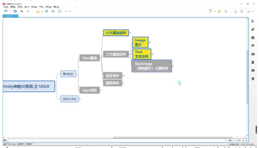
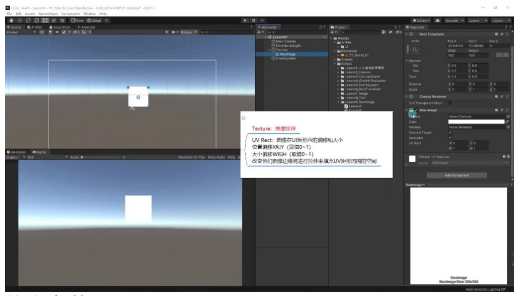
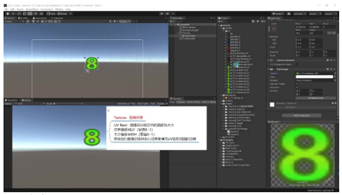
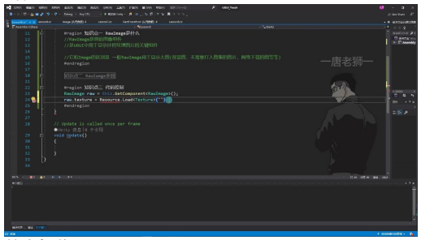
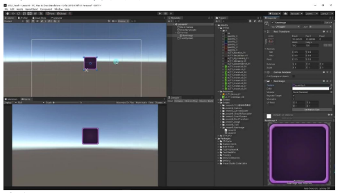

# RawImage原始图像控件

以下为AI生成的图文笔记的内容。

---

## 一、原始图片控件 00:04

### 1. 原始图像组件是什么 00:36




- **定义**：RawImage是UGUI中用于显示任何纹理图片的关键组件
- **主要用途**：
  - 显示大图（如背景图）
  - 显示不需要打入图集的图片
  - 显示网络下载的图片
- **与Image的区别**：
  - Image主要用于显示小UI元素
  - RawImage支持更多图片格式
  - Image的图片会打入图集，RawImage不会

### 2. 原始图像组件参数 01:26





#### 核心参数

| 参数 | 说明 |
|------|------|
| Texture | 可关联任何类型的图片资源，不限于Sprite |
| UV Rect | 控制图像在UI矩形内的偏移和大小 |

**UV Rect参数：**

| 参数 | 说明 | 取值范围 |
|------|------|----------|
| X | 位置偏移（横向） | 0-1 |
| Y | 位置偏移（纵向） | 0-1 |
| W | 大小偏移（宽度） | 0-1 |
| H | 大小偏移（高度） | 0-1 |

#### 其他参数

| 参数 | 说明 |
|------|------|
| Color | 颜色叠加 |
| Material | 材质 |
| Raycast Target | 射线检测 |
| Maskable | 遮罩相关 |

#### UV Rect特点

- 改变参数时图像边缘会拉伸填充
- 实际开发中较少使用
- 主要用于特殊显示需求

### 3. 代码控制 05:15

#### 基本操作

- **获取组件**：
  ```csharp
  RawImage raw = GetComponent<RawImage>();
  ```
- **需要引用命名空间**：
  ```csharp
  using UnityEngine.UI;
  ```

#### 常用控制

- **更换纹理**：
  ```csharp
  raw.texture = Resources.Load<Texture>("路径");
  ```
- **修改UV Rect**：
  ```csharp
  raw.uvRect = new Rect(x, y, w, h);
  ```

#### 资源加载

- 支持加载任意格式的图片资源
- 资源需放在Resources文件夹下
- 路径不需要包含扩展名

#### 使用建议

| 场景 | 推荐组件 |
|------|----------|
| 大图 | RawImage |
| 小UI元素 | Image |
| 网络图片下载后显示 | RawImage |

---

## 二、知识小结

| 知识点 | 核心内容 | 考试重点/易混淆点 | 难度系数 |
|--------|----------|-------------------|----------|
| Raw Image 定义 | Raw Image 是 UGUI 中用于显示任何纹理图片的关键组件，与 Image 的区别在于：适用于大图（如背景图）、未打入图集的图片或网络下载图片，而 Image 主要用于小 UI 元素。 | 与 Image 的区分：Raw Image 支持任意纹理格式（如 Texture、Sprite），而 Image 仅支持 Sprite 且依赖图集。 | ⭐⭐ |
| 参数对比 | Texture 字段：可关联任意类型图片（不限 Sprite）；UVRect：控制图像偏移（XY）和缩放（WH），值范围 0-1，修改后边缘会拉伸填充。 | UVRect 应用场景：默认无需调整，仅特殊需求（如动态裁剪）时使用。 | ⭐⭐ |
| 代码控制 | 通过 `RawImage.texture` 动态加载图片（支持 `Resources.Load` 加载 Texture 或 Sprite）；`uvRect` 可通过 `new Rect(x,y,w,h)` 修改。 | 资源路径问题：需确保图片放置在 Resources 文件夹内，且类型匹配（如 Texture2D）。 | ⭐⭐⭐ |
| 使用场景 | 优先使用 Image：常规 UI 小元素；使用 Raw Image：背景大图、动态下载图片或避免图集冗余时。 | 性能权衡：Raw Image 不依赖图集，但可能增加渲染开销。 | ⭐⭐ |
