# Text文本控件

以下为AI生成的图文笔记的内容。

---

## 一、文本控件 00:04

### 1. 文本控件知识点 00:23

#### 1）Text是什么

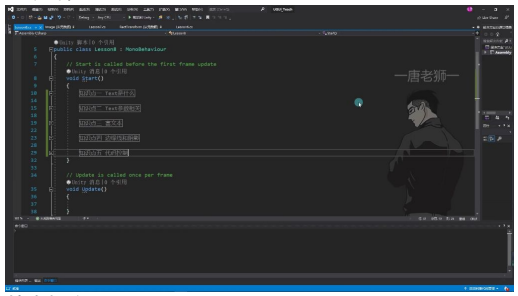
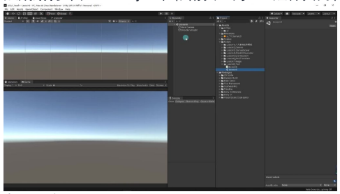
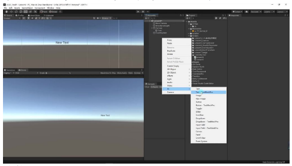

##### 基本概念 00:35

- **组件定义**：Text是Unity UGUI系统中用于显示文本的关键组件
- **创建方式**：在Hierarchy窗口右键 → UI → Text即可创建
- **组成结构**：由GameObject和依附其上的Text组件共同构成

##### 组件类型区分

- **标准Text**：基础文本显示组件
- **TextMeshPro**：高级文本组件（带后缀的变体）
- **学习顺序**：本课程先学习标准Text组件，TextMeshPro将在后续专门课程讲解

##### 核心功能

- **主要用途**：使GameObject能够显示指定的文本内容
- **显示原理**：通过修改Text组件的text属性值来更新显示内容

#### 2）Text参数相关 01:41

##### 文本显示内容 02:04

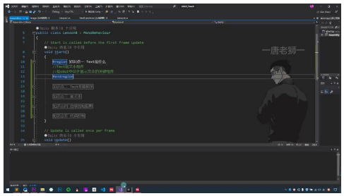
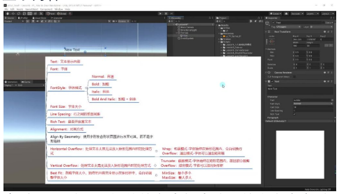
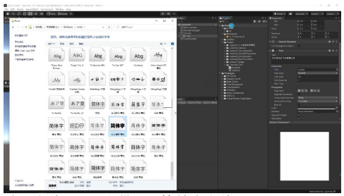

- **实时显示**：在Text组件的文本框中输入的内容会实时显示在Scene和Game窗口中
- **多语言支持**：可以输入中文、英文等各种语言内容，如示例中输入"实时路况的飞机爱斯达克"等测试文本

##### 字体 02:28

- **默认字体**：Unity自带Arial等基本字体
- **添加字体**：
  1. 从网站下载字体文件
  2. 从系统字体文件夹（`C:\Windows\Fonts`）拖入Unity工程Assets文件夹
  3. 示例中演示了导入"华文琥珀"字体的过程
- **应用字体**：将字体文件拖拽到Text组件的Font字段即可改变显示字体

##### 字体样式 03:26

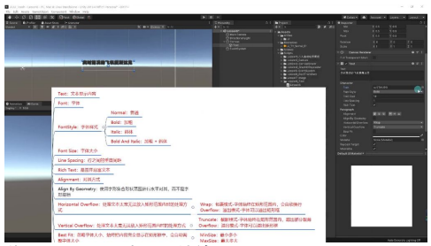
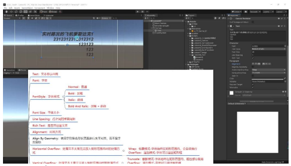

- **普通（Normal）**：默认无特效
- **加粗（Bold）**：使字体变粗，效果因字体而异（华文琥珀加粗后效果不佳）
- **斜体（Italic）**：使字体向右倾斜
- **加粗斜体（Bold And Italic）**：同时应用两种效果

##### 字体大小 04:09

- **调整方式**：直接修改Font Size数值
- **显示限制**：字体过大可能超出RectTransform范围导致不可见，需相应增大UI元素尺寸
- **示例**：将字体从14改为41再改为更大值演示显示效果

##### 行之间的垂直间距 05:03

- **作用**：控制多行文本的行间距
- **调整效果**：
  - 设为0时行间无空隙
  - 可设为浮点数精细调整间距
- **示例**：输入多行文本后调整Line Spacing值观察间距变化

##### 是否开启富文本 05:46

- **默认状态**：勾选开启
- **作用**：允许使用HTML标签控制文本样式（后续会详细讲解）

##### 对齐方式 06:02

- **水平对齐**：
  - 左对齐（Align Left）
  - 居中对齐（Align Center）
  - 右对齐（Align Right）
- **垂直对齐**：
  - 顶部对齐（Upper）
  - 中部对齐（Middle）
  - 底部对齐（Lower）
- **组合方式**：共9种组合对齐方式，如左上对齐、右下对齐等

##### 使用字形集合形状范围进行水平对齐 07:30

- **作用**：改变水平对齐的计算方式，基于字形实际形状而非字形指标
- **使用建议**：通常保持默认不勾选，效果差异不明显

##### 水平溢出模式 08:00

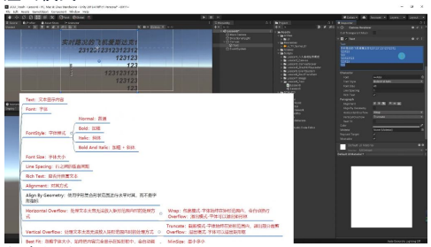
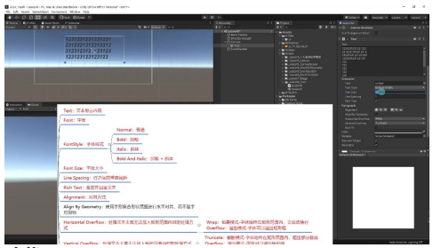

- **包裹模式（Wrap）**：
  - 自动换行保持文本在矩形范围内
  - 适合多行文本显示
- **溢出模式（Overflow）**：
  - 允许文本超出矩形范围
  - 需要手动回车换行
- **截断模式（Truncate）**：
  - 超出部分被裁剪
  - 保持单行显示

##### 垂直溢出模式 09:46

- **截断模式（Truncate）**：
  - 超出高度部分被裁剪
- **溢出模式（Overflow）**：
  - 允许文本向下溢出显示
- **使用建议**：通常使用截断模式避免UI元素重叠

##### 忽略字体大小 10:54

- **功能**：
  - 自动调整字体大小适应文本框
  - 需设置最小（Min Size）和最大（Max Size）字体限制
- **示例**：
  - 设置Min=20，Max=40
  - 内容少时用最大字号
  - 内容多时自动缩小但不小于Min值

##### 颜色与材质球 12:58

- **颜色（Color）**：修改文本显示颜色
- **材质（Material）**：通常使用默认，特殊效果时才需修改

##### 射线检测 13:15

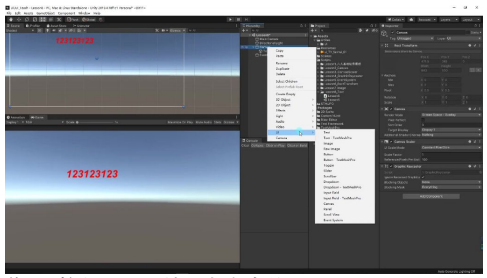
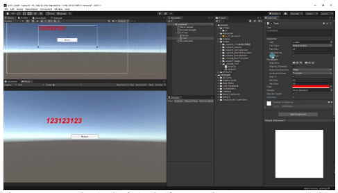

- **作用**：控制是否阻挡UI点击事件
- **常见问题**：
  - Text可能挡住后方Button的点击
  - 解决方案：取消勾选Raycast Target
- **使用建议**：不需要响应点击的Text应关闭此选项

#### 3）富文本 14:55

##### 基本概念

- **定义**：UGUI中的特殊文本格式，类似HTML标记语言，允许对文本的不同部分设置不同样式效果
- **启用条件**：必须勾选"是否开启富文本"参数才能生效，默认是勾选状态

##### 基础语法

###### 加粗与斜体

- **加粗语法**：`<b>文本内容</b>`，如`<b>123</b>`会使"123"显示为粗体
- **斜体语法**：`<i>文本内容</i>`，如`<i>123</i>`会使"123"显示为斜体
- **嵌套使用**：可以多层嵌套，如`<b><i>123</i></b>`会同时应用加粗和斜体效果

###### 字体大小

- **语法格式**：`<size=数值>文本内容</size>`
- **示例**：默认41号字时，`<size=50>123</size>`会使"123"显示为50号字
- **注意事项**：必须成对使用开始和结束标签，否则无法正确显示

##### 颜色设置

###### 十六进制表示法

- **语法格式**：`<color=#RRGGBBAA>文本内容</color>`
- **示例**：`<color=#ff0000ff>123</color>`显示红色文字
- **通道说明**：RR（红）、GG（绿）、BB（蓝）、AA（透明度）均为16进制值

###### 颜色别名

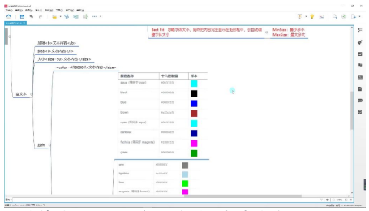
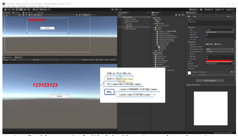


- **语法格式**：`<color=颜色名称>文本内容</color>`
- **常用别名**：

| 别名 | 对应颜色 | 十六进制值 |
|------|----------|------------|
| red | 红色 | #ff0000ff |
| green | 绿色 | #00ff00ff |
| blue | 蓝色 | #0000ffff |
| black | 黑色 | #000000ff |
| white | 白色 | #ffffffff |

- **优势**：比记忆16进制代码更方便，Unity已内置常用颜色映射

##### 使用注意事项

- **必须成对标记**：所有样式标签必须正确闭合，如`<b>`必须对应`</b>`
- **开启前提**：必须在Text组件中勾选"富文本"选项才能生效
- **显示异常处理**：若显示原始标签文本而非样式效果，首先检查是否开启了富文本功能

#### 4）边缘线和阴影 19:30

##### UGUI中的边缘线和阴影设置

- **组件区别**：与NGUI不同，UGUI需要通过添加特定组件来实现边缘线和阴影效果
- **实现方式**：
  - 边缘线：Outline组件
  - 阴影：Shadow组件

##### Outline组件详解

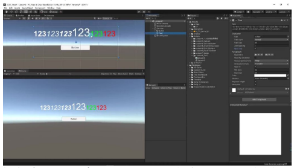
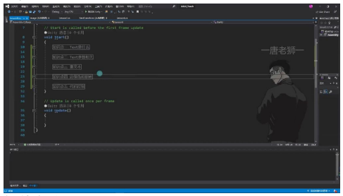

- **添加方法**：通过Add Component添加"Outline"组件
- **主要参数**：
  - **颜色设置**：可修改边缘线颜色（如黄色边缘线）
  - **偏移量**：
    - X轴：控制横向偏移（如-2）
    - Y轴：控制竖向偏移
  - **效果控制**：默认值为1，一般不需修改
  - **透明度**：可通过Alpha通道调整半透明效果
- **使用注意**：
  - 实际效果相对简单
  - 图形颜色叠加选项通常无明显效果
  - 重点记忆：颜色、粗细和偏移三个主要参数

##### Shadow组件详解

- **添加方法**：通过Add Component添加"Shadow"组件
- **主要参数**：
  - **颜色设置**：可修改阴影颜色（如红色阴影）
  - **偏移量**：X/Y轴控制阴影偏移位置
- **组件特点**：参数设置与Outline组件类似

##### 关键记忆点

- **组件名称**：
  - 边缘线：Outline
  - 阴影：Shadow
- **核心参数**：
  - 颜色设置
  - 偏移量调整
  - 透明度控制
- **使用建议**：简单效果可直接使用，复杂效果可能需要其他实现方式

#### 5）代码控制 22:04

##### 组件获取与修改

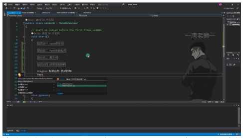
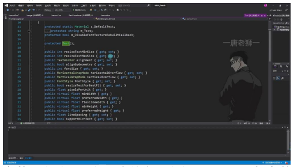
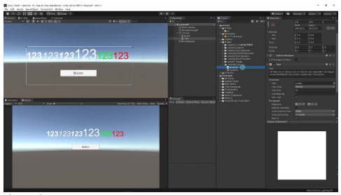

- **命名空间引用**：必须引用`UnityEngine.UI`命名空间才能操作Text组件，可通过"alt+回车"快捷键快速添加引用
- **组件获取方式**：使用`this.GetComponent<Text>()`获取当前对象上的Text组件
- **内容修改方法**：通过修改text属性值来改变显示内容，例如：
  ```csharp
  txt.text = "唐老狮哈哈哈哈哈";
  ```

##### 参数动态修改

- **参数对应关系**：代码中的变量名与Inspector面板参数名称完全一致
- **常用修改项**：

| 参数 | 说明 |
|------|------|
| `fontSize` | 修改字体大小 |
| `alignment` | 调整文本对齐方式 |
| `color` | 改变文本颜色 |
| `fontStyle` | 设置字体样式（普通/加粗/斜体等） |

- **修改原则**：通常只修改显示内容，字体等样式参数建议在编辑器中预设

##### 实践演示

- **实现步骤**：
  1. 创建脚本继承MonoBehaviour
  2. 获取Text组件引用
  3. 在Start/Update等方法中修改text属性
- **效果验证**：运行后文本内容从"123"变为"唐老狮哈哈哈哈哈"，证明代码控制生效

##### 组件特性总结

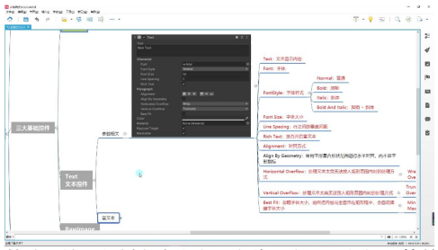

- **基础属性**：包括文本内容、字体、字号、行间距等基本显示参数
- **布局控制**：
  - 水平/垂直溢出处理方式（Wrap/Truncate等）
  - 对齐方式（TextAnchor枚举）
  - BestFit自动调整字号功能
- **富文本支持**：通过HTML标签实现部分富文本效果
- **性能考虑**：Raycast Target选项控制是否参与射线检测

---

## 二、知识小结

| 知识点 | 核心内容 | 考试重点/易混淆点 | 难度系数 |
|--------|----------|-------------------|----------|
| Text控件基础概念 | Unity UGUI中用于显示文本的核心组件，通过GameObject附加Text组件实现 | 区分Text与TextMeshPro（后续专题讲解） | ⭐ |
| Text参数详解 | - 文本内容：实时编辑显示；- 字体：支持系统字体导入（如C:\Windows\Fonts）；- 样式：加粗/斜体组合；- 对齐：九宫格排列组合（左中右×上中下）；- 溢出模式：横向包裹/溢出，竖向截断/溢出；- Best Fit：自动缩放字体大小（需设最小/最大值） | 易混淆：- 包裹模式自动换行 vs 溢出模式不换行；- Best Fit与手动设置字体大小的优先级 | ⭐⭐ |
| 富文本（Rich Text） | 类似HTML标签的格式控制：- `<b>`加粗`</b>`；- `<i>`斜体`</i>`；- `<size=60>`字体大小`</size>`；- `<color=#FF0000>`颜色`</color>`（支持16进制或颜色别名如red） | 重点：必须勾选组件面板的富文本开关 | ⭐⭐ |
| 边缘线与阴影 | - Outline组件：边缘线颜色/偏移量/透明度；- Shadow组件：阴影颜色/位置偏移 | 易忽略：组件需手动添加（Outline/Shadow） | ⭐ |
| 代码控制 | 通过`GetComponent<Text>()`动态修改：- `.text`属性更新内容；- 其他参数与面板一一对应 | 注意：需引用`UnityEngine.UI`命名空间 | ⭐ |
