# Image图像控件

以下为AI生成的图文笔记的内容。

---

## 一、Image图像控件 00:04

### 1. UGUI Image控件参数详解 01:23

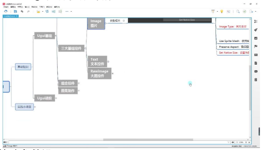
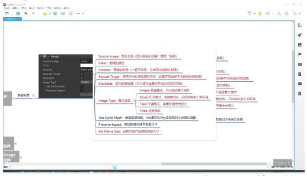

#### 1）基础参数设置

- **Source Image**：图片来源设置，必须选择"Sprite"精灵类型的资源
- **Color**：控制图像显示颜色，可通过调色板修改整体色调
- **Material**：默认使用UI材质，特殊效果时才需要修改
- **Raycast Target**：勾选后可作为射线检测目标（如按钮点击检测）
- **Maskable**：控制是否受遮罩影响，需配合Mask组件使用

#### 2）图像显示模式

- **Image Type**：
  - Simple：普通模式，整体均匀缩放
  - Sliced：9宫格模式，仅拉伸中央十字区域（适合按钮背景）
  - Tiled：平铺模式，重复显示图片中心部分
  - Filled：填充模式，常用于进度条等动态显示
- **Use Sprite Mesh**：启用后Unity会为图片生成优化网格
- **Preserve Aspect**：保持原始宽高比，防止图像变形
- **Set Native Size**：一键还原图片原始分辨率

#### 3）高级功能说明

- **9宫格拉伸原理**：通过定义图片边缘的固定区域，确保UI元素拉伸时边角不变形
- **填充模式应用**：配合脚本控制Fill Amount参数可实现血条、加载进度等效果
- **性能优化建议**：大图建议使用RawImage，常规UI元素使用Image配合图集

### 2. Image参数 01:32

#### 1）图片来源 01:44

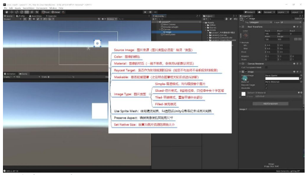
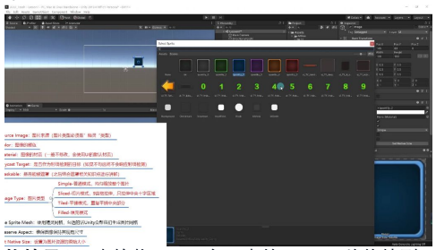

- **图片类型要求**
  - 强制类型：必须使用"Sprite"精灵类型图片，这是Unity UI系统对Image组件的硬性要求
  - **格式转换方法**：
    1. 选中图片资源 → 在Inspector窗口将Texture Type改为"Sprite(2D and UI)"
    2. 点击"Apply"按钮应用修改
    3. 成功标志：图片左侧出现小箭头图标
  - **批量处理技巧**：可以多选所有需要使用的图片一次性进行类型转换

- **图片导入方式**
  - **拖拽导入**：直接将Project窗口中的Sprite图片拖拽到Image组件的Source Image属性框
  - **选择器导入**：
    1. 点击Source Image属性右侧的圆形选择按钮
    2. 在弹出的选择窗口中定位需要的Sprite资源
    3. 支持通过名称搜索特定图片
  - **资源准备**：所有需要使用的图片必须提前完成Sprite类型转换才能正常显示

#### 2）图像的颜色 03:12

- **默认值**：图像颜色默认为白色
- **设置方法**：
  - 通过颜色面板选择所需颜色
  - 使用吸管工具在场景中直接吸取颜色
- **效果原理**：颜色设置是在原图基础上进行颜色叠加
- **应用场景**：
  - 特殊需求时使用
  - 处理黑白图片时常用
- **注意事项**：一般情况下UI图片不建议设置颜色

#### 3）图像的材质 04:15

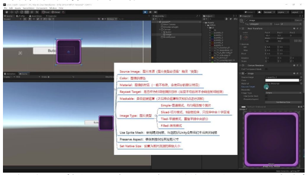
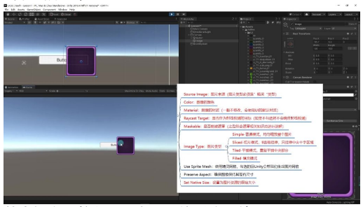

- **默认设置**：使用UI默认材质
- **修改条件**：
  - 需要实现特殊视觉效果时
  - 对UI有特殊要求时
- **注意事项**：
  - 通常情况下不需要修改材质
  - 未设置材质时图片仍可正常显示

#### 4）是否作为射线检测的目标 04:34

- **功能说明**：控制UI元素是否响应射线检测（如鼠标点击等交互操作）
- **默认状态**：该选项默认处于勾选状态
- **穿透原理**：当取消勾选时，射线可以穿透当前UI元素检测到后方元素
- **层级关系**：UI元素的显示顺序由Hierarchy面板中的子对象顺序决定，越靠后的对象显示在最前面
- **实际应用**：
  - 对于不需要交互的半透明图片（如背景图），建议取消勾选以避免阻挡后方按钮
  - 示例：当Image遮挡Button时，若Image取消勾选Raycast Target，点击事件可穿透Image触发Button

#### 5）是否能被遮罩 07:39

- **基本概念**：控制UI元素是否接受遮罩效果
- **学习建议**：该参数需要结合后续遮罩知识点深入理解
- **关联知识**：通常与UI Mask组件配合使用实现特殊显示效果

#### 6）图片类型 08:05

##### 普通模式 08:14

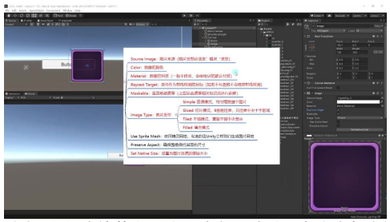

- **特点**：均匀缩放整个图片，改变尺寸时所有像素都会被拉伸
- **适用场景**：不需要改变尺寸的固定大小图片（如美术原图100×100直接使用）
- **缺点**：拉伸时会产生形变，效果较差
- **示例**：当图片尺寸变化时，所有像素均匀拉伸导致形变明显

##### 切片模式 09:12

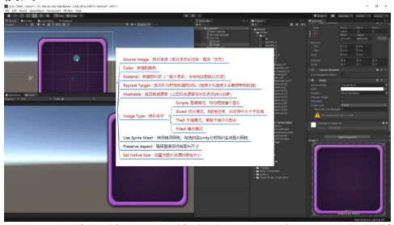
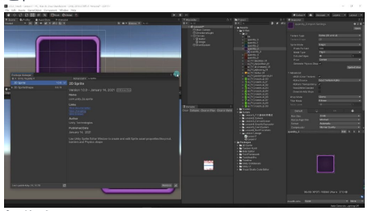

- **原理**：9宫格拉伸，只拉伸中央十字区域，四个角保持不变
- **优势**：保持边框和角落不变形，适合面板背景图等需要拉伸的场景
- **设置方法**：
  - **边框设置**：通过Sprite Editor调整四条边形成九宫格区域
  - **中心填充**：默认勾选Fill Center参数，取消后中央区域会被挖空
  - **像素乘数**：一般不修改Pixels Per Unit Multiplier参数
- **应用示例**：小图（如100×100）通过九宫格拉伸可替代大图（如500×500）作为面板背景

###### 设置边框 09:54

- **操作步骤**：
  1. 安装2D Sprite包（新版本Unity需要）
  2. 打开Sprite Editor拖动绿色点设置四条边
  3. 应用设置后图片会自动分割为9个区域
- **效果验证**：拉伸时只有中央十字区域变化，四个角保持原样
- **注意事项**：出现黄色感叹号表示未设置边框，需先完成边框设置

##### 平铺模式

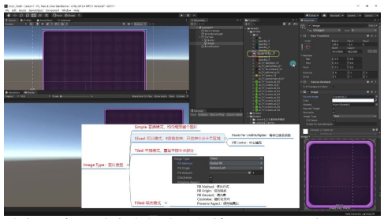

- **特点**：重复平铺中央部分，保持原图大小不变
- **应用场景**：面板底纹等需要重复图案的效果
- **边框影响**：可设置边框控制平铺范围（如只平铺右侧区域）
- **示例**：设置单边边框后，只有指定区域会进行平铺重复

##### 填充模式

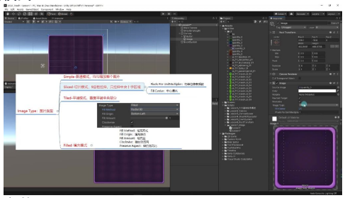
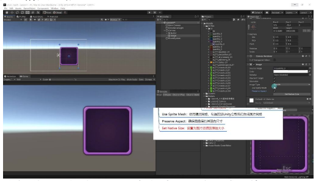

- **参数配置**：
  - **填充方式**：水平/垂直/径向（90/180/360度）
  - **填充原点**：可设置8个方向作为起点
  - **填充量**：控制显示比例（0-1）
  - **顺时针**：控制径向填充的旋转方向
- **应用场景**：
  - 水平/垂直：进度条、血条
  - 径向：CD冷却效果
- **保持宽高比**：勾选后无论容器如何变形都保持原图比例

###### 每单位像素乘数 14:04

- **作用**：调整像素密度，值越大像素越"细"，值越小像素越"宽"
- **默认值**：保持1不变，修改会导致显示效果异常
- **注意**：所有图片类型都有此参数，但通常不需要调整

#### 7）使用精灵网格 21:58

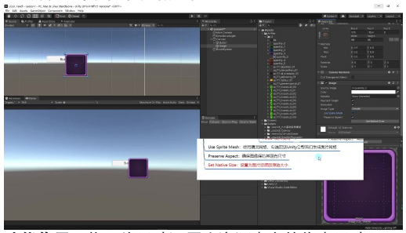
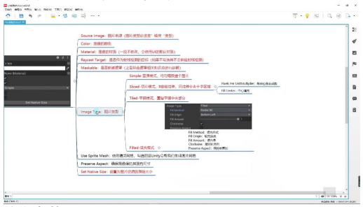
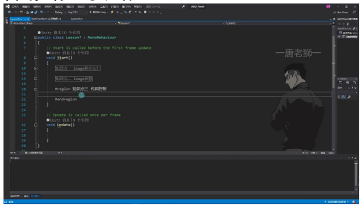

- **功能说明**：勾选后Unity会自动为图片生成网格
- **使用场景**：
  - **推荐使用**：制作2D游戏时
  - **不推荐使用**：开发UI界面时（会额外生成网格内容，造成性能浪费）
- **注意事项**：该选项与宽高比参数配合使用，需根据实际需求选择

#### 8）设置为图片资源的原始大小 22:24

- **功能作用**：将图片尺寸还原为资源本身的像素尺寸
- **适配模式影响**：
  - 恒定物理模式与恒定像素模式的计算公式不同
  - 未修改适配参数时，设置结果与图片像素尺寸完全一致
- **操作演示**：点击按钮即可自动完成尺寸设置

---

**核心参数总结：**

| 参数 | 说明 |
|------|------|
| Source Image | 必须为精灵类型 |
| Color | 图像颜色 |
| Material | 默认使用UI材质 |
| Raycast Target | 射线检测开关 |
| Maskable | 遮罩功能开关 |

**重点参数**：Image Type（图片类型）是后续开发中最常用的参数

---

## 二、代码控制Image组件 23:25

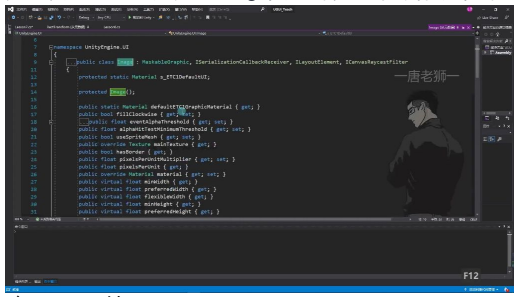
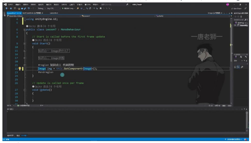
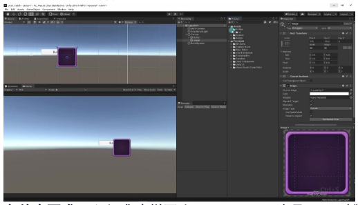

### 1. 获取Image组件

- **命名空间引用**：使用UGUI的Image类需要先引用`UnityEngine.UI`命名空间，否则无法识别Image类型
- **组件获取方式**：通过`this.GetComponent<Image>()`获取当前游戏对象上的Image组件
- **声明变量**：需要先声明Image类型的变量来存储获取的组件引用，如`Image img`

### 2. 修改Image属性

- **关键属性**：Image组件最重要的属性是`sprite`，用于控制显示的图片
- **动态设置方法**：通过`Resources.Load<Sprite>("图片路径")`加载精灵图片资源
- **类型匹配**：必须确保加载的资源类型是Sprite，与`Image.sprite`要求的类型一致

### 3. 注意事项

- **资源路径**：`Resources.Load`使用的路径是相对于Resources文件夹的相对路径
- **组件检查**：获取组件前需确保游戏对象上确实附加了Image组件
- **命名空间**：忘记引用`UnityEngine.UI`命名空间是常见错误，会导致编译错误

---

## 三、动态设置图片 24:45

### 1. 创建Resources文件夹 24:55

- **文件夹要求**：必须准确拼写为"Resources"，这是Unity引擎规定的特殊文件夹名称
- **作用**：用于存放需要通过代码动态加载的资源文件

### 2. 移动图片到Resources文件夹 25:04

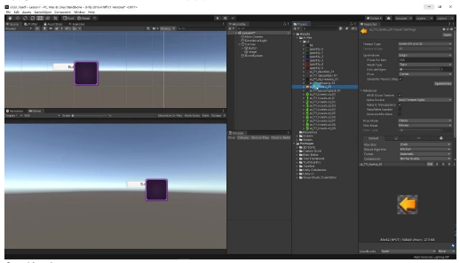
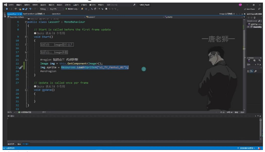
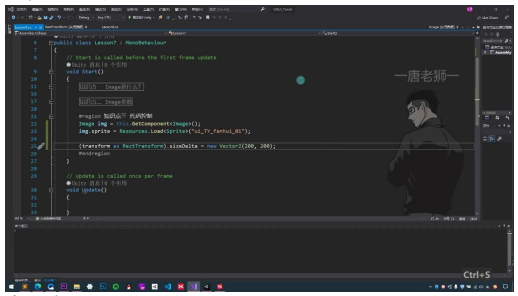

- **操作步骤**：
  1. 将测试图片拖入Resources文件夹
  2. 通过F2重命名复制图片名称（如示例中的"ui_TY_fanhui_01"）
- **注意事项**：图片名称将作为代码中加载资源的路径标识

### 3. 动态加载图片到Image组件 25:17

**核心代码**：

```csharp
img.sprite = Resources.Load<Sprite>("图片名称");
```

**关键点**：
- 使用`Resources.Load`方法加载资源
- 不需要实例化，直接加载数据资源
- 图片名称需与Resources文件夹中的实际文件名完全一致

### 4. 设置图片尺寸 26:01

**实现方法**：

```csharp
img.GetComponent<RectTransform>().sizeDelta = new Vector2(200, 200);
```

**原理说明**：
- 尺寸控制属于RectTransform组件功能
- Vector2的x值控制宽度，y值控制高度
- 示例中将图片从98×98修改为200×200

### 5. 修改Image组件的其他参数 27:06

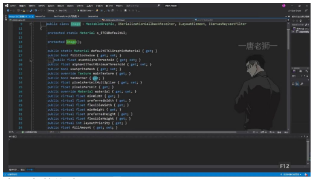
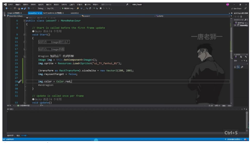
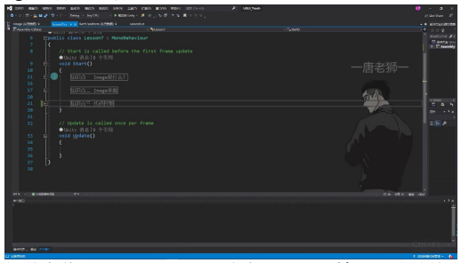

- **常用参数修改**：
  - `raycastTarget`：控制是否接受射线检测
  - 可直接通过`img.参数名`访问Inspector中显示的大多数参数
- **查看方式**：通过查看Image类的定义了解所有可用参数

### 6. 设置图片颜色 27:42

**颜色设置方法**：

```csharp
img.color = Color.red;
```

**实用技巧**：
- 可使用Color类预定义的颜色常量
- 支持透明度通道（A）的调整
- 示例中将图片颜色改为红色

---

## 四、UGUI Image组件详解 28:09

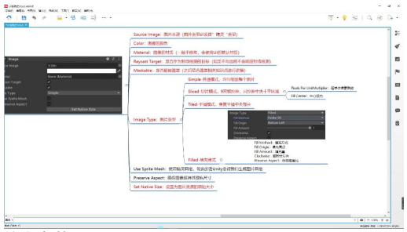
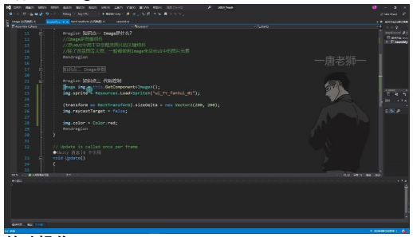

### 1. Image组件基础概念

- **组件定位**：Image是UGUI系统中用于显示精灵图片的核心组件
- **应用场景**：除背景图等大图外，UI中的图片元素通常都使用Image组件来显示
- **组件特性**：专门用于显示精灵（Sprite）类型的图片资源

### 2. Image参数详解

**核心参数：**

| 参数 | 说明 |
|------|------|
| Source Image | 必须设置为"精灵"类型的图片资源 |
| Color | 控制图像显示颜色，支持透明度调节 |
| Raycast Target | 决定是否响应射线检测（取消勾选可优化UI交互性能） |
| Maskable | 控制是否允许被遮罩（需结合后续遮罩知识点理解） |

**图片类型（Type）：**

| 类型 | 说明 |
|------|------|
| Simple | 普通模式，均匀缩放整个图片 |
| Sliced | 切片模式（9宫格拉伸），仅拉伸中央十字区域 |
| Tiled | 平铺模式，重复平铺中央部分 |
| Filled | 填充模式，支持多种填充方式和方向 |

**实用功能：**

| 功能 | 说明 |
|------|------|
| Preserve Aspect | 保持图片原始宽高比 |
| Set Native Size | 将图片恢复为资源原始尺寸 |
| Use Sprite Mesh | 启用精灵网格优化（由Unity自动生成） |

### 3. 代码控制Image

**基础操作**：
- 获取组件：`Image img = GetComponent<Image>()`
- 设置图片：`img.sprite = Resources.Load<Sprite>("路径")`
- 修改尺寸：`GetComponent<RectTransform>().sizeDelta = new Vector2(w, h)`
- 修改颜色：`img.color = Color.red`

**注意事项**：
- 动态加载的图片资源必须放在Resources文件夹下
- 尺寸修改需通过RectTransform组件实现
- 颜色修改会直接影响图片显示效果

### 4. UGUI基础组件体系

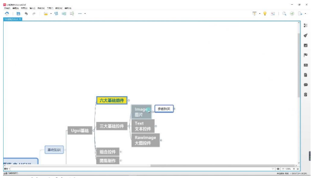

**三大基础控件：**
- **Image**：标准图片显示组件
- **Text**：基础文本显示组件
- **RawImage**：大图/纹理显示组件

**进阶内容：**
- 组合控件开发
- 图集制作与优化
- UGUI系统进阶实践

---

## 五、知识小结

| 知识点 | 核心内容 | 考试重点/易混淆点 | 难度系数 |
|--------|----------|-------------------|----------|
| Image控件定义 | Unity UGUI中用于显示精灵图片的UI组件，适用于背景图、UI元素等 | 区分Image与RawImage的适用场景 | ⭐⭐ |
| 图片来源参数 | 必须使用Sprite类型图片，需在导入设置中切换格式为Sprite（2D UI专用） | 未转换Sprite格式的图片无法显示 | ⭐⭐ |
| 颜色参数 | 在原图基础上叠加颜色，支持吸管取色 | 颜色修改是叠加而非替换 | ⭐ |
| 射线检测参数（Raycast Target） | 勾选时阻挡UI交互（如遮挡按钮），取消勾选可穿透点击 | 半透明图片需关闭该选项以避免阻挡交互 | ⭐⭐⭐ |
| 图片类型（Image Type） | 四种模式：1. Simple：均匀拉伸（易变形）；2. Sliced：九宫格拉伸（面板背景常用）；3. Tiled：平铺重复（底纹效果）；4. Filled：填充进度（血条/CD条） | 1. 切片模式需预先设置Sprite边框；2. 填充模式支持方向/原点调整 | ⭐⭐⭐⭐ |
| 九宫格切片设置 | 通过Sprite Editor调整边框，中央区域拉伸，边角保持原状 | 未设置边框时提示黄色警告 | ⭐⭐⭐ |
| 填充模式参数 | 支持水平/垂直/角度填充，可调原点（如血条从左到右）、顺时针方向（CD倒计时） | 360度填充需配合材质实现环形进度条 | ⭐⭐⭐ |
| 代码控制 | 关键API：`image.sprite`动态替换图片；`image.color`修改颜色；`transform.sizeDelta`调整尺寸 | 需引用`UnityEngine.UI`命名空间 | ⭐⭐⭐ |
| 性能优化 | Use Sprite Mesh选项生成网格（2D游戏常用，UI一般不勾选） | 非必要不启用以节省性能 | ⭐⭐ |
