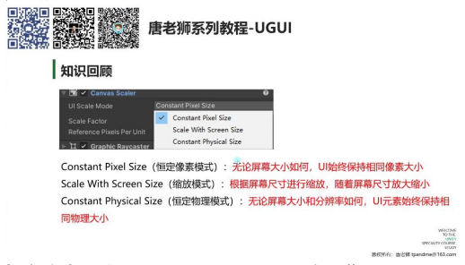
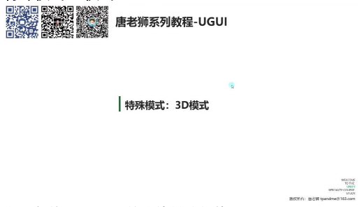
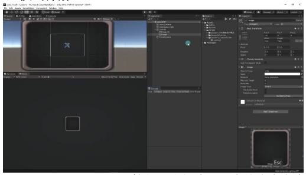
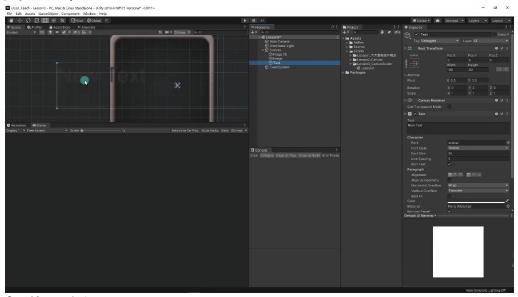
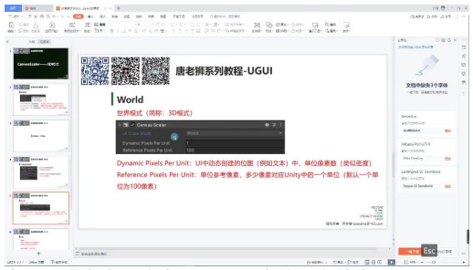
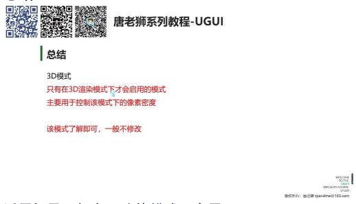

# CanvasScaler 3D 模式

## 一、非正式课程

## 二、知识回顾

- **恒定像素模式 (Constant Pixel Size)：** 无论屏幕大小如何，UI 始终保持相同像素大小
- **缩放模式 (Scale With Screen Size)：** 根据屏幕尺寸进行缩放，随着屏幕尺寸放大缩小，是开发中最常用的模式
- **恒定物理模式 (Constant Physical Size)：** 无论屏幕大小和分辨率如何，UI 元素始终保持相同物理大小

## 三、特殊模式：3D 模式

- **出现条件：** 当 Canvas 的渲染模式切换为 World Space（世界坐标系）时自动出现
- **特性：**
  - 该模式下 Canvas Scaler 会自动切换为 World（世界 3D）模式
  - 此模式不可手动修改，由系统自动设置

## 四、3D 模式详解

- **Dynamic Pixels Per Unit：** 控制 3D 空间中 UI 元素的像素密度
- **Reference Pixels Per Unit：** 设置参考像素单位，默认为 100
- **应用场景：** 主要用于 3D 游戏中的 UI 元素，如血条、名称标签等需要跟随 3D 对象的界面元素

## 五、世界模式

### 1. 动态像素每单位 (Dynamic Pixels Per Unit)

- **定义：** 控制 UI 中动态创建的位图（如文本）的单位像素数
- **特性：** 类似像素密度的概念，值越大显示越清晰
- **默认值：** 1（单位像素数）

#### 1）举例：文本创建

操作示例：

- 创建 UI 文本时，默认值为 1 显示不够清晰
- 调整为 2 时文本清晰度明显提升
- 继续增大到 3 时清晰度进一步提高

注意事项：

- 值过大会导致文本尺寸变小
- 实际使用中需要平衡清晰度和尺寸

### 2. 参考像素每单位 (Reference Pixels Per Unit)

- **定义：** 指定多少像素对应 Unity 中的一个单位
- **默认值：** 100 像素对应 1 个 Unity 单位
- **作用：** 建立屏幕像素与 Unity 世界单位的换算关系

## 六、总结

- **适用场景：** 仅在 3D 渲染模式下启用
- **核心功能：** 控制 3D 模式下的像素密度
- **使用建议：** 了解即可，一般不需要修改
- **重点模式：** 缩放模式（Scale With Screen Size）才是实际开发中最常用的模式

---

## 七、知识小结

| 知识点 | 核心内容 | 考试重点/易混淆点 | 难度系数 |
|--------|----------|-------------------|----------|
| Canvas Scaler 的 3D 模式 | 仅在 World Space 渲染模式下启用，控制动态创建位图（如文本）的像素密度 | 与常规 UI 缩放模式的区别（3D 模式不可手动切换） | ⭐⭐ |
| 3D 模式参数 1：动态位图像素密度 | 值越大，文字/动态位图越清晰（但过大会导致显示缩小） | 参数作用（类似 PPI，非直接分辨率调整） | ⭐⭐ |
| 3D 模式参数 2：单位像素比 | 默认 100 像素 = 1 Unity 单位（与 2D 模式参数一致） | 需结合物理尺寸理解 | ⭐ |
| Canvas Scaler 核心缩放模式 | 缩放模式（根据屏幕尺寸自适应）为最常用方案，需掌握匹配方案 | 恒定像素 vs 恒定物理 vs 缩放模式的适用场景 | ⭐⭐⭐ |
| 3D 模式适用性 | 主要用于 World Space 下 UI 清晰度优化，实际开发中较少使用 | 与常规 UI 模式的优先级对比 | ⭐ |
