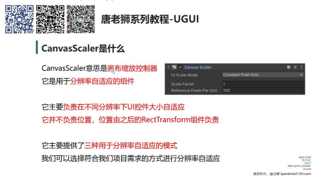
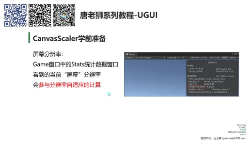
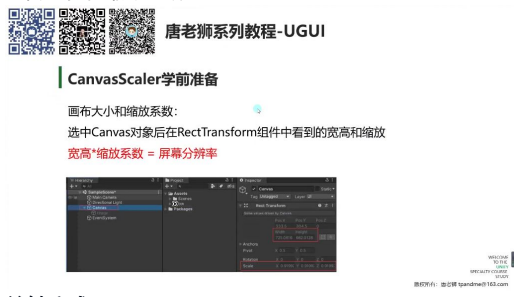
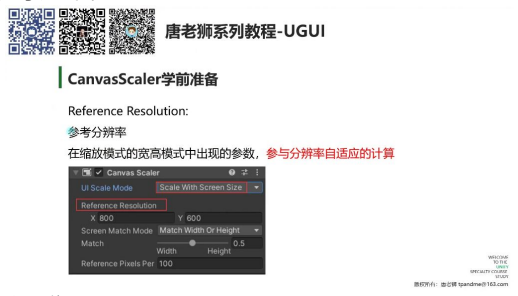
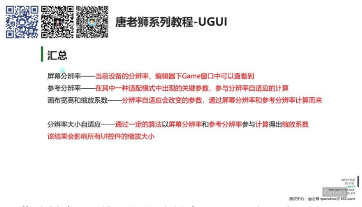
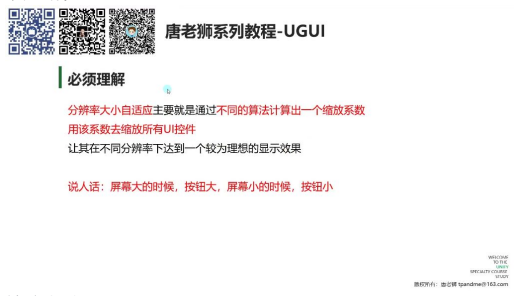
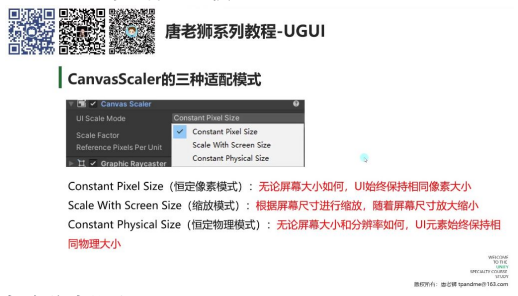

# CanvasScaler 必备知识

## 一、CanvasScaler 必备知识

### 1. 主要学习内容

**学习重点：**

- CanvasScaler 组件的功能
- 学前准备知识
- 三种适配方式

### 2. CanvasScaler 用来干啥

**核心功能：**

- 画布缩放控制器，用于分辨率自适应
- 只负责UI控件大小自适应，不负责位置（位置由 RectTransform 组件负责）

**工作模式：**

- 提供三种分辨率自适应模式
- 根据项目需求选择合适的适配方式

### 3. CanvasScaler 学前准备

#### 1）屏幕分辨率

- **查看方式：**
  - 在 Game 窗口的 Stats 统计数据窗口中查看
  - 显示为 "Screen" 后的数值
- **重要性：**
  - 参与分辨率自适应的计算
  - 编辑器模式下随 Game 窗口大小变化而变化

#### 2）画布大小和缩放系数

**关键公式：**

> 画布宽高 × 缩放系数 = 屏幕分辨率

- **查看方法：**
  - 选中 Canvas 对象后在 RectTransform 组件中查看
  - 宽高表示画布大小，Scale 表示缩放系数
- **验证方法：**
  - 通过计算器验证公式准确性
  - 注意浮点数计算可能产生微小误差

#### 3）参考分辨率

- **出现位置：** 在缩放模式的宽高模式中出现
- **作用：**
  - 参与分辨率自适应的计算
  - 影响最终 UI 控件的缩放系数

### 4. 汇总

| 概念 | 说明 |
|------|------|
| 屏幕分辨率 | 当前设备的分辨率，Game 窗口中可查看 |
| 参考分辨率 | 特定适配模式中的关键参数 |
| 画布参数 | 宽高和缩放系数会随分辨率自适应变化 |
| 自适应原理 | 通过算法计算缩放系数，影响所有 UI 控件大小 |

### 5. 必须理解

**核心机制：**

- 通过不同算法计算缩放系数
- 用该系数缩放所有 UI 控件

**通俗解释：**

- 屏幕大时按钮大，屏幕小时按钮小
- 实现 UI 在各种设备上的理想显示效果

### 6. CanvasScaler 的三种适配模式

- **恒定像素模式：**
  - UI 始终保持相同像素大小
  - 不受屏幕大小影响
- **缩放模式：**
  - 最常用模式
  - 根据屏幕尺寸自动缩放 UI
- **恒定物理模式：**
  - UI 保持相同物理大小
  - 考虑屏幕分辨率和尺寸

### 7. 总结

- CanvasScaler 功能：实现分辨率大小自适应
- 必备知识：
  - 画布尺寸和缩放
  - 屏幕分辨率
  - 参考分辨率
- 三种模式：
  - 恒定像素
  - 缩放
  - 恒定物理

---

## 二、知识小结

| 知识点 | 核心内容 | 考试重点/易混淆点 | 难度系数 |
|--------|----------|-------------------|----------|
| CanvasScaler 组件功能 | 用于分辨率大小自适应（UI控件缩放），不负责位置自适应（由 RectTransform 组件处理） | 区分"分辨率自适应"与"位置自适应" | ⭐⭐ |
| 学前必备知识 | 1. 屏幕分辨率（Game窗口查看）; 2. 画布宽高×缩放=屏幕分辨率; 3. 参考分辨率（仅宽高适配模式使用） | 公式：画布尺寸×缩放=屏幕分辨率 | ⭐⭐⭐ |
| 三种适配模式 | 1. 恒定像素模式：UI像素固定; 2. 缩放模式（最常用）：按屏幕尺寸缩放UI; 3. 恒定物理模式：UI物理大小固定 | 恒定像素与恒定物理模式的区别 | ⭐⭐⭐⭐ |
| 分辨率自适应原理 | 通过算法（基于屏幕分辨率、参考分辨率）计算缩放系数，统一调整UI控件大小 | 理解"参考分辨率"对计算的影响 | ⭐⭐⭐ |
| 编辑器操作验证 | 在Unity中动态调整Game窗口大小，观察Canvas的宽高、缩放系数与屏幕分辨率的关系 | 实践验证公式的重要性 | ⭐⭐ |
