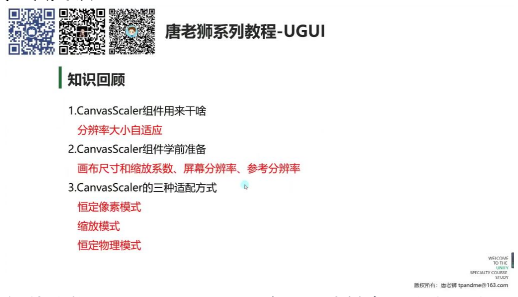
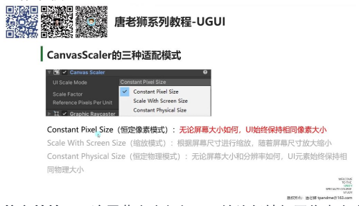
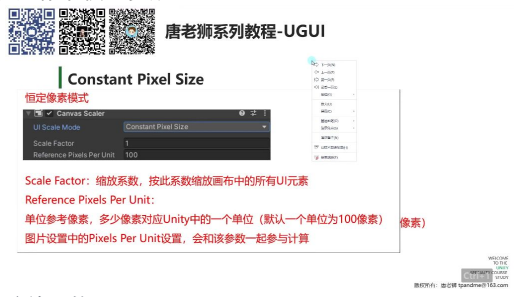
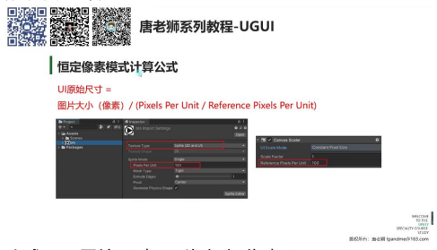
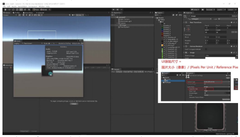
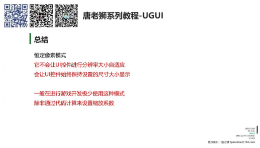

# CanvasScaler 恒定像素模式

## 一、知识回顾

- **组件功能：** CanvasScaler 用于实现 UI 分辨率大小自适应
- **学前准备：**
  - 需要了解画布尺寸和缩放系数
  - 掌握屏幕分辨率和参考分辨率概念
- **适配方式：** 包含三种模式：
  - 恒定像素模式
  - 缩放模式
  - 恒定物理模式

## 二、恒定像素模式

### 1. 恒定像素模式

**核心特性：** 无论屏幕大小如何，UI 始终保持相同像素大小

**默认设置：** 新建 Canvas 时默认选择此模式

#### 1）恒定像素模式参数

- **缩放系数 (Scale Factor)**
  - 作用：按此系数缩放画布中的所有 UI 元素
  - 计算公式：宽高 × 缩放系数 = 屏幕分辨率
  - 示例：
    - 缩放系数为 1 时，UI 元素保持原始大小
    - 缩放系数为 2 时，UI 元素放大两倍

- **单位参考像素 (Reference Pixels Per Unit)**
  - 定义：表示多少个像素对应 Unity 中的一个单位
  - 默认值：100 像素对应 1 个单位
  - 关联设置：需要配合图片的 Pixels Per Unit 参数使用

**恒定像素模式计算公式：**

> UI 原始尺寸 = 图片大小(像素) / (Pixels Per Unit / Reference Pixels Per Unit)

**示例计算：**

- 图片大小 98×98 像素
- Pixels Per Unit = 100
- Reference Pixels Per Unit = 100
- 计算结果：98×98 像素

#### 2）应用案例

**例题：改变窗口分辨率**

- 现象观察：无论窗口大小如何变化，UI 元素始终保持相同像素尺寸
- 实际影响：
  - 小窗口时 UI 显得过大
  - 大窗口时 UI 显得过小
  - 不会自动进行缩放适配

### 2. 总结

#### 1）恒定像素模式定义

**主要特点：**

- 不会让 UI 控件进行分辨率大小自适应
- 始终保持设置的尺寸大小显示

**使用建议：**

- 游戏开发中极少使用
- 特殊情况可通过代码计算缩放系数实现适配

---

## 三、结束

---

## 四、知识小结

| 知识点 | 核心内容 | 考试重点/易混淆点 | 难度系数 |
|--------|----------|-------------------|----------|
| 恒定像素模式 | UI 元素始终保持相同像素大小，不随屏幕分辨率变化自适应 | 缩放系数（Scale Factor）与单位参考像素（Reference Pixels Per Unit）的计算关系 | ⭐⭐ |
| Canvas Scaler 组件 | 用于分辨率自适应，包含三种适配模式（恒定像素、缩放、恒定物理） | 默认创建的 Canvas 会启用恒定像素模式 | ⭐ |
| 图片尺寸计算 | 公式：UI 原始尺寸 = 图片像素大小 / (Pixels Per Unit / Reference Pixels Per Unit) | Pixels Per Unit（图片属性）与 Reference Pixels Per Unit（Canvas Scaler参数）的联动影响 | ⭐⭐⭐ |
| 恒定像素模式局限性 | 需手动通过代码计算缩放系数实现自适应，开发中极少使用 | 屏幕分辨率变化时需动态调整 Scale Factor | ⭐⭐ |
| 图片导入与设置 | UI 图片需设置为 Sprite (2D/UI) 格式，Set Native Size 按钮还原原始尺寸 | 图片格式未正确设置会导致无法拖入 Image 组件 | ⭐ |
