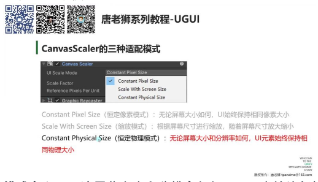
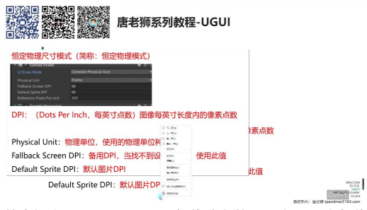
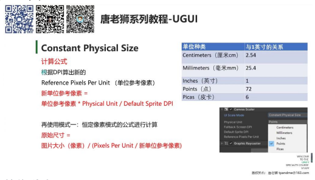
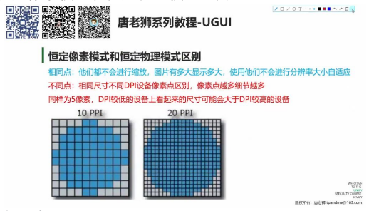
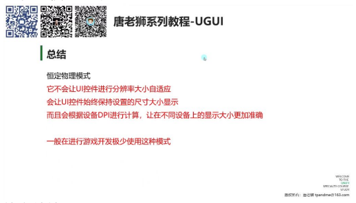

# CanvasScaler 恒定物理模式

## 一、恒定物理模式

### 1. 恒定物理尺寸模式

**模式定义：** 无论屏幕大小和分辨率如何，UI 元素始终保持相同物理大小

**类比说明：** 与恒定像素模式非常类似，但计算公式发生变化

### 1）DPI

- **基本概念：** Dots Per Inch（每英寸点数），表示图像每英寸长度内的像素点数
- **实际意义：**
  - 显示器分辨率相同时，尺寸越小 DPI 越高
  - 举例：1920×1080 分辨率在手机和显示器上 DPI 不同
- **参数说明：**
  - 备用 DPI：当找不到设备 DPI 时使用的默认值（通常为 96）
  - 默认图片 DPI：美术导出图片时的 DPI 设置（通常保持 96 不变）

### 2）物理单位

**单位种类：**

- 厘米（2.54cm = 1 英寸）
- 毫米（25.4mm = 1 英寸）
- 英寸（1 英寸 = 1 英寸）
- 点（72 点 = 1 英寸）
- 皮卡（6 皮卡 = 1 英寸）

**计算公式：**

> 新单位参考像素 = 单位参考像素 × (PhysicalUnit / DefaultSpriteDPI)

> 原始尺寸 = 图片大小（像素） / (PixelsPerUnit / 新单位参考像素)

### 3）恒定像素模式和恒定物理模式区别

**相同点：**

- 都不会进行缩放
- 图片有多大显示多大
- 不会进行分辨率大小自适应

**不同点：**

| 维度 | 恒定像素模式 | 恒定物理模式 |
|------|------------|------------|
| 显示效果 | 相同像素在不同 DPI 设备上物理尺寸不同 | 根据设备 DPI 调整显示尺寸 |
| 计算原理 | 直接使用图片像素尺寸 | 根据设备 DPI 计算显示尺寸 |
| 应用场景 | 简单固定像素显示 | 确保不同设备上物理尺寸一致 |

### 2. 恒定物理模式总结

**核心特性：**

- 不进行分辨率自适应
- 保持设置尺寸显示
- 根据设备 DPI 精确计算

**使用建议：**

- 游戏开发中极少使用
- 主要用于需要精确物理尺寸的场景
- 了解其原理即可，实际开发推荐使用其他模式

---

## 二、知识小结

| 知识点 | 核心内容 | 考试重点/易混淆点 | 难度系数 |
|--------|----------|-------------------|----------|
| 恒定物理模式 (Constant Physical Size) | 无论屏幕大小和分辨率如何，UI 元素始终保持相同的物理大小。计算公式：单位参考像素 = (物理单位值 × 单位换算系数) / 默认图片 DPI，再结合恒定像素模式公式计算原始尺寸。 | 与恒定像素模式的区别：恒定物理模式会根据设备 DPI 调整显示尺寸，确保在不同设备上物理大小一致；恒定像素模式则固定使用图片原始像素尺寸。 | ⭐⭐ |
| DPI（每英寸点数） | 描述屏幕像素密度的参数，影响显示细节。相同分辨率下，设备尺寸越小，DPI 越高。 | DPI 与分辨率的关系：分辨率相同但尺寸不同的设备，DPI 不同（如手机 DPI 通常高于显示器）。 | ⭐⭐ |
| Unity 参数设置 | - 物理单位：可选厘米/毫米/英寸/点/皮卡（如 1 英寸=72 点）。- 备用 DPI：设备无法获取 DPI 时的默认值（通常 96）。- 默认图片 DPI：美术导出图片时的 DPI 值（通常 96）。 | 参数影响：物理单位和 DPI 值共同决定单位参考像素的计算结果。 | ⭐⭐ |
| 恒定物理模式的应用场景 | 解决不同 DPI 设备显示一致性问题（如确保 5 像素在高低 DPI 设备上物理大小相同）。 | 局限性：不进行分辨率自适应，可能导致手机端 UI 过大，游戏开发中极少使用。 | ⭐ |
| 模式对比总结 | - 相同点：均不缩放 UI，保持设置尺寸。- 不同点：恒定物理模式通过 DPI 计算尺寸，恒定像素模式直接使用图片像素尺寸。 | 易混淆点：恒定物理模式并非用于分辨率适配，而是物理尺寸一致性。 | ⭐⭐ |
