# CanvasScaler — 缩放模式

## 一、CanvasScaler 缩放模式

### 1. 知识回顾

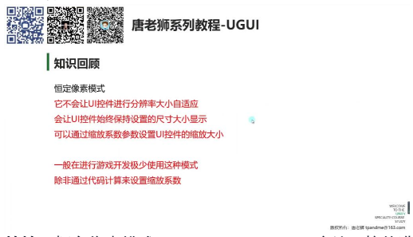

- **特性：** 恒定像素模式 (Constant Pixel Size) 不会让 UI 控件进行分辨率大小自适应，UI 控件始终保持设置的尺寸大小显示。
- **参数设置：** 可以通过缩放系数 (Scale Factor) 参数来设置 UI 控件的缩放大小。
- **使用场景：** 在游戏开发中极少使用这种模式，除非通过代码计算来设置缩放系数，但这种方式相对麻烦。

### 2. CanvasScaler 的适配模式

#### 1）缩放模式 (Scale With Screen Size)

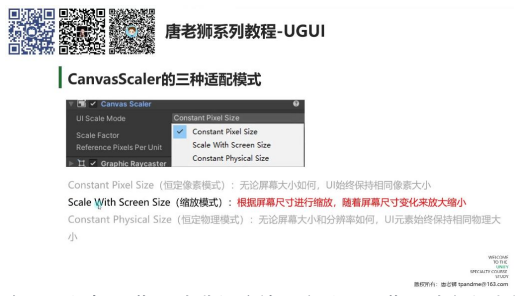

- **定义：** 根据屏幕尺寸进行缩放，会随着屏幕尺寸变化来放大或缩小 UI 元素。
- **特点：** 这是最常用的一种分辨率自适应模式。
- **对比：**
  - 恒定像素模式：UI 保持相同像素大小
  - 恒定物理模式：UI 保持相同物理大小
  - 缩放模式：UI 随屏幕尺寸变化

#### 2）缩放模式参数详解

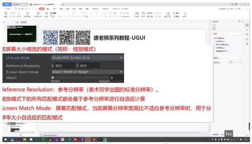

- **参考分辨率 (Reference Resolution)：** 美术同学出图的标准分辨率，默认为 800×600。
- **屏幕匹配模式 (Screen Match Mode)：** 当屏幕分辨率宽高比不适应参考分辨率时，用于分辨率大小自适应的匹配模式。
- **匹配方式：**
  - Match Width：匹配宽度
  - Match Height：匹配高度
  - Match Width Or Height：可选择匹配宽度或高度

#### 3）实际操作演示

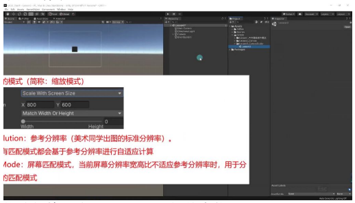

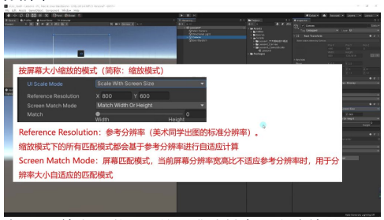

- **模式切换：** 在 Canvas Scaler 组件中将 UI Scale Mode 从 Constant Pixel Size 切换为 Scale With Screen Size。
- **参数变化：** 切换后会显示参考分辨率和屏幕匹配模式等新参数。
- **注意事项：** 所有匹配模式都会基于参考分辨率进行自适应计算。

### 3. 缩放模式

#### 1）按屏幕大小缩放模式

**参考分辨率**

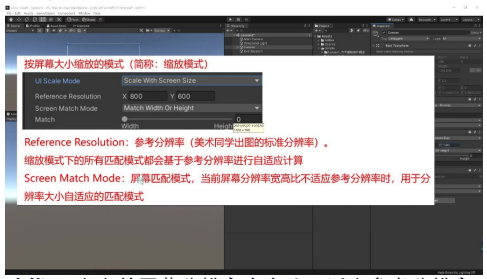

- **定义：** 美术同学出图的标准分辨率，在缩放模式下所有匹配模式都会基于此分辨率进行自适应计算。
- **设置标准：**
  - 根据产品市场定位选择，如主要针对安卓/iOS 手机则选择市面上最常用机型分辨率
  - 学习阶段 PC 端建议设置为 1920×1080（Windows 系统常见分辨率）
  - Mac 用户可设置为设备实际分辨率（通常更高）
- **计算原理：**
  - 自适应计算时会使用 X 和 Y 两个数值参与运算
  - 这两个参数对分辨率自适应计算非常重要

**屏幕匹配模式**

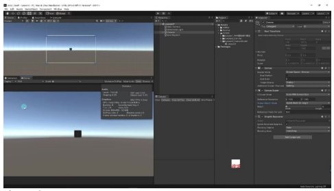

- **功能：** 当当前屏幕分辨率宽高比不适应参考分辨率时，用于分辨率大小自适应的匹配模式
- **核心概念：**
  - 宽高比：宽度除以高度的比值（如 1920×1080 的宽高比为 16:9）
  - 模拟原理：Unity 通过保持宽高比不变来调整实际显示分辨率
- **应用场景：**
  - 可通过 Game 窗口切换不同比例（如 16:9、3:2 等）模拟不同设备显示效果
  - 支持手动添加自定义分辨率（如 iPhone 12 Pro 的 2778×1284）

**分辨率自适应原理**

- **实现步骤：**
  - 大小自适应：通过 Canvas Scaler 组件控制 UI 元素在不同分辨率下的显示大小
  - 位置自适应：通过 Rect Transform（后续讲解）控制 UI 元素的显示位置
- **观察现象：**
  - 切换不同比例时，UI 元素大小会动态变化
  - 实际分辨率与参考分辨率通过宽高比参与计算
- **技术要点：**
  - Canvas Scaler 主要负责大小自适应
  - 九宫格技术（后续讲解）负责位置自适应

**屏幕匹配模式**

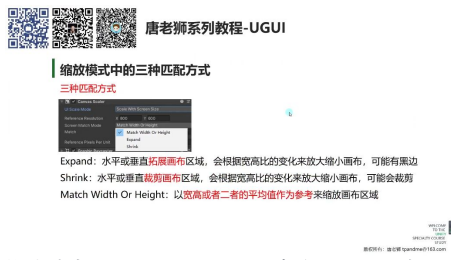

三种匹配方式：

- 模式分类：Canvas Scaler 提供 Expand（拓展）、Shrink（收缩）和 Match Width Or Height（宽高匹配）三种屏幕适配模式
- 核心区别：三种模式使用不同算法进行屏幕分辨率自适应，主要差异在于画布尺寸和 UI 元素的缩放方式

---

### 拓展匹配 (Expand)

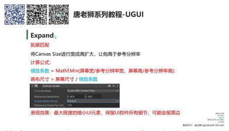

**基本原理：** 将 Canvas Size 进行宽或高扩大，使其高于参考分辨率

**设计目的：** 保证 UI 元素完整显示，不丢失任何细节

**视觉表现：** 可能出现黑边（当屏幕比例与设计比例不一致时）

#### 计算公式

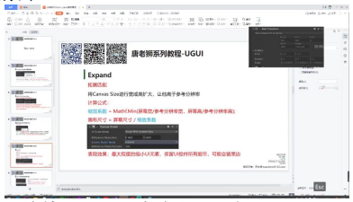

> 缩放系数 = Mathf.Min(屏幕宽 / 参考分辨率宽, 屏幕高 / 参考分辨率高)

> 画布尺寸 = 屏幕尺寸 / 缩放系数

**计算示例（参考分辨率 1920×1080，屏幕 800×600）：**

1. 800 / 1920 ≈ 0.41667
2. 600 / 1080 ≈ 0.5555
3. 取最小值 0.41667 作为缩放系数
4. 最终画布尺寸为 (800, 600) / 0.41667 ≈ (1920, 1440)

#### 表现效果

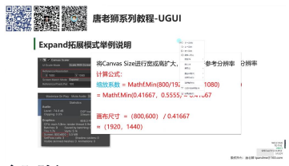

- UI 缩放：最大程度缩小 UI 元素
- 细节保留：确保所有 UI 控件细节完整显示
- 适配特点：适合需要完整展示 UI 内容的场景，如信息展示类界面

#### 应用案例

**例题：拓展模式应用示例**

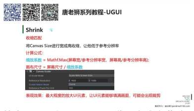

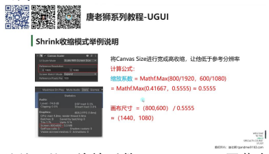

实际验证：

- 设置参考分辨率 1920×1080
- 调整 Game 窗口为 800×600
- 观察 Canvas 缩放系数自动变为 0.416667（验证公式正确性）
- 画布尺寸显示为 1920×1440（大于参考分辨率）

效果演示：

- 创建 1920×1080 背景图
- 在 800×600 窗口下出现上下黑边
- 调整窗口比例时，黑边位置会动态变化（左右或上下）

---

### 收缩匹配 (Shrink)

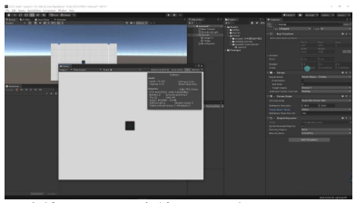

**基本原理：** 将 Canvas Size 进行宽或高收缩，使其低于参考分辨率

**设计目的：** 让 UI 元素填满整个屏幕

**视觉表现：** 可能出现裁剪（当屏幕比例与设计比例不一致时）

#### 计算公式

> 缩放系数 = Mathf.Max(屏幕宽 / 参考分辨率宽, 屏幕高 / 参考分辨率高)

> 画布尺寸 = 屏幕尺寸 / 缩放系数（公式与 Expand 相同）

**计算示例（参考分辨率 1920×1080，屏幕 800×600）：**

1. 取最大值 0.5555 作为缩放系数
2. 最终画布尺寸为 (800, 600) / 0.5555 ≈ (1440, 1080)

#### 表现效果

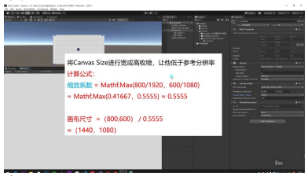

- UI 缩放：最大程度放大 UI 元素
- 填充效果：确保 UI 元素填满整个画面
- 适配特点：适合需要全屏显示的场景，如游戏主界面

#### 应用案例

实际验证：

- 相同分辨率设置下（1920×1080 参考，800×600 屏幕）
- 缩放系数变为 0.555556（验证取最大值）
- 画布尺寸显示为 1440×1080（小于参考分辨率）

效果演示：

- 背景图会被放大至填满窗口
- 在宽屏下裁剪上下部分
- 在窄屏下裁剪左右部分
- 始终保证画面无黑边

#### 模式对比

**核心差异：**

- **Expand：** 保证内容完整（可能留黑边）
- **Shrink：** 保证画面填满（可能裁剪内容）

**选择建议：**

- 重要 UI 内容优先选择 Expand
- 视觉效果优先选择 Shrink

**记忆口诀：** "Expand 保完整，Shrink 保满屏"

---

### 宽高匹配 (Match Width Or Height)

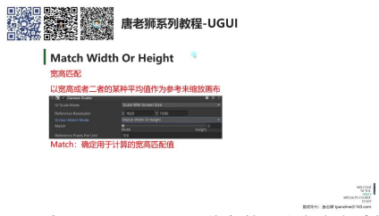

**基本原理：** 以宽度、高度或二者的某种平均值作为参考来缩放画布

**适用场景：** 主要用于只有横屏模式或竖屏模式的游戏开发场景

**核心特点：** 保持 UI 元素在不同分辨率下显示尺寸不变，通过裁剪或黑边处理适配

#### 宽高匹配参数

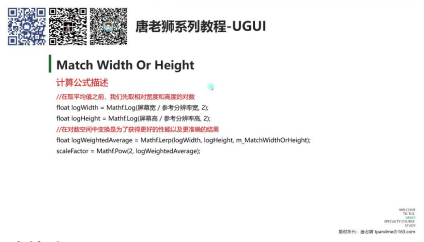

- **匹配值 (Match)：** 0-1 可调节参数，决定宽高计算权重
  - 0：完全以宽度为基准（竖屏游戏常用）
  - 1：完全以高度为基准（横屏游戏常用）
  - 中间值：取宽高的加权平均值
- **参考分辨率：** 默认 1920×1080，作为缩放基准值

#### 宽高匹配公式

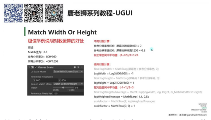

计算步骤：

1. 计算相对宽高的对数：
   - `logWidth = Mathf.Log(屏幕宽 / 参考宽, 2)`
   - `logHeight = Mathf.Log(屏幕高 / 参考高, 2)`
2. 在对数空间取加权平均：
   - `logWeightedAverage = Mathf.Lerp(logWidth, logHeight, matchWidthOrHeight)`
3. 计算最终缩放因子：
   - `scaleFactor = Mathf.Pow(2, logWeightedAverage)`

**设计目的：** Unity 官方采用对数计算是为了获得更好的性能和更准确的结果

#### 对数运算的好处

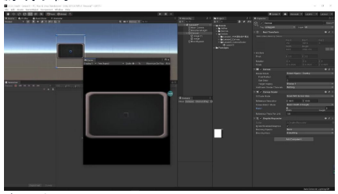

**传统计算问题：** 当参考分辨率 800×600，屏幕分辨率 400×1200 时：

- 宽度比：400/800 = 0.5
- 高度比：1200/600 = 2
- 算术平均值：(2 + 0.5) / 2 = 1.25（不准确）

**对数计算优势：**

- 将值平分到坐标轴两侧（-1 到 1）
- Match=0.5 时取中间值 0，计算结果更均衡
- 最终 scaleFactor = 1（准确反映实际缩放需求）

#### 竖屏游戏与横屏游戏的套路

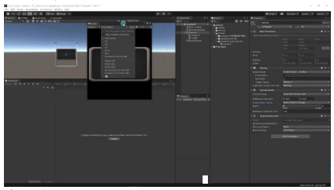

**竖屏游戏设置：**

- Match = 0（完全以宽度为基准）
- 保持画布宽度不变，高度自适应
- 屏幕越高可能出现上下黑边

**横屏游戏设置：**

- Match = 1（完全以高度为基准）
- 保持画布高度不变，宽度自适应
- 屏幕越宽可能出现左右黑边

**核心优势：** 确保 UI 元素在不同设备上显示尺寸完全一致

#### 竖屏游戏示例

实际表现：

- 改变屏幕高度时，画布宽度始终保持 1920
- UI 元素缩放系数不变（0.5395）
- 屏幕变窄时裁剪内容，屏幕过高时产生黑边

对比其他模式：

- 收缩/拓展模式会使 UI 元素随屏幕尺寸变化
- 宽高匹配模式保持 UI 元素绝对尺寸稳定

**开发建议：** 适合需要精确控制 UI 显示尺寸的项目

#### 横屏游戏示例

实际表现：

- Match=1 时，画布高度锁定为 1080
- 改变屏幕宽度时，缩放系数保持 0.5395 不变
- 屏幕变窄时裁剪两侧内容，过宽时产生黑边

视觉一致性：

- 3D 模型显示尺寸不变
- UI 元素不会因屏幕变宽而过度遮挡画面

**典型应用：** 主流横屏游戏如 MOBA、FPS 等类型

### 4. UI 适配模式

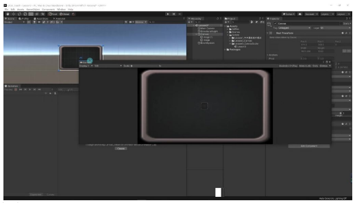

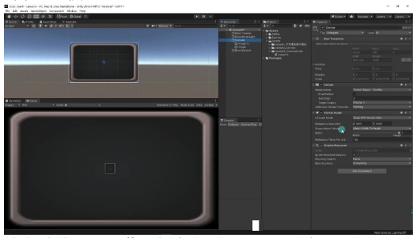

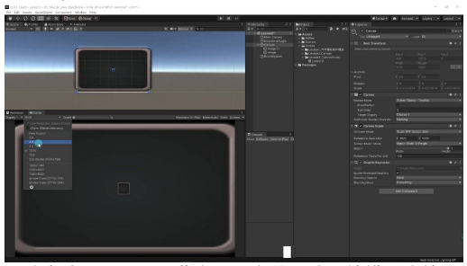

#### 1）宽高匹配模式

**核心特性：** 当屏幕比例变化时（如从 16:9 变为 16:10/3:2/4:3/5:4），UI 元素保持原始尺寸不变，仅进行边缘裁剪

**适配原理：** 以参考分辨率（如 1920×1080）为基准，其他比例通过裁剪画面实现适配

**元素表现：**

- 背景图：需要额外适配处理（可通过代码控制或自动布局组件实现）
- UI 控件：在所有设备上保持视觉尺寸一致性

#### 2）适用场景

**最佳实践：** 适用于屏幕方向固定的游戏（纯横屏或纯竖屏）

**优势对比：**

- 相比收缩模式：避免 UI 元素缩放变形
- 相比拓展模式：保持设计精度不拉伸

**参数配置：**

| 参数 | 推荐值 |
|------|--------|
| 参考分辨率 | 1920×1080（16:9） |
| 匹配模式 | Width or Height（根据主导方向选择） |
| 物理单位 | 每单位 200 像素（200 px/unit） |

---

## 二、改变比例的画布缩放

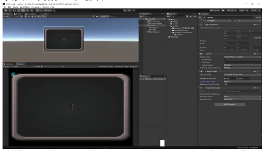

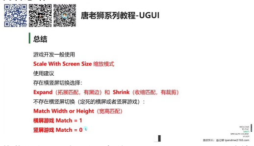

**缩放模式表现：** 当使用 Expand 拓展模式时，改变屏幕比例会导致 UI 元素进行缩放，可能越来越小或越来越大。

**模式选择依据：** 需要根据项目实际情况选择适合的缩放模式，不同模式会带来不同的 UI 表现效果。

---

## 三、内容总结

**推荐模式：** 游戏开发一般使用 Scale With Screen Size 缩放模式

**横竖屏切换建议：**

- 存在切换：选择 Expand（拓展匹配，有黑边）或 Shrink（收缩匹配，有裁剪）
- 不存在切换：使用 Match Width or Height（宽高匹配）

**匹配参数设置：**

- 横屏游戏 Match 参数设为 1
- 竖屏游戏 Match 参数设为 0

**实际应用原则：** 具体选择应根据项目实际需求和期望效果决定

**学习重点：** 需要理解不同匹配方式的表现区别，并能根据项目需求做出合适选择

---

## 四、知识小结

| 知识点 | 核心内容 | 考试重点/易混淆点 | 难度系数 |
|--------|----------|-------------------|----------|
| Canvas Scaler 缩放模式 | Unity 中 UI 分辨率自适应的核心组件，包含三种模式：恒定像素模式、缩放模式（Scale with Screen Size）、恒定物理尺寸模式 | 恒定像素模式需手动计算缩放系数，缩放模式自动适配屏幕 | ⭐⭐ |
| 恒定像素模式 (Constant Pixel Size) | UI 控件保持固定像素尺寸，不随分辨率变化，需代码控制缩放系数 | 适用于需精确控制 UI 尺寸的场景（如像素风游戏） | ⭐⭐ |
| 缩放模式 (Scale with Screen Size) | 根据屏幕尺寸动态缩放 UI，包含三种匹配方式：拓展匹配（Expand）、收缩匹配（Shrink）、宽高匹配（Match Width/Height） | 参考分辨率（Reference Resolution）是美术出图标准，影响自适应计算 | ⭐⭐⭐ |
| 拓展匹配 (Expand) | 画布尺寸扩大以完整显示 UI，可能留黑边；缩放系数取屏幕宽高比与参考分辨率比值的最小值 | 黑边问题需额外处理背景填充 | ⭐⭐⭐ |
| 收缩匹配 (Shrink) | 画布尺寸收缩以填满屏幕，可能裁剪 UI；缩放系数取屏幕宽高比与参考分辨率比值的最大值 | 裁剪风险需设计 UI 时预留安全区域 | ⭐⭐⭐ |
| 宽高匹配 (Match Width/Height) | 固定宽度或高度比例（通过 Match 参数 0-1 调节），适合横屏/竖屏游戏；UI 元素大小不变，仅调整可见范围 | 横屏游戏 Match=1，竖屏游戏 Match=0 | ⭐⭐⭐⭐ |
| 匹配模式选择逻辑 | 横竖屏切换游戏：优先拓展/收缩模式；固定横竖屏游戏：宽高匹配模式 | 性能优化：宽高匹配使用对数计算更精确 | ⭐⭐⭐ |
| 实际应用案例 | PC 端常用参考分辨率：1920×1080；移动端需调研主流设备分辨率（如 iPhone 12 Pro 为 2778×1284） | 美术协作：需统一出图分辨率标准 | ⭐⭐⭐ |
