# EventSystem 和 Standalone Input Module

> 以下为AI生成的图文笔记的内容

## 一、学习目标

- EventSystem 组件的功能
- EventSystem 组件的参数
- Standalone Input Module 组件的功能
- Standalone Input Module 组件的参数

---

## 二、EventSystem 组件功能

### 1. 核心功能解析

EventSystem（事件系统）是 Unity 中**管理 UI 事件的核心组件**。

**主要职责：**

| 职责 | 说明 |
|------|------|
| **事件分发** | 管理玩家输入事件并分发给各 UI 控件 |
| **逻辑处理** | 作为事件逻辑处理模块，通过轮询检测所有 UI 事件 |
| **协作中枢** | 类似中转站，与多个模块协同工作 |

### 重要性

- 若缺失该组件，所有点击、拖拽等交互行为都将失效
- 是 UI 交互功能的基础保障

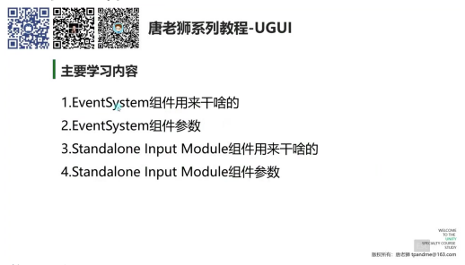

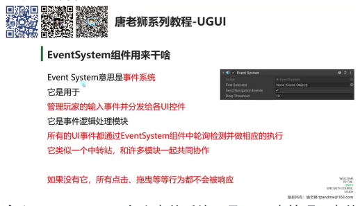

---

## 三、EventSystem 组件参数详解

### 1. First Selected（首先选择的游戏对象）

**默认选择设置：** 可以设置游戏一开始的默认选中 UI 元素，未设置时运行游戏不会有初始选中状态。

- **视觉反馈：** 被选中的按钮会显示颜色变化（如变灰），通过将 GameObject 拖入参数栏即可实现初始选中
- **关联性：** 该参数与 "Send Navigation Events" 参数存在功能关联，共同控制 UI 导航系统

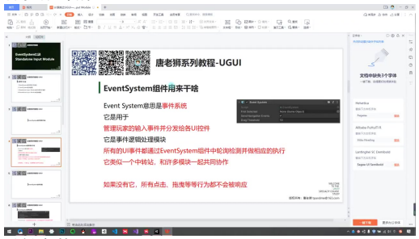

### 2. Send Navigation Events（是否允许导航事件）

**功能定义：** 控制是否允许通过键盘/手柄进行 UI 导航（移动/按下/取消操作）。

**测试方法：**

- 创建多个按钮并修改选中颜色（如红色）便于观察
- 开启时可通过 WASD 或方向键切换选中状态
- 关闭后键盘输入将不再影响 UI 选择状态

**实际应用：** 实现类似 PC/主机应用中用键盘操作 UI 的交互方式，回车键等效于点击操作。

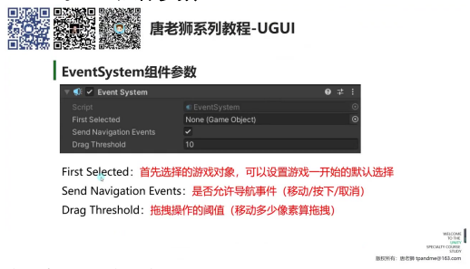

### 3. Drag Threshold（拖拽操作的阈值）

**参数意义：** 定义触发拖拽操作需要移动的**最小像素距离**（默认 10 像素）。

- **使用场景：** 当需要实现长按拖拽 UI 元素的功能时，该值决定触发拖拽的灵敏度
- **调整建议：** 根据项目需求调整，值过小可能导致误操作，过大则拖拽体验迟钝

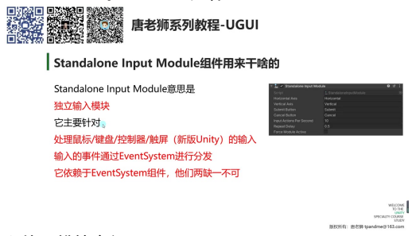

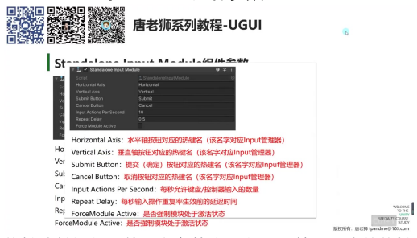

---

## 四、Standalone Input Module 组件

### 1. 独立输入模块介绍

**核心功能：** 处理多种输入设备（鼠标/键盘/控制器/触屏）的事件响应。

**关键特性：**

| 特性 | 说明 |
|------|------|
| **版本差异** | 新版 Unity 已整合触屏输入功能，旧版需要单独组件处理 |
| **系统依赖** | 必须与 EventSystem 组件配合使用，负责将输入事件分发给 UI 系统 |
| **参数配置** | 可自定义水平/垂直轴向的按键映射、提交/取消按钮的对应按键、输入响应频率、重复延迟 |

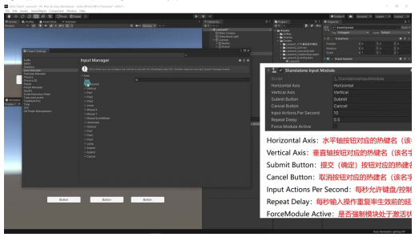

---

## 五、Standalone Input Module 参数详解

### 热键映射机制

前四个参数均对应 Input 管理器中的热键名称，用于建立 UI 操作与物理输入的关联关系。

> **默认值原则：** 这些参数通常保持默认值，无需修改。

### 1. Horizontal Axis（水平轴按钮对应的热键名）

- **实际映射：** 对应键盘 AD 键或左右方向键，手柄会自动识别左右按键
- **配置位置：** 需在 Project Settings → Input Manager 中设置具体键位

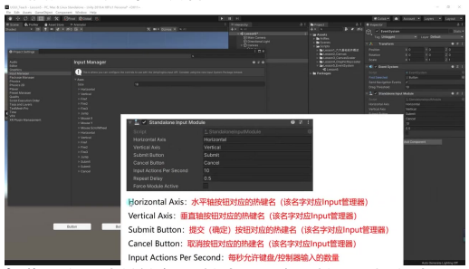

### 2. Vertical Axis（垂直轴按钮对应的热键名）

- **操作对应：** 映射键盘 WS 键或上下方向键，手柄自动适配上下按键
- **系统集成：** 与 EventSystem 协同实现 UI 导航功能

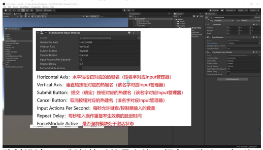

### 3. Cancel Button（取消按钮对应的热键名）

- **功能类比：** 类似键盘 ESC 键的取消功能
- **命名规范：** 必须与 Input Manager 中定义的名称完全一致

### 4. Input Actions Per Second（每秒允许键盘/控制器输入的数量）

- **防抖设计：** 限制长按时的最大输入频率，默认 10 次/秒
- **应用场景：** 防止快速连击导致意外操作

### 5. Repeat Delay（每秒输入操作重复率生效前的延迟时间）

- **时间控制：** 设置重复输入的初始延迟，默认 0.5 秒
- **用户体验：** 影响长按操作的响应灵敏度

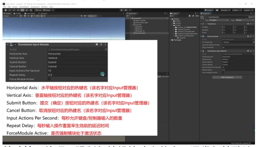

### 6. Force Module Active（是否强制模块处于激活状态）

- **特殊情况处理：** 强制保持模块响应状态，通常保持默认
- **版本变化：** 新版本已整合触屏输入功能

---

## 六、总结

### 核心要点

| 要点 | 说明 |
|------|------|
| **核心功能** | 实现输入事件监听与分发，保障 UI 交互响应 |
| **必要组件** | 必须与 GraphicRaycaster 配合使用 |
| **调试技巧** | 通过 EventSystem 的调试信息可查看鼠标事件 |
| **常见问题** | 按钮无响应需检查 EventSystem 是否存在 |

### 核心依赖关系

UI 交互必备条件：

1. Canvas 挂载 **Graphic Raycaster**
2. 场景存在 **EventSystem** 对象

> 缺失任一组件将导致所有输入事件无响应

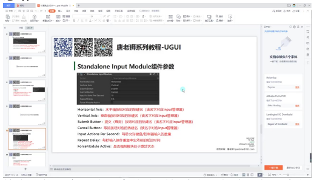

---

## 七、知识小结

| 知识点 | 核心内容 | 考试重点/易混淆点 | 难度系数 |
|--------|----------|-------------------|----------|
| **EventSystem 组件** | 管理玩家输入事件并分发给 UI 控件，类似中转站；依赖 Standalone Input Module 组件 | 必须与 Graphic Raycaster 共存；删除后 UI 交互失效 | ⭐⭐⭐ |
| **First Selected 参数** | 设置游戏默认选中的 UI 对象（如按钮初始选中状态） | 需配合导航系统使用；未设置时无默认选中 | ⭐⭐ |
| **Navigation 导航系统** | 允许通过键盘/手柄切换 UI 焦点（上下左右键或 WASD） | 勾选后需配置 Standalone Input Module 的输入热键 | ⭐⭐⭐ |
| **Drag Threshold 拖拽阈值** | 定义触发拖拽的最小像素移动量（默认 10 像素） | 值过小可能导致误触，过大影响操作灵敏度 | ⭐⭐ |
| **Standalone Input Module 组件** | 处理鼠标/键盘/控制器/触屏输入，与 EventSystem 协作 | 新版 Unity 已合并触屏输入模块；老版本需单独 Touch Input Module | ⭐⭐⭐⭐ |
| **输入热键配置** | 关联 Input Manager 中的水平轴（AD/左右键）、垂直轴（WS/上下键）等 | Submit 热键默认对应回车键；取消键可自定义 | ⭐⭐⭐ |
| **Repeat Rate 参数** | 限制每秒键盘/控制器输入次数（防连击过快） | 高频操作场景需调整（如快速菜单切换） | ⭐⭐ |
| **调试信息功能** | 实时显示鼠标位置、选中对象及操作事件（需双击横线展开） | 用于排查 UI 点击失效问题（如遮挡或组件缺失） | ⭐⭐⭐ |
| **核心依赖关系** | UI 交互必备条件：Canvas 挂载 Graphic Raycaster；场景存在 EventSystem 对象 | 缺失任一组件将导致所有输入事件无响应 | ⭐⭐⭐⭐ |
