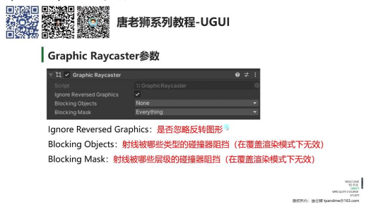
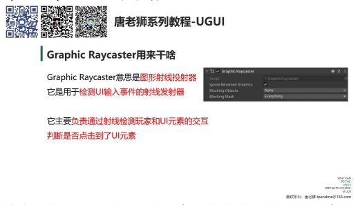
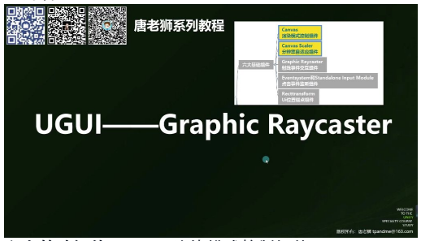
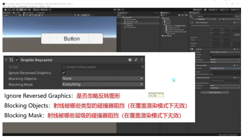

# Graphic Raycaster 图形射线投射器组件

> 以下为AI生成的图文笔记的内容

## 一、课程内容

六大基础组件：

- **Canvas** — 渲染模式控制组件
- **Canvas Scaler** — 分辨率自适应组件
- **Graphic Raycaster** — 射线事件交互组件
- **EventSystem** — 点击事件监听组件
- **RectTransform** — UI位置锚点组件

> 本节重点：主要学习 **Graphic Raycaster** 组件的功能和使用方法

---

## 二、Graphic Raycaster 用来干啥

### 核心功能

Graphic Raycaster 是**用于检测 UI 输入事件的射线发射器**，通过射线检测玩家和 UI 元素的交互，判断是否点击到了 UI 元素。

### 检测原理

- 基于**图形**进行检测（非碰撞器检测），因此称为"图形射线投射器"
- 所有 UI 控件（如 Image）默认没有碰撞器，但依然可以响应点击事件

### 组件特点

- 所有 UI 控件默认无碰撞器，仍可响应点击
- 与物理射线检测（Physics Raycaster）本质不同

---

## 三、Graphic Raycaster 参数详解

### 1. Ignore Reversed Graphics（忽略反转图形）

| 属性 | 说明 |
|------|------|
| **作用** | 是否忽略反转图形（X 轴或 Y 轴旋转 180° 的 UI 元素） |
| **默认值** | 勾选（忽略反转图形） |
| **Z 轴旋转** | 不影响检测，仅 X/Y 轴反转生效 |

**示例：** 当按钮旋转 180° 后，勾选时无法点击，取消勾选可正常响应点击。

---

### 2. Blocking Objects（射线阻挡类型）

**作用：** 射线被哪些类型的碰撞器阻挡（在覆盖渲染模式下无效）

| 选项 | 说明 |
|------|------|
| **None** | 不阻挡 |
| **2D** | 仅 2D 碰撞器阻挡 |
| **3D** | 仅 3D 碰撞器阻挡 |
| **All** | 全部阻挡 |

**示例：** 当设置为 2D 时，射线会被 Sprite 的 2D 碰撞器阻挡，但能穿透 3D 物体。

### 3. Blocking Mask（射线阻挡层级）

**作用：** 射线被哪些层级的碰撞器阻挡（需配合 Blocking Objects 使用）

- 通过层级过滤决定哪些层的碰撞器能阻挡射线
- **示例：** 当取消勾选 Cube 层时，该层的 3D 物体不再阻挡射线

### 4. 渲染模式要求

> **重要：** 必须在"摄像机模式"或"世界空间模式"下才生效。
>
> 覆盖渲染模式（Screen Space - Overlay）下这两个参数无效（因 UI 始终显示在最前）。

---

## 四、总结

### 核心功能

- 用于 UI 元素的射线检测和交互触发
- 基于图形而非碰撞器进行检测

### 关键参数

| 参数 | 说明 |
|------|------|
| **忽略反转图形** | 控制是否响应旋转 180° 的 UI 元素 |
| **阻挡类型** | 选择 2D/3D 碰撞器的阻挡效果 |
| **阻挡层级** | 通过层级过滤阻挡效果 |
| **渲染模式** | 需在摄像机/世界空间模式下使用 |

### 应用场景

- 处理 UI 与 3D 场景物体的遮挡关系
- 实现复杂的 UI 交互逻辑
- 优化射线检测性能（通过层级过滤）

---

## 五、知识小结

| 知识点 | 核心内容 | 考试重点/易混淆点 | 难度系数 |
|--------|----------|-------------------|----------|
| **Graphic Raycaster 的作用** | 用于检测 UI 输入事件的射线发射器，通过图形（而非碰撞器）检测玩家与 UI 元素的交互 | 注意区分 UGUI 与物理碰撞器的检测机制 | ⭐⭐ |
| **忽略反转图形参数** | 控制是否响应被旋转（X/Y 轴 180°）的 UI 元素，默认勾选（忽略反转图形） | Z 轴旋转不影响检测，仅 X/Y 轴反转生效 | ⭐⭐ |
| **射线阻挡类型参数** | 决定射线被 2D/3D 碰撞器阻挡（覆盖模式无效），选项：None/2D/3D/All | 需配合摄像机/3D 渲染模式使用 | ⭐⭐⭐ |
| **射线阻挡层级参数** | 指定阻挡射线的碰撞器所属层级（需与阻挡类型参数配合使用） | 层级过滤仅在非覆盖模式下生效 | ⭐⭐⭐ |
| **组件核心特性总结** | 1. 基于图形检测 2. 可配置阻挡条件 3. 反转图形可控制交互 | 与物理射线检测的本质差异 | ⭐⭐ |
