# RectTransform 矩形变换

> 以下为AI生成的图文笔记的内容

## 一、RectTransform 组件用来干啥

### 继承关系

RectTransform 继承自 Transform 组件，专门用于**处理 UI 元素位置和大小**。

### 功能扩展

在 Transform 的位置、角度（X/Y/Z）、缩放（Scale X/Y/Z）基础上，新增矩形处理功能：

| 新增属性 | 说明 |
|----------|------|
| **Center Pos（中心点）** | UI 元素的中心位置 |
| **Anchors（锚点）** | 相对父对象的定位参考点 |
| **Width / Height** | 矩形宽高（如 500×500） |

将 UI 元素视为**矩形对象**处理。

### 设计目的

- 更便捷地控制 UI 元素大小
- 实现分辨率自适应时的位置适应

---

## 二、RectTransform 组件参数详解

### 1. 基础参数

| 参数 | 说明 |
|------|------|
| **Width / Height** | 矩形宽高（示例值：500×500） |
| **Rotation** | 围绕轴心点（Pivot）旋转的角度（X/Y/Z） |
| **Scale** | 缩放大小（X/Y/Z，默认值 1） |

#### 特殊模式

| 模式 | 说明 |
|------|------|
| **蓝图模式（Blueprint Mode）** | 编辑旋转缩放仅影响显示内容，不改变实际矩形范围 |
| **原始编辑模式（Raw Edit Mode）** | 改变轴心/锚点不改变矩形位置 |

### 2. 核心参数

| 参数 | 说明 |
|------|------|
| **Pivot（轴心点）** | 取值范围 0~1（示例值：X=0.5 / Y=0.5），旋转和缩放的中心基准点 |
| **Anchors（锚点）** | 相对父矩形的定位点，由 Min（最小值）和 Max（最大值）定义范围（示例值：MinX=0.5 / MinY=0.5） |
| **Position** | 实际表示轴心点相对锚点的位置（示例值：X=-179 / Y=144），注意与 Transform 的 Position 区别 |
| **Left / Top / Right / Bottom** | 矩形边缘相对锚点的位置，仅当锚点分离时显示 |

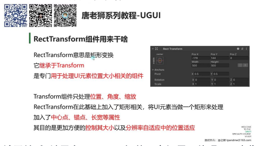

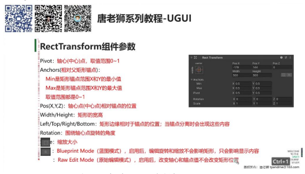

---

## 三、RectTransform 组件参数详细讲解

### 1. 轴心点（Pivot）

**定义与取值范围：** 轴心点（Pivot）是 UI 元素的旋转和位置计算中心，取值范围为 [0,1] × [0,1] 的二维坐标系。

**坐标系规则：**

| 坐标 | 位置 |
|------|------|
| (0, 0) | 左下角 |
| (1, 1) | 右上角 |
| (0.5, 0.5) | 矩形正中心（默认值） |

**核心作用：**

- **旋转基准：** 所有旋转操作都围绕轴心点进行（示例：将轴心点改为 (0,0) 后旋转，元素会绕左下角转动）
- **位置计算基准：** 与锚点配合计算相对位置

**可视化验证：** 在 Unity 编辑器中拖动 Pivot 的 X/Y 值，可观察到蓝色圆点标记在矩形范围内的实时移动。

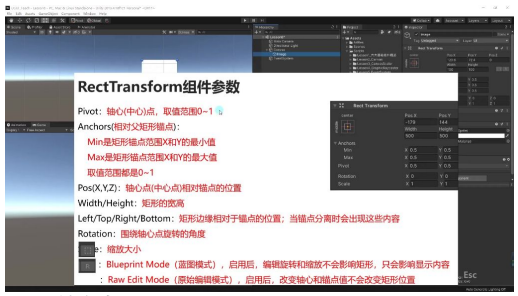

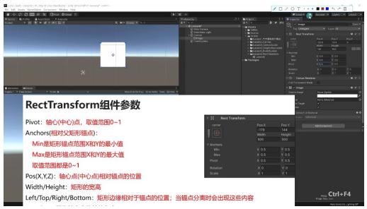

---

### 2. 相对父矩形锚点（Anchors）

#### 锚点计算规则

**基本概念：**

- 锚点（Anchors）决定 UI 元素相对于父矩形的位置关系
- 通过 Min（左下）和 Max（右上）两个点定义锚点范围
- 取值范围：与轴心点相同，采用归一化坐标，(0,0) 表示父矩形左下角，(1,1) 表示右上角

**两种形态：**

| 形态 | 条件 | 表现 |
|------|------|------|
| **点形态** | Min = Max（如 (0.5, 0.5)） | 四个箭头聚合成单个锚点 |
| **范围形态** | Min ≠ Max（如 Min(0.1, 0.1) Max(0.9, 0.9)） | 形成矩形范围 |

**父对象影响：** 锚点始终基于直接父对象的矩形范围计算（示例：将 Image 从 Canvas 移到空物体下，锚点参照系立即切换）。

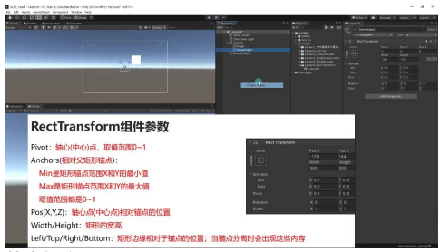

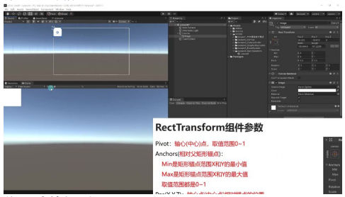

#### 锚点作为点的情况

**位置计算规则：**

- Transform 显示的 Pos(X,Y) 值是**轴心点到锚点的偏移量**
- 坐标系：右侧为 X 正方向，上方为 Y 正方向（示例：锚点在左上角时，向下移动 Y 值显示为负）

**分辨率自适应：**

- **九宫格对齐原理：** 通过设置特殊锚点实现（如 (0,1) 左上角、(1,1) 右上角等）
- **实际应用：** 将按钮锚点设为 (0.5, 0) 可使按钮在不同分辨率下始终水平居中且贴底

**典型问题：**

| 问题 | 原因 | 解决方案 |
|------|------|----------|
| 未设置锚点导致显示不全 | 当 Canvas 尺寸变化时，以中心点计算的元素可能超出屏幕 | 根据 UI 元素定位需求选择对应角落的锚点 |

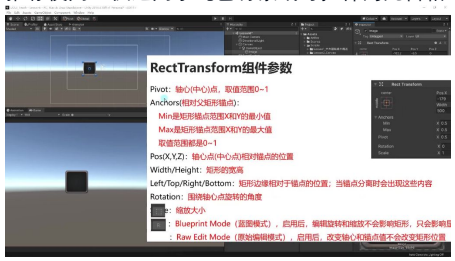

#### 锚点应用：大小自适应

**参数变化：**

- 当锚点分离为范围时，Pos(X,Y) 变为 Left/Top/Right/Bottom
- 数值含义：表示元素各边与锚点范围对应边的距离（示例：Left=10 表示元素左边距锚点范围左边 10 单位）

**拉伸原理：**

- 元素大小会随锚点范围的变化而等比缩放
- 计算公式：`元素宽度 = 父矩形宽度 × (MaxX - MinX) - (Left + Right)`

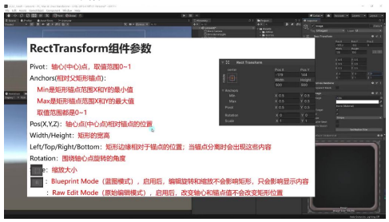

**使用场景：**

| 场景 | 锚点设置 | 说明 |
|------|----------|------|
| 背景图填充 | Min(0,0) Max(1,1) | 可使背景完全适应父对象 |
| 特殊区域控制 | Min(0.2,0.2) Max(0.8,0.8) | 创建 20% 边距的弹性区域 |

**注意事项：**

| 风险 | 说明 | 建议 |
|------|------|------|
| 图片变形风险 | 非等比缩放会导致图像失真（正圆形被拉伸为椭圆形） | 仅适用于纯色背景或可拉伸的九宫格 Sprite |

#### 轴心点与锚点的协作关系

| 参数 | 作用 |
|------|------|
| **轴心点** | 控制元素自身的旋转中心和位置计算基准 |
| **锚点** | 建立元素与父对象的空间关系，决定位置/大小的自适应方式 |

- 当锚点为**点**时：Pos(X,Y) 计算轴心点与锚点的偏移
- 当锚点为**范围**时：通过边距参数控制元素与锚点范围的相对关系

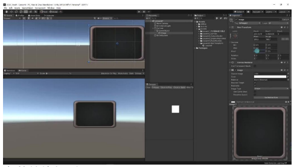

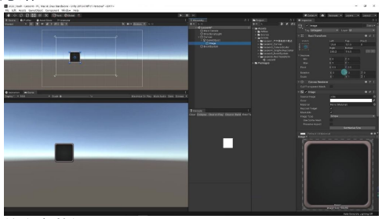

---

### 3. 宽高和左右上下

#### 锚点设置为点的情况

**参数显示规则：** 当锚点设置为单个点（如 X=0.5, Y=0.5）时，界面显示的是 **Pos(X,Y,Z)** 位置参数和 **Width/Height** 宽高参数。

**宽高变化基准：**

| 轴心点设置 | 宽度变化方向 | 高度变化方向 |
|-----------|-------------|-------------|
| X=0.5 / Y=0.5 | 向两侧延伸 | 向上下延伸 |
| X=0 / Y=0 | 向右延伸 | 向上延伸 |
| X=1 / Y=1 | 向左延伸 | 向下延伸 |

**缩放影响：**

- 缩放同样受轴心点影响：轴心点 (0.5, 0.5) 时向四周均匀缩放
- 轴心点在边缘时（X=0 或 X=1），缩放会向单侧延伸

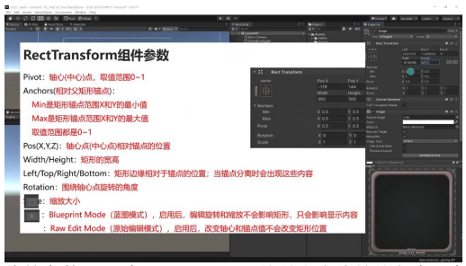

#### 锚点设置为范围的情况

**参数转换规则：**

- 当锚点 Min 和 Max 值不同形成范围时，参数显示变为 **Left / Right / Top / Bottom** 边缘偏移值
- 例如：Y 轴锚点 Min=0, Max=1 时显示 Top/Bottom；Min=0.5, Max=0.5 时显示 Y 位置

**显示逻辑：**

| 轴向状态 | 显示参数 |
|----------|----------|
| 锚点重合（如 Y=0.5-0.5） | 位置参数 |
| 锚点分离（如 Y=0-1） | 边缘偏移参数 |

**实际应用：**

- 上下边重合时只需控制 Y 位置
- 上下边分离时需要分别控制与父对象上下边的距离

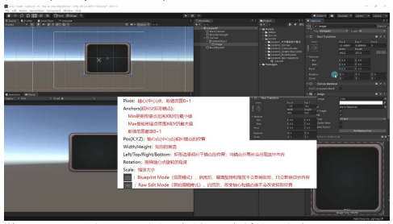

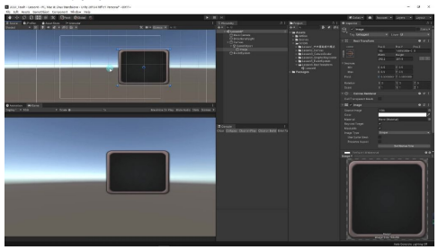

#### 参数总结

**核心参数组：**

| 参数组 | 包含内容 |
|--------|----------|
| **位置参数组（PosX/Y/Z）** | 控制轴心点相对于锚点的位置 |
| **尺寸参数组** | Width/Height 或 Left/Right/Top/Bottom |

**显示切换条件：**

- 锚点是否为范围决定显示位置参数还是边缘参数
- 参数切换是自动的，取决于锚点设置方式

**关联影响：**

- 轴心点同时影响位置计算、旋转中心和尺寸变化方向
- 锚点设置方式决定了参数的计算基准和显示方式

---

### 4. 旋转和缩放

- **旋转参数：** 通过 Rotation 设置围绕轴心点旋转的角度，参数包含 X/Y/Z 三个轴向
- **缩放参数：** 通过 Scale 设置缩放大小，包含 X/Y/Z 三个轴向的缩放比例

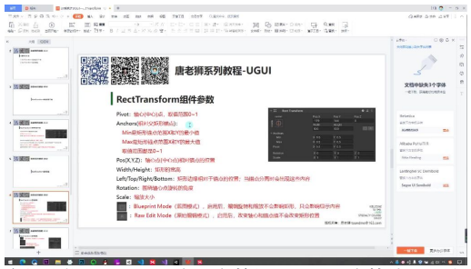

---

### 5. 蓝图模式和原始编辑模式

#### 蓝图模式（Blueprint Mode）

- **作用机制：** 启用后编辑旋转和缩放仅影响显示内容，不改变矩形实际范围
- **典型表现：** 缩放 X 轴或旋转时，外部矩形框保持原状，仅内部内容变化
- **应用场景：** 特殊需求时使用，常规情况建议保持关闭状态

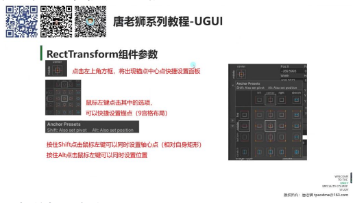

#### 原始编辑模式（Raw Edit Mode）

- **核心功能：** 启用后修改轴心（Pivot）和锚点（Anchors）数值不会立即改变矩形位置
- **视觉反馈：** Inspector 窗口坐标值保持不变，但场景中对象实际位置会偏移
- **数学原理：** 系统保持轴心与锚点的相对距离不变，导致对象位置自动补偿

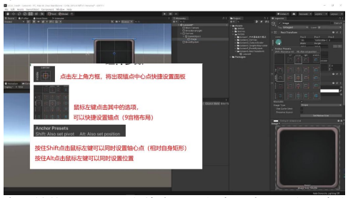

---

### 6. 轴心与锚点的快捷设置

- **轴心点设置：** 拖动 Scene 窗口蓝色圆点可直接调整 Pivot 值（0~1 范围）
- **锚点设置：** 通过拖拽四个箭头状控件（称为"菊花"）可快速修改锚点位置
- **操作优势：** 相比手动输入数值，可视化拖拽更直观高效

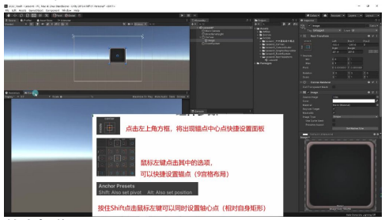

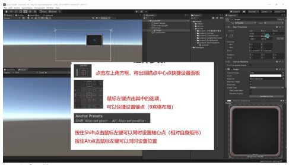

---

### 7. 锚点中心点快捷设置面板

#### 面板的打开方式

- **打开位置：** 点击 UI 元素左上角的方框即可打开锚点中心点快捷设置面板
- **操作基础：** 该面板主要用于快速设置 UI 元素的锚点和中心点（轴心点）

#### 面板布局与功能

- **布局结构：** 采用九宫格布局，包含上中下三行，每行三个点，分别对应中心点、上下左右及四个角落
- **核心功能：**
  - 锚点设置：通过点击九宫格中的点可以快速设置锚点位置
  - 快捷键功能：
    - **按住 Shift 键点击** — 可同时设置轴心点（基于自身矩形）
    - **按住 Alt 键点击** — 可同时设置位置

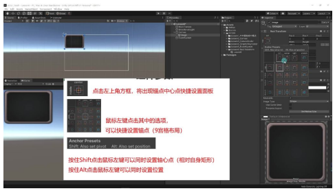

#### 锚点设置示例

**基本操作：**

| 操作 | 效果 |
|------|------|
| 点击左上角点 | 将锚点设置到父对象的左上角 |
| 点击中心点 | 将锚点设置到父对象的中心 |

**范围设置：**

- 右侧蓝色箭头选项可设置 X 轴有最小和最大范围（左右拉伸）
- Y 轴可设置为固定值（不受父对象高度变化影响）

**自适应效果：**

- 当设置 X 轴范围后，UI 元素宽度会随父对象宽度变化
- Y 轴固定时高度保持不变，仅相对于上边进行位置计算

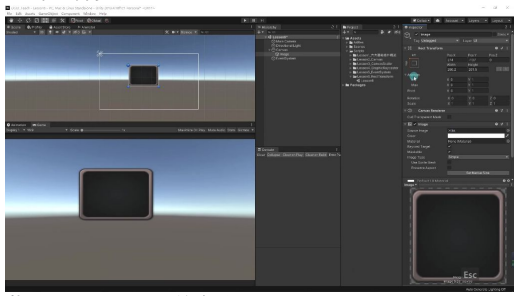

#### 轴心点与位置设置

**组合操作：**

| 快捷键 | 效果 |
|--------|------|
| **Shift + 点击** | 同时设置锚点和轴心点（轴心点基于自身坐标系） |
| **Alt + 点击** | 同时设置锚点、轴心点并将 UI 元素移动到对应位置 |

**实际应用：** 创建 UI 元素后，使用 **Shift + Alt + 点击** 可快速将其定位到指定位置，特别适合需要精确对齐的 UI 布局工作。

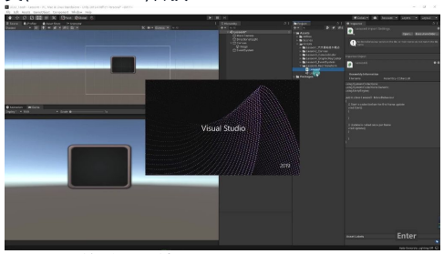

#### 面板常用功能总结

**最常用功能：**

- 九宫格中间的 9 个点（用于基本锚点定位）
- 右下角四个箭头图标（将锚点设置为填满父对象）

**使用场景：**

| 场景 | 方案 |
|------|------|
| 背景 / 遮罩 | 使用填满父对象选项 |
| 普通 UI 元素 | 使用九宫格定位点 |
| 特殊需求 | 根据实际情况选择单边拉伸等选项 |

**核心要点：** 锚点和轴心点是 RectTransform 组件的核心参数，其他参数变化大多基于这两个点的设置。

---

### 8. 通过代码得到 RectTransform

#### 获取 RectTransform 的方法

- **基本获取方式：** 通过 `this.transform` 获取对象的 Transform 组件，由于 RectTransform 继承自 Transform，可以直接强制转换为 RectTransform 类型
- **类型转换：** 使用 `as` 关键字进行安全类型转换：

```csharp
RectTransform rt = this.transform as RectTransform;
```

- **里氏替换原则：** 这里体现了面向对象中的里氏替换原则，父类（Transform）可以被子类（RectTransform）替换

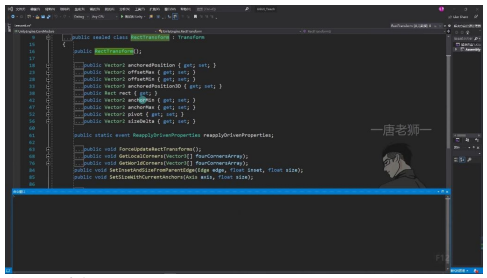

#### RectTransform 的重要属性

| 类别 | 属性 | 说明 |
|------|------|------|
| **尺寸属性** | `sizeDelta` | 获取 UI 元素的尺寸 |
| | `rect` | 获取矩形信息 |
| **锚点属性** | `anchorMin` | 获取左下锚点 |
| | `anchorMax` | 获取右上锚点 |
| **位置属性** | `anchoredPosition` | 获取基于锚点的位置 |
| | `pivot` | 获取中心点位置 |
| **继承属性** | `rotation` / `scale` | 继承自 Transform 的旋转和缩放属性 |

#### 实际应用示例

```csharp
void Start()
{
    // 获取并打印 UI 元素的尺寸
    print((this.transform as RectTransform).sizeDelta);
}
```

**测试方法：** 将脚本挂载到 Image 组件上运行，可以验证打印出的尺寸（如 290, 201）是否与 Inspector 面板中显示的数值一致。

**调试技巧：** 可以直接打印整个 RectTransform 对象来查看所有属性值。

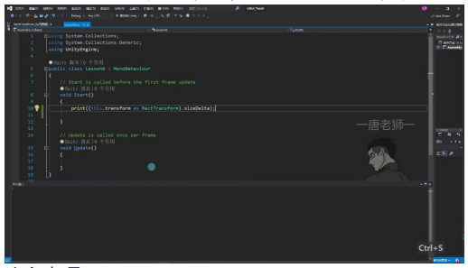

#### 注意事项

| 注意点 | 说明 |
|--------|------|
| **参数设置时机** | 具体的参数设置方法将在后续讲解 UI 控件时详细介绍 |
| **继承关系** | RectTransform 在 Transform 基础上添加了 UI 特有的参数，但保留了所有 Transform 的功能 |
| **类型安全** | 使用 `as` 进行转换比强制类型转换更安全，转换失败会返回 `null` 而不会抛出异常 |

---

## 四、RectTransform 组件总结

### 核心功能

- **UI 控制组件：** RectTransform 是专门用于控制 UI 尺寸大小和对齐方式的组件
- **分辨率适配：** 主要功能是帮助 UI 在分辨率变化时实现位置的自适应（通过九宫格布局实现）

### 关键概念

| 概念 | 作用 |
|------|------|
| **锚点（Anchors）** | 决定 UI 元素与父物体的相对定位关系，影响元素在不同分辨率下的布局表现 |
| **轴心点（Pivot）** | 控制 UI 元素旋转和缩放的基准点，影响变换操作的中心位置 |

**快捷操作：**

| 快捷键 | 效果 |
|--------|------|
| Shift + 左键 | 可同时设置轴心点（相对自身矩形） |
| Alt + 左键 | 可同时设置元素位置 |

### 九宫格布局

- **布局原理：** 将 UI 区域划分为 9 个格子，通过锚点设置确定元素在不同分辨率下的伸缩规则
- **应用场景：** 特别适合需要适配多种屏幕尺寸的 UI 元素布局

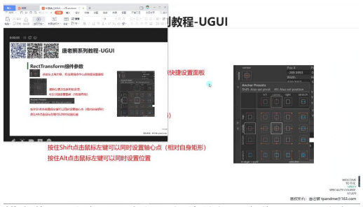

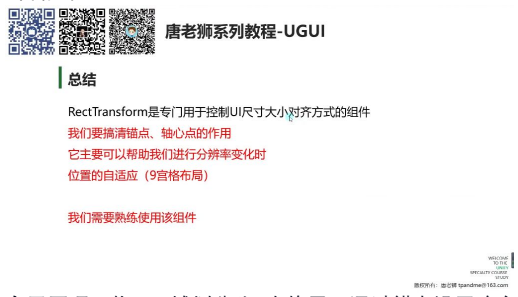

---

## 五、知识小结

| 知识点 | 核心内容 | 考试重点/易混淆点 | 难度系数 |
|--------|----------|-------------------|----------|
| **RectTransform 组件的作用** | 用于控制 UI 元素的位置、大小、旋转和缩放，继承自 Transform 组件，专门处理 UI 元素的矩形变换 | 锚点与轴心点的区别：锚点决定 UI 元素相对于父对象的位置或范围，轴心点决定旋转和缩放的中心 | ⭐⭐ |
| **锚点（Anchors）** | 锚点用于确定 UI 元素相对于父对象的位置或范围，支持点对齐（九宫格）和范围对齐（拉伸） | 点对齐：用于位置自适应；范围对齐：用于大小自适应（可能导致图像变形） | ⭐⭐⭐ |
| **轴心点（Pivot）** | 轴心点决定 UI 元素的旋转和缩放中心，取值范围 0-1（左下角为 0,0，右上角为 1,1） | 轴心点变化会影响旋转、缩放以及宽高变化的延伸方向 | ⭐⭐ |
| **锚点与轴心点的交互** | 当锚点为点时，UI 元素的位置基于轴心点与锚点的偏移计算；当锚点为范围时，UI 元素的大小基于父对象的边距计算 | 易混淆点：锚点范围模式下，UI 元素会随父对象拉伸，可能导致变形 | ⭐⭐⭐ |
| **分辨率自适应** | 通过锚点设置（如九宫格对齐）实现 UI 元素在不同分辨率下的位置自适应 | 关键技巧：使用 Shift+Alt 快速设置锚点和位置，确保 UI 适配不同屏幕尺寸 | ⭐⭐⭐ |
| **RectTransform 参数** | Position/Size：锚点为点时显示坐标和尺寸；Left/Right/Top/Bottom：锚点为范围时显示边距；Rotation/Scale：与 Transform 组件一致 | 易错点：锚点模式切换时，参数显示会变化（如 XYZ 变为 Left/Right） | ⭐⭐ |
| **蓝图模式与原始编辑模式** | 蓝图模式：缩放/旋转不影响矩形框；原始编辑模式：改变轴心/锚点时不改变矩形位置（仅数值不变） | 实际开发中较少使用，特殊场景下可能需要 | ⭐ |
| **代码获取 RectTransform** | 通过 `GetComponent<RectTransform>()` 获取，可访问锚点、轴心、尺寸等属性 | 重点掌握 `anchoredPosition`、`sizeDelta` 等常用属性 | ⭐⭐ |
