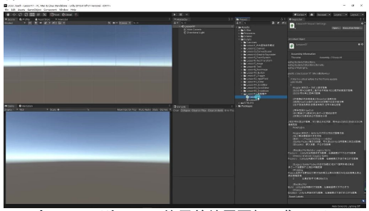
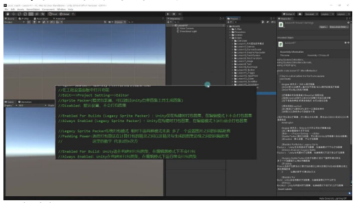
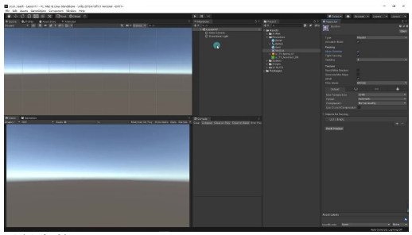
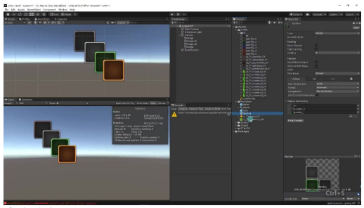
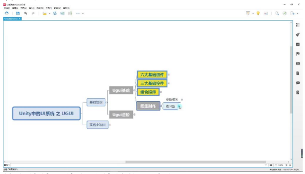

# 图集制作

> 以下为AI生成的图文笔记内容

## 一、图集制作

### 1. 为什么要打图集

- UGUI与NGUI区别：NGUI使用前就需要打图集，而UGUI可以之后再打图集
- **主要目的**：减少DrawCall，提高性能
- **DrawCall本质**：CPU通知GPU进行一次渲染的命令
- **优化原理**：将多个小图合并成大图，将原本n次的DrawCall合并为1次
- **性能影响**：DrawCall次数过多会导致游戏卡顿



### 2. 在Unity中打开自带的打图集功能

**开启路径**：`Edit → Project Setting → Editor → Sprite Packer`

**四种模式**：

| 模式 | 说明 |
|------|------|
| Disabled | 默认不打包图集 |
| Enabled For Builds | 仅在构建时打包 |
| Always Enabled | 构建和编辑器模式都会打包 |
| Legacy模式 | 多出图片间隔距离设置 |

**间隔参数**：Padding Power值代表 2^n 像素的间隔距离。

**推荐设置**：UI图集建议使用 **Always Enabled** 模式。



### 3. 打图集参数注意

**关键参数**：

| 参数 | 建议设置 | 说明 |
|------|---------|------|
| Allow Rotation | 必须取消勾选 | 避免UI元素异常旋转 |
| Tight Packing | 建议取消勾选 | 老版本可能有兼容问题 |

**创建方法**：右键 → Create → Sprite Atlas

**性能验证**：通过Game窗口的Stats面板查看DrawCall数量变化。

**层级影响**：不同图集的图片穿插会打断批处理，增加DrawCall。



### 4. 代码加载

**命名空间**：`using UnityEngine.U2D`

**加载图集**：

```csharp
SpriteAtlas sa = Resources.Load<SpriteAtlas>("图集名称");
```

**获取子图**：

```csharp
Sprite sprite = sa.GetSprite("子图名称");
```

**使用场景**：动态替换UI元素的图片资源。



### 5. 内容总结

- **核心价值**：优化渲染性能，减少DrawCall
- **工作流程**：创建图集 → 关联图片 → 设置参数 → 打包使用
- **注意事项**：避免不同图集图片穿插，注意参数设置
- **实践建议**：提前规划通用资源图集，为项目做好准备



## 二、知识小结

| 知识点 | 核心内容 | 考试重点/易混淆点 | 难度系数 |
|--------|----------|-------------------|----------|
| 为什么要打图集 | 减少DrawCall（DC）次数，提高性能；通过合并小图成大图，将多次DC合并为一次 | DrawCall概念（需结合NGUI课程理解）；UI图集与非UI图集参数差异 | ⭐⭐ |
| Unity打图集功能开启 | Edit > Project Settings > Editor > Sprite Packer；模式选择：Always Enabled（编辑器+发布时打包） | 传统打包模式（间隔像素设置）与默认模式区别 | ⭐ |
| 图集参数设置 | 创建Sprite Atlas文件；UI图集需取消勾选：Allow Rotation（自动旋转）和Tight Packing（边缘紧缩） | 参数误勾选导致UI显示异常 | ⭐⭐ |
| DrawCall验证方法 | 通过Game窗口 > Stats > Batches统计；打断批处理：不同图集图片或Text插入重叠层级会增加DC | 层级打断原理（需结合NGUI批处理规则） | ⭐⭐⭐ |
| 代码加载图集 | 引用UnityEngine.U2D命名空间；Resources.Load<SpriteAtlas>加载；GetSprite("name")获取子图 | 路径匹配（需在Resources文件夹下） | ⭐⭐ |
| 实战注意事项 | 通用资源预先打包图集；避免非图集元素打断渲染顺序 | 性能优化优先级（高频更新UI需单独处理） | ⭐⭐⭐ |
