# Button 按钮控件

> 以下内容为 AI 生成的图文笔记

---

## 一、组合控件相关知识点

### 1. Button 按钮控件

#### 1) Button 是什么

**定义**: Button 是 UGUI 中用于处理玩家按钮相关交互的关键组件。

**组成结构**:
- **父对象**:
  - 必须包含 RectTransform 组件
  - 挂载 Image 组件作为按钮背景图
  - 包含 Button 组件处理交互逻辑
- **子对象（可选）**:
  - Text 组件用于显示按钮文字
  - 可根据美术需求决定是否保留

**特点**:
- 默认创建时包含完整父子结构
- 文字显示可根据 UI 设计需求灵活调整
- 交互区域由 Image 组件的显示范围决定

#### 2) 创建 Button

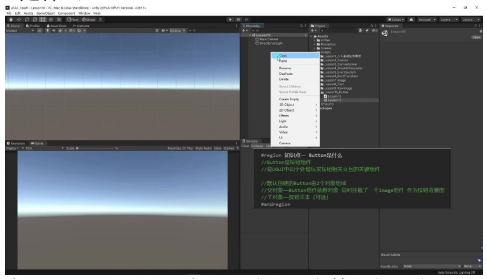

**创建步骤**:
1. 在 Hierarchy 窗口右键选择 `UI > Button`
2. 系统自动生成包含父子结构的 Button 对象

**组件验证**:
- 父对象必含三大组件：RectTransform、Image、Button
- 子对象默认包含 Text 组件但可删除

**运行效果**:
- 未被遮挡时即可响应点击事件
- 交互区域与 Image 显示范围一致

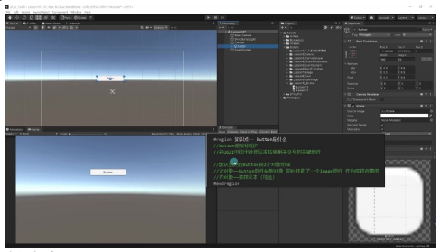

**设计建议**:
- 当美术资源已包含文字时可删除 Text 子对象
- 需要动态修改文字时保留 Text 组件

#### 3) Button 参数

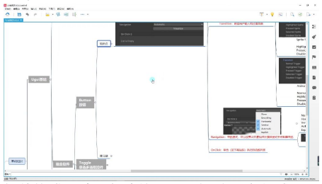

**组件构成**: 默认创建的 Button 由 2 个对象组成：父对象是 Button 组件依附对象（挂载 Image 组件作为按钮背景），子对象是可选的按钮文本。

**核心功能**: Button 是 UGUI 中用于处理玩家按键交互的关键组件。

**是否接受输入 (Interactable)**:

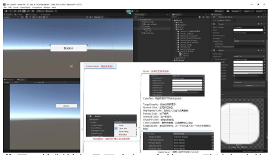

- **作用**: 控制按钮是否响应玩家输入，默认勾选状态
- **禁用效果**: 取消勾选后按钮变色且无法点击，但不会隐藏按钮
- **应用场景**: 常用于条件触发按钮（如未满足条件时禁用按钮）

**响应用户输入的过渡效果 (Transition)**:

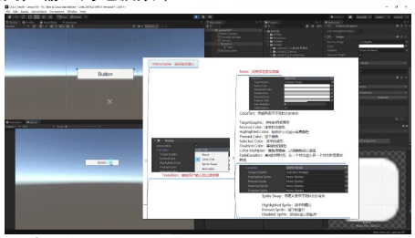

四种模式：

| 模式 | 说明 | 使用频率 |
|------|------|----------|
| None | 无状态变化（交互感弱） | 较少 |
| Color Tint | 颜色变化（最常用） | 最高 |
| Sprite Swap | 图片切换 | 中等 |
| Animation | 动画效果 | 较高（成本也高） |

默认选择：颜色变化模式，提供最佳视觉反馈。

**控制的目标图形 (Target Graphic)**:

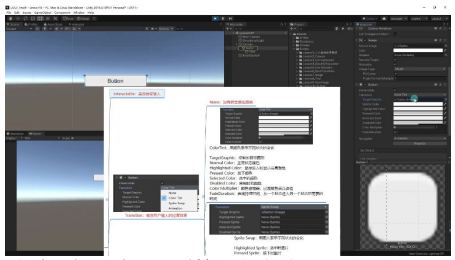

- **关联对象**: 默认关联按钮自身的 Image 组件
- **控制原理**: 通过控制目标图形的颜色/图片实现状态变化
- **自定义设置**: 可指定其他 UI 元素作为控制目标

**正常颜色 (Normal Color)**:

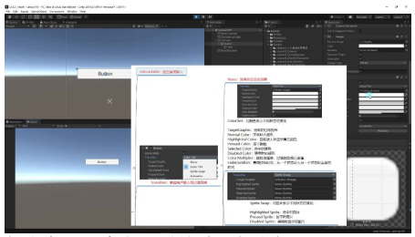

- **状态定义**: 未交互时的默认状态颜色
- **修改效果**: 直接改变按钮基础外观（如设为红色则按钮默认显示红色）

**鼠标进入时的高亮颜色 (Highlighted Color)**:

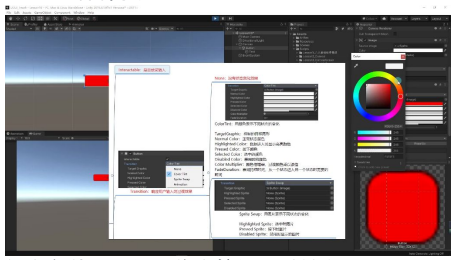

- **触发条件**: 鼠标悬停在按钮上时触发
- **示例设置**: 黄色高亮效果（鼠标移入时按钮变黄）
- **视觉反馈**: 帮助玩家识别可交互区域

**按下的颜色 (Pressed Color)**:

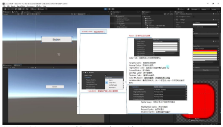

- **触发时机**: 鼠标按下但未释放时
- **示例设置**: 蓝色按下效果（点击时按钮变蓝）

**选中的颜色 (Selected Color)**:

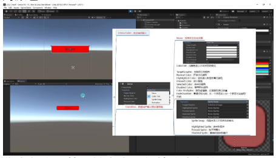

- **焦点状态**: 按钮被点击后保持选中状态时显示
- **应用场景**: 用于标记当前激活的选项（如菜单中的选中项）
- **示例设置**: 特殊颜色标识选中状态

**禁用的颜色 (Disabled Color)**:

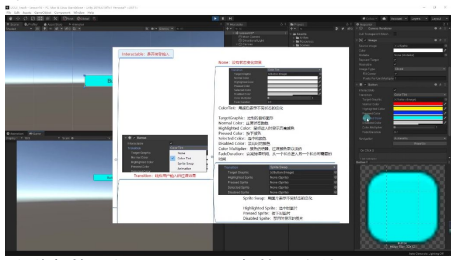

- **关联参数**: 与 Interactable 参数配合使用
- **视觉提示**: 当 Interactable 取消勾选时显示禁用颜色
- **设计建议**: 通常使用灰色表示禁用状态

**颜色倍增器 (Color Multiplier)**:

- **计算方式**: 过渡颜色值乘以该系数
- **默认值**: 通常保持默认 1 不变
- **特殊用途**: 需要增强颜色对比度时可调整

**衰减持续时间 (Fade Duration)**:

- **功能**: 控制状态切换时的渐变时间（单位：秒）
- **默认值**: 0.1 秒（100 毫秒）
- **调整效果**: 设为 1 秒时会产生缓慢的颜色过渡效果
- **设计平衡**: 过长的持续时间会导致响应迟滞

**用图片表示不同状态的变化 (Sprite Swap)**:

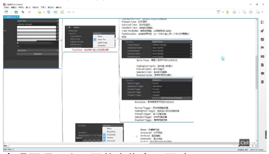

- **实现原理**: 为不同状态指定不同贴图
- **资源需求**: 需要美术提供多张状态图片
- **状态配置**:
  - Highlighted Sprite：鼠标悬停图
  - Pressed Sprite：按下状态图
  - Selected Sprite：选中状态图
  - Disabled Sprite：禁用状态图
- **适用场景**: 需要精细视觉效果的高质量 UI

**用动画表示不同状态的变化 (Animation)**:

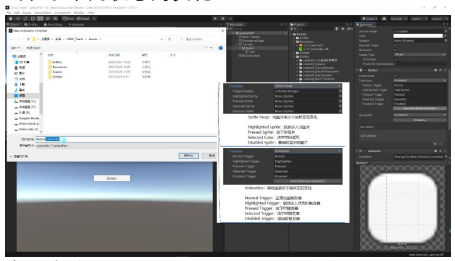

- **实现方式**:
  1. 点击"Auto Generate Animation"生成动画控制器
  2. 在 Animation 窗口编辑各状态动画
  3. 通过触发器控制状态切换
- **动画类型**:
  - Normal Trigger：默认状态动画
  - Highlighted Trigger：悬停动画
  - Pressed Trigger：按下动画
  - Selected Trigger：选中动画
  - Disabled Trigger：禁用动画
- **制作技巧**: 取消勾选"Loop Time"避免动画循环播放
- **应用建议**: 适合需要复杂动态效果的按钮，但开发成本较高

#### 4) 导航模式

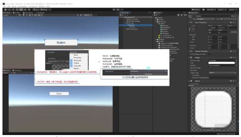

- **核心功能**: 控制 UI 元素在播放模式中的键盘导航行为
- **应用场景**: 适用于需要通过键盘方向键或 WASD 键在不同 UI 元素间切换的场景

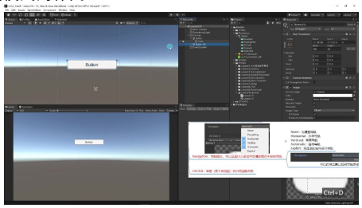

**导航模式的作用**:

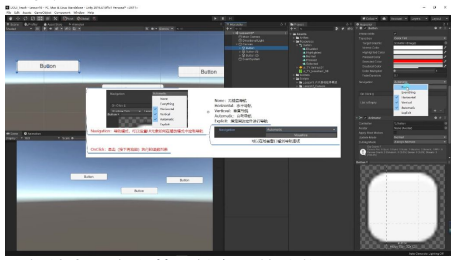

- **交互机制**: 通过 Event System 组件实现导航事件处理
- **视觉反馈**: 建议为按钮设置不同状态颜色（如选中状态设为红色）以增强导航可视性
- **测试方法**: 运行状态下使用方向键或 WASD 在不同按钮间切换

**无键盘导航 (None)**:

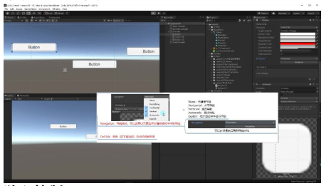

- **功能特点**: 完全禁用键盘导航功能
- **使用场景**: 当需要限制仅通过鼠标操作 UI 元素时
- **实际表现**: 选中按钮后按方向键不会触发任何导航行为

**水平导航与垂直导航**:

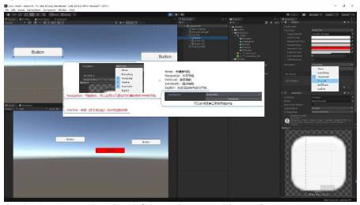

- **独立控制**:
  - 水平导航：仅响应左右方向键操作
  - 垂直导航：仅响应上下方向键操作
- **限制条件**: 若只启用水平导航，上下方向键操作将无效，反之亦然

**自动导航**:

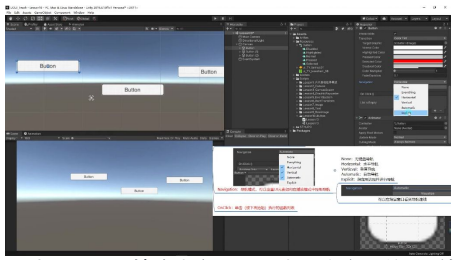

- **智能模式**: 自动判断周边可导航元素
- **关联特性**: 选择自动模式时会同时启用水平和垂直导航
- **默认行为**: 相当于同时勾选水平和垂直导航选项

**指定周边控件导航**:

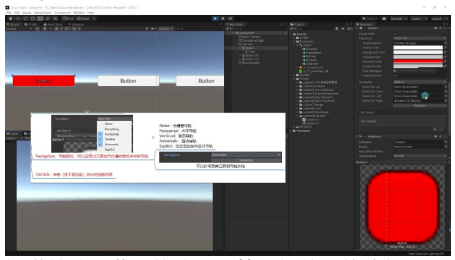

- **手动配置**: 可精确指定上下左右四个方向的关联按钮
- **配置方法**: 通过场景视图拖拽指定目标按钮
- **测试案例**: 设置按钮 A 的 Right 属性指向按钮 B，运行时按右键可直接跳转

**导航连线可视化**:

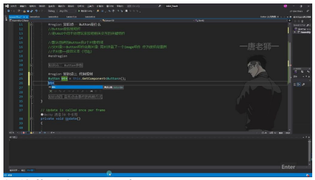

- **视觉辅助**: 黄色箭头显示按钮间的导航路径
- **启用方式**: 点击 Visualize 参数激活显示
- **调试价值**: 直观展示按钮间的导航关系，便于检查导航逻辑

#### 5) 代码控制

**获取 Button 组件**:

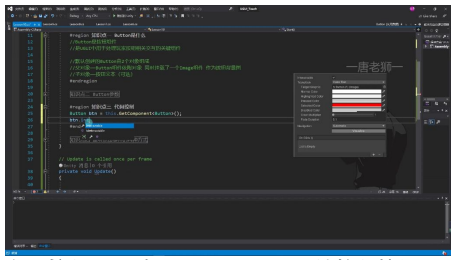

- **组件获取方法**: 通过 `this.GetComponent<Button>()` 获取当前对象上的 Button 组件，需要先引用 `UnityEngine.UI` 命名空间
- **组件关系**: Button 组件通常与 Image 组件配合使用，默认创建的 Button 包含父对象（挂载 Button 和 Image）和子对象（可选文本）

**参数控制**:

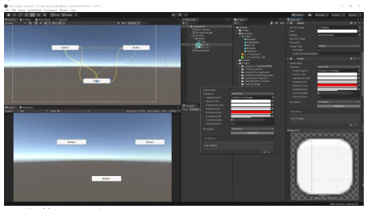

- **交互控制**: 通过 `btn.interactable` 属性控制按钮是否可点击（true/false）
- **过渡效果**: `transition` 属性提供四种模式：None（无）、ColorTint（颜色变化）、SpriteSwap（图片切换）、Animation（动画）
- **图像控制**: 建议直接获取 Image 组件进行图片修改，避免通过 Button 组件间接操作

**组件联动**:

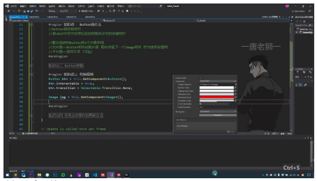

- **图像获取**: 使用 `this.GetComponent<Image>()` 直接获取关联的 Image 组件
- **操作方式**: 对 Image 组件的操作与普通 Image 组件完全一致，可以修改 sprite、color 等属性
- **注意事项**: 当 transition 模式为 SpriteSwap 时，通过 Button 组件获取图片可能不准确

**代码示例**:

基本操作：
```csharp
Button btn = this.GetComponent<Button>();
btn.interactable = true;   // 设置可交互
btn.transition = Selectable.Transition.None;   // 设置过渡效果
```

图像操作：
```csharp
Image img = this.GetComponent<Image>();
// 对 img 进行各种图像操作
```

#### 6) 监听点击事件的两种方式

**方式一：拖脚本形式**

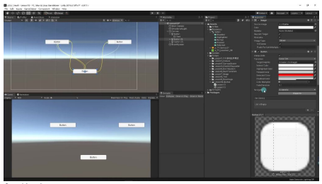

**操作步骤**:
1. 在 Inspector 面板中找到 Button 组件的 On Click 参数
2. 点击"+"号添加事件监听
3. 将包含脚本的游戏对象拖入目标对象栏
4. 选择对应的公共函数（私有函数不可见）

**执行条件**:
- 必须在按钮区域内完成"按下+抬起"才算一次有效点击
- 若在按钮外抬起鼠标则不会触发事件

**注意事项**:
- 只能关联 public 修饰的函数
- 可添加多个监听函数，点击时会按顺序执行
- 通过面板上的"-"号可移除监听

**函数要求**:
- 必须是无参数无返回值（void）类型
- 示例函数声明：`public void ClickBtn()`

**方式二：代码添加方式**

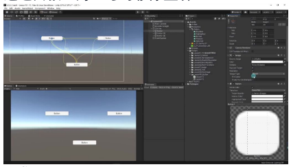

**核心方法**:
- `btn.onClick.AddListener(函数名)`
- 支持三种形式：
  - 已声明的函数：`AddListener(ClickBtn2)`
  - 匿名函数：`AddListener(()=>{...})`
  - Lambda 表达式：`AddListener(delegate{...})`

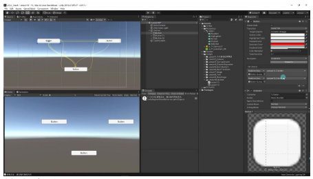

**移除监听**:
- 移除指定函数：`RemoveListener(ClickBtn2)`
- 移除所有监听：`RemoveAllListeners()`

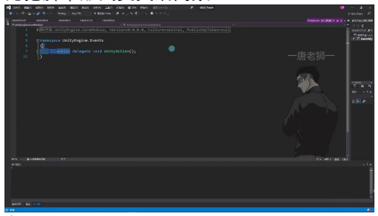

**注意事项**:
- 匿名函数无法单独移除
- 适合批量按钮事件绑定
- 比拖脚本形式更灵活高效

**参数类型**:
- 使用 `UnityEngine.Events.UnityAction` 委托
- 本质是无参数无返回值的委托：`public delegate void UnityAction()`

**优势对比**:
- 代码形式更适合复杂项目
- 拖脚本形式更适合快速原型开发
- 实际开发中常混合使用两种方式

---

## 二、知识小结

| 知识点 | 核心内容 | 考试重点/易混淆点 | 难度系数 |
|--------|----------|-------------------|----------|
| Button 组件构成 | 由父对象(Button组件+Image)和子对象(Text)组成，Text可选 | 父对象必须包含 Image 组件作为背景 | ⭐⭐ |
| Button参数-交互状态 | Interactable控制按钮是否可点击，Transition控制状态切换效果(颜色/图片/动画) | 颜色过渡模式需掌握5种状态颜色设置 | ⭐⭐⭐ |
| Button参数-导航模式 | 设置键盘导航规则(无/水平/垂直/自动/自定义) | 自动模式=水平+垂直，自定义需手动指定关联按钮 | ⭐⭐ |
| 代码控制 | 通过 GetComponent 获取 Button 和 Image 组件进行参数修改 | Image 组件修改需单独获取，与 Button 组件独立 | ⭐⭐ |
| 事件监听-拖拽方式 | 在 Inspector 面板添加回调函数，需使用 public 方法 | 私有方法不可见，可添加多个回调 | ⭐⭐ |
| 事件监听-代码方式 | 使用 onClick.AddListener 添加委托(含Lambda表达式) | 匿名函数无法单独移除，需用 RemoveAllListeners | ⭐⭐⭐⭐ |
| 动画过渡实现 | 需配合 Animator Controller 制作不同状态动画 | 需要掌握 Unity 动画系统基础 | ⭐⭐⭐⭐ |
