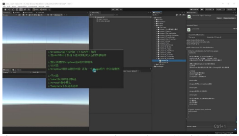
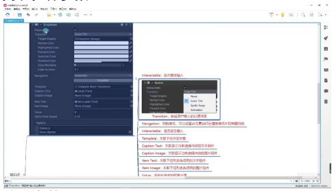
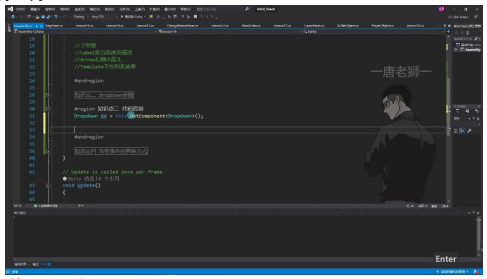
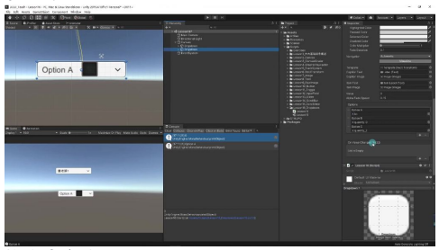
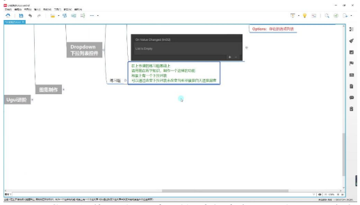

# Dropdown下拉列表控件

> 以下为AI生成的图文笔记内容

## 一、Unity下拉列表控件

### 1. 项目文件新建

准备工作：在Unity工程中新建文件夹、脚本和场景，用于下拉列表控件的学习。

### 2. 下拉列表控件

#### 1）下拉列表控件概述

**定义**：Dropdown是UGUI中用于处理下拉列表交互的关键组件。

**组成结构**：

| 层级 | 对象 | 说明 |
|------|------|------|
| 父对象 | Dropdown + Image | 包含Dropdown组件和Image组件（背景图） |
| 子对象 | Label | 显示当前选项内容 |
| 子对象 | Arrow | 右侧小箭头（仅样式作用） |
| 子对象 | Template | 下拉列表选单（本质是Scroll View组件） |
| 子对象 | Viewport + Scrollbar | 构成滚动视图 |



#### 2）核心参数

| 参数 | 说明 |
|------|------|
| Template | 关联下拉列表对象（默认关联Scroll View） |
| Caption Text | 关联显示当前选择内容的文本组件 |
| Caption Image | 关联显示当前选择内容的图片组件（可选） |
| Item Text | 关联下拉列表选项用的文本控件 |
| Item Image | 关联下拉列表选项用的图片控件（可选） |
| Value | 当前所选选项的索引值（从0开始） |
| Alpha Fade Speed | 下拉列表窗口淡入淡出速度（默认0.15） |
| Options | 选项列表（可添加文字或图片） |

**交互参数**：

| 参数 | 说明 |
|------|------|
| Transition | 响应用户输入的过渡效果 |
| Navigation | UI元素在控制器导航中的模式 |
| Interactable | 是否接受输入 |



### 3. 代码控制

获取组件：

```csharp
Dropdown dd = GetComponent<Dropdown>();
```

关键操作：

| 操作 | 代码 |
|------|------|
| 获取当前选项 | `dd.options[dd.value].text` |
| 添加新选项 | `dd.options.Add(new Dropdown.OptionData("选项名"));` |
| 获取选项数量 | `dd.options.Count` |

**注意事项**：
- 通过代码添加的选项会立即生效
- 图片选项需要同时设置Item Image参数

### 4. 监听事件的两种方式

#### 拖脚本方式

直接在Inspector面板中关联回调函数。



#### 代码添加方式

```csharp
dd.onValueChanged.AddListener((index) => {
    Debug.Log("选择了选项索引: " + index);
});
```

**事件参数**：回调函数接收int类型参数，表示当前选择项的索引。



### 5. 练习题

**题目要求**：制作一个通过下拉列表改变场景白天/黑夜状态的功能。

**实现思路**：
1. 创建Dropdown控件并设置选项
2. 添加事件监听器
3. 在回调函数中修改场景光照参数
4. 测试不同选项的效果



## 二、知识小结

| 知识点 | 核心内容 | 考试重点/易混淆点 | 难度系数 |
|--------|----------|-------------------|----------|
| DropDown组件构成 | 由父对象(DropDown组件+Image)、Label(显示内容)、Arrow(样式箭头)、ScrollView(选单面板)四部分组成 | ScrollView结构嵌套关系 | ⭐⭐ |
| 关键参数 | Options(选项列表)、Value(当前索引)、CaptionText(显示文本)、ItemText(选项文本)、FadeSpeed(过渡速度) | 图片选项与文本选项的混合使用 | ⭐⭐⭐ |
| 代码控制 | 通过options属性动态添加选项(`Add(new OptionData())`)、通过value获取当前选择索引 | options列表与value索引的对应关系 | ⭐⭐⭐⭐ |
| 事件监听 | OnValueChanged事件传递int类型索引参数，支持拖拽绑定和AddListener代码绑定两种方式 | 事件参数与options列表的联动逻辑 | ⭐⭐⭐ |
| 应用场景 | 主要用于端游设置界面，手游使用频率较低 | 图片下拉列表的特殊实现方式 | ⭐⭐ |
