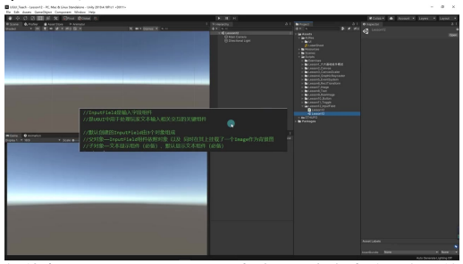
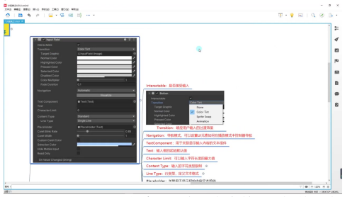
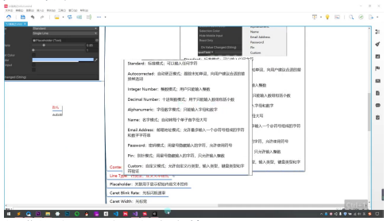
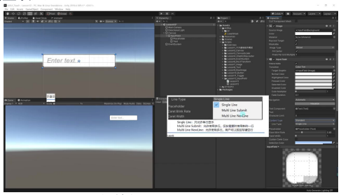
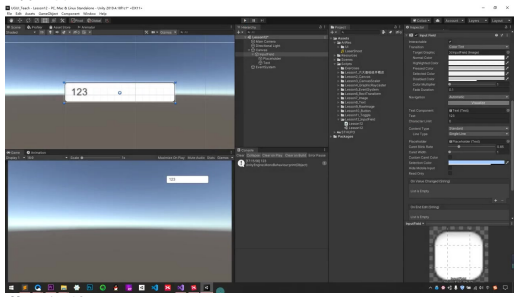
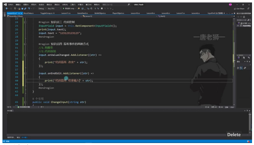
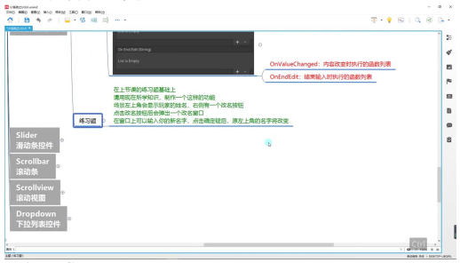

# InputField 文本输入控件

> 以下内容为 AI 生成的图文笔记

---

## 一、文本输入控件

### 1. 知识要点

#### 1) InputField 概念



- **组件定义**: InputField 是 UGUI 中处理玩家文本输入交互的关键组件
- **默认结构**:
  - **父对象**: 挂载 InputField 组件和 Image 背景
  - **子对象1**: Text 组件（必备，显示输入内容）
  - **子对象2**: Placeholder 文本（必备，显示提示文字如"Enter text"）

#### 2) InputField 参数详解

**核心参数**:



| 参数 | 说明 |
|------|------|
| Text Component | 关联显示输入内容的 Text 组件（自动关联） |
| Text | 当前输入框内容，可通过代码直接修改 |
| Character Limit | 字符数限制（0 表示无限制） |
| Content Type | 输入内容类型限制（共 11 种模式） |

**内容类型详解**:



| 模式 | 说明 |
|------|------|
| Standard | 可输入任意字符 |
| Auto Correct | 自动跟踪并建议单词替换 |



| 模式 | 说明 |
|------|------|
| Integer Number | 仅允许输入整数 |
| Decimal Number | 允许输入数字和小数点 |
| Alphanumeric | 仅允许字母和数字 |
| Password | 用星号隐藏输入，允许符号 |
| PIN | 用星号隐藏，仅允许整数 |

**行类型设置**:



| 类型 | 说明 |
|------|------|
| Single Line | 强制单行显示 |
| Multi Line Submit | 自动换行（需宽度不足时） |
| Multi Line Newline | 允许回车键换行 |

**光标与选择**:

| 参数 | 说明 |
|------|------|
| Caret Blink Rate | 光标闪烁频率（0 为不闪烁） |
| Caret Width | 光标宽度（默认 1） |
| Custom Caret Color | 自定义光标颜色 |
| Selection Color | 文本选中时的背景色 |

**其他重要参数**:

| 参数 | 说明 |
|------|------|
| Hide Mobile Input | iOS 设备隐藏虚拟键盘 |
| Read Only | 只读模式（可复制不可修改） |
| Transition | 用户交互的过渡效果 |
| Navigation | 控制器导航设置 |

### 2. 代码控制

- **获取组件**: `InputField input = GetComponent<InputField>();`
- **读写内容**: 通过 `input.text` 属性读写输入框内容

### 3. 事件监听

#### 1) 两种事件类型

| 事件 | 说明 |
|------|------|
| OnValueChanged | 内容每次改变时触发（传入 string） |
| OnEndEdit | 结束编辑时触发（失去焦点或按回车） |

#### 2) 实现方式



**拖拽方式**:

- 在 Inspector 面板关联公共方法
- 方法签名需接收 string 参数

**代码添加**:

```csharp
input.onValueChanged.AddListener((string text) => {
    // 处理文本变化
});

input.onEndEdit.AddListener((string text) => {
    // 处理编辑结束
});
```

### 4. 例题：改名功能实现



**功能需求**:
1. 显示玩家姓名
2. 点击按钮弹出改名窗口
3. 输入新名字后更新显示

**实现要点**:
- 使用 InputField 获取输入
- 通过 OnEndEdit 事件确认修改
- 结合 Button 组件触发弹窗

---

## 二、知识小结

| 知识点 | 核心内容 | 考试重点/易混淆点 | 难度系数 |
|--------|----------|-------------------|----------|
| InputField 概念 | Unity UGUI 中处理玩家文本输入的交互组件，由父对象、背景图、默认提示文本和实际输入文本组成 | 组件结构关系（父对象与子对象功能区分） | ⭐⭐ |
| Text Component 参数 | 关联显示输入内容的文本组件，可通过修改 text 属性实时改变输入框内容 | 动态修改机制（运行时可编程修改） | ⭐⭐ |
| 字符限制参数 | 最大字符数限制（0 为无限）、字符类型限制（标准/整数/密码等 9 种模式） | 密码模式差异（Password 允许任意字符/Pin 仅限数字） | ⭐⭐ |
| 多行控制参数 | 单行/智能多行/强制多行三种显示模式，通过 LineType 参数控制 | 回车键行为差异（EndEdit 事件触发条件） | ⭐⭐ |
| 光标与交互参数 | 闪烁速率/宽度/颜色设置、选中高亮颜色、iOS 键盘隐藏选项、只读模式 | 移动端适配（Hide Mobile Input 仅 iOS 生效） | ⭐ |
| 代码控制 | 通过 `GetComponent<InputField>` 获取引用，text 属性读写输入内容 | 运行时赋值（会触发 ValueChanged 事件） | ⭐⭐ |
| 事件监听方式 | ValueChanged（实时触发）和 EndEdit（失焦触发）两种事件，支持拖拽绑定和代码注册（`onValueChanged.AddListener`） | 参数类型差异（string 参数 vs Button 的无参数） | ⭐⭐ |
| 组件联动 | 默认关联 Placeholder Text（提示文本）和 Text（输入文本）两个子对象 | 提示文本消失逻辑（有输入时自动隐藏） | ⭐ |
