# ScrollView 滚动视图

> 以下内容为 AI 生成的图文笔记

---

## 一、ScrollView 滚动视图

### 1. 滚动视图的知识点

#### 1) ScrollRect 是什么

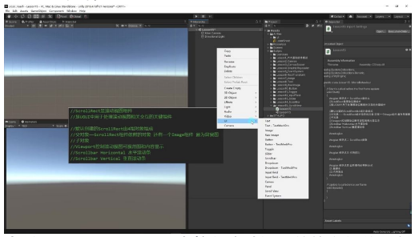

- **本质**: ScrollRect 是 Unity 中控制滚动视图的核心组件，创建时命名为 ScrollView 但实际由 ScrollRect 组件驱动
- **功能**: 处理 UGUI 中所有滚动视图相关的交互逻辑

**基本组成**:

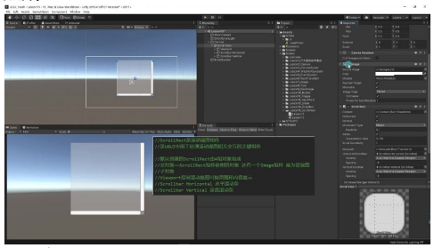

- **父对象**:
  - 包含 Image 组件作为背景图（半透明显示）
  - 挂载 ScrollRect 核心脚本
- **子对象**:
  - **Viewport**: 控制可视区域范围
  - **Content**: 存放所有滚动内容（必须保留）
  - **Scrollbar Horizontal**: 水平滚动条（可删除）
  - **Scrollbar Vertical**: 垂直滚动条（可删除）

**工作原理**:
- 类比示例：类似 VS 代码编辑器的滚动条功能
  - 当内容超出显示区域时出现滚动条
  - 通过拖动滚动条查看被遮挡内容
- 核心机制：
  - Viewport 划定显示范围
  - Content 实际包含所有内容
  - 滚动时 Content 移动而 Viewport 固定

**与 ScrollView 关系**:
- 创建方式：在 Hierarchy 右键 UI 菜单选择 ScrollView 创建
- 命名区别：
  - 创建时命名为 ScrollView
  - 实际控制组件名为 ScrollRect
- 组件关系：ScrollView 是包含 ScrollRect 组件的预制体结构

**典型应用场景**:
- 长列表显示（如物品栏、聊天记录）
- 大尺寸内容浏览（如地图、长文档）
- 需要分页查看的 UI 界面

#### 2) ScrollView 参数详解

**Content 参数**:

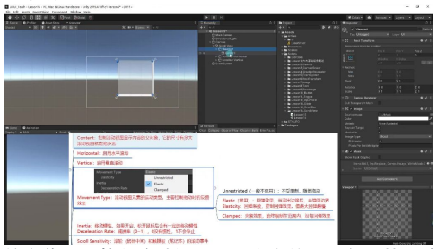

- **核心作用**: 控制滚动视图显示内容的父对象，其尺寸决定可拖动范围
- **实现原理**: Content 的矩形尺寸越大，滚动条滑块越小，可拖动范围越大
- **使用要点**:
  - 所有需要滚动显示的内容必须作为 Content 的子对象
  - 动态调整 Content 大小才能显示更多内容（通过代码或手动）
  - 示例：创建 100x100 的 Image 作为装备格子，多个格子放入 Content 下

**水平与垂直滚动**:

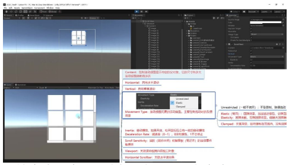

| 设置 | 效果 |
|------|------|
| 双轴滚动 | 默认同时启用水平和垂直滚动 |
| 取消水平勾选 | 只能垂直拖动 |
| 取消垂直勾选 | 只能水平拖动 |

设计建议：根据 UI 设计需求选择，通常不会两个都关闭。

**运动类型 (Movement Type)**:

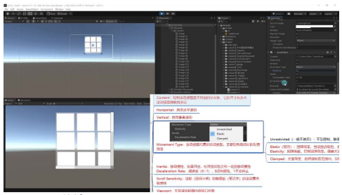

| 类型 | 说明 | 使用场景 |
|------|------|----------|
| Elastic | 最常用模式，拖出边界后会弹性回弹 | 一般滚动视图 |
| Unrestricted | 可随意拖出边界，内容可能完全消失 | 实际开发中基本不使用 |
| Clamped | 严格限制在边界内，无回弹效果 | 需要严格限制拖动范围的场景 |

**Elasticity 参数**: 值越大回弹越慢（1 比 0.1 回弹更缓慢）

**移动惯性 (Inertia)**:

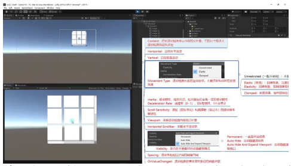

- **效果表现**: 松开鼠标/手指后内容会继续滑动一段距离
- **Deceleration Rate**:
  - 取值范围 0~1
  - 0：无惯性（立即停止）
  - 1：几乎不会停止（到达边界才停）
  - 默认值 0.135 提供自然阻尼效果
- **开发建议**: 保持默认值即可，不宜设置过大

**滚轮与触摸板灵敏度 (Scroll Sensitivity)**:

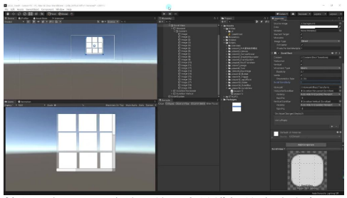

- **控制对象**: 鼠标滚轮和笔记本触摸板的滚动速度
- **调整方法**:
  - 默认值 1 滚动较慢
  - 改为 5 可显著加快滚动速度
- **应用场景**: 当内容很多时需要提高灵敏度值

**Viewport 与可视范围**:

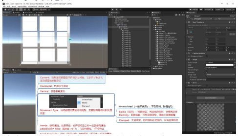

- **核心功能**: 决定实际可见的内容区域
- **特性**:
  - 自动跟随 ScrollView 父对象大小变化
  - 内容只在 Viewport 矩形范围内显示
  - 通常不需要手动修改关联关系

**滚动条显示模式 (Visibility)**:

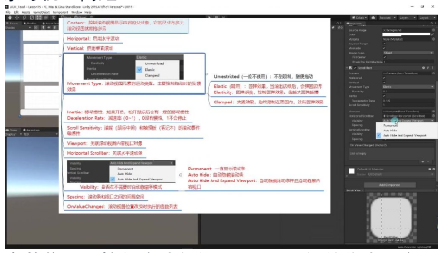

| 模式 | 说明 |
|------|------|
| Permanent（永久显示） | 始终显示滚动条（即使内容很少），实际使用较少 |
| Auto Hide（自动隐藏） | 内容不足时隐藏滚动条，不扩展 Viewport 范围 |
| Auto Hide And Expand | 内容不足时隐藏滚动条，自动扩展 Viewport 填满可用空间，最推荐的默认选项 |

**滚动条与视口间距 (Spacing)**:

- **参数作用**: 控制滚动条与 Viewport 之间的像素距离
- **典型值**:
  - 负值：Viewport 与滚动条重叠（默认 -3）
  - 正值：产生间隔（如 5 表示 5 像素间距）
- **视觉效果**: 影响 Viewport 的实际可见区域大小

#### 3) 代码控制 ScrollView

**代码控制 ScrollRect**:

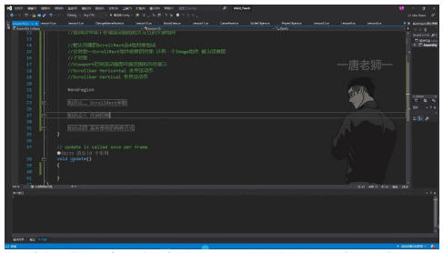

**组件组成**: 默认创建的 ScrollRect 由 4 组对象组成：
- 父对象：包含 ScrollRect 组件和 Image 背景图
- Viewport：控制滚动视图可视范围和内容显示
- Scrollbar Horizontal：水平滚动条
- Scrollbar Vertical：垂直滚动条

**动态创建对象与尺寸调整**:
- 内容控制：通过代码控制 ScrollView 时，主要操作其 Content 对象
- 动态创建：需要在 Content 中动态创建对象时，必须通过代码控制其尺寸
- 尺寸调整：改变 Content 的 `sizeDelta` 属性可以调整内容区域大小

**获取 ScrollRect 组件**:

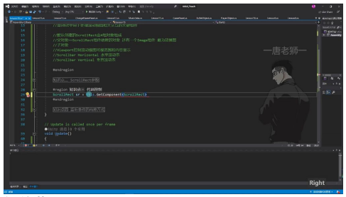

```csharp
ScrollRect sr = GetComponent<ScrollRect>();
```

- 需要引用 `UnityEngine.UI` 命名空间

**修改 Content 尺寸**:

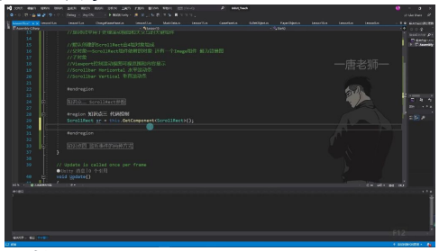

```csharp
sr.content.sizeDelta = new Vector2(width, height);
```

**重置 Content 位置**:
- 位置重置：通过修改 Content 的 RectTransform 位置属性
- 应用场景：面板打开时需要将滚动位置重置到初始状态
- 实现方式：直接设置 `transform.position` 或 `localPosition`

**使用 normalizedPosition 调整位置**:

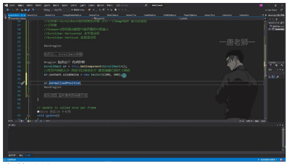

- **参数特性**:
  - 范围：[0, 1] 区间
  - x=0 表示最左侧，x=1 表示最右侧
  - y=0 表示最上方，y=1 表示最下方
- **代码实现**:
  ```csharp
  sr.normalizedPosition = new Vector2(0, 0.5f);
  ```
- **优势**: 相比直接设置位置，使用百分比更直观且不需要计算具体数值

#### 4) 监听事件方式

**ScrollRect 组件基础**:

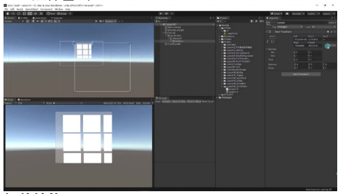

- **组件结构**:
  - 父对象：包含 ScrollRect 组件和 Image 背景图
  - 子对象：Viewport 控制可视范围和内容显示
  - 可选滚动条：Horizontal 水平滚动条和 Vertical 垂直滚动条
- **参数特性**: 通过代码控制时主要操作 content 的 sizeDelta 属性改变可拖动范围

**代码控制方法**:

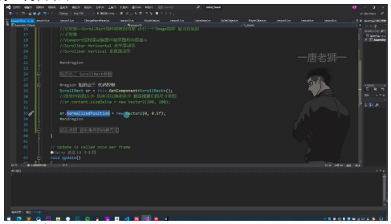

**核心方法**:
```csharp
ScrollRect sr = GetComponent<ScrollRect>();
sr.content.sizeDelta = new Vector2(290, 200);   // 改变内容大小
sr.normalizedPosition = new Vector2(0, 0.5f);     // 设置滚动位置
```

**事件监听方式**:

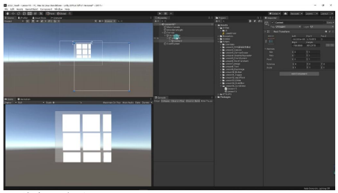

**两种实现方式**:

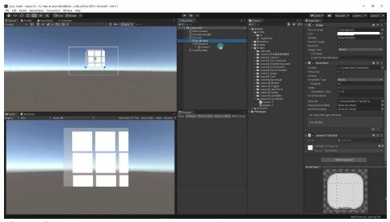

1. **拖拽脚本**: 通过 Unity 编辑器直接关联
2. **代码添加**: 动态绑定事件处理器

- **回调参数**: 事件回调函数接收 `Vector2` 参数，实时返回当前滚动位置（x/y 均为 0-1 标准化值）

**实战演示**:

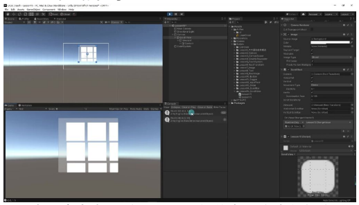

**实现步骤**:
1. 创建 public 方法接收 Vector2 参数：
   ```csharp
   public void OnScrollRectValueChanged(Vector2 value)
   ```
2. 在 Unity 编辑器中关联动态事件（注意选择非静态方法）

**输出验证**: 拖动时控制台实时打印如 (0, 0.5)、(0, 0.3) 等位置坐标

**典型值范围**:
- X 轴：0（最左）→ 1（最右）
- Y 轴：0（底部）→ 1（顶部）

---

## 二、UGUI ScrollRect 组件

### 1. ScrollRect 的坐标参考点

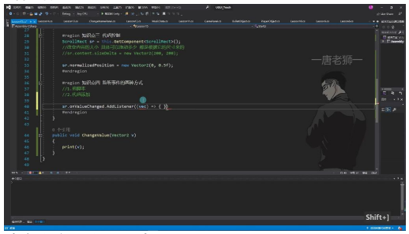

- **左下角为参考点**: 在 ScrollRect 组件中，移动内容时，左下角被视为坐标的参考点。例如，当内容移动到最左下角时，其坐标值接近(0, 0)；拖到上面时，横坐标可能变为 0.1 等。

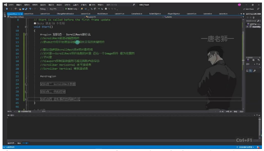

- **与锚点有关**: 具体以哪个点作为参考可能与锚点的设置有关，但一般情况下，我们很少去监听 ScrollView 的这个事件，因为这个值对于我们的意义不大。

### 2. 代码控制 ScrollRect

- **改变内容大小**: 通过 `sr.content.sizeDelta = new Vector2(290, 200);` 可以改变 ScrollRect 内容的大小，其中 290 和 200 分别代表宽度和高度。
- **设置位置**: 通过 `sr.normalizedPosition = new Vector2(0, 0.5f);` 可以设置 ScrollRect 的滚动位置，这里设置为左上角偏下的位置。

### 3. 监听 ScrollRect 事件

- **两种方式**: 监听 ScrollRect 事件有两种方式，一是通过拖拽脚本，二是通过代码添加。
- **代码添加示例**:
  ```csharp
  sr.onValueChanged.AddListener((Vector2 v) => {
      print(v);
  });
  ```
  通过上述代码，可以监听 ScrollRect 的滚动事件，并打印出当前的坐标值。这种方式更加灵活，适用于需要动态添加监听器的情况。

---

## 三、知识点总结

### 1. ScrollRect 组件概述

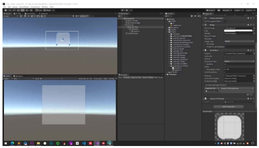

- **定义**: ScrollRect 是 UGUI 中用于处理滚动视图相关交互的关键组件
- **组成结构**:
  - **父对象**: 包含 ScrollRect 组件和 Image 背景图
  - **子对象**:
    - Viewport：控制可视范围和内容显示
    - Scrollbar Horizontal：水平滚动条
    - Scrollbar Vertical：垂直滚动条

### 2. ScrollRect 参数详解

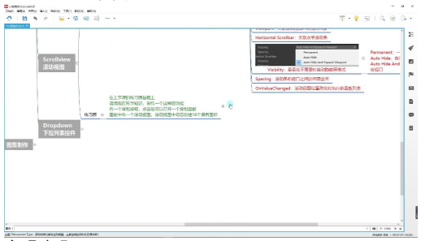

**核心参数**:

| 参数 | 说明 |
|------|------|
| Movement Type | 控制滚动视图的运动类型，主要影响反弹效果 |
| Horizontal/Vertical Scrollbar | 关联对应的滚动条 |
| Visibility | 设置滚动条在不需要时是否自动隐藏 |
| Spacing | 滚动条和视口之间的间隔空间 |
| OnValueChanged | 滚动视图位置改变时触发的事件 |

### 3. 代码控制要点

**动态对象处理**:
- 所有动态创建的对象都必须放在 Content 下
- 需要通过代码控制 Content 的尺寸和子对象位置

**布局方式**:
- 当前阶段需要手动设置位置和尺寸
- 进阶阶段会学习自动布局组件（本质仍是代码控制）

### 4. 应用场景

**常见用途**:
- 背包系统
- 商店界面
- 排行榜

**特点**: 适合内容较多的显示需求

### 5. 例题：背包系统实现

**实现步骤**:
1. 创建背包按钮和面板
2. 面板中添加 ScrollRect 组件
3. 动态生成 10 个道具图标并放入 Content
4. 通过代码控制 Content 尺寸和道具位置

**注意事项**:
- 确保所有动态生成的对象都正确设置父级
- 需要根据道具数量计算 Content 的合适尺寸

---

## 四、知识小结

| 知识点 | 核心内容 | 考试重点/易混淆点 | 难度系数 |
|--------|----------|-------------------|----------|
| Scroll View 基础概念 | 滚动视图的本质是 ScrollRect 组件控制，由四部分组成：背景图、Viewport 可视区域、Content 内容容器、滚动条 | 创建时名为 ScrollView 但实际控制组件是 ScrollRect | ⭐⭐ |
| 参数解析 | Content 尺寸决定滚动范围、运动类型(回弹/不受限/夹紧)、惯性控制、滚动条显示模式 | 回弹系数越大回弹越慢; 自动隐藏与始终显示滚动条的区别 | ⭐⭐⭐ |
| 代码控制 | 通过 `sr.content` 获取内容容器，可动态调整尺寸(sizeDelta)和位置(normalizedPosition) | normalizedPosition 采用 0-1 标准化坐标; 删除滚动条后需手动清空关联字段 | ⭐⭐⭐⭐ |
| 事件监听 | 通过 onValueChanged 监听滚动位置变化(返回 Vector2 坐标值) | 动态创建对象必须作为 Content 子物体; 实际开发中较少监听滚动事件 | ⭐⭐ |
| 组件关系 | Viewport 控制可视范围，Content 承载实际内容，两者尺寸需协调 | Content 小于 Viewport 时自动隐藏滚动条; Viewport 与滚动条的间距参数 | ⭐⭐⭐ |
