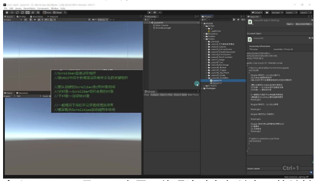
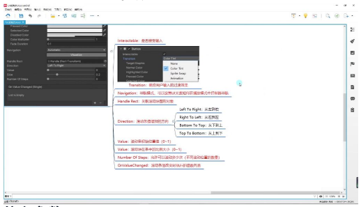
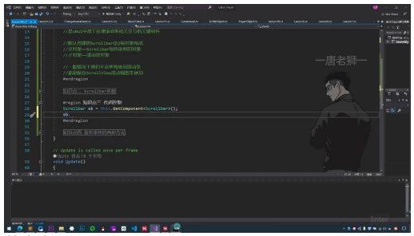
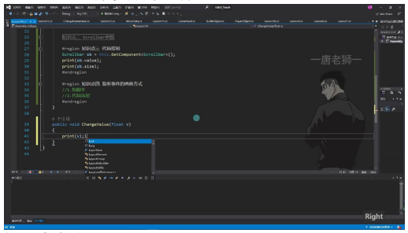

# ScrollBar 滚动条

> 以下内容为 AI 生成的图文笔记

---

## 一、滚动条

### 1. 知识点一：Scrollbar 是什么



- **定义**: Scrollbar 是 UGUI 中用于处理滚动条相关交互的关键组件
- **组成结构**:
  - 默认由 2 组对象组成
  - **父对象**: Scrollbar 组件依附的对象（包含 Image 作为背景图）
  - **子对象**: 滚动块对象（本质是一张可拖动的图片）
- **使用场景**:
  - 通常不单独使用
  - 主要配合 ScrollView 滚动视图使用

### 2. 知识点二：Scrollbar 参数



**核心参数**:

| 参数 | 说明 |
|------|------|
| Handle Rect | 关联滚动块图形对象（自动关联） |
| Direction | 滑动条值增加方向 |
| Value | 滚动条初始位置值（0~1） |
| Size | 滚动块在条中的比例大小（0~1） |
| Number Of Steps | 允许滚动次数（0 表示平滑滚动） |

**Direction 方向**:
- 从左到右 (Left To Right)
- 从右到左 (Right To Left)
- 从下到上 (Bottom To Top)
- 从上到下 (Top To Bottom)

**参数详解**:
- **Value**: 滚动条初始位置值，范围 0~1
- **Size**: 滚动块比例大小
  - 0 时极小
  - 1 时填满整个滑动条
- **Number Of Steps**: 设置步数会将 0~1 平均分，0 表示平滑拖动

### 3. 知识点三：代码控制



**基本方法**:
```csharp
Scrollbar sb = GetComponent<Scrollbar>();
```

**常用属性**:

| 属性 | 说明 |
|------|------|
| value | 当前滚动位置（0~1） |
| size | 滚动块大小比例（0~1） |

- value 和 size 是最常用的两个属性
- 其他参数通常在设计时设置好

**注意事项**:
- 需要引用 `UnityEngine.UI` 命名空间
- 实际开发中较少单独控制 Scrollbar

### 4. 知识点四：监听事件的两种方式



**拖脚本方式**:
1. 创建 public 方法 `void ChangeValue(float v)`
2. 在 Inspector 面板关联 OnValueChanged 事件
3. 选择动态 float 参数传递

**代码添加方式**:
```csharp
sb.onValueChanged.AddListener((v) => {
    // 处理滚动值变化
});
```

**事件特点**:
- 传递的参数 v 是当前 value 值（0~1）
- 两种方式获取的值相同
- 可通过 RemoveListener 移除监听

---

## 二、知识小结

| 知识点 | 核心内容 | 考试重点/易混淆点 | 难度系数 |
|--------|----------|-------------------|----------|
| ScrollBar 定义 | Unity UGUI 中处理滚动条交互的组件，默认由父对象（背景图+Scroll Bar 组件）和子对象（滚动块）组成 | 需注意不单独使用，通常配合 ScrollView | ⭐⭐ |
| 参数解析 | 1. 关联滚动块对象（自动设置）; 2. 滑动方向（类似 Slider 的 4 种方向）; 3. Value（0-1 初始位置值）; 4. Size（0-1 滑动块比例，1 为填满）; 5. Number of Steps（步数，0 为平滑拖动） | Value 与 Size 的取值逻辑（百分比 vs. 填充比例）; 步数非整数变化，而是零到一的均分 | ⭐⭐⭐ |
| 代码控制 | 1. 获取组件：`Scrollbar sb = GetComponent<Scrollbar>();` 2. 关键操作：`sb.value`（动态调整位置）、`sb.size`（控制滑块大小） | 实际开发中较少单独控制，多与 Scroll View 联动 | ⭐⭐ |
| 事件监听 | 1. 拖拽脚本：通过 On Value Changed 绑定动态 float 参数方法; 2. 代码添加：`sb.onValueChanged.AddListener(v => {})` | 需区分动态/静态监听（上节课 Slider 已强调） | ⭐⭐⭐ |
| 综合应用提示 | 强调 Scroll Bar 需配合 Scroll View 使用，单独使用场景极少 | 下节课将展开 Scroll View 联动细节 | ⭐⭐ |
