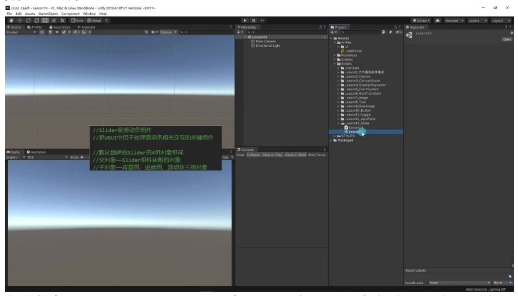
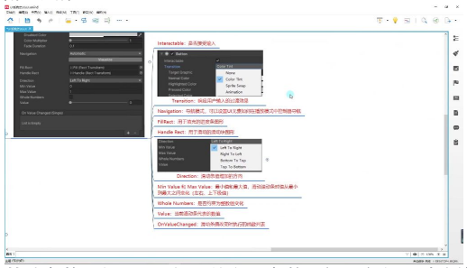
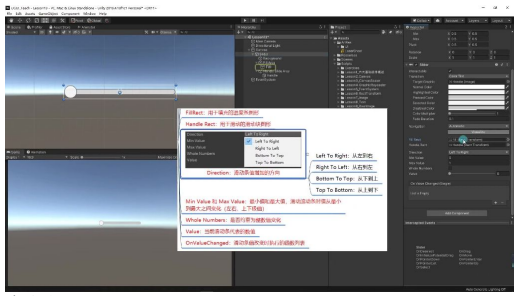
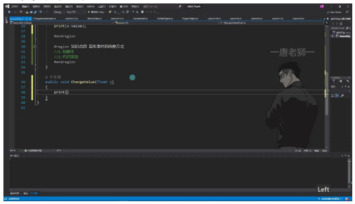
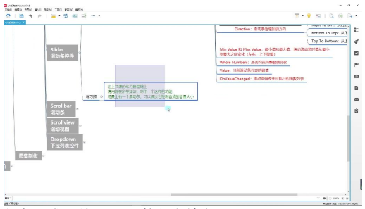

# Slider 滑动条控件

> 以下内容为 AI 生成的图文笔记

---

## 一、Unity 项目文件整理

- 新建文件夹：在 Unity 工程中新建文件夹 "Lesson13_Slider"，用于存放本节课相关资源
- 创建脚本和场景：在文件夹中新建脚本和场景文件，准备 Slider 控件学习环境

## 二、知识点讲解

### 1. Slider 是什么

#### 1) 截图讲解



- **组件定义**: Slider 是 UGUI 中用于处理滑动条相关交互的关键组件
- **组成结构**:
  - **父对象**: Slider 组件依附的 GameObject
  - **子对象**: 背景图(Background)、进度图(Fill)和滑动块(Handle)三组对象
- **视觉元素**:
  - **Background**: 滑动条背景图像
  - **Fill**: 滑动条填充内容，表示当前进度
  - **Handle**: 可拖动的滑块控件

### 2. Slider 参数

#### 1) 截图讲解



- **基础参数**: 与 Button 相同的交互参数（颜色变化、过渡效果等）
- **核心参数**:
  - **Fill Rect**: 关联进度条填充图形
  - **Handle Rect**: 关联滑块图形
  - **Direction**: 滑动值增加方向

#### 2) Unity 中参数讲解



**方向设置**:

| 方向 | 说明 |
|------|------|
| Left To Right | 从左到右（默认） |
| Right To Left | 从右到左 |
| Bottom To Top | 从下到上 |
| Top To Bottom | 从上到下 |

**数值范围**:

| 参数 | 说明 |
|------|------|
| Min Value | 最小值（默认 0） |
| Max Value | 最大值（默认 1） |
| Value | 当前值（实时变化） |

**整数约束**:
- **Whole Numbers**: 勾选后值只能取整数

**事件回调**:
- **On Value Changed**: 值改变时触发的事件列表

### 3. 代码控制

#### 1) 获取组件

```csharp
Slider s = this.GetComponent<Slider>();
print(s.value); // 获取当前值
```

- **命名空间**: 需要引用 `UnityEngine.UI`
- **主要属性**:
  - `value`: 当前滑动条值（float 类型）
  - `normalizedValue`: 标准化后的值（0-1 范围）
  - `minValue / maxValue`: 最小/最大值

#### 2) 界面内容更改

- **常用操作**:
  - 获取当前值用于逻辑处理
  - 动态修改 `minValue / maxValue` 改变取值范围
  - 通过代码设置 `value` 值改变滑块位置

### 4. 监听事件的两种方式

#### 1) 拖脚本和代码添加



**拖脚本方式**:
1. 创建 public 方法：`public void ChangeValue(float v)`
2. 在 Inspector 面板关联动态 float 参数
3. 注意：不要选择静态参数（会固定传值）



**代码添加方式**:
```csharp
s.onValueChanged.AddListener((v) => {
    print("代码添加的监听" + v);
});
```

**注意事项**:
- 监听方法必须接收 float 参数
- 推荐使用代码添加方式（更灵活）
- 可通过 RemoveListener 移除特定监听

---

## 三、结束

### 练习题

- **任务要求**: 使用 Slider 控制音效音量大小
- **实现要点**:
  1. 创建 Slider 控件并设置合适参数
  2. 编写代码监听值变化
  3. 将 Slider 的 value 映射到 AudioSource 的 volume

---

## 四、知识小结

| 知识点 | 核心内容 | 考试重点/易混淆点 | 难度系数 |
|--------|----------|-------------------|----------|
| Slider 组件构成 | 由背景图(Background)、进度条(Fill)和滑动块(Handle)三部分组成 | 注意三个子对象的层级关系和锚点设置 | ⭐⭐ |
| Fill Rect 参数 | 关联进度条的图形组件 | 默认自动关联 Fill 子对象，通常无需修改 | ⭐ |
| Handle Rect 参数 | 关联滑块控件的图形组件 | 默认自动关联 Handle 子对象 | ⭐ |
| Direction 参数 | 控制数值增长方向(左→右/右→左/下→上/上→下) | 竖条布局时需要特别注意方向设置 | ⭐⭐ |
| Min/Max Value | 设置滑动条取值范围(默认 0-1) | 音量控制等场景常用 0-1 范围 | ⭐⭐ |
| Whole Numbers | 约束为整数值变化 | 勾选后无法获取小数中间值 | ⭐⭐ |
| 代码获取值 | `slider.value` 获取当前数值 | 主要编程接口，最常用功能 | ⭐⭐⭐ |
| 事件监听(拖拽方式) | 通过 On Value Changed 添加监听方法 | 必须选择动态 float 参数，静态调用会传固定值 | ⭐⭐⭐ |
| 事件监听(代码方式) | `slider.onValueChanged.AddListener()` | 支持 Lambda 表达式/匿名函数/普通函数三种写法 | ⭐⭐⭐ |
| 组件应用场景 | 音量控制/进度显示/参数调节等交互场景 | 注意与 Scrollbar 组件的区别使用 | ⭐⭐ |
