# Toggle 开关控件

> 以下内容为 AI 生成的图文笔记

---

## 一、Toggle 单选多选框控件

### 1. Toggle 是什么

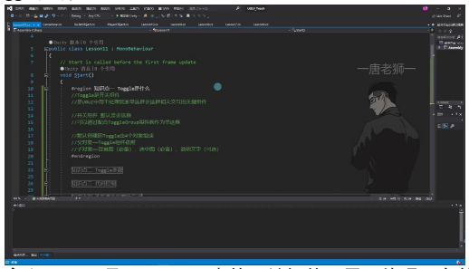

- **定义**: Toggle 是 Unity UGUI 中的开关组件，用于处理玩家单选框和多选框相关交互。
- **默认类型**: 开关组件默认是多选框形式。
- **单选框实现**: 可以通过配合 ToggleGroup 组件将其制作为单选框。

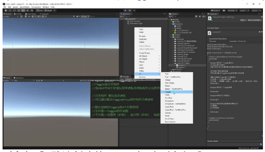

**对象组成**: 默认创建的 Toggle 由 4 个对象组成：
- **父对象**: 包含 Toggle 组件依附的 Rect Transform
- **子对象**:
  - 背景图（必备）
  - 选中图（必备）
  - 说明文字（可选）

**实际应用**:
- 背景图通常为白色框图
- 选中图通常为勾选标记
- 说明文字用于描述 Toggle 功能（如"音效开关"）
- 说明文字可根据需求删除，但通常保留以明确功能

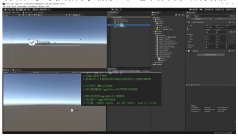

**创建方式**:
1. 在 Unity 编辑器中右键点击
2. 选择 `UI > Toggle`
3. 创建后自动生成完整 Toggle 结构

### 2. Toggle 参数

#### 1) Toggle 与 Button 的相似参数

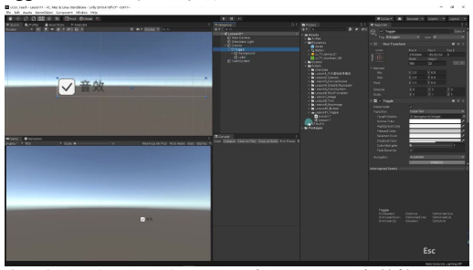

- **交互状态 (Interactable)**: 与 Button 相同，通过 Interactable 参数控制是否接受点击事件，取消勾选时组件置灰无法交互
- **过渡效果 (Transition)**: 提供与 Button 完全相同的三种过渡方式（颜色/图片/动画过渡）
- **导航系统 (Navigation)**: 导航模式设置与 Button 一致，控制 UI 元素在播放模式中的导航方式

#### 2) Is On 参数

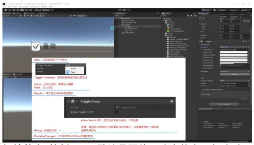

- **初始状态**: 控制 Toggle 默认是否处于选中状态，勾选时运行即显示选中状态
- **实时反馈**: 在 Scene 窗口可实时观察状态变化，运行时修改会立即反映在 UI 表现上
- **应用场景**: 常用于保存用户偏好设置，如音效开关的默认开启/关闭状态

#### 3) Toggle Transition 参数

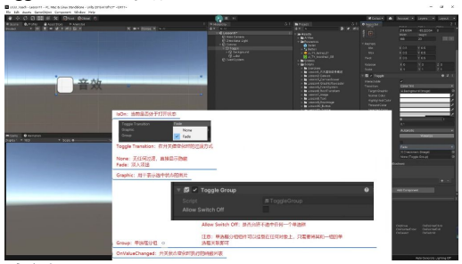

**过渡类型**:

| 类型 | 说明 |
|------|------|
| None | 无过渡效果，直接切换显示/隐藏状态 |
| Fade | 默认选项，通过淡入淡出效果平滑过渡（耗时约 0.1 秒） |

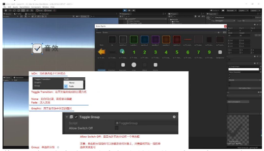

- **性能权衡**: 淡入淡出效果会消耗额外计算资源，性能敏感场景可关闭过渡效果
- **视觉反馈**: 选中状态变化时，关联图片会按照指定过渡方式显示/隐藏

#### 4) Graphic 参数

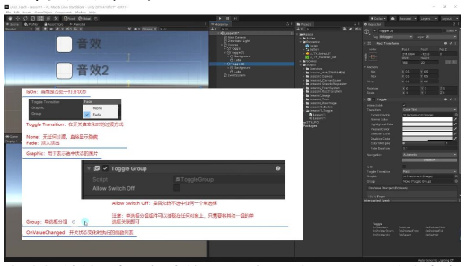

- **作用对象**: 指定表示选中状态的视觉元素（默认关联 Checkmark 图片）
- **自定义方法**: 可替换为任意 Image 组件，修改后运行时选中状态将控制新图片的显隐
- **注意事项**: 通常不直接修改此处，而是通过 Hierarchy 面板替换 Checkmark 图片资源
- **示例演示**: 将关联图片改为数字"0"后，点击时该数字会显示/隐藏

#### 5) Group 参数与单选框

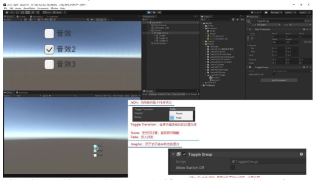

- **多选框特性**: 默认创建的 Toggle 相互独立，可同时选中多个
- **单选框转换**:
  1. 创建空对象添加 Toggle Group 组件
  2. 将多个 Toggle 的 Group 参数关联到同一 Toggle Group 对象
  3. 关联后这些 Toggle 变为互斥的单选框
- **分组位置**: Toggle Group 可挂载在任何对象（推荐创建专门的分组父对象便于管理）
- **关联技巧**: 只需保证一组 Toggle 关联同一个 Toggle Group 对象即可实现互斥

#### 6) Allow Switch Off 参数

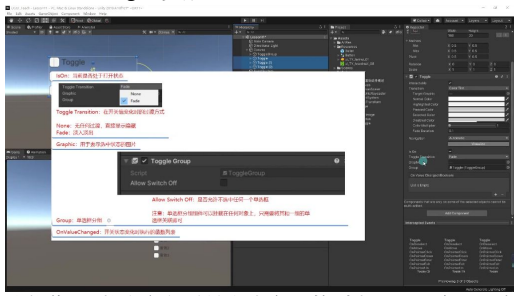

- **默认行为**: 单选框分组必须保持至少一个选项被选中
- **特殊需求**: 勾选此参数后允许取消所有选项（如问卷调查中的"不确定"选项）

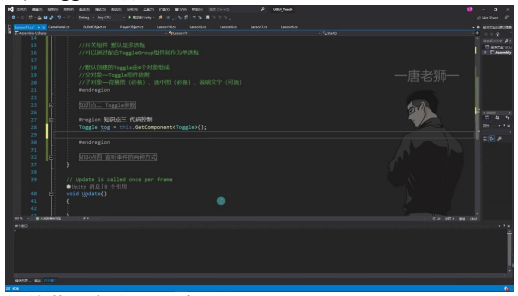

- **设置位置**: 在 Toggle Group 组件上设置，影响该分组内所有 Toggle 的行为

#### 7) On Value Changed 参数

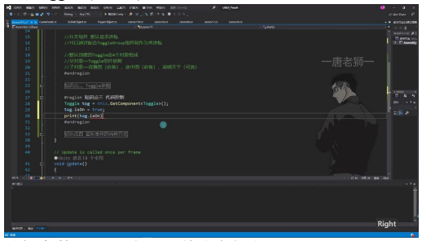

- **功能作用**: 状态变化时触发指定函数列表（用于实现业务逻辑）
- **使用场景**: 如音效开关切换时实时控制音频播放/暂停
- **实现方式**: 可通过代码绑定或编辑器拖拽方式添加响应函数
- **教学安排**: 该参数将在后续事件系统章节详细讲解实现方法

### 3. 代码控制

#### 1) 获取 Toggle 组件

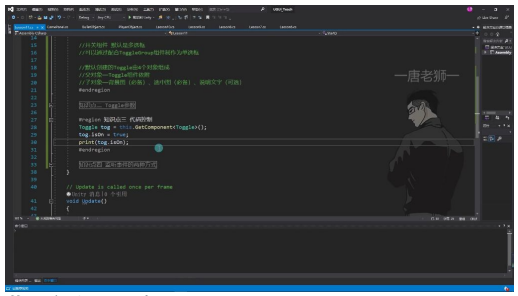

- **组件获取方式**: 通过 `this.GetComponent<Toggle>()` 获取当前对象上的 Toggle 组件
- **命名空间**: 需要引用 `UnityEngine.UI` 命名空间（使用 `Alt+Enter` 快速引用）
- **关联方式**: 可以直接将脚本挂载到 Toggle 组件所在对象上，也可以通过 public 变量拖拽关联

#### 2) 控制 Toggle 的开关状态

- **关键参数**: `isOn` 表示当前选中状态
- **状态获取**: 通过 `tog.isOn` 可以获取当前 Toggle 的开关状态
- **状态设置**: 可以通过代码动态设置 `tog.isOn = true/false` 来改变开关状态
- **状态打印**: 可以直接打印 `print(tog.isOn)` 查看当前状态

#### 3) ToggleGroup 组件的控制

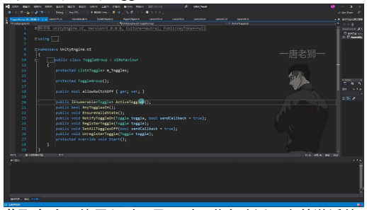

- **获取方式**: 通过 `this.GetComponent<ToggleGroup>()` 获取 ToggleGroup 组件
- **重要参数**:
  - `allowSwitchOff`: 控制是否允许所有 Toggle 都不选中
  - 可以通过 `togGroup.allowSwitchOff = false` 强制必须选中一个
- **组件关系**: ToggleGroup 是管理一组 Toggle 的容器组件

#### 4) 获取激活状态的 Toggle

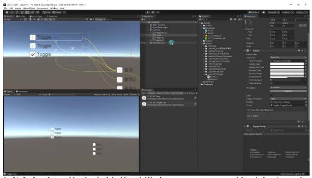

- **获取方法**: 使用 `ActiveToggles()` 方法返回当前激活的 Toggle 迭代器
- **遍历方式**: 通过 `foreach` 循环遍历 `togGroup.ActiveToggles()`
- **实用技巧**:
  - 可以获取当前选中 Toggle 的名称 `item.name`
  - 可以获取选中状态 `item.isOn`
  - 适用于需要知道具体哪个 Toggle 被选中的场景

#### 5) 代码测试与验证

- **测试方法**: 将脚本挂载到带有 ToggleGroup 的对象上运行
- **预期输出**:
  - 打印当前选中 Toggle 的名称
  - 打印选中状态（应为 true）
- **实际应用**: 这种验证方式可以确保 ToggleGroup 的功能正常工作

---

## 二、知识小结

| 知识点 | 核心内容 | 考试重点/易混淆点 | 难度系数 |
|--------|----------|-------------------|----------|
| Toggle 组件基础 | Toggle 是 UGUI 中用于处理单选框/多选框交互的开关组件，默认多选框，需配合 Toggle Group 实现单选框功能 | 多选框与单选框的转换逻辑（是否依赖 Toggle Group） | ⭐⭐ |
| Toggle 参数解析 | Is On：初始选中状态; Transition：过渡效果（淡入淡出/无）; Graphic：关联选中状态显示的图片; Group：单选框分组（需关联 Toggle Group 组件） | Allow Switch Off 参数作用（是否允许单选框组全不选中） | ⭐⭐⭐ |
| 代码控制 | 获取/设置 isOn 属性控制选中状态; 通过 ToggleGroup 遍历 ActiveToggles() 获取当前选中项 | 动态分组关联（代码中修改 group 属性） | ⭐⭐⭐⭐ |
| 事件监听 | 1. 拖拽绑定：声明 `public void Method(bool isOn)`，关联动态布尔值事件; 2. 代码绑定：`onValueChanged.AddListener()` 支持 Lambda 表达式 | 事件重复触发条件（仅状态变化时触发，相同值不重复） | ⭐⭐⭐ |
| Toggle Group | 单选框分组核心组件; 可挂载任意对象，同组 Toggle 需关联同一 Toggle Group; 支持代码控制 allowSwitchOff 属性 | 分组逻辑独立性（非父子关系也可分组） | ⭐⭐⭐ |
