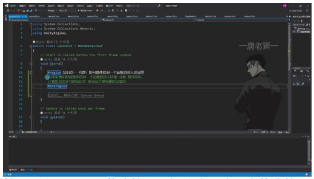
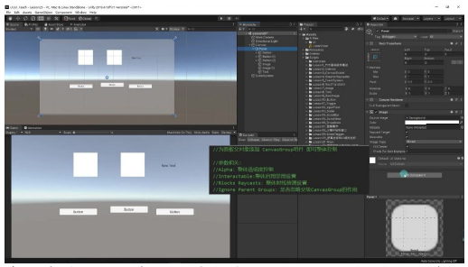
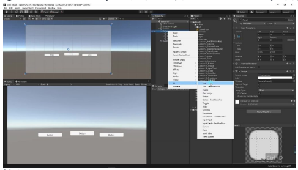

# Canvas Group 画布组

## 一、UGUI 进阶 - Canvas Group 画布组

### 1. Canvas Group 画布组

#### 1）问题：面板整体控制

- **控制需求**：当需要整体控制面板的淡入淡出或整体禁用时，传统方法需要逐个修改子元素的透明度或禁用状态
- **现有局限**：对于包含多个按钮、图片和文本的复杂面板（如示例中的 Panel 及其子按钮），逐个控制效率低下且难以维护
- **典型场景**：面板可能包含 n 个按钮和 n 个图片等 UI 元素，需要统一控制显示效果

#### 2）解决方案：Canvas Group 组件

- **实现方式**：为面板父对象添加 CanvasGroup 组件即可实现整体控制

- **核心参数**：
  - **Alpha**：整体透明度控制（0-1 范围），可实现淡入淡出效果
  - **Interactable**：整体启用/禁用设置，取消勾选会使所有子按钮处于禁用状态
  - **Blocks Raycasts**：整体射线检测设置，取消后按钮将无法响应点击
  - **Ignore Parent Groups**：是否忽略父级 CanvasGroup 的作用（用于嵌套情况）

- **嵌套控制**：
  - 子对象添加 CanvasGroup 并勾选 "Ignore Parent Groups" 时，父级的透明度变化不会影响子对象
  - 取消勾选后，父级的透明度变化会同时影响子对象

- **实际应用**：
  - 适合面板淡入淡出动画制作
  - 快速实现全面板禁用/启用状态切换
  - 控制面板是否响应交互操作

---

## 二、知识小结

| 知识点 | 核心内容 | 应用场景 | 技术要点 |
|--------|----------|----------|----------|
| 面板整体控制问题 | 无法便捷实现面板内多元素的统一淡入淡出/禁用控制 | UI 动画效果开发 | 需逐个操作 Image/Text 组件 |
| Canvas Group 组件 | 通过父对象组件控制所有子元素的： - 整体透明度 (Alpha) - 交互状态 (Interactable) - 射线检测 (Blocks Raycasts) | 面板显隐控制/全局交互开关 | 组件参数联动控制 关键参数：Ignore Parent Groups Alpha=0.5 时半透明 |
| 实践演示 | 1. 创建含多按钮的面板 2. 添加 CanvasGroup 组件 3. 演示参数实时效果 | Unity 编辑器实操 | 组件层级覆盖关系 子对象独立设置技巧 |
