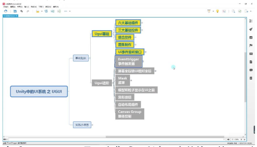
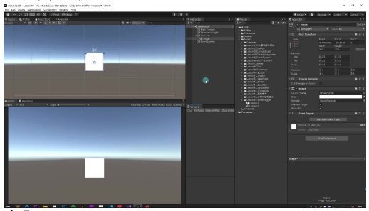
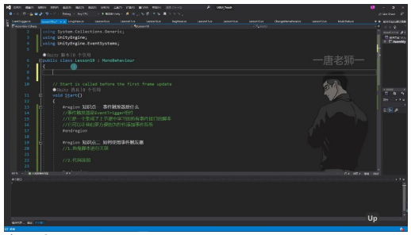
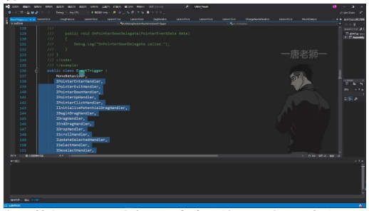

# EventTrigger事件触发器

> 以下为AI生成的图文笔记内容

## 一、EventTrigger事件触发器

### 1. 事件触发器是什么

- **本质**：EventTrigger是一个集成了所有UI事件接口的Unity组件
- **功能**：可以更方便地为控件添加事件监听，避免手动实现接口
- **实现原理**：内部继承MonoBehaviour并实现了IPointerEnterHandler等所有UI事件接口
- **优势**：将事件监听逻辑集中管理，便于维护和扩展



### 2. 如何使用事件触发器

#### 1）拖拽脚本关联方式

**步骤**：
1. 为UI控件添加EventTrigger组件
2. 点击"Add New Event Type"添加需要监听的事件类型
3. 关联面板类中的处理函数

**注意事项**：
- 处理函数参数必须与事件类型匹配
- 可通过 `as` 操作符将 `BaseEventData` 转换为具体事件类型
- 一个事件可关联多个处理函数



#### 2）代码添加方式

**实现步骤**：
1. 创建 `EventTrigger.Entry` 对象
2. 设置 `eventID` 指定事件类型
3. 通过 `AddListener` 添加处理函数
4. 将Entry对象添加到EventTrigger的 `triggers` 列表

**代码示例**：

```csharp
EventTrigger et = GetComponent<EventTrigger>();

EventTrigger.Entry entry = new EventTrigger.Entry();
entry.eventID = EventTriggerType.PointerUp;
entry.callback.AddListener((data) => {
    print("抬起");
});
et.triggers.Add(entry);
```





### 3. 内容总结

- **代码简化**：无需手动实现所有事件接口，减少重复代码
- **面向对象**：可在面板类中统一管理所有子控件的事件逻辑
- **维护方便**：事件处理逻辑集中管理，便于后期修改和扩展
- **灵活性**：支持动态添加/移除事件监听，适应不同业务场景

## 二、知识小结

### 核心知识点

| 知识点 | 核心内容 | 关键操作步骤 | 代码示例 |
|--------|----------|-------------|----------|
| 事件触发器定义 | EventTrigger组件集成所有事件接口 | 1. 创建Image/Button控件<br>2. 添加EventTrigger组件 | `AddComponent<EventTrigger>()` |

### 绑定方式

| 绑定方式 | 操作方法 | 步骤 |
|----------|---------|------|
| 拖拽绑定 | 通过面板关联事件响应函数 | 1. 点击Add New EventType<br>2. 选择事件类型（如PointerEnter）<br>3. 关联脚本函数 |

```csharp
public void Test(PointerEventData data)
{
    // 处理逻辑
}
```

| 代码绑定 | 动态添加事件监听对象 | 1. 创建Entry<br>2. 设置eventID和回调函数<br>3. 加入triggers列表 |

```csharp
triggers.Add(new EventTrigger.Entry
{
    eventID = EventTriggerType.PointerUp
});
```

### 参数类型转换

| 要点 | 说明 | 代码示例 |
|------|------|----------|
| BaseEventData转具体事件参数 | 使用类型强制转换 | `PointerEventData pData = (PointerEventData)data` |

### 多事件处理

| 要点 | 说明 | 示例 |
|------|------|------|
| 支持同时监听多个事件类型 | 1. 创建多个Entry对象<br>2. 分别设置不同eventID | BeginDrag / EndDrag / Drop |

### 绑定方式对比

| 绑定方式 | 开发效率 | 灵活性 | 适用场景 | 维护成本 |
|----------|---------|--------|---------|---------|
| 拖拽绑定 | ★★★★☆ | ★★☆☆☆ | 简单交互/快速原型 | 低（可视化操作） |
| 代码绑定 | ★★☆☆☆ | ★★★★★ | 复杂逻辑/动态控制 | 高（需编程基础） |

### 功能点详解

| 功能点 | 代码实现 | 参数说明 | 注意事项 |
|--------|---------|---------|---------|
| 鼠标进入事件 | `EventTriggerType.PointerEnter` | PointerEventData含position参数 | 需类型转换 |
| 抬起事件监听 | `triggers.Add(new Entry{eventID=EventTriggerType.PointerUp})` | 回调函数通过Lambda表达式实现 | 避免重复添加相同eventID |
| 多回调处理 | `callback.AddListener()` | 支持多个函数绑定同一事件 | 注意内存泄漏问题 |
