# UI事件监听接口

> 以下为AI生成的图文笔记内容

## 一、UI事件监听接口

### 1. 事件接口用来解决什么问题

**现有问题**：目前所有UI控件（如Button）只提供常用事件监听列表（如onClick）。

**功能限制**：
- 无法实现长按、双击、拖拽等特殊交互功能
- Image / Text / RawImage三大基础控件无法响应玩家输入

**解决方案**：事件接口机制
- 允许为所有控件添加自定义事件监听
- 扩展控件交互能力，处理更复杂的逻辑

**典型场景**：
- 按钮拖拽功能实现
- 基础控件的点击响应
- 自定义手势识别（如长按触发菜单）

**核心价值**：突破UI控件原生事件系统的局限性，提供更灵活的事件处理方案。

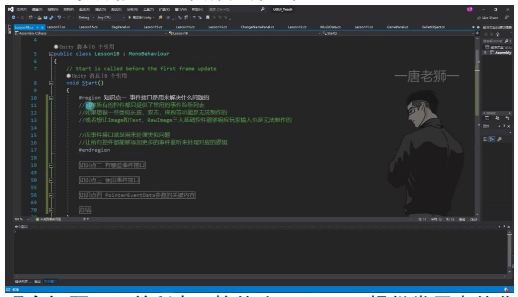

### 2. 有哪些事件接口

#### 1）常用事件接口

**鼠标交互类**：

| 接口 | 方法 | 说明 |
|------|------|------|
| IPointerEnterHandler | OnPointerEnter | 当指针进入对象时调用（鼠标进入） |
| IPointerExitHandler | OnPointerExit | 当指针退出对象时调用（鼠标离开） |
| IPointerDownHandler | OnPointerDown | 在对象上按下指针时调用（按下） |
| IPointerUpHandler | OnPointerUp | 松开指针时调用（抬起） |
| IPointerClickHandler | OnPointerClick | 在同一对象上按下再松开指针时调用（点击） |

**拖拽操作类**：

| 接口 | 方法 | 说明 |
|------|------|------|
| IBeginDragHandler | OnBeginDrag | 即将开始拖动时在拖动对象上调用（开始拖拽） |
| IDragHandler | OnDrag | 发生拖动时在拖动对象上调用（拖拽中） |
| IEndDragHandler | OnEndDrag | 拖动完成时在拖动对象上调用（结束拖拽） |

**实现方式**：
1. 继承接口后实现对应方法
2. 将脚本挂载到需要监听的控件上
3. 执行对应操作时会自动触发相关函数

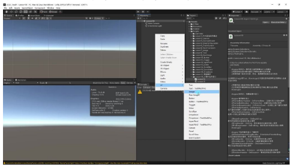

#### 2）不常用事件接口

**特殊交互类**：

| 接口 | 方法 | 说明 |
|------|------|------|
| IInitializePotentialDragHandler | OnInitializePotentialDrag | 在找到拖动目标时调用，可用于初始化值 |
| IDropHandler | OnDrop | 在拖动目标对象上调用 |
| IScrollHandler | OnScroll | 当鼠标滚轮滚动时调用 |
| IUpdateSelectedHandler | OnUpdateSelected | 每次勾选时在选定对象上调用 |

**选择状态类**：

| 接口 | 方法 | 说明 |
|------|------|------|
| ISelectHandler | OnSelect | 当对象成为选定对象时调用 |
| IDeselectHandler | OnDeselect | 取消选择选定对象时调用 |

**导航相关类**：

| 接口 | 方法 | 说明 |
|------|------|------|
| IMoveHandler | OnMove | 发生移动事件（上、下、左、右等）时调用 |
| ISubmitHandler | OnSubmit | 按下Submit按钮时调用（如回车键） |
| ICancelHandler | OnCancel | 按下Cancel按钮时调用（如ESC键） |

**使用建议**：
- 这些接口了解即可，一般不会特别常用
- 主要用于特殊需求场景
- 最常用的仍是鼠标交互和拖拽操作相关接口

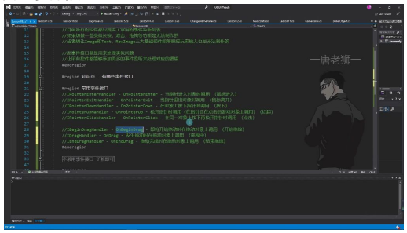

### 3. 使用事件接口

**实现步骤**：
1. 继承MonoBehaviour的脚本需要继承对应的事件接口，并引用命名空间 `UnityEngine.EventSystems`
2. 实现接口中的具体方法内容
3. 将脚本挂载到需要监听自定义事件的UI控件上

#### 1）继承接口并实现方法

- **命名空间**：必须引用 `UnityEngine.EventSystems` 才能使用事件接口
- **多接口继承**：C#类可以同时继承多个事件接口，如 `IPointerEnterHandler`、`IPointerExitHandler` 等
- **自动补全**：继承接口后会强制实现对应方法，如 `OnPointerEnter`、`OnPointerExit` 等
- **移动端限制**：鼠标进入/离开事件（`IPointerEnterHandler`/`IPointerExitHandler`）在移动设备上无效，因为移动设备只有点击概念

```csharp
using UnityEngine;
using UnityEngine.EventSystems;

public class EventListener : MonoBehaviour, IPointerEnterHandler, IPointerExitHandler, IPointerDownHandler, IPointerUpHandler
{
    public void OnPointerEnter(PointerEventData eventData)
    {
        Debug.Log("鼠标进入");
    }

    public void OnPointerExit(PointerEventData eventData)
    {
        Debug.Log("鼠标离开");
    }

    public void OnPointerDown(PointerEventData eventData)
    {
        Debug.Log("按下");
    }

    public void OnPointerUp(PointerEventData eventData)
    {
        Debug.Log("抬起");
    }
}
```

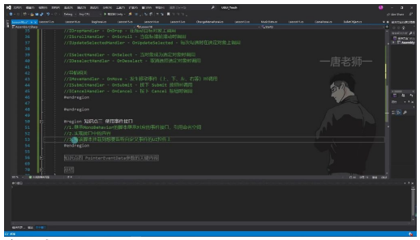

#### 2）应用案例：Image监听事件

**关键设置**：
- 必须确保Image组件的 **Raycast Target** 属性处于勾选状态
- 通过打印日志验证事件触发：进入、离开、按下、抬起

**注意事项**：基础控件（Image/Text/RawImage）默认不响应输入，需通过事件接口扩展功能。

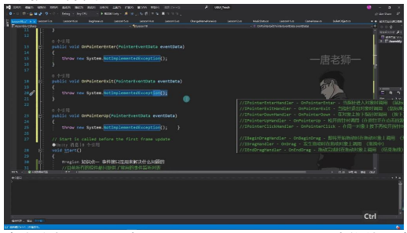

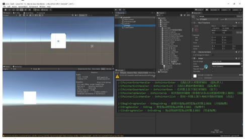

#### 3）应用案例：按钮监听事件

- **功能扩展**：按钮除了原有点击事件，通过接口可增加按下、抬起等更多事件响应
- **通用性**：同一脚本可挂载到不同UI控件上实现统一的事件监听逻辑
- **事件响应链**：所有继承接口的方法会在对应事件发生时自动调用

**常用接口总结**：

| 类别 | 接口 |
|------|------|
| 指针相关 | 进入/离开/按下/抬起/点击 |
| 拖拽相关 | 开始拖拽/拖拽中/结束拖拽 |

**不常用接口**：

| 类别 | 接口 |
|------|------|
| 其他 | 初始化拖拽/放置/滚动 |
| 选择相关 | 选中/取消选中 |
| 导航相关 | 移动/提交/取消 |

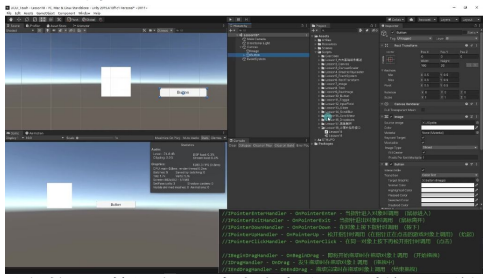

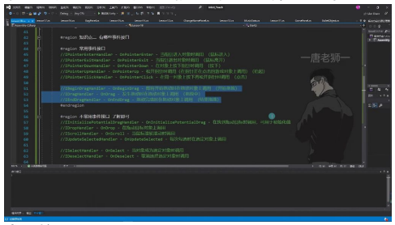

### 4. PointerEventData参数的关键内容

**父类关系**：`PointerEventData` 继承自 `BaseEventData`，所有事件接口响应时传入的都是 `PointerEventData` 类型参数。

**核心参数**：

| 参数 | 类型 | 说明 |
|------|------|------|
| pointerId | int | 鼠标按键ID（左键-1，右键-2，中键-3） |
| position | Vector2 | 当前指针屏幕坐标（左下角为原点） |
| pressPosition | Vector2 | 按下时的指针位置 |
| delta | Vector2 | 指针移动增量（拖动时相邻两帧的位置差） |
| clickCount | int | 连击次数 |
| clickTime | float | 点击时间（需自行计算时间间隔） |
| pressEventCamera | Camera | 最后按下事件关联的摄像机 |
| enterEventCamera | Camera | 最后进入事件关联的摄像机 |

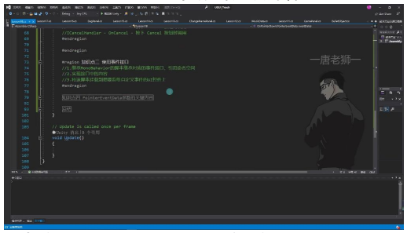

#### 1）PointerEventData父类讲解

- **继承机制**：所有UI事件接口方法都会传入 `PointerEventData` 参数，其父类 `BaseEventData` 提供基础事件数据
- **使用场景**：主要用于处理标准UI事件之外的特殊交互需求，如长按、双击、拖拽等

#### 2）例题：判断鼠标按键

**实现方法**：
- 通过 `eventData.pointerId` 判断按键类型
- 左键值-1，右键-2，中键-3

**应用场景**：实现右键菜单、中键特殊功能等

**注意**：移动设备上需考虑触摸交互的等效处理

```csharp
public void OnPointerDown(PointerEventData eventData)
{
    switch (eventData.pointerId)
    {
        case -1:
            Debug.Log("左键按下");
            break;
        case -2:
            Debug.Log("右键按下");
            break;
        case -3:
            Debug.Log("中键按下");
            break;
    }
}
```

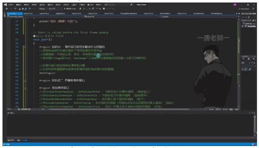

#### 3）例题：屏幕坐标系位置打印

**坐标系特点**：
- 屏幕左下角为原点 (0, 0)
- `position` 返回 `Vector2` 类型的屏幕像素坐标

**典型应用**：
- 实现UI元素跟随鼠标
- 计算拖动距离
- 区域判定交互


#### 4）例题：拖动中Delta值的变化

**delta特性**：
- 表示相邻两帧的指针位置差
- 类型为 `Vector2`，包含x/y轴偏移量

**应用技巧**：
- 实现平滑拖拽效果
- 计算拖动速度
- 制作惯性滑动效果

**对比参数**：

| 参数 | 类型 | 说明 |
|------|------|------|
| position | 绝对坐标 | 当前指针位置 |
| pressPosition | 绝对坐标 | 记录按下瞬间位置 |
| delta | 相对坐标 | 反映相对运动量（帧间差） |

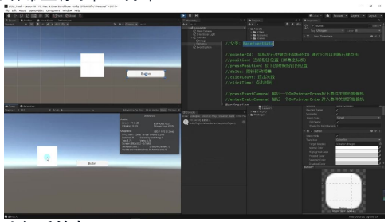

### 5. 总结

**优势**：
- 扩展基础控件的事件监听能力
- 实现复杂交互（长按/拖拽等）
- 精确控制交互细节

**局限**：
- 需要为每个控件单独挂载脚本
- 管理维护成本较高
- 不符合集中管理的设计模式

**改进方案**：后续课程介绍的事件触发器（EventTrigger）可解决这些问题。


## 二、知识小结

| 知识点 | 核心内容 | 关键接口/参数 | 应用示例 | 难度系数 |
|--------|----------|---------------|----------|----------|
| 事件接口作用 | 解决控件默认事件监听不足的问题，扩展交互功能 | IPointerEnterHandler / IPointerDownHandler | 实现长按、拖拽等基础控件不具备的功能 | ⭐⭐ |
| 常用事件接口 | 鼠标/触屏基础交互事件 | OnPointerEnter / OnPointerDown / OnDrag | 按钮悬停效果、图片拖拽 | ⭐⭐⭐ |
| 拖拽事件组 | 完整拖拽流程监听 | IBeginDragHandler / IDragHandler / IEndDragHandler | 实现可拖动UI元素 | ⭐⭐⭐⭐ |
| PointerEventData参数 | 事件触发时的交互数据 | pointerId(按键区分) / position(屏幕坐标) / delta(移动增量) | 区分左右键操作、实现精准拖拽计算 | ⭐⭐⭐⭐ |
| 实现步骤 | 1.继承MonoBehaviour和接口 2.实现接口方法 3.挂载到UI控件 | 需引用UnityEngine.EventSystems命名空间 | 使Image支持点击检测 | ⭐⭐ |
| 移动端限制 | 鼠标悬停类事件在移动设备无效 | OnPointerEnter / OnPointerExit | 需改用点击事件实现类似功能 | ⭐⭐⭐ |
| 射线检测要求 | 控件需启用Raycast Target | Image/Text组件的射线检测开关 | 基础控件事件响应的前置条件 | ⭐ |
| 优缺点对比 | 优点：功能扩展灵活<br>缺点：脚本管理分散 | 需为每个控件单独挂载脚本 | 与面板集中管理模式的冲突 | ⭐⭐⭐ |
