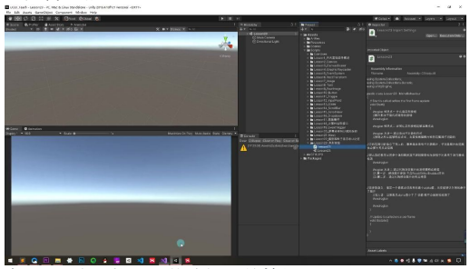
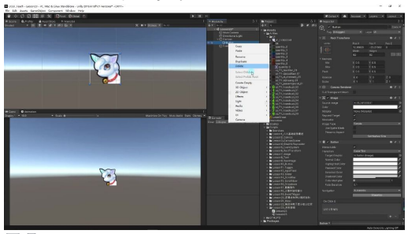
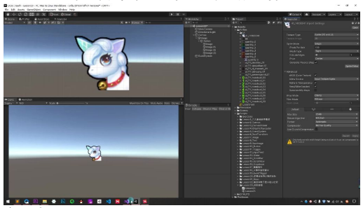
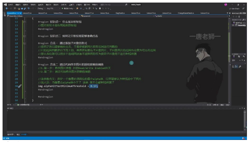

# 异形按钮

## 一、异形按钮

### 1. 什么是异形按钮

- **定义**：图片形状不是传统矩形的按钮
- **特点**：
  - 传统按钮事件监听基于图片矩形范围
  - 透明区域点击也会响应事件
  - 体验较差，需要精确点击响应


### 2. 让异形按钮准确点击的方法

#### 1）方法一：通过添加子对象的形式

- **原理**：
  - 按钮响应基于图片矩形范围判断
  - 范围判断自下而上，子对象图片范围也会计入可点击范围



- **实现步骤**：
  1. 创建 Image 作为按钮显示
  2. 在按钮下创建多个透明 Image 子对象
  3. 调整子对象矩形大小拼凑不规则图形



- **优点**：
  - 内存消耗小
  - 实现简单直观
- **缺点**：
  - 需要手动拼凑图形
  - 边缘可能不够精确



#### 2）方法二：通过代码改变图片的透明度响应阈值

- **实现步骤**：
  1. 修改图片参数开启 Read/Write Enabled 开关
  2. 通过代码设置 `alphaHitTestMinimumThreshold` 属性

- **参数说明**：
  - 指定像素必须具有的最小 alpha 值才能响应点击
  - alpha 值低于阈值不会被射线检测

- **代码示例**：

```csharp
// 设置图片可读写
Image image = GetComponent<Image>();
image.alphaHitTestMinimumThreshold = 0.1f;
```



- **优点**：
  - 点击判断精确到像素级
  - 实现效果完美
- **缺点**：
  - 增加内存消耗
  - 需要修改图片参数

- **选择建议**：
  - 简单场景使用方法一
  - 需要精确点击使用方法二

---

## 二、知识小结

| 知识点 | 核心内容 | 考试重点/易混淆点 | 难度系数 |
|--------|----------|-------------------|----------|
| 异形按钮概念 | 图片形状非传统矩形的按钮，需精准响应点击区域（仅图片非透明部分可触发） | 传统按钮按矩形范围检测，异形按钮需特殊处理透明区域 | ⭐⭐ |
| 实现方法一：子对象拼凑法 | 通过添加透明子对象图片拼凑不规则点击范围，利用事件自下而上传递特性 | 关键点：子对象需为图片/文字元素，透明需设置 Alpha=0 | ⭐⭐⭐ |
| 实现方法二：代码修改透明度阈值 | 修改图片 Read/Write 权限，代码设置 alphaHitTestMinimumThreshold（如 0.1）控制最小响应透明度 | 内存消耗较高，但精度优于拼凑法 | ⭐⭐⭐⭐ |
| 方法对比 | 子对象法：内存友好，操作繁琐；代码法：精准高效，但增加内存开销 | 选择依据：项目性能要求 vs 开发效率 | ⭐⭐ |
