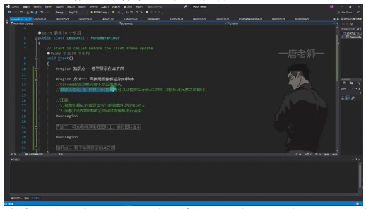
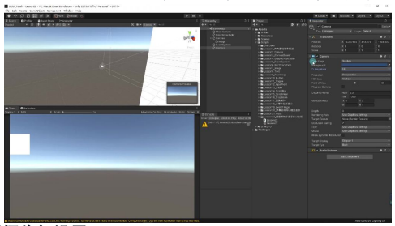
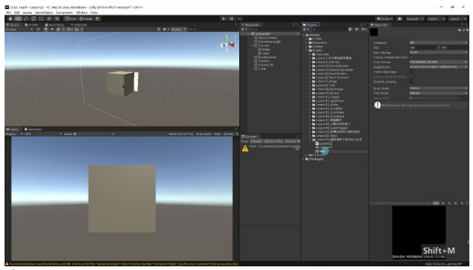
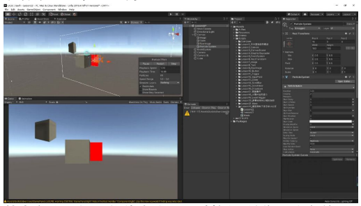

# 模型和粒子显示在 UI 之前

## 一、模型和粒子显示在 UI 之前

### 1. 模型显示在 UI 之前

#### 1）方法一：直接用摄像机渲染 3D 物体

- **渲染模式要求**：Canvas 的渲染模式不能是覆盖模式，摄像机模式和世界(3D)模式都可以让模型显示在 UI 之前
- **Z 轴控制**：只需保证 3D 物体的 Z 轴在 UI 元素之前即可
- **注意事项**：
  - 摄像机模式时建议用专门的摄像机渲染 UI 相关
  - 面板上的 3D 物体建议也用 UI 摄像机进行渲染
  - 导入 3D 模型时需要把层级改为 UI 层
  - 3D 物体会受到 Canvas 缩放影响，需要调整缩放大小

- **专用摄像机设置**：
  1. 新建摄像机专门渲染 UI 层
  2. 移除 Audio Listener 组件
  3. 主摄像机取消渲染 UI 层
  4. 通过 Plane Distance 控制与 UI 摄像机的距离

#### 2）方法二：将 3D 物体渲染在图片上

- **实现原理**：
  - 专门使用一个摄像机渲染 3D 模型
  - 将渲染内容输出到 Render Texture
  - 类似小地图的制作方式
  - 将渲染的图显示在 UI 上
- **优势**：不受 Canvas 渲染模式限制，任何模式都适用
- **适用场景**：建议在面板上只显示一个模型时使用

- **操作步骤**：
  1. 创建新摄像机并设置只渲染模型层
  2. 创建 Render Texture 并关联到摄像机
  3. 使用 Raw Image 显示 Render Texture

### 2. 粒子特效显示在 UI 之前

- **基本方法**：与 3D 物体类似，通过控制 Z 轴位置决定前后关系
- **特殊设置**：
  - 在粒子组件的 Renderer 参数中可以改变排序层
  - 通过调整 Sorting Layer 和 Order in Layer 参数
  - 可以让粒子特效始终显示在 UI 之前，不受 Z 轴影响
- **实现方式**：
  - 可以直接将粒子特效放在 UI 层
  - 也可以使用方法二的 Render Texture 方式
  - 粒子特效会受到 Canvas 缩放影响，需要调整大小

---

## 二、知识小结

| 知识点 | 核心内容 | 考试重点/易混淆点 | 难度系数 |
|--------|----------|-------------------|----------|
| 模型显示在 UI 之前 | **方法一**：通过 Canvas 的摄像机渲染模式，用专用 UI 摄像机渲染 3D 物体，调整 Z 轴控制前后关系。 **方法二**：将 3D 物体渲染到 Render Texture，通过 UI 图片显示（类似小地图技术）。 | - 方法一需确保 3D 物体层级为 UI 层，并调整缩放。 - 方法二仅适用于单个模型，且不依赖 Canvas 渲染模式。 | ⭐⭐ |
| 粒子特效显示在 UI 之前 | 与 3D 物体逻辑一致，但可通过粒子组件的 Sorting Layer 强制显示在 UI 前（不受 Z 轴影响）。 | - Sorting Order 参数优先级高于 Z 轴。 - 需与 Canvas 的渲染层级设置配合使用。 | ⭐⭐ |
| 技术对比 | 方法一适合多模型场景，方法二适合单模型场景。 粒子特效比 3D 物体多 Sorting Layer 控制维度。 | - 摄像机模式 vs. Render Texture 性能开销。 - 易忽略点：UI 摄像机的 Clear Flags 需设为 Depth Only。 | ⭐⭐ |
