# 自动布局组件

## 一、自动布局组件

### 1. 自动布局是什么

- **基本概念**：虽然 UGUI 的 RectTransform 可以帮助快速布局，但 Unity 还提供了专门用于 UI 控件自动布局的组件。
- **工作方式**：**自动布局控制组件 + 布局元素 = 自动布局**
  - **控制组件**：Unity 提供的管理性质组件，专门用于布局
  - **布局元素**：具备布局属性的 UI 组件（主要指有 RectTransform 的 UI 元素）

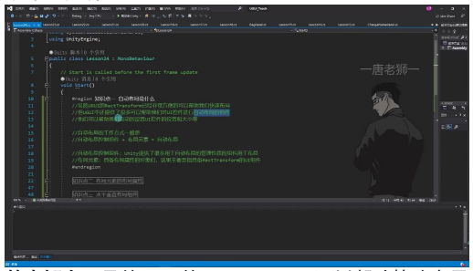

### 2. 布局元素的布局属性

- **基本规则**：
  - 参与自动布局的元素必须包含布局属性
  - 共有 **6 个核心属性**：
    - **最小尺寸**：Minimum width/height（元素应具有的最小宽高）
    - **首选尺寸**：Preferred width/height（分配额外空间前应具有的宽高）
    - **弹性尺寸**：Flexible width/height（相对于同级填充额外空间的相对量）

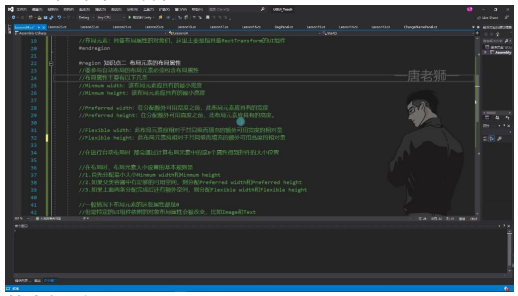

- **计算规则**：
  1. 首先分配最小尺寸（Minimum width/height）
  2. 父容器有足够空间时分配首选尺寸（Preferred width/height）
  3. 仍有额外空间时分配弹性尺寸（Flexible width/height）

- **实际应用**：
  - 默认情况下这些属性值为 0
  - Image 和 Text 等特定 UI 组件会自动修改这些属性
  - 可通过添加 LayoutElement 组件手动修改布局属性

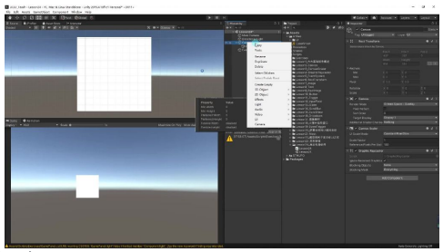

- **示例观察**：
  - Text 组件会根据内容自动调整 Preferred width/height
  - 修改文本内容时，布局属性值会动态变化
  - 实际开发中通常不需要直接修改这些属性

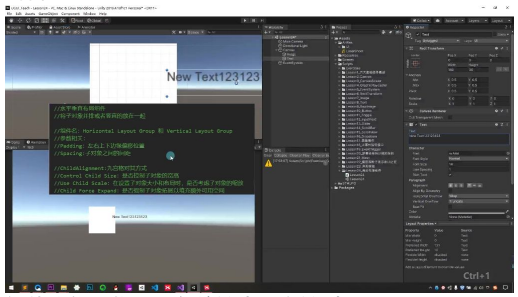

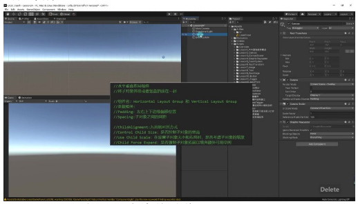

### 3. 水平垂直布局组件

#### 1）组件概述

- **组件功能**：将子对象并排或竖直排列
- **组件名称**：
  - 水平布局：**Horizontal Layout Group**
  - 垂直布局：**Vertical Layout Group**
- **使用场景**：通常在父对象基础上布局子对象

#### 2）参数详解

- **Padding**：左右上下边缘偏移位置
  - 默认值：0
  - 调整 Left/Right/Top/Bottom 可控制子对象与边框的距离
- **Spacing**：子对象之间的间距
  - 默认值：0
  - 控制子对象间的间隔像素数
- **Child Alignment**：九宫格对齐方式
  - 默认：左上角对齐
  - 可选：左中、中央、右下等 **9 种对齐方式**
- **Control Child Size**：是否控制子对象宽高
  - 勾选后会根据父对象大小自动调整子对象尺寸
- **Use Child Scale**：是否考虑子对象缩放
  - 勾选后布局会考虑子对象的缩放值
- **Child Force Expand**：是否强制子对象填充可用空间
  - 勾选后子对象会平均分配额外空间

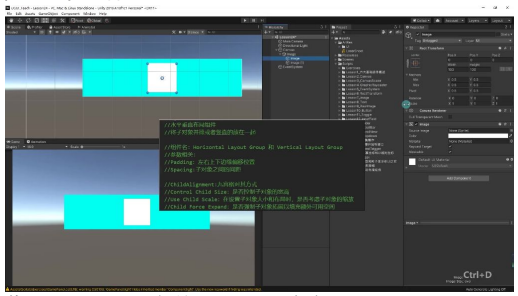

#### 3）布局元素组件

- **作用**：设置子对象的最小/最大宽高
- **添加方式**：给子对象添加 LayoutElement 组件
- **关键参数**：
  - Min Width/Height：最小宽高
  - Preferred Width/Height：首选宽高
  - Flexible Width/Height：弹性宽高比例
- **使用建议**：
  - 一般情况下不需要手动添加
  - 当需要固定子对象最小尺寸时使用
  - 父对象范围过小时会保持最小宽高

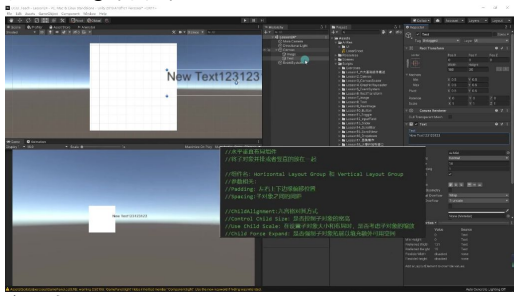

#### 4）例题：Image 自动布局

- **实现步骤**：
  1. 创建父对象并添加 Horizontal/Vertical Layout Group
  2. 在父对象下创建多个子对象（如 Image）
  3. 调整布局参数控制排列效果
- **注意事项**：
  - 子对象默认会重合显示
  - 添加布局组件后自动排列
  - 父对象大小变化会影响子对象布局

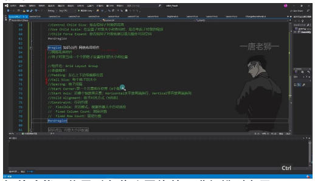

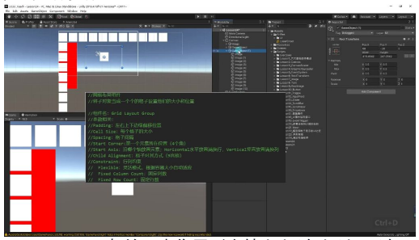

- **参数调整技巧**：
  - 取消 Child Force Expand 可使子对象保持原尺寸
  - 设置 Spacing 控制间距
  - 通过 ChildAlignment 改变整体对齐方式

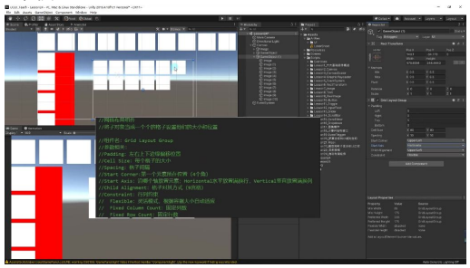

### 4. 网格布局组件

- **组件功能**：将子对象作为网格单元进行排列布局
- **组件名称**：**Grid Layout Group**
- **核心参数**：
  - **Padding**：控制网格与容器边缘的偏移量（单位：像素）
  - **Cell Size**：每个网格单元的固定尺寸（如 100×100）
  - **Spacing**：网格单元之间的间隔距离（X/Y 轴可分别设置）

#### 1）布局控制参数

- **Start Corner**：起始元素位置（支持左上/右上/左下/右下四个角落）
- **Start Axis**：
  - Horizontal：水平排列，排满自动换行
  - Vertical：垂直排列，排满自动换列
- **Child Alignment**：九宫格对齐方式（默认左上对齐）

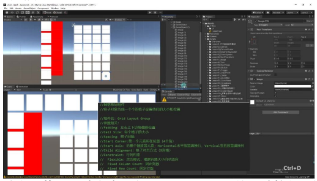

#### 2）约束模式

- **Flexible**：自适应模式（根据容器尺寸动态调整行列）
- **Fixed Column Count**：固定列数（如设置为 2 则始终显示 2 列）
- **Fixed Row Count**：固定行数（如设置为 2 则始终显示 2 行）

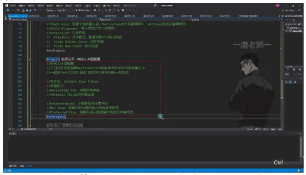

#### 3）应用技巧

- **动态调整**：通过修改父容器 RectTransform 的尺寸控制网格显示数量
- **自动换行**：当容器宽度不足时，水平模式会自动换行显示
- **元素增减**：删除网格元素时会自动重新排列剩余元素

#### 4）典型应用场景

- **背包系统**：固定尺寸的物品格子排列
- **图鉴系统**：等距排列的收集元素展示
- **技能栏**：规整的技能图标布局

### 5. 注意事项

- **尺寸计算**：实际显示行列数由（容器尺寸 - 边距）÷（格子大小 + 间隔）决定
- **性能优化**：建议对动态内容使用对象池技术
- **嵌套限制**：不建议多层网格布局嵌套使用

### 6. 内容大小适配器

- **功能**：自动调整 RectTransform 的长宽让组件自动设置大小
- **应用场景**：
  - 主要在 Text 上使用
  - 配合其他布局组件一起使用

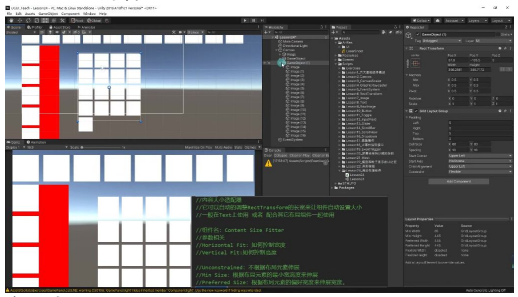

- **组件名**：**Content Size Fitter**
- **参数设置**：
  - **Horizontal Fit**：控制宽度适配方式
    - Unconstrained：不根据布局元素伸展
    - Min Size：根据布局元素的最小宽度伸展
    - Preferred Size：根据布局元素的偏好宽度伸展
  - **Vertical Fit**：控制高度适配方式
    - 选项与宽度控制相同

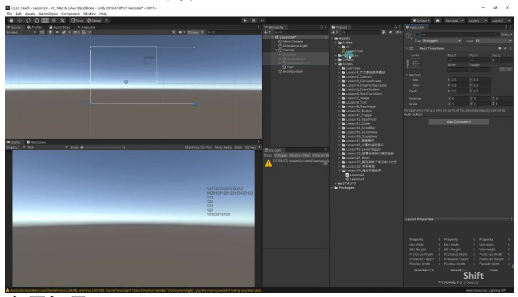

#### 1）例题：Text 内容适配

- **实现步骤**：
  1. 创建 Text 组件
  2. 添加 Content Size Fitter 组件
  3. 设置 Horizontal Fit 和 Vertical Fit 为 Preferred Size
- **效果**：
  - 当 Text 内容变化时，组件大小自动调整
  - 实际使用的是布局元素中的 Preferred Width/Height 属性
- **注意事项**：
  - 若设置为 Min Size，可能因最小值为 0 导致内容不可见
  - 偏好宽度设置是最常用的适配方式

#### 2）例题：ScrollView 内容适配

- **应用场景**：
  - 动态内容容器（如背包系统）
  - Grid Layout Group 布局的子物体
- **实现方法**：
  - 在 ScrollView 的 Content 对象上添加 Content Size Fitter
  - 设置 Vertical Fit 为 Preferred Size
  - 配合 Grid Layout Group 使用
- **优势**：
  - 自动计算 Content 所需尺寸
  - 无需手动编写代码调整 Content 大小
  - 动态添加/删除子物体时自动更新布局
- **典型配置**：
  - 网格布局：Cell Size 50×50
  - 间距：Spacing X=5, Y=5
  - Padding：各边 5 像素

### 7. 宽高比适配器

#### 1）功能与组件

- **主要作用**：
  - 让布局元素按照一定比例调整自身大小
  - 使布局元素在父对象内部根据父对象大小进行适配

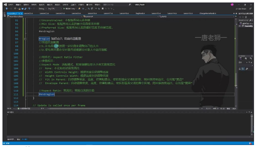

- **组件名称**：**Aspect Ratio Fitter**
- **核心参数**：
  - **Aspect Mode**：适配模式
  - **Aspect Ratio**：宽高比（宽除以高的比值）

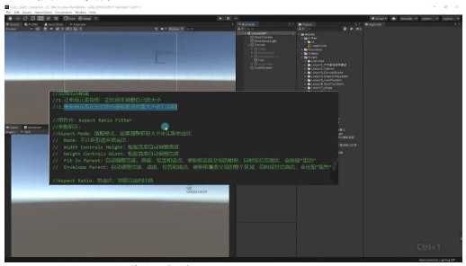

#### 2）适配模式详解

- **None 模式**：不进行宽高比适配
- **宽度控制高度**：
  - 保持宽度不变
  - 根据设定比例自动计算高度
  - 例：800×400 的图片，比例设为 2:1 时高度自动调整为 400
- **高度控制宽度**：
  - 保持高度不变
  - 根据设定比例自动计算宽度
  - 例：800×400 的图片，比例设为 2:1 时宽度自动调整为 800

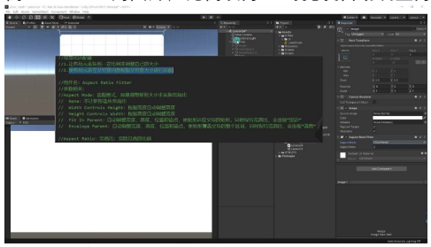

- **Fit In Parent 模式**：
  - 自动调整宽高和锚点
  - 保持宽高比适配父对象
  - 会出现"黑边"（类似 Canvas Scaler 的扩充模式）

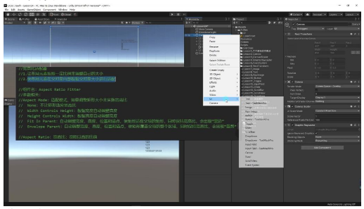

- **Envelope Parent 模式**：
  - 自动调整宽高和锚点
  - 保持宽高比覆盖父对象
  - 会出现"裁剪"（类似 Canvas Scaler 的收缩模式）

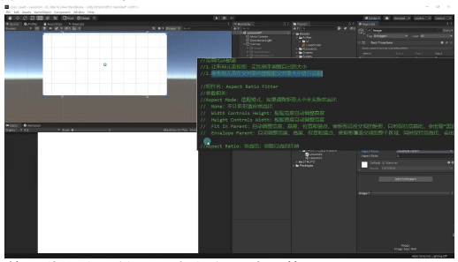

#### 3）应用实例

- **典型应用**：
  - 背景图适配不同分辨率
  - 保持 UI 元素的固定比例
- **操作步骤**：
  1. 创建 Image 组件（建议尺寸 800×400）
  2. 添加 Aspect Ratio Fitter 组件
  3. 选择适配模式
  4. 设置宽高比例（如 16:9）

#### 4）模式对比与选择

- 前两种模式：针对元素自身尺寸调整
- 后两种模式：针对父对象尺寸调整
- **选择建议**：
  - 需要完整显示内容 → **Fit In Parent**（可能出现黑边）
  - 需要填满显示区域 → **Envelope Parent**（可能出现裁剪）
  - 背景图推荐使用 Envelope Parent 模式

#### 5）与 Canvas Scaler 的关系

- **相似性**：
  - Fit In Parent ≈ 扩充模式（显示完全）
  - Envelope Parent ≈ 收缩模式（填满裁剪）

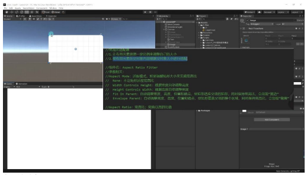

- **区别**：
  - 作用于单个 UI 元素而非整个 Canvas
  - 可以单独控制每个元素的适配方式

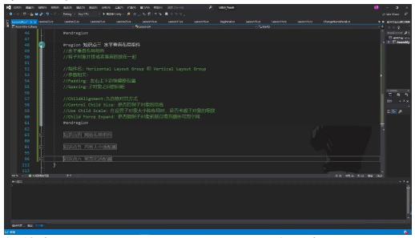

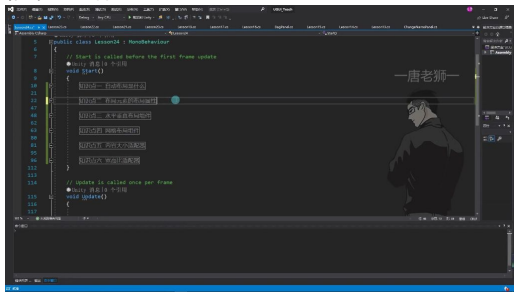

---

## 二、UGUI 自动布局组件总结

### 1. 水平垂直布局组件

- **组件类型**：Horizontal Layout Group（水平布局）和 Vertical Layout Group（垂直布局）
- **核心功能**：将子对象按水平或垂直方向自动排列
- **关键参数**：
  - Padding：控制组件边缘与子对象之间的偏移量
  - Spacing：设置子对象之间的间距
  - Child Alignment：使用九宫格方式对齐子对象
  - Control Child Size：是否自动控制子对象的宽高尺寸
  - Use Child Scale：布局时是否考虑子对象的缩放比例
  - Child Force Expand：是否强制子对象扩展以填充可用空间

### 2. 网格布局组件

- **组件特点**：以网格形式排列子对象，适合需要规整排列的场景
- **应用场景**：常用于物品栏、图库等需要整齐排列的 UI 界面

### 3. 内容大小适配器

- **核心功能**：根据内容自动调整 UI 元素尺寸
- **使用要点**：特别适合文本内容长度不确定的情况

### 4. 宽高比适配器

- **主要作用**：保持 UI 元素特定的宽高比例
- **典型应用**：确保图片在不同分辨率下不变形

### 5. 学习重点提示

- **掌握要点**：
  - 理解各布局组件的基本概念
  - 熟悉组件的主要参数设置
  - 了解不同布局组件的适用场景
- **学习建议**：虽然属性参数较多，但实际开发中只需掌握核心功能即可满足大部分需求

---

## 三、知识小结

### 知识点总览

| 知识点 | 核心内容 | 关键参数/功能 | 应用场景 |
|--------|----------|--------------|----------|
| 自动布局基础 | UI 控件自动位置大小设置 | 布局控制组件 + 布局元素 | UI 界面快速排版 |
| 布局属性 | 6 个核心布局参数 | minWidth / preferredWidth / flexibleWidth 等 | 控件尺寸计算规则 |
| 水平/垂直布局 | 线性排列子对象 | Padding / Spacing / Child Controls Size | 导航栏/列表项排版 |
| 网格布局 | 矩阵式格子排列 | Cell Size / Start Corner / Constraint | 背包系统/图库展示 |
| 内容适配器 | 动态调整 RectTransform | Horizontal / Vertical Fit | 文本内容自适应 |
| 宽高比适配器 | 比例保持适配 | Width / Height Mode | 背景图多端适配 |

### 组件类型对比

| 组件类型 | 边缘控制 | 间距控制 | 对齐方式 | 尺寸控制 |
|----------|----------|----------|----------|----------|
| 水平布局组 | Padding | Spacing | 9宫格对齐 | Child Force Expand |
| 垂直布局组 | Padding | Spacing | 9宫格对齐 | Child Force Expand |
| 网格布局组 | Padding | Spacing | Start Corner | Cell Size / Constraint |

### 布局属性计算优先级

| 属性类型 | 计算优先级 | 作用说明 | 典型值 |
|----------|------------|----------|--------|
| minWidth | 1 | 最小宽度保障 | 100px |
| preferredWidth | 2 | 理想宽度 | 200px |
| flexibleWidth | 3 | 弹性扩展权重 | 0.5 |
| minHeight | 1 | 最小高度保障 | 50px |
| preferredHeight | 2 | 理想高度 | 150px |
| flexibleHeight | 3 | 弹性扩展权重 | 1.0 |

### 适配器类型对比

| 适配器类型 | 适配逻辑 | 显示效果 | 适用场景 |
|------------|----------|----------|----------|
| 内容大小适配器 | 按文本内容扩展 | 动态调整包围盒 | 聊天气泡/标签 |
| 宽高比适配器 | 按比例约束 | 黑边/裁剪 | 背景图/视频窗口 |
