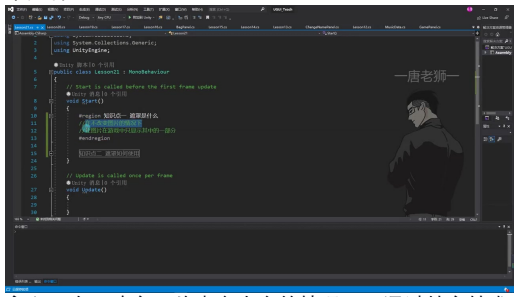
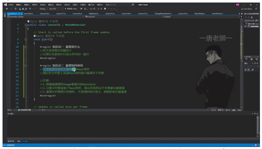
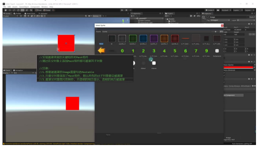
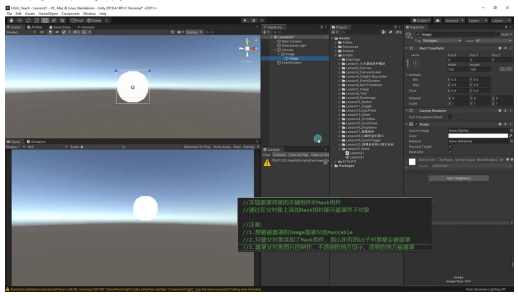
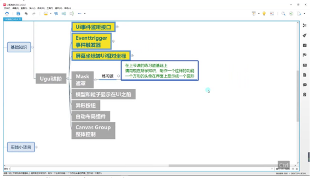

# Mask 遮罩

## 一、遮罩相关知识点

### 1. 遮罩是什么

- **定义**：在不改变图片本身内容的情况下，通过特定技术手段让图片在游戏中只显示其中一部分的效果
- **应用场景**：常见于不规则图形显示（如圆形头像）、UI元素局部显示控制等
- **已有接触**：Unity中 Scroll View 组件默认包含遮罩功能，通过 Viewport 上的 Mask 组件实现内容区域限制

### 2. 遮罩如何使用

**核心组件**：通过父对象添加 Mask 组件实现遮罩效果

**实现步骤**：
1. 创建 Image 作为遮罩容器
2. 添加 Mask 组件（Edit Component → 输入 Mask）
3. 设置遮罩图片（建议使用透明通道分明的图片）
4. 添加需要被遮罩的子对象

#### 1）关键注意事项

- **Maskable 属性**：
  - 被遮罩的子对象必须勾选 Image 组件中的 Maskable 选项
  - 取消勾选将导致遮罩失效
- **层级影响**：
  - 父对象添加 Mask 后，所有 UI 子对象（包括子对象的子对象）都会自动被遮罩
- **遮罩图片规则**：
  - 不透明区域显示内容，透明区域遮挡内容
  - 美术资源要求：边缘像素需均匀分布以避免锯齿现象

#### 2）组件参数详解

- **Show Mask Graphic**：
  - 勾选：显示遮罩图片本身（如红色圆形背景）
  - 取消勾选：仅保留遮罩功能，不显示遮罩图片
- **视觉效果优化**：
  - 遮罩图片建议使用高质量 PNG 资源
  - 复杂形状遮罩需特别注意边缘抗锯齿处理

### 3. 实践练习

- **题目要求**：将方形头像显示为圆形
- **实现要点**：
  1. 创建圆形遮罩图片作为父对象
  2. 添加 Mask 组件并设置合适参数
  3. 将头像图片作为子对象放入
  4. 确保子对象 Maskable 属性开启
- **扩展应用**：异形按钮、特殊 UI 边框等创意效果制作

---

## 二、知识小结

| 知识点 | 核心内容 | 考试重点/易混淆点 | 难度系数 |
|--------|----------|-------------------|----------|
| 遮罩的定义 | 在不改变图片的情况下，只显示图片的一部分 | 遮罩效果的实际应用场景 | ⭐⭐ |
| 遮罩的实现方法 | 通过父对象添加 Mask 组件，子对象需勾选 Maskable | 子对象必须勾选 Maskable 才能生效 | ⭐⭐⭐ |
| 遮罩的关键组件 | Mask 组件控制遮罩范围，Show Mask Graphic 控制是否显示遮罩图片 | Show Mask Graphic 的作用 | ⭐⭐ |
| 遮罩的注意事项 | 1. 子对象需勾选 Maskable 2. 父对象添加 Mask 后，所有 UI 子对象均被遮罩 3. 遮罩图片透明区域不显示内容 | 遮罩图片锯齿问题的原因及优化方法 | ⭐⭐⭐ |
| 遮罩的应用场景 | 不规则图形显示（如头像、特殊 UI 效果） | 如何利用遮罩优化 UI 显示效果 | ⭐⭐ |
