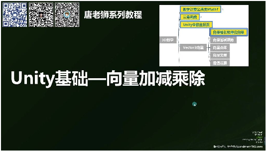
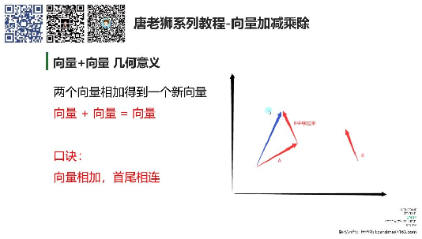
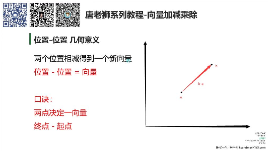
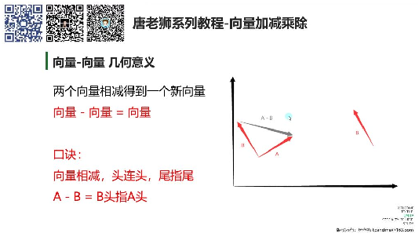
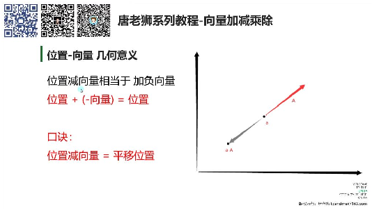
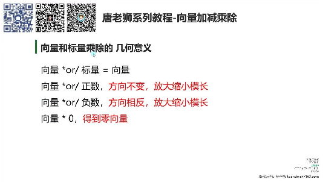
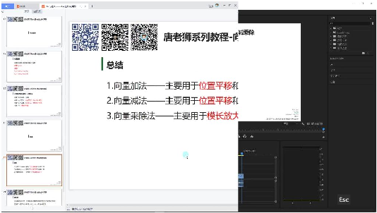
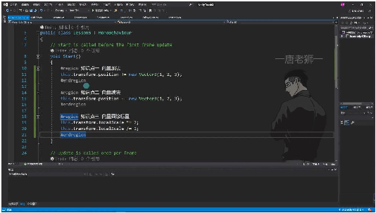
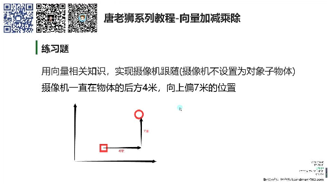

# 向量加减乘除

> 来源：向量加减乘除.pdf

---

## Page 1
以下为AI⽣成的图⽂笔记的内容 ⼀、Unity基础—向量加减乘除 00:05

• •核⼼概念：Vector3向量在Unity中代表位置或⽅向，包含加减乘除四种基本运算 1. 向量加法 00:20 1）向量+向量⼏何意义 01:28

• •运算规则：A(xa,ya,za)+B(xb,yb,zb)=(xa+xb,ya+yb,za+zb) •⼏何意义：两个向量相加得到新向量，遵循"⾸尾相连"原则（加数起点连接被加数终 点） •应⽤场景：物理类游戏中的⽅向计算，如组合运动⽅向 2）向量+位置⼏何意义 02:39 •位置平移：位置+向量=新位置，实现点沿向量⽅向平移 •Unity实现：transform.Translate()本质是位置加向量运算 •⼝诀记忆："位置和向量相加等于平移位置" 2. 向量减法 03:32 1）位置-位置⼏何意义 04:00

• •⼏何意义：两点相减得到⽅向向量（终点-起点）

## Page 2
•运算规则：B(xb,yb,zb)-A(xa,ya,za)=(xb-xa,yb-ya,zb-za) •记忆⼝诀："两点决定⼀向量，终点减起点" 2）向量-向量⼏何意义 04:50

• •⼏何规则：遵循"头连头，尾指尾"原则（被减数终点指向减数终点） •记忆技巧：A-B结果为B的头部指向A的头部形成的向量 3）位置-向量⼏何意义 06:16

• •等效运算：位置+(-向量)，实现反向平移 •Unity应⽤：通过减向量实现对象位置的反⽅向移动 4）向量-位置⼏何意义 06:57 •特殊说明：此运算⽆实际⼏何意义，Unity中应避免使⽤ 3. 向量乘除法 07:31 1）向量和标量乘除的⼏何意义 07:58

• •运算规则：A(x,y,z)*k=(x*k,y*k,z*k)，除法同理 •⼏何效果： o正数：保持⽅向，缩放模⻓ o负数：反向并缩放模⻓ o零：得到零向量(0,0,0) •Unity应⽤：主要⽤于对象缩放（localScale属性）

## Page 3
4. 总结 08:34

• •加法：位置平移（核⼼应⽤）、向量合成 •减法：获取⽅向向量、反向平移 •乘除：模⻓缩放（正数缩放/负数反向） 5. 课程内容Unity实践 08:51

• •位置平移： •缩放控制： •注意事项：必须使⽤localScale⽽⾮lossyScale（只读属性） ⼆、练习题 12:14

• •题⽬要求：使⽤向量运算实现⾮⽗⼦物体的摄像机跟随，保持后⽅4⽶、上⽅7⽶的偏 移位置 三、知识⼩结 知识点核⼼内容考试重点/易难度系数 混淆点 向量加法运算规则：x+x, y+y,位置+位置⽆⭐⭐ z+z；⼏何意义：位置意义，仅向量

## Page 4
平移（位置+向量）或/位置组合有 向量合成（向量+向实际应⽤；向 量）。Unity中常⽤量合成需掌握 Transform.Translate实现“⾸尾相连”规 平移。则。 向量减法运算规则：x-x, y-y, z-终点减起点得⭐⭐⭐ z；⼏何意义：两点决向量；向量相 定向量（位置-位置）、减需记忆“头 向量差（向量-向量）、连头，尾指尾 反向平移（位置-向”规则；向量 量）。减位置⽆意 义。 向量乘除法仅与标量运算：x*a, y*a,乘以零得零向⭐⭐ z*a（乘除同理）。⼏何量；负数运算 意义：模⻓缩放（⽅向会反转⽅向； 不变/相反，取决于正负需区分全局/ 数）。Unity中⽤于调整局部缩放 localScale。（localScale可 改，全局只 读）。 Unity应⽤场加法/减法：物体位移实际开发中优⭐⭐ 景（Translate本质为位置+先⽤Translate 向量）；乘除法：缩放⽽⾮直接操作 物体（localScale * 标position；缩 量）。放需注意坐标 系差异。
