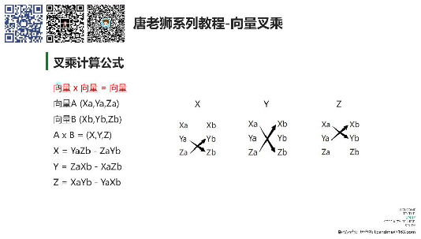
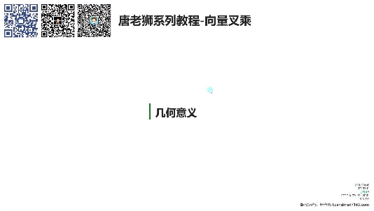
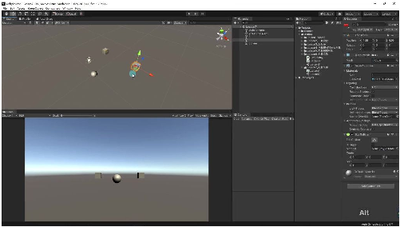
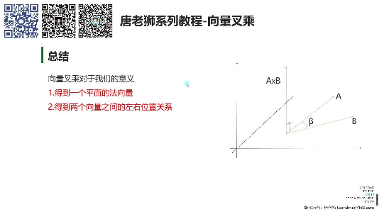
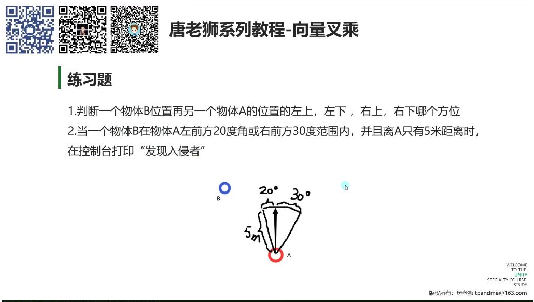

# 向量叉乘

> 来源：向量叉乘.pdf

---

## Page 1
以下为AI⽣成的图⽂笔记的内容 ⼀、向量叉乘 00:03 1. 叉乘计算公式 00:13

• •基本形式：向量A×向量B=向量C，其中： oA=(Xa,Ya,Za) oB=(Xb,Yb,Zb) oC=(X,Y,Z) •分量计算： oX=YaZb-ZaYb oY=ZaXb-XaZb oZ=XaYb-YaXb 1）叉乘计算公式解析 00:17 •记忆技巧： o将向量竖排书写，计算哪个分量就忽略该分量所在列 o计算X分量时忽略X列，从上往下交叉相乘后相减 o计算Y分量时忽略Y列，从下往上交叉相乘后相减 o计算Z分量时忽略Z列，从上往下交叉相乘后相减 •特性： o结果是⼀个新的向量 o顺序影响结果⽅向：A×B=-(B×A) 2）Unity计算叉乘 04:26 •API使⽤： oVector3.Cross(A.position, B.position) o内部⾃动应⽤叉乘公式计算 •注意事项： o⾯试可能需要⼿写公式 o理解原理⽐记忆API更重要 2. 叉乘的⼏何意义 07:19 1）叉乘的⼏何意义解析 07:56

## Page 2

• •法向量： o结果向量同时垂直于输⼊的两个向量 o是两向量所在平⾯的法向量 •⽅向判断： o在XZ平⾯上时，y分量正负表示左右关系 oy>0：B在A右侧 oy<0：B在A左侧 2）Unity计算叉乘示例 10:00 •例题:判断向量左右位置

o o实现步骤： 创建两个物体A和B 计算叉乘结果向量 检查y分量正负 •例题:if语句判断向量左右位置 11:29 1 Vector3 C = Vector3.Cross(A.position, B.position); 2 if(C.y > 0) { 3 print("B在A的右侧"); 4 } else { 5 print("B在A的左侧"); 6 } •注意事项： o顺序影响判断结果 o适⽤于XZ平⾯上的向量 3. 内容总结 15:28

## Page 3

• •主要意义： o获取平⾯的法向量 o判断两向量的左右位置关系 •应⽤场景： o3D图形学中的⾯法线计算 o游戏AI中的⽅位判断 o结合点乘实现更复杂的空间关系判断 4. 练习题

•

• •练习要点： o结合点乘和叉乘实现⽅位判断 o注意距离和⻆度的双重条件判断 o使⽤Unity API简化计算过程 ⼆、知识⼩结 知识点核⼼内容考试重点/易混难度系数 淆点 向量差乘计向量差乘结果为新公式记忆技⭐⭐⭐ 算公式向量，计算公式通巧：竖排向

## Page 4
过交叉相乘和相减量，按“跳过当 得到（如：新向量x前维度，交叉 = yazb - zayb）。相乘”规则计 Unity中可直接⽤算。 Vector3.Cross()计易错点：差乘 算，⽆需⼿动实现顺序影响结果 公式。⽅向（a×b = - b×a）。 向量差乘⼏差乘结果向量同时应⽤场景：3D⭐⭐ 何意义垂直于原向量，是游戏中判断敌 两向量所在平⾯的⼈⽅位（结合 法向量。可⽤于判点乘计算⻆度+ 断向量相对位置差乘判断左 （如：y>0表示右右）。 侧，y<0表示左易混淆点：法 侧）。向量⽅向受差 乘顺序影响。 Unity实战应通过Vector3.Cross()关键代码：⭐⭐ ⽤快速计算差乘，结Vector3 c = 合y值判断对象⽅位Vector3.Cross(a, （如：if(c.y > 0)表b); 示⽬标在右侧）。if(c.y > 0) Debug.Log("右 侧"); 差乘与点乘点乘计算夹⻆⼤对⽐维度：⭐⭐⭐ 对⽐⼩，差乘补充⽅向- 点乘：标量结 判断（左右关果，⽤于⻆度/ 系）。两者结合可投影。 实现完整⽅位分- 差乘：向量结 析。果，⽤于法向 量/⽅向。
