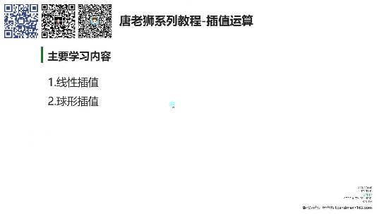
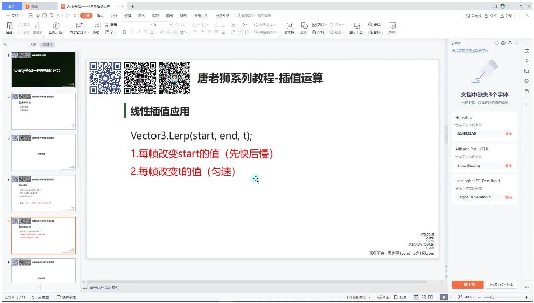
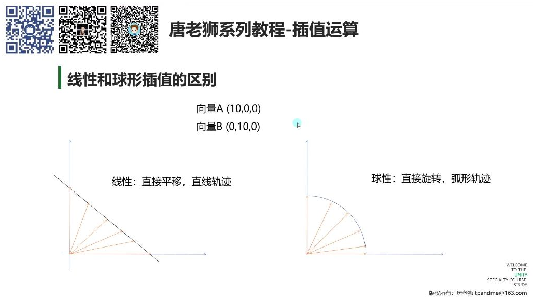
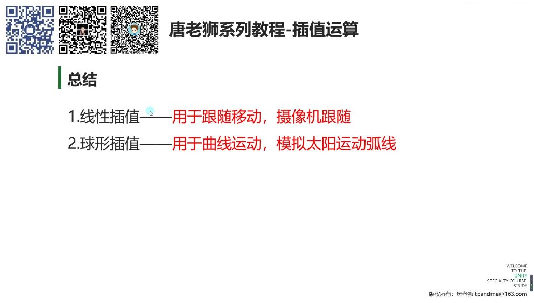

# 向量插值运算

> 来源：向量插值运算.pdf

---

## Page 1
以下为AI⽣成的图⽂笔记的内容 ⼀、向量插值运算 00:15

• 1. 线性插值 1）线性插值定义 00:17 •数学原理: 线性插值公式为result=start+(end-start)*t，其中t的取值范围是0到1 •Unity实现: Vector3.Lerp(start, end, t)函数实现三个坐标值同时插值 •与Mathf区别: Mathf.Lerp处理单个值，Vector3.Lerp同时处理xyz三个分量 2）线性插值应⽤ 01:22

• •先快后慢效果: 每帧改变start值，使物体位置⽆限接近但不完全到达终点 •匀速移动效果: 每帧改变t值，当t≥1时得到最终结果 •实际应⽤: 实现物体从⼀个位置平滑移动到另⼀个位置 3）线性插值代码实现 02:08 •先快后慢实现: 1 A.position = Vector3.Lerp(A.position, target.position, Time.deltaTime); •匀速移动实现: 1 time += Time.deltaTime; 2 B.position = Vector3.Lerp(startPos, target.position, time); •⽬标移动处理: 当⽬标位置改变时需要重置time和startPos，避免瞬移 2. 球形插值 13:54 1）球形插值定义 13:56

## Page 2

• •数学原理: Vector3.Slerp(start, end, t)实现弧形轨迹插值 •参数说明: 参数与Lerp相同，但运动轨迹为弧线⽽⾮直线 2）线性插值和球形插值的区别 14:15 •运动轨迹: o线性插值：直线运动 o球形插值：弧线运动 •示例对⽐: o向量A(10,0,0)到B(0,10,0) o线性：直接平移 o球形：旋转移动 3）球形插值代码实现 15:48 •基础实现: 1 C.position = Vector3.Slerp(Vector3.right * 10, Vector3.forward * 10, time * 0.1f); •应⽤场景: 太阳东升⻄落、导弹弧线轨迹等特殊运动效果 ⼆、总结 19:22

• •线性插值应⽤: 摄像机跟随、物体平滑移动 •球形插值应⽤: 曲线运动、太阳运动轨迹模拟 •练习题: o实现摄像机跟随（保持后⽅4⽶，上⽅7⽶） o模拟太阳升降变化 三、知识⼩结 知识点核⼼内容考试重点/易混淆点难度系数 线性差值通过Vector3.Lerp实现- 先快后慢：a.position⭐⭐ （Lerp）物体位置插值，⽀持先= 快后慢（每帧更新起始Vector3.Lerp(a.position, 位置）和匀速移动（固target, deltaTime) 定起始位置，变化时间

## Page 3
系数）。公式：结果 =- 匀速移动：需记录初 start + (end - start) * t。始位置和时间，⽬标变 化时重置时间和起始位 置，否则会瞬移。 球形差值通过Vector3.Slerp实现与线性差值核⼼区别：⭐⭐ （Slerp）弧形轨迹移动，参数与运动轨迹为曲线，适⽤ Lerp相同，但运动路径于太阳轨迹、导弹路径 为旋转弧线（如从等特殊场景。 (10,0,0)到(0,0,10)）。 应⽤对⽐- 线性差值：摄像机跟关键差异：线性为直线⭐⭐ 随、物体直线移动。路径，球形为弧线路 - 球形差值：曲线运动径。实际开发中线性差 （如天体运⾏）。值更常⽤。
