# 向量模长和单位向量

> 来源：向量模长和单位向量.pdf

---

## Page 1
以下为AI⽣成的图⽂笔记的内容 ⼀、向量基础 00:38 1. 标量和向量 00:41
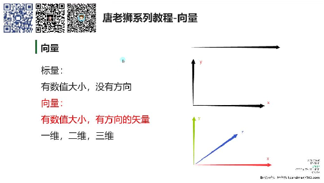
• •本质区别： o标量：只有数值⼤⼩，没有⽅向（如温度、质量） o向量：既有数值⼤⼩⼜有⽅向的⽮量（如速度、位移） •维度分类： o⼀维向量：在直线上的量（如物体以5m/s速度移动） o⼆维向量：在平⾯坐标系中的量（如坐标点(x,y)与原点的连线） o三维向量：在空间坐标系中的量（如坐标点(x,y,z)与原点的连线） •物理实例： o⼀维示例：物理中未指定⽅向的匀速运动（"五⽶每秒"移动） o⼆维示例：平⾯直⻆坐标系中的位置向量 o三维示例：⽴体空间中的⽅向向量 2. 向量在空间中的表示 01:05
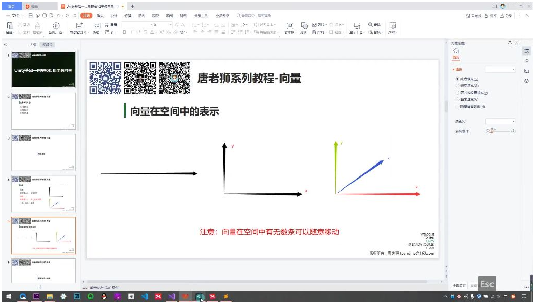
• •基本特性： o⾃由向量：可在空间内任意平移⽽不改变本质（只要保持⽅向和⼤⼩不变） o唯⼀性判定：⽅向相同、⻓度相等的向量视为同⼀向量 •坐标系表示： o⼀维：数轴上的有向线段 o⼆维：xy平⾯内从原点到点(x,y)的有向线段 o三维：xyz空间内从原点到点(x,y,z)的有向线段 •重要注意： o向量与位置⽆关：⽆论起点在何处，只要⽅向⼤⼩相同即为同⼀向量 o可视化理解：向量箭头可平⾏移动⾄坐标系任意位置

## Page 2
⼆、Unity中向量 02:51 1. 向量3的两种⼏何意义 03:10
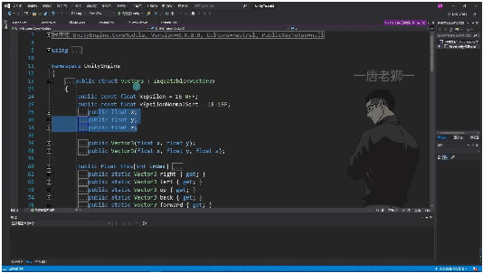
• •基本概念：Unity中使⽤Vector3结构体表示三维向量，包含x、y、z三个浮点数值 •⼏何意义： o位置表示：代表三维空间中的⼀个点坐标，如transform.position返回的就是 Vector3类型的位置坐标 o⽅向表示：代表⼀个⽅向向量，如transform.forward和transform.up返回的都是表 示⽅向的Vector3
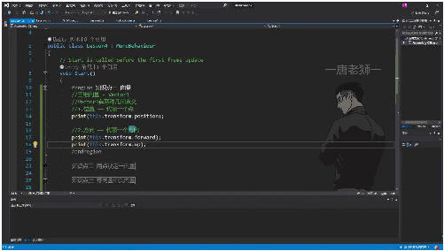
o •⽅向向量特点：虽然数值形式与位置相同，但⼏何意义不同。例如物体⾯朝向 (forward)和头顶朝向(up)都是⽅向向量 •⼆维向量：Unity中还有Vector2结构体，⽤于表示⼆维向量，只有x和y两个分量 2. 两点决定⼀向量 04:04 1）向量计算原理 07:16
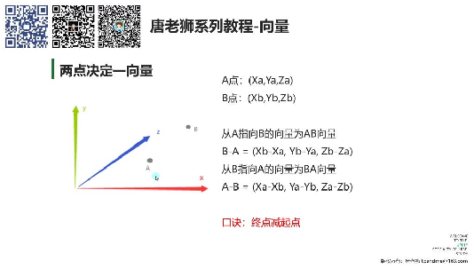
• •计算公式： oAB向量 = B点坐标 - A点坐标 =(Xb-Xa,Yb-Ya,Zb-Za) oBA向量 = A点坐标 - B点坐标 =(Xa-Xb,Ya-Yb,Za-Zb) •记忆⼝诀：终点减起点。要得到从A指向B的向量就⽤B减A 2）Unity中的实现 09:36

## Page 3
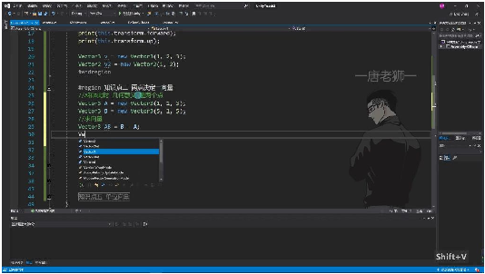
• •代码示例： 1 Vector3 A = new Vector3(1, 2, 3); 2 Vector3 B = new Vector3(5, 1, 5); 3 Vector3 AB = B - A; // 得到A指向B的向量 4 Vector3 BA = A - B; // 得到B指向A的向量 •实际应⽤：常⽤于计算物体间的相对⽅向，如： 1 Vector3 direction = target.position - transform.position; •运算符重载：Vector3已重载减法运算符，内部⾃动计算各分量差值
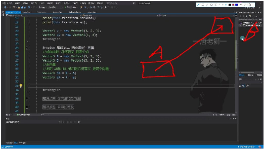
• •⼏何意义转换：同⼀个Vector3变量在不同场景下可表示点或向量，具体意义由使⽤场 景决定 •注意事项：计算结果仍是Vector3类型，但此时表示的是⽅向向量⽽⾮位置点 3. 零向量和负向量 13:14
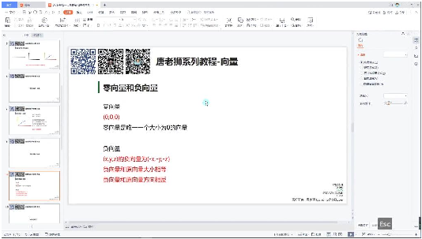
• •零向量定义：唯⼀⼤⼩为0的向量，表示为(0,0,0)，其x、y、z分量均为零。 •负向量定义：向量(x,y,z)的负向量为(-x,-y,-z)，与原向量⼤⼩相等但⽅向相反。 •Unity表示： o零向量：Vector3.zero（实际值为(0,0,0)） o负向量：在变量前加负号（如-Vector3.forward将(0,0,1)变为(0,0,-1)） •⼏何意义：负向量相当于原向量的反向延⻓线，常⽤于实现反向运动效果。 4. 向量的模⻓ 15:59

## Page 4
1）向量的模⻓意义 16:02
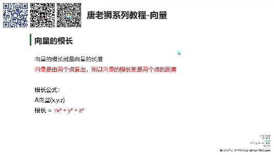
• •本质：向量的⻓度（两点间距离） •⼏何解释：在三维坐标系中，向量O⃗A的模⻓即点A(x,y,z)到原点O的距离 •应⽤场景：计算物体间距、运动距离等物理量 2）模⻓公式 16:49 •计算公式：|O⃗A|=x2+y2+z2 •推导基础：三维空间中的勾股定理 •示例：向量(5,6,7)的模⻓为52+62+72≈10.488 3）Unity求向量⻓度 17:20
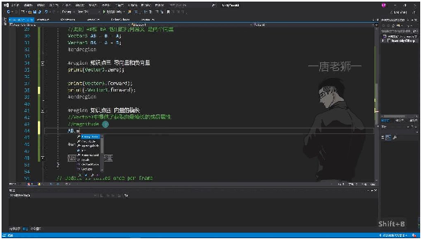
• •核⼼API：vector.magnitude成员属性 o示例：AB.magnitude返回AB向量的⻓度 o本质：⾃动计算x2+y2+z2的结果 •等效⽅法：Vector3.Distance(A,B)可获得相同结果 •特殊说明： o对点坐标直接调⽤magnitude时，计算的是该点到原点的距离 o如new Vector3(5,6,7).magnitude计算的是(5,6,7)到(0,0,0)的距离 5. 单位向量 21:04 1）单位向量的概念 21:05 •定义：模⻓为1的向量称为单位向量 •应⽤场景：当只需要⽅向⽽不想让模⻓影响计算结果时使⽤，例如物体移动计算 •归⼀化：任意向量通过归⼀化处理可得到单位向量 2）单位向量的求法 21:45

## Page 5
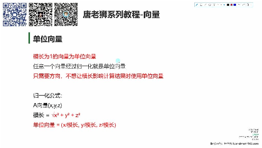
• •计算步骤： o先计算向量模⻓：模长=x2+y2+z2 xyz o各分量除以模⻓：单位向量=(模长,模长,模长) •⼏何意义：相当于将原向量缩放⾄⻓度为1，保持⽅向不变 3）unity求单位向量 23:23
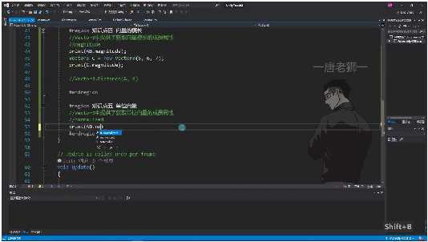
• •快捷⽅法：使⽤Vector3.normalized属性直接获取单位向量 •验证⽅法：通过AB/AB.magnitude计算结果应与AB.normalized相同 •优势：避免⼿动计算，提⾼开发效率 6. 总结 25:23 1）Vector3变量的双重性 25:28 •双重含义：Vector3既可表示坐标系中的点，也可表示向量 •决定因素：具体表示什么由开发需求和逻辑决定 •特殊情形：单独的点C可表示原点O到该点的向量OC 2）在Unity中获取向量 26:14 •基本⽅法：终点坐标减去起点坐标 •示例：向量AB = B - A，向量BA = A - B 3）向量的模⻓和单位向量的应⽤ 27:00
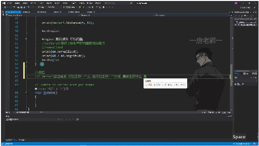
• •模⻓应⽤：

## Page 6
o计算两点间距离 o通过Vector3.magnitude属性直接获取 •单位向量应⽤： o主要⽤于移动计算 o避免因向量⻓度影响移动速度 o保证移动效果仅由速度参数控制 4）练习题 28:57
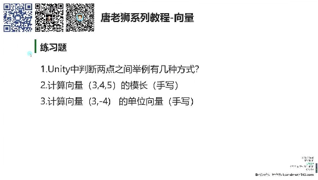
• •题⽬解析： oUnity中判断两点距离的⽅式 o⼿动计算向量(3,4,5)的模⻓ o⼿动计算向量(3,-4)的单位向量 三、知识⼩结 知识点核⼼内容考试重点/易混淆点难度系数 向量基础概向量与标量的区别向量平移不变性、⭐⭐ 念（⽅向性）、维度Unity中Vector3的双重 分类含义（点坐标/⽅向向 （1D/2D/3D）、⼏量） 何意义（位置/⽅ 向） 两点确定向终点减起点计算法⼏何意义转换（点→⭐⭐⭐ 量则、Unity向量减法向量）、物体相对位 运算符重载置计算 零向量与负Zero属性表示、负⽅向相反性验证、移⭐ 向量号运算符重载效果动反⽅向实现 向量模⻓Magnitude属性原理模⻓⼏何意义（点距⭐⭐ （勾股定理三维扩原点距离/两点间距） 展）、Distance⽅法 对⽐ 单位向量归⼀化公式（坐标/移动计算必要性（消⭐⭐⭐ 模⻓）、Normalized除模⻓影响）、⼿动 属性应⽤计算验证 Unity实践应Vector3结构体操位置判断与⽅向移动⭐⭐⭐⭐ ⽤作、Transform组件的代码实现差异 向量关联
