# 向量点乘

> 来源：向量点乘.pdf

---

## Page 1
以下为AI⽣成的图⽂笔记的内容 ⼀、向量点乘 00:04 1. 主要学习内容 00:11
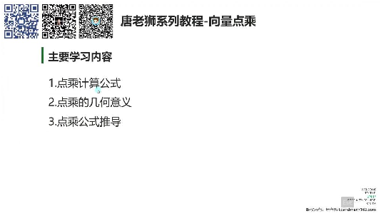
• •向量点乘的三个核⼼内容： o计算公式 o⼏何意义 o公式推导 2. 点乘计算公式 00:22 •基本形式：向量a与向量b的点乘记作a∙b，计算公式为各分量相乘后相加：a∙ b=x1x2+y1y2+z1z2 •结果性质：点乘结果为标量（具体数值） •记忆技巧：⼝诀"x乘x加y乘y加z乘z" •应⽤场景：⾯试中可能出现⼝算题，建议强制记忆公式 3. 点乘⼏何意义 01:17
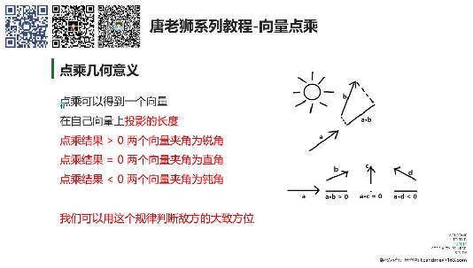
• •核⼼概念：点乘结果等于向量b在向量a⽅向上投影的⻓度 •夹⻆判断： oa∙b>0：两向量夹⻆为锐⻆（<90°） oa∙b=0：两向量垂直（=90°） oa∙b<0：两向量夹⻆为钝⻆（>90°） •实例说明：通过向量AB与物体朝向向量的点乘结果，可判断⽬标物体位于前⽅ （>0）、侧⽅（=0）或后⽅（<0） 1）例题：判断对象位置 04:44

## Page 2
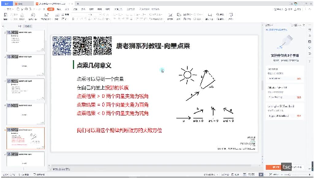
• •实现步骤： o计算AB向量（⽬标位置-⾃⾝位置） o⽤⾃⾝朝向向量点乘AB向量 o根据点乘结果正负判断相对⽅位 •调试技巧：使⽤Debug.DrawLine可视化朝向向量 2）补充知识 05:29
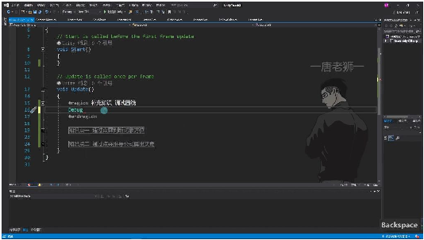
• •Debug⽅法： oDrawLine(Vector3 start, Vector3 end, Color)：绘制线段（需指定起点终 点） oDrawRay(Vector3 start, Vector3 dir, Color)：绘制射线（需指定起点和⽅ 向） •参数区别： oDrawLine第⼆个参数是终点坐标 oDrawRay第⼆个参数是⽅向向量 •应⽤示例：Debug.DrawLine(transform.position, transform.position + transform.forward, Color.red)可绘制⾯朝⽅向的红⾊线段 4. 应⽤案例 09:01 1）例题:通过点乘判断⽅位
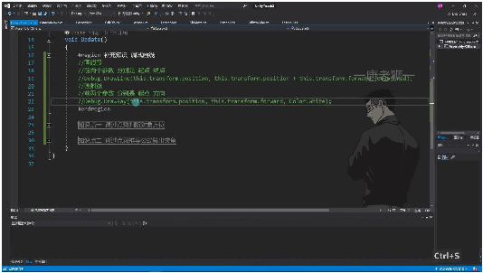
•

## Page 3
•⼏何意义：点乘可以得到⼀个向量在另⼀个向量上投影的⻓度，通过这个投影⻓度可 以判断两个向量的相对⽅位关系。 •判断⽅法： o当点乘结果>0时，两个向量夹⻆为锐⻆，表示⽬标在正前⽅ o当点乘结果=0时，两个向量夹⻆为直⻆，表示⽬标在正侧⽅ o当点乘结果<0时，两个向量夹⻆为钝⻆，表示⽬标在正后⽅ •Unity实现： o使⽤Vector3.Dot()⽅法计算点乘 o参数为两个向量：⾃⾝朝向向量和⽬标⽅向向量 o⽬标⽅向向量通过target.position - this.transform.position计算得到
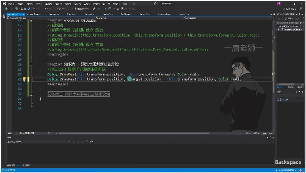
o •代码实现： o⾸先绘制两条辅助线： o计算点乘结果： o根据结果判断⽅位： •实际应⽤： o在Unity中运⾏时，当⽬标物体移动到前⽅时控制台输出"它在我前⽅" o当⽬标物体移动到后⽅时控制台输出"它在我后⽅" o通过改变⽬标物体位置可以实时验证判断结果的正确性 •核⼼要点： o点乘结果的符号直接反映两个向量的相对⽅位关系 o在Unity中可以通过简单的向量运算实现⽅位判断 o实际应⽤中通常将等于0的情况也归为前⽅判断 5. 点乘的公式推导 15:06
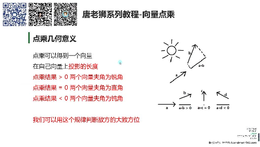
• •⼏何意义：向量点乘结果为0时表示两个向量夹⻆为直⻆；a∙b>0时夹⻆⼩于90°； a∙c=0时垂直；a∙d<0时夹⻆⼤于90°。在游戏开发中可⽤于判断敌⽅⽅位。 1）例题：推导公式算夹⻆ 22:16

## Page 4
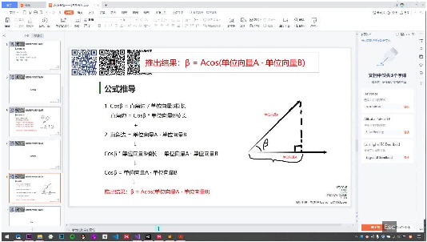
• •推导前提：当向量A和B都是单位向量（模⻓为1）时： o根据三⻆函数：cosβ=直角边/|B|→ 直⻆边=cosβ∙|B| o根据点乘性质：直⻆边=A∙B o联⽴得：cosβ=A∙B→β=arccos(A∙B)
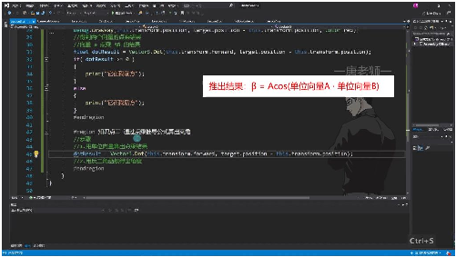
o •实现步骤： o计算单位向量的点乘结果：Vector3.Dot(transform.forward, (target.position - transform.position).normalized) o⽤反余弦函数求弧度：Mathf.Acos(dotResult) o转换为⻆度：*Mathf.Rad2Deg •API简化：Unity提供Vector3.Angle()⽅法直接计算夹⻆，其底层原理仍是点乘公 式。但⾯试或考试时需⼿动实现推导过程。 6. 总结 28:40
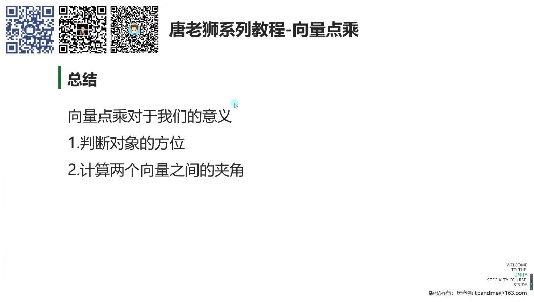
• •核⼼应⽤： o判断对象⽅位（前后关系） o计算向量间夹⻆（0°-180°范围）

## Page 5
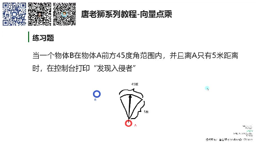
o •练习要点：需同时满⾜⻆度≤45°且距离≤5⽶时触发"发现⼊侵者"提示，需结合距离 检测与⻆度计算。 ⼆、知识⼩结 知识点核⼼内容考试重点/易混淆点难度系数 向量的点乘点乘的计算公式（a·b 死记硬背公式（⾯试可⭐⭐ = x₁x₂ + y₁y₂ +能要求⼝算） z₁z₂），结果为标量 点乘的⼏何投影⻓度判断⽅位：>0正负值与⽅位关系（易⭐⭐⭐ 意义（锐⻆/前⽅）、=0混淆投影⽅向） （直⻆/侧⽅）、<0 （钝⻆/后⽅） Unity实战应通过Vector3.Dot判断单位向量与⾮单位向量⭐⭐⭐⭐ ⽤敌⼈⽅位，结合处理（需标准化） Debug.DrawLine可视 化向量 夹⻆计算推单位向量点乘结果弧度与⻆度转换⭐⭐⭐⭐ 导=cosθ → 反余弦求弧度（Mathf.Rad2Deg） → 转⻆度 （Mathf.Acos） Unity API优化直接使⽤⾯试时需⼿推公式（禁⭐⭐ Vector3.Angle计算夹⽤API） ⻆（底层仍为点乘实 现） 游戏开发案怪物扇形检测逻辑：通⻆度范围判定（需结合⭐⭐⭐⭐ 例过夹⻆限制视野范围正负⽅向） （如≤60°触发追击）
