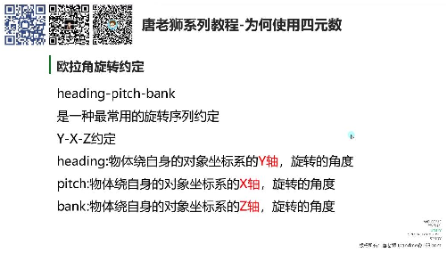
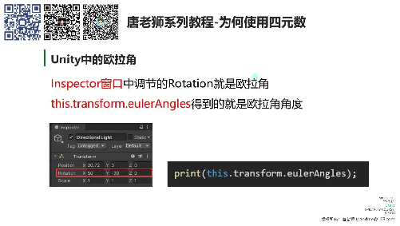
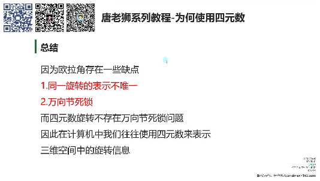

# 为何使用四元数

> 来源：为何使用四元数.pdf

---

## Page 1
以下为AI⽣成的图⽂笔记的内容 ⼀、四元素 00:55 1. 为何使⽤四元素 00:57 1）欧拉⻆ 01:10 •欧拉⻆定义 01:13

o o组成结构: 由三个⻆度(x,y,z)组成，在特定坐标系下⽤于描述物体的旋转量。 o分解原理: 空间中的任意旋转都可以分解成绕三个互相垂直轴的三个旋转⻆组成 的序列。 •欧拉⻆旋转约定 01:30

o oheading-pitch-bank约定: 旋转顺序: Y-X-Z轴依次旋转 heading: 绕对象坐标系Y轴旋转的⻆度 pitch: 绕对象坐标系X轴旋转的⻆度 bank: 绕对象坐标系Z轴旋转的⻆度 •Unity中的欧拉⻆ 02:15

o o操作界⾯: Inspector窗⼝中的Rotation参数即为欧拉⻆ o代码获取: 通过this.transform.eulerAngles获取欧拉⻆数值 o实例演示: ⽴⽅体绕Y轴旋转90°和450°效果相同，验证同⼀旋转表示不唯⼀

## Page 2
•欧拉⻆的优缺点 02:55

o o优点: 直观性: 直接显示绕各轴旋转⻆度（如X轴50°，Y轴-30°） 存储效率: 仅需存储三个数值 ⼤⻆度旋转: ⽀持超过180°的旋转表示 o缺点: 表示不唯⼀: 如90°和450°表示相同旋转状态 万向节死锁: 特定⻆度会导致⾃由度丢失 2）万向节死锁 05:24

• •发⽣条件: 当特定轴达到临界值（如Unity中X轴90°）时 •表现现象: 两个旋转轴重合，失去⼀个旋转⾃由度 •Unity验证: ⽴⽅体X轴旋转90°后，Y轴和Z轴旋转效果相同 •机械原理: 通过三环臂装置演示，当中间环臂旋转90°时，内外环臂运动平⾯重合 3）总结 12:19

• •欧拉⻆问题: o旋转表示不唯⼀（如90°=450°） o不可避免的万向节死锁现象 •解决⽅案: 四元素旋转表示法 o⽆万向节死锁问题

## Page 3
o成为计算机表示3D旋转的标准⽅案 ⼆、知识⼩结 知识点核⼼内容考试重点/易混淆难度系数 点 向量运算点乘、差乘、差值运点乘与差乘的区别⭐⭐ 算的应⽤（位置判（点乘⽤于⻆度/ 断、平滑移动）投影，差乘⽤于垂 直向量） 欧拉⻆由XYZ三轴⻆度组成的同⼀旋转表示不唯⭐⭐⭐ 旋转表示⽅法（如⼀（如90°与450°效 Unity的Rotation属性）果相同） 万向节死锁特定轴旋转临界值时Unity中的表现⭐⭐⭐⭐ ⾃由度丢失（如X=90°（Inspector调整欧 后Y/Z轴重合）拉⻆时触发） 四元数引⼊解决欧拉⻆的万向节与欧拉⻆的对⽐⭐⭐⭐ 原因死锁和旋转表示不唯（四元数⽆死锁但 ⼀问题更难直观理解）
