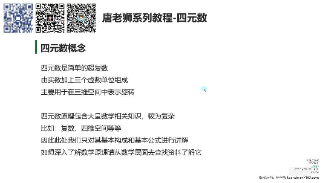
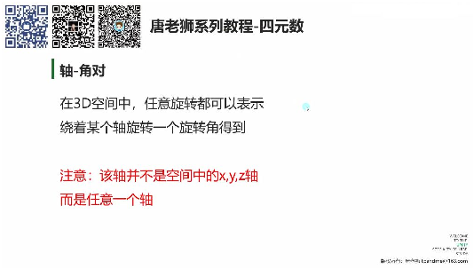
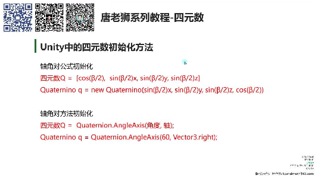
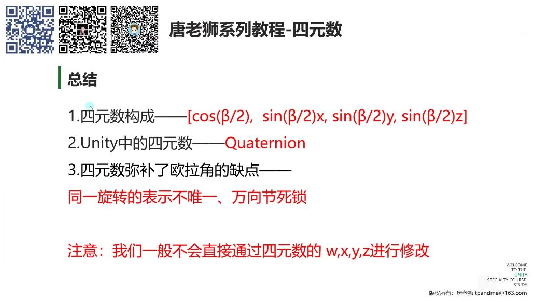

# 四元数是什么

> 来源：四元数是什么.pdf

---

## Page 1
以下为AI⽣成的图⽂笔记的内容 ⼀、四元数构成 00:46 1. 四元数的构成 02:07

• •基本定义：四元数是简单的超复数，由实数加上三个虚数单位组成，主要⽤于在三维 空间中表示旋转。 •数学原理：包含复数、四维空间等复杂数学知识，此处仅讲解基本构成和公式。 •构成要素：⼀个四元数包含⼀个标量w和⼀个3D向量v，表示为[w,v]或展开为 [w,(x,y,z)]。 •旋转表示：任意给定的四元数表示3D空间中的⼀个旋转量。 •轴⻆对概念：在3D空间中，任意旋转都可以表示为绕着某个轴旋转⼀个⻆度，该轴可 以是任意⽅向向量。 2. 轴⻆对 02:35

• 数学表达：对于绕轴n=(x,y,z)旋转β度，对应四元数公式为： Q=[cos(β/2),sin(β/2)n] 或展开为： •Q=[cos(β/2),sin(β/2)x,sin(β/2)y,sin(β/2)z] •记忆要点： o标量部分固定为cos(β/2) o向量部分为sin(β/2)乘以轴向分量 o不需要理解数学原理，只需记忆公式即可使⽤ ⼆、Unity中的四元数 06:25 1. 四元数的初始化⽅法 06:45

## Page 2

• •公式初始化： •轴⻆对⽅法： •实际应⽤： o通常使⽤第⼆种⽅法，计算更简单 o第⼀种⽅法需要⼿动计算三⻆函数值 o示例：Quaternion.AngleAxis(60, Vector3.right) 2. 四元数和欧拉⻆相互转化 15:13 1）欧拉⻆转四元数 15:44 •转换⽅法： •示例： 2）四元数转欧拉⻆ 16:29 •转换⽅法： •注意点： o转换后的欧拉⻆范围始终在-180°~180°之间 o避免了同义旋转表示不唯⼀的问题 3. 四元数弥补的欧拉⻆缺点 17:53 1）同⼀旋转的表示不唯⼀ 18:07 •问题表现：欧拉⻆可以有⽆限多种表示⽅式对应同⼀旋转状态 •四元数解决： o通过四元数旋转后转换的欧拉⻆始终保持在-180°~180°范围 o消除了表示不唯⼀性问题 2）万向节死锁 21:16 •问题表现：当某轴旋转到特定⻆度(如90°)时，其他两轴旋转会重合 •四元数解决： o通过四元数旋转可以避免万向节死锁 o旋转轴始终相对于物体⾃⾝坐标系 o示例代码：

## Page 3
三、总结 26:17

• •核⼼公式：[cos(β/2),sin(β/2)x,sin(β/2)y,sin(β/2)z] •Unity实现：使⽤Quaternion结构体，优先采⽤AngleAxis⽅法初始化 •优势体现： o解决了欧拉⻆表示不唯⼀问题 o避免了万向节死锁现象 •使⽤注意： o⼀般不直接修改四元数的w,x,y,z分量 o旋转计算时注意坐标系是相对于物体⾃⾝ 四、知识⼩结 知识点核⼼内容考试重点/易混淆点难度系数 四元素的构成四元素是简单的超复数，由轴⻆对概念（绕任意⭐⭐⭐ 实数加三个虚数单位组成，轴旋转β度）与数学 ⽤于三维空间旋转表示。公原理（复数、四维空 式：标量（cos(β/2)） + 向量间）的关联性。 （sin(β/2)*[x,y,z]）。 Unity中的四元结构体Quaternion，初始化避免直接修改⭐⭐ 素⽅法：xyz/w，优先使⽤封 （Quaternion1. 直接公式计算（new装⽅法。⾯试需记忆 ）Quaternion(x,y,z,w)）公式。 2. 轴⻆对静态⽅法 （Quaternion.AngleAxis(⻆ 度, 轴)）。 四元素与欧拉- 欧拉⻆→四元素：转换时注意弧度与⻆⭐⭐ ⻆转换Quaternion.Euler(x,y,z)度的差异 - 四元素→欧拉⻆：（Mathf.Deg2Rad） quaternion.eulerAngles。。 四元素解决欧1. 同义旋转表示唯⼀：四元万向节死锁对⽐实⭐⭐⭐ 拉⻆缺点素⻆度范围固定为-验：欧拉⻆在X=90°时⭐ 180°~180°Y/Z轴重合，四元素⽆ 2. 避免万向节死锁：四元素此问题。 乘法旋转（q1 *= q2）基于 ⾃⾝坐标系。 四元素旋转计四元素相乘代表旋转（如旋转轴⽅向：输⼊向⭐⭐⭐ 算transform.rotation *=量为⾃⾝坐标系（⾮ 世界坐标系）。

## Page 4
Quaternion.AngleAxis(1, Vector3.up)）。
