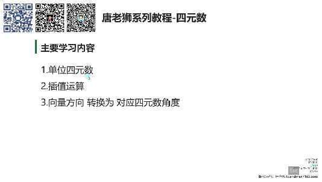
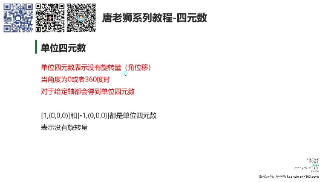
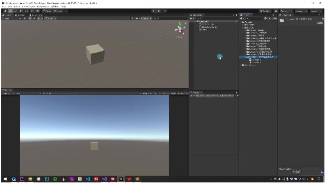
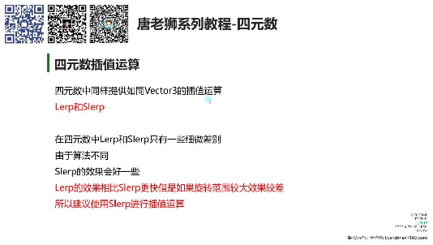
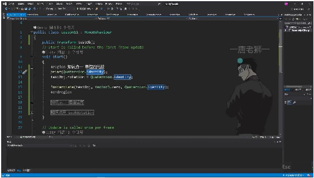
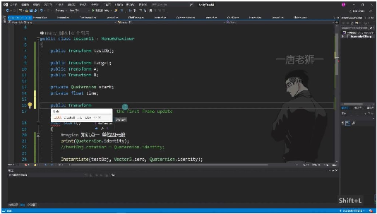
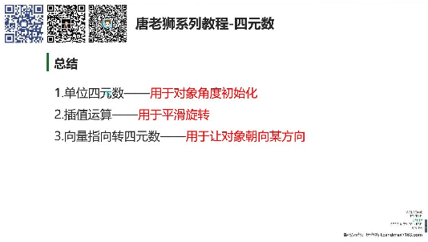
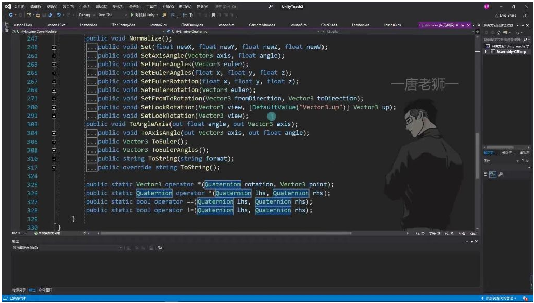
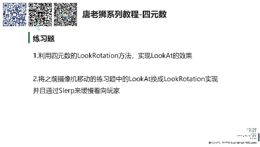

# 四元数的常用方法

> 来源：四元数的常用方法.pdf

---

## Page 1
以下为AI⽣成的图⽂笔记的内容 ⼀、四元数的常⽤⽅法 00:05

• 1. 主要学习内容 00:09

• •三⼤重点: o单位四元数 o插值运算 o向量⽅向转换为对应四元数⻆度 2. 单位四元数 00:19

• •定义: 表示没有旋转量（⻆位移）的四元数 •数学表示:[1,(0,0,0)]和[-1,(0,0,0)]都是单位四元数 •特性: o当⻆度为0或360度时对于给定轴都会得到单位四元数 o对应欧拉⻆为(0,0,0)的状态 •应⽤场景: 主要⽤于对象⻆度初始化 1）例题:单位四元数应⽤ 01:53

## Page 2

• •关键代码: •实际效果: o对象⻆度变为(0,0,0) o实例化新对象时保持⽆旋转状态 3. 插值运算 04:06

• •两种⽅法: oLerp: 线性插值，计算更快但旋转范围⼤时效果较差 oSlerp: 球形插值，效果更好，推荐使⽤ •区别: o与Vector3不同，四元数中Lerp和Slerp表现相似 oSlerp算法更优，适合⼤范围旋转 1）例题:插值运算应⽤ 05:12

• •实现⽅式: o先快后慢变化: o匀速变化: •效果对⽐: o先快后慢：初始变化快，逐渐趋近⽬标 o匀速变化：保持恒定速度转向⽬标

## Page 3
4. 向量指向转四元数 11:32 •核⼼⽅法: Quaternion.LookRotation(⾯朝向量) •⼯作原理: o将⾯朝向量转换为对应的四元数⻆度信息 o内部实现类似Transform.LookAt 1）例题:向量指向转四元数应⽤ 13:48

• •关键代码: •动态跟踪: o在Update中持续计算可实现对象持续跟踪⽬标 o效果与LookAt类似但基于四元数实现 5. 总结 18:23

• •单位四元数: ⽤于对象⻆度初始化 •插值运算: ⽤于平滑旋转 •向量转四元数: ⽤于让对象朝向某⽅向 6. 四元素⽅法介绍 18:41

• •常⽤⽅法: oAngleAxis: 轴⻆初始化 oEuler: 欧拉⻆转四元数

## Page 4
oLookRotation: 向量转四元数 oSlerp: 球形插值 •其他⽅法: 多数情况下不常⽤，可查阅官⽅API⽂档 ⼆、练习题 19:24

• •练习1: 利⽤LookRotation⽅法实现LookAt效果 •练习2: 将摄像机LookAt替换为LookRotation+Slerp实现平滑转向 三、知识⼩结 知识点核⼼内容考试重点/易混淆点难度系数 单位四元素表示⽆旋转量（⻆度为0或单位四元素与欧拉⻆⭐⭐ 360度），标量为±1且向量(0,0,0)的等价性； 为(0,0,0)时成⽴。Unity中通identity属性的只读 过Quaternion.identity获取，特性。 ⽤于初始化对象⻆度。 差值运算四元素提供的球形差值⽅Slerp与Lerp在四元素⭐⭐⭐ （Slerp）法，实现平滑旋转（先快后中的表现差异；匀速 慢或匀速变化）。变化需固定起始值 Quaternion.Slerp(start, end,（start），⽽先快后 t)为核⼼API，建议优先使⽤慢需动态更新起始 ⽽⾮线性差值（Lerp）。值。 向量指向转四元通过向量需归⼀化处理；⭐⭐⭐ 素Quaternion.LookRotation(⽅与Transform.LookAt⭐ （LookRotation向向量)将⽬标⽅向转换为四⽅法的关联性；连续 ）元素⻆度，直接赋值可使物调⽤需在Update中 体⾯朝⽬标。适⽤于动态追实现实时转向。 踪（如怪物注视玩家）。 四元素初始化⽅轴⻆对初始化、欧拉⻆转轴⻆对与欧拉⻆的转⭐⭐ 法换、单位四元素赋值。其他换逻辑；四元素乘法 API（如四元素乘法）较少使表示旋转叠加。 ⽤。
