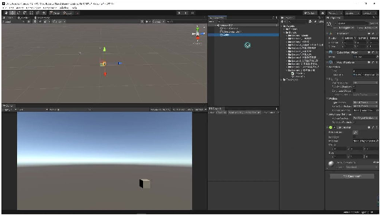
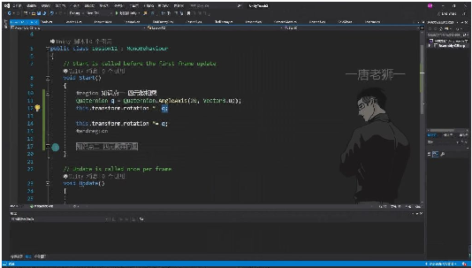
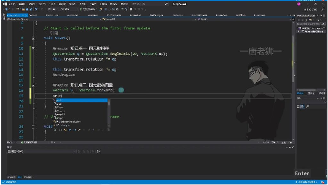

# 四元数计算

> 来源：四元数计算.pdf

---

## Page 1
以下为AI⽣成的图⽂笔记的内容 ⼀、四元数相乘 00:21 1. 两个四元数相乘得到⼀个新的四元数 00:27

• •数学表示：q3=q1*q2，表示两个四元数相乘得到⼀个新的四元数 •物理意义：代表两个旋转量的叠加，相当于连续进⾏两次旋转 •坐标系说明：旋转操作是相对于物体⾃⾝的坐标系进⾏的 •应⽤优势：相⽐欧拉⻆旋转，可以避免万向节死锁问题 •初始化⽅法：实际开发中通常使⽤轴⻆对API（Quaternion.AngleAxis）初始化四元数， ⽽⾮直接使⽤公式 2. 实例操作 01:09

• •环境准备： o创建⽴⽅体对象 o挂载Lesson12脚本控制旋转 •代码实现： •旋转效果： o每次执⾏使物体绕⾃⾝y轴旋转20度 o连续执⾏两次相当于旋转40度 •坐标系验证： o当物体z轴旋转90度后，y轴朝向左侧 o再次执⾏仍绕物体⾃⾝y轴（此时为世界坐标系左侧⽅向）旋转 o证明旋转确实基于物体⾃⾝坐标系 •注意事项： o旋转效果应以四元数计算结果为准，欧拉⻆显示可能有差异 o实际开发中应避免直接修改欧拉⻆来旋转物体 ⼆、四元数乘向量 04:38 1. 四元数乘向量返回⼀个新的向量 04:44

## Page 2
•运算规则: 四元数乘向量公式为v2=q1*v1，其中q1是四元数，v1是原始向量，运算 结果v2是⼀个新向量 •功能作⽤: 该运算可以将指定向量旋转对应四元数的旋转量，相当于对向量进⾏旋转 操作 •顺序要求: 必须四元数在前、向量在后，顺序不可颠倒，否则会报错 2. 实例操作 05:19

•

• •基础示例: o初始向量：Vector3.forward即(0,0,1) o旋转操作：使⽤Quaternion.AngleAxis(45,Vector3.up)创建旋转45度的四元数 •旋转效果: o第⼀次旋转45度后向量变为(0.7,0,0.7) o第⼆次旋转45度后向量变为(1,0,0) •⼏何解释: o在xz平⾯中，初始向量沿z轴正⽅向 o旋转45度后x、z分量相等，符合直⻆三⻆形特性 o旋转90度后完全指向x轴正⽅向 •实际应⽤: o可⽤于实现⻜机发射扇形/环形⼦弹 o通过基础⽅向向量乘以不同旋转⻆度的四元数，可获得多个发射⽅向

## Page 3
三、总结

• •核⼼要点: o四元数相乘：实现⻆度叠加效果 o四元数乘向量：实现向量旋转功能 四、练习题 10:07 ![练习题要求](./00_10_10.jpg "练习题要求"> •题⽬⼀: o模拟⻜机发射不同类型⼦弹的⽅法 o包括单发、双发、扇形、环形四种模式 •题⽬⼆: o实现摄像机跟随效果 o具体要求： 摄像机在⼈物斜后⽅，通过⻆度控制倾斜率 ⿏标滚轮控制摄像机距离（有最⼤最⼩限制） 摄像机看向⼈物头顶上⽅可调节位置 使⽤Vector3.Lerp实现平滑跟随 使⽤Quaternion.Slerp实现朝向过渡 五、知识⼩结 知识点核⼼内容考试重点/易混淆点难度系数 四元素相乘两个四元素注意与欧拉⻆旋转⭐⭐ 相乘得到新的区别（避免万向 四元素，代节死锁），顺序不 表旋转量的可逆（四元素×四 叠加，基于元素）。 物体⾃⾝坐 标系旋转。 四元素乘向四元素×向量顺序强制要求（四⭐⭐ 量返回新向元素在前，向量在 量，实现向后），旋转基于向 量旋转（如量起点⽅向。 ⼦弹发射⽅ 向计算）。 四元素初始通过轴⻆对旋转轴需明确坐标⭐ 化API（⻆度+系（如Vector3.up 旋转轴）初实际依赖物体⾃⾝ 始化，避免坐标系）。

## Page 4
⼿动公式计 算。 应⽤场景游戏开发中需结合坐标系理解⭐⭐⭐ 物体旋转旋转效果（如物体 （如⽴⽅局部坐标系 vs 世界 体）、⽅向坐标系）。 向量⽣成 （如扇形⼦ 弹弹道）。
