# Mathf

> 来源：Mathf.pdf

---

## Page 1
以下为AI⽣成的图⽂笔记的内容 ⼀、数学计算公共类Mathf 00:04 1. 知识点⼀ Mathf和Math 01:10
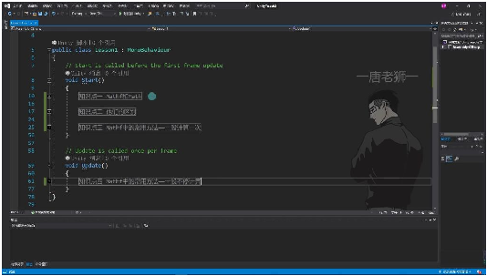
• •Math⼯具类：C#中封装好的⽤于数学计算的⼯具类，位于System命名空间中 •Mathf结构体：Unity中封装好的⽤于数学计算的⼯具结构体，位于UnityEngine命名空 间中 •共同点：都提供⽤于数学相关计算的静态⽅法和常量
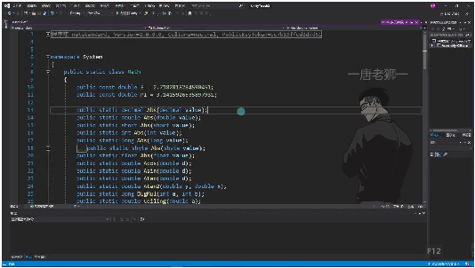
• •Math类特性： o包含常⽤数学常量如E=2.7182818284590451和PI=3.1415926535897931 o提供绝对值计算、三⻆函数、对数运算等静态⽅法 o⽅法重载⽀持多种数值类型（decimal, double, int等）
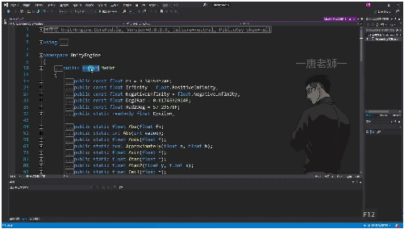
o •Mathf特性： o包含Unity专⽤的数学常量如PI=3.14159274F o提供⻆度弧度转换常量Deg2Rad=0.0174532924F和Rad2Deg=57.29578F o包含游戏开发专⽤⽅法如Lerp插值、平滑阻尼等 2. 知识点⼆ 他们的区别

## Page 2
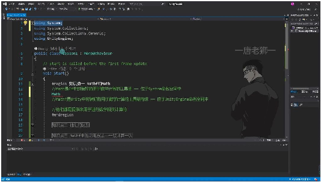
• •来源区别： oMath属于C#基础类库，位于System命名空间 oMathf是Unity引擎特有，位于UnityEngine命名空间 •类型区别： oMath是静态类（static class） oMathf是结构体（struct） •功能区别： oMath提供基础数学运算功能 oMathf额外包含游戏开发专⽤⽅法 3. 知识点三 Mathf中的常⽤⽅法 1）⼀般计算⼀次的⽅法
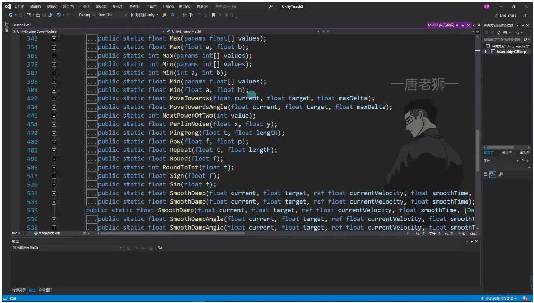
• •基本运算： oAbs()：计算绝对值 oCeil()/Floor()：向上/向下取整 oRound()：四舍五⼊ •三⻆函数： oSin()/Cos()：正弦/余弦计算 oAtan2()：计算反正切值 •特殊计算： oClamp()：数值范围限制 oLerp()：线性插值计算 2）⼀般不停计算的⽅法

## Page 3
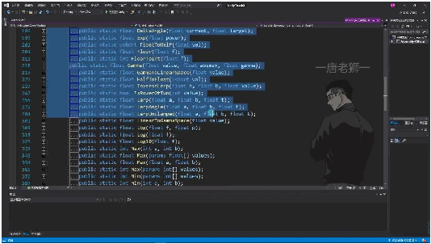
• •平滑运动： oSmoothDamp()：平滑阻尼运动 oMoveTowards()：向⽬标值渐进 •⻆度处理： oDeltaAngle()：计算⻆度差 oLerpAngle()：⻆度插值 •其他： oPingPong()：乒乓循环 oRepeat()：循环取值 4. 知识点⼆ Mathf和Math的区别 03:40
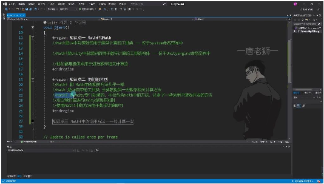
• •来源差异: oMath是C#⾃带的数学⼯具类，位于System命名空间 oMathf是Unity封装的数学⼯具结构体，位于UnityEngine命名空间
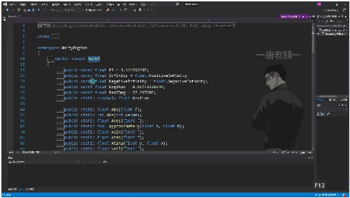
o •功能范围: oMath仅提供基础数学计算⽅法 oMathf不仅包含Math的全部⽅法，还额外添加了游戏开发专⽤⽅法 o例如：SmoothDamp()、Lerp()等插值计算⽅法

## Page 4
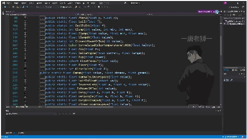
o •适⽤场景: oUnity开发中优先使⽤Mathf o仅当Math有⽽Mathf没有的特殊⽅法时才选⽤Math o典型游戏开发⽅法包括： Clamp()：数值范围限制 Lerp()：线性插值 SmoothDamp()：平滑过渡
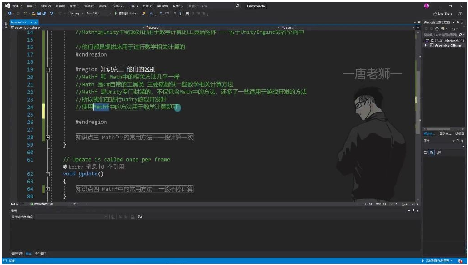
 •使⽤建议: oMathf是Unity对Math的⼆次封装扩展 o专为游戏开发优化，包含更多实⽤⽅法 o结构体设计使其性能表现更优 o记忆⼝诀："Unity开发⽤Mathf，特殊需求才选Math" 5. 知识点三 Mathf中的常⽤⽅法 05:15 1）Mathf中的π 05:29
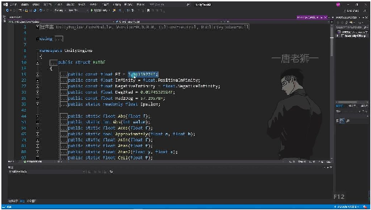
• •常量值: Mathf.PI =3.14159274F，⽐常⽤的3.1415926更精确 •使⽤⽅式: 直接调⽤Mathf.PI即可，⽆需⾃⾏定义 •示例: 2）取绝对值-Abs 06:25

## Page 5
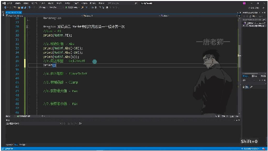
• •功能: 返回数值的绝对值（正数形式） •数学定义: 负数的绝对值是其对应的正数，如|-10|=10 •重载⽅法: oMathf.Abs(float f) oMathf.Abs(int value) •示例: 3）向上取整-CeilToInt 07:19
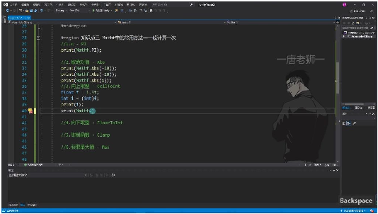
• •功能: 将浮点数向上取整到最近的整数 •与强制转换区别: o强制转换(int)f会向下取整 oCeilToInt始终向上取整 •特性: 只要⼩数部分>0就会进位 •示例: 4）向下取整-FloorToInt 09:09
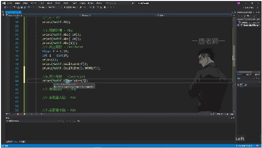
• •功能: 将浮点数向下取整到最近的整数 •与强制转换区别: o结果与强制转换(int)f相同 o但语法更简洁直观 •特性: 直接舍去⼩数部分

## Page 6
•示例: 5）钳制函数-Clamp
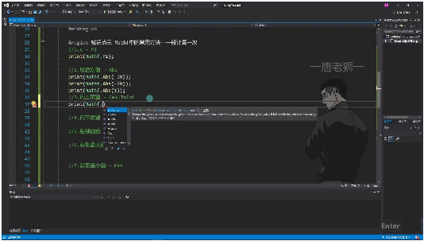
• •功能: 将数值限制在指定范围内 •参数: Clamp(float value, float min, float max) •返回值规则: o若value在[min,max]区间内，返回value o若value<min，返回min o若value>max，返回max 6. 知识点四 10:08 1）Mathf中的常⽤⽅法 10:11 •⼀般计算⼀次的⽅法
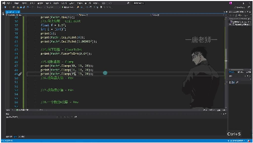
o o钳制函数(Clamp): 别名"夹紧函数"或"前置函数"，将数值限制在最⼩值和最⼤值之间 规则：⽐最⼩值⼩取最⼩值，⽐最⼤值⼤取最⼤值，在区间内取原值 示例：Mathf.Clamp(10,11,20)返回11，Mathf.Clamp(21,11,20)返回 20，Mathf.Clamp(15,11,20)返回15 o向上取整(CeilToInt): 对浮点数向上取整为整数 示例：Mathf.CeilToInt(1.3f)返回2，Mathf.CeilToInt(1.00001f)返回2 o向下取整(FloorToInt): 对浮点数向下取整为整数 示例：Mathf.FloorToInt(9.6f)返回9 •获取极值⽅法

## Page 7
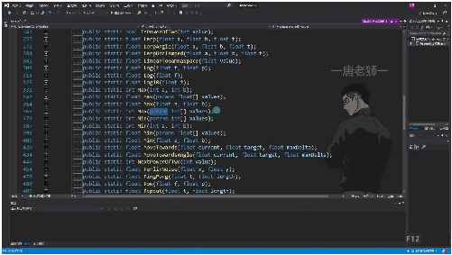
o o获取最⼤值(Max): 可接受多个参数，返回其中最⼤值 重载：⽀持int和float类型，可传2个参数或变⻓参数 示例：Mathf.Max(1,2,3,4,5,6,7,8)返回8，Mathf.Max(1,2)返回2 o获取最⼩值(Min): 与Max⽅法类似，返回最⼩值 示例：Mathf.Min(1.1f,0.4f)返回0.4， Mathf.Min(1,2,3,4,545,6,1123,123)返回1 •数学运算⽅法
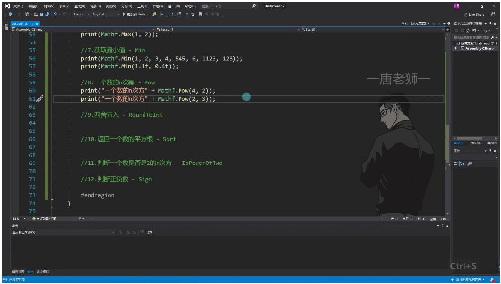
o o幂运算(Pow): 计算⼀个数的n次⽅ 示例：Mathf.Pow(4,2)返回16，Mathf.Pow(2,3)返回8 o平⽅根(Sqrt): 计算⼀个数的平⽅根 示例：Mathf.Sqrt(4)返回2，Mathf.Sqrt(16)返回4，Mathf.Sqrt(64)返 回8 o四舍五⼊(RoundToInt): 对浮点数进⾏四舍五⼊取整 示例：Mathf.RoundToInt(1.3f)返回1，Mathf.RoundToInt(1.5f)返回2 •特殊判断⽅法
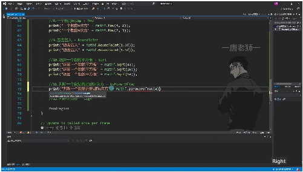
o

## Page 8
o判断2的n次⽅(IsPowerOfTwo): 判断⼀个数是否是2的幂次⽅ 原理：基于⼆进制表示特性 示例：Mathf.IsPowerOfTwo(4)返回true，Mathf.IsPowerOfTwo(8)返回 true，Mathf.IsPowerOfTwo(3)返回false o判断正负数(Sign): 返回数值的符号 规则：正数返回1，负数返回-1，零返回1 示例：Mathf.Sign(10)返回1，Mathf.Sign(-10)返回-1，Mathf.Sign(0) 返回1 •Mathf与Math的区别
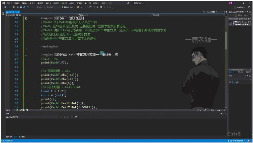
o o来源差异: Math是C#⾃带的数学⼯具类 Mathf是Unity专⻔封装的数学⼯具类 o功能差异: Mathf包含Math中的⽅法 Mathf额外提供适⽤于游戏开发的⽅法 o使⽤建议: Unity开发中优先使⽤Mathf 2）插值运算-Lerp 20:41
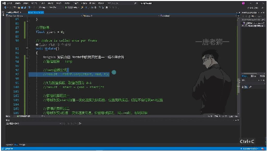
• •定义: 差值运算是指通过Mathf.Lerp函数在两个值之间进⾏平滑过渡的计算⽅法 •特点: 这是Unity特有的数学运算⽅法，传统数学课程中未曾涉及 •应⽤场景: 主要⽤于游戏开发中物体的平滑移动、颜⾊渐变等需要渐进变化的场景 3）Lerp函数公式 21:02 •基本公式

## Page 9

o o标准形式:result=Matℎf.Lerp(start,end,t) o展开公式:result=start+(end-start)*t o参数说明: start: 起始值（如示例中的0） end: 结束值（如示例中的10） t: 插值系数，取值范围为0~1 •参数特性 ot值范围: 必须介于0到1之间，常⽤Time.deltaTime这样的⼩数值作为增量 o计算原理: 结果值是基于起始值与⽬标值之间的⽐例位置 o数学意义: 当t=0时结果为start，t=1时结果为end，中间值按⽐例线性插值 •两种⽤法 o改变start值
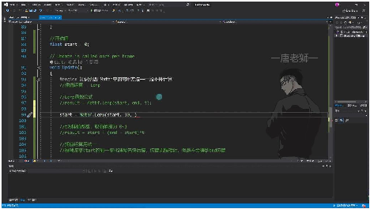
 实现⽅式: 每帧更新start值，如start=Matℎf.Lerp(start,end,t) 运动特点: •速度变化：先快后慢 •最终状态：⽆限接近end但理论上永远不会达到 •适⽤场景：需要渐进减速的效果 o改变t值 实现⽅式: 保持start不变，逐步增加t值 运动特点: •速度变化：保持匀速 •最终状态：当t≥1时可精确到达end位置 •适⽤场景：需要线性变化的效果 •计算示例 o示例参数: start = 0 end = 10 t = 0.1 o计算结果:0 + (10-0)*0.1 = 1 o实际应⽤: 在Update()中每帧执⾏，可实现平滑过渡效果

## Page 10
4）插值运算⽤法⼀ 22:20
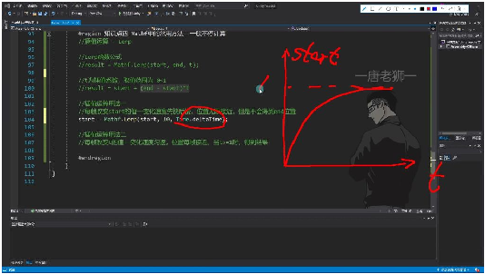
• •基本公式 o函数原型: result = Mathf.Lerp(start, end, t); o数学等价:result=start+(end-start)×t o参数说明: t为插值系数，取值范围[0,1] start为起始值，end为⽬标值 •动态特性 o变化规律: 当每帧更新start值时（示例代码：start = Mathf.Lerp(start, 10, Time.deltaTime);） 变化速度呈现先快后慢的特征 结果值会⽆限趋近于⽬标值但永不相等 o数学原理: ⾸次计算：0+(10-0)×t=10t 后续计算：因start值持续更新，(end-start)差值逐渐减⼩ 导致增量部分(end-start)×t逐帧递减 •可视化理解 o坐标系演示: 横轴表示时间变化 纵轴表示start值变化 曲线特征：初始斜率⼤（变化快），后期渐缓（变化慢） o极限特性: 当t→∞时，start→end（数学极限） 实际编程中由于浮点精度限制，最终会稳定在极接近end的值 •典型应⽤场景 o适⽤情况: 需要平滑过渡的效果（如摄像机跟随） 对最终精度要求不严格的渐进变化 o注意事项: 不能⽤于必须精确到达⽬标值的场景 时间参数t建议使⽤Time.deltaTime保证帧率⽆关 5）插值运算⽤法⼆ 25:24

## Page 11
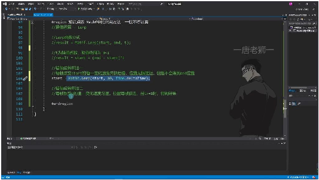
• •基本公式：result=Matℎf.Lerp(start,end,t)或result=start+(end-start)*t •参数说明： ostart：起始值 oend：⽬标值 ot：插值系数，取值范围为0~1 •实现⽅式
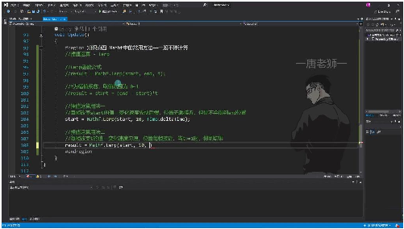
o o变量声明： o更新逻辑： •特性分析
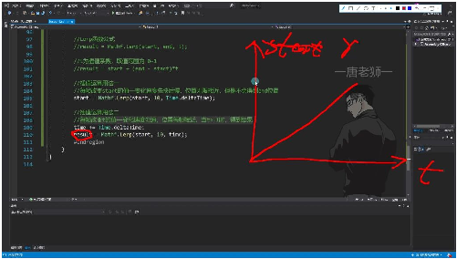
o o运动特性： 匀速变化：随时间均匀接近⽬标值 精确到达：当t>=1时，结果会精确等于end值 o数学原理： 由于start保持不变，公式简化为0+(10-0)*t 每帧增加相同的Time.deltaTime，导致变化量均匀 •与⽤法⼀的区别

## Page 12
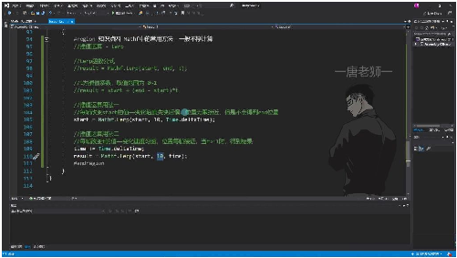
o o变化速度： ⽤法⼀：先快后慢 ⽤法⼆：匀速变化 o最终结果： ⽤法⼀：⽆限接近但永不等于end ⽤法⼆：最终会精确等于end o参数变化： ⽤法⼀：改变start值 ⽤法⼆：改变t值 •实际应⽤ o跟随移动：实现对象A平滑跟随对象B的效果 将对象B的坐标作为end值 每帧计算对象A的新位置 o值趋近：任何需要值平滑过渡的场景 如UI透明度变化 摄像机平滑移动 •记忆要点 o核⼼区别： 变start→先快后慢不达终值 变t→匀速变化可达终值 o应⽤场景选择： 需要精确到达时⽤⽤法⼆ 需要阻尼效果时⽤⽤法⼀ 7. 应⽤案例 30:11 1）线性插值实现⽅块跟随
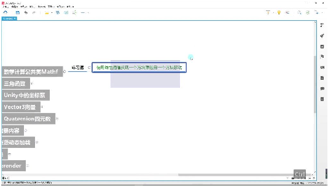
• •实现⽅法：使⽤Unity中的线性插值函数实现⼀个⽅块跟随另⼀个⽅块移动的效果 •数学基础：需要掌握Mathf类中的数学计算⽅法 •坐标系转换：理解Unity中的Vector3向量和Quaternion四元数坐标系 •动态加载：通过代码动态控制游戏对象的渲染和移动

## Page 13
2）练习题：线性插值应⽤

• •练习要求： o使⽤线性插值函数实现⽅块跟随效果 o可截图保存制作过程 o将在下个视频中讲解实现⽅法 •技术要点： o掌握Mathf.Lerp函数的参数设置 o理解插值系数对移动效果的影响 o注意坐标系转换的准确性 ⼆、知识⼩结 知识点核⼼内容考试重点/易难度系数 混淆点 Mathf与Math的Math是C#⾃带的数学计算Math是类，⭐⭐ 区别⼯具类（System命名空Mathf是结构 间），Mathf是Unity封装体；Mathf⽅ 的数学计算结构体法更全⾯，优 （UnityEngine命名空先使⽤。 间），Mathf包含更多游戏 开发专⽤⽅法。 常⽤静态变量Mathf.PI（圆周率常量）直接调⽤，⽆⭐ 需⼿动定义。 绝对值计算Mathf.Abs(-10) → 10负数的绝对值⭐ 是其正数形 式。 取整⽅法- Mathf.CeilToInt(1.3f)⾮四舍五⼊，⭐⭐ → 向上取整为2与强制类型转 - Mathf.FloorToInt(1.6f)换的区别。 → 向下取整为1 钳制函数Mathf.Clamp(10, 11,⽐最⼩值⼩取⭐⭐ （Clamp）20) → 11（超出范围取边最⼩，⽐最⼤ 界值）值⼤取最⼤， 否则取原值。 极值计算- Mathf.Max(1,2,8) → 8⽀持多参数输⭐ - Mathf.Min(0.5f, 0.4f)⼊。 → 0.4 幂与平⽅根- Mathf.Pow(4, 2) → 16幂运算需区分⭐⭐ （4的2次⽅）底数与指数。

## Page 14
- Mathf.Sqrt(16) → 4 ⼆的幂判断Mathf.IsPowerOfTwo(4)⽤于⼆进制位⭐⭐ → true运算场景。 符号判断Mathf.Sign(-10) → -1零被视为正⭐ （负数返回-1，正数返回数。 1） 线性插值- ⽤法1：start =公式：start ⭐⭐⭐ （Lerp）Mathf.Lerp(start, end,+ (end - t) → 先快后慢，⽆限接近start) * t；游 但不等于end戏对象缓动跟 - ⽤法2：result =随的常⽤实现 Mathf.Lerp(0, 10, time)⽅式。 → 匀速变化，time≥1时等 于end
