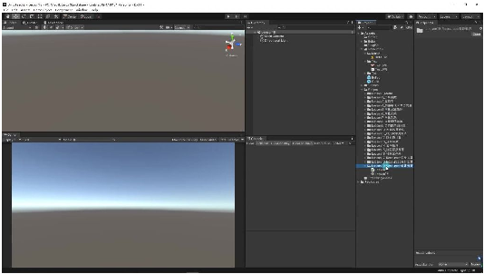
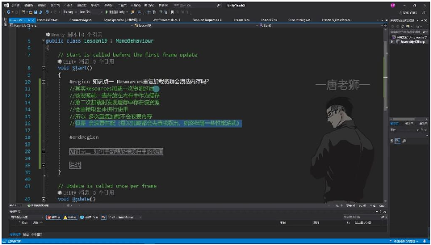
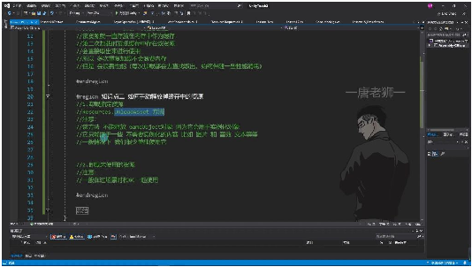
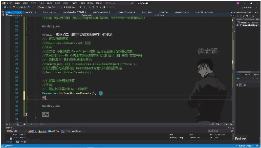
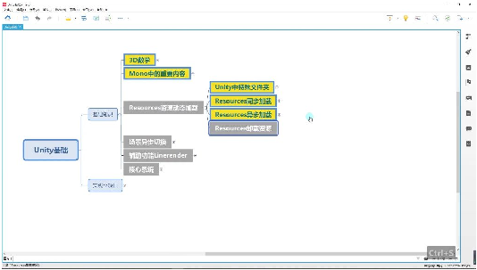

# Resources资源卸载

> 来源：Resources资源卸载.pdf

---

## Page 1
以下为AI⽣成的图⽂笔记的内容 ⼀、资源卸载 00:00

• ⼀、项⽬⽂件说明 00:12

• •新建⽂件夹：需要在Unity⼯程中新建Lesson19⽂件夹 •脚本准备：新建脚本和场景⽤于演示资源卸载功能 ⼀、知识点⼀：重复加载资源的内存影响 00:24

• •缓存机制：Resources加载⼀次资源后，该资源会⼀直存放在内存中作为缓存 •重复加载特性： o第⼆次加载时发现缓存中存在该资源会直接取出使⽤ o多次重复加载不会浪费内存 •性能消耗：每次加载都会去查找取出，始终伴随⼀些性能消耗 ⼀、知识点⼆：⼿动释放缓存资源 01:14 3. 卸载指定资源

## Page 2

• •⽅法：使⽤Resources.UnloadAsset() •限制： o不能释放GameObject对象(会⽤于实例化) o只能⽤于不需要实例化的内容(图⽚、⾳效、⽂本等) •使⽤频率：⼀般情况下很少单独使⽤ •示例验证： o加载Cube预设体会报错，验证GameObject⽆法卸载 o图⽚资源可通过内存调试窗⼝观察卸载效果 3. 卸载未使⽤资源

• •⽅法：Resources.UnloadUnusedAssets() •使⽤时机： o⼀般在过场景时使⽤ o需配合GC.Collect()⼀起使⽤ •效果：执⾏后会把所有没⽤到的资源全部释放 •内存验证： o通过Unity Profiler窗⼝观察内存变化 o按1键加载图⽚，按2键卸载，内存有明显增减 4. 总结 09:28

•

## Page 3
•指定资源卸载： oResources.UnloadAsset卸载指定资源 o不能卸载GameObject对象 •批量资源卸载： oResources.UnloadUnusedAssets卸载所有未使⽤资源 o⼀般过场景时配合GC使⽤ •重复加载验证： o多次按1键加载同⼀资源不会增加内存占⽤ o按2键卸载后内存才会释放 ⼆、知识⼩结 知识点核⼼内容考试重点/易难度系数 混淆点 Resources重重复加载不会浪费内存（资源缓缓存机制 vs 性⭐⭐ 复加载资源存），但会浪费性能（每次加载需查能消耗 的内存影响找） ⼿动释放缓1. Resources.UnloadAsset()：卸载GameObject释⭐⭐⭐ 存资源的⽅指定资源（不⽀持GameObject，仅限放限制 vs ⾮实 法图⽚/⾳效/⽂本等）例化资源释放 2. Resources.UnloadUnusedAssets() + GC.Collect()：卸载未使⽤资源（场 景切换时常⽤） 内存验证实通过Unity调试窗⼝（Ctrl+7）监测内内存监控⼯具⭐⭐ 验存变化：使⽤ - 加载图⽚后内存增加 - 卸载后内存恢复 - 重复加载不增加内存 资源卸载注- UnloadAsset不能⽤于脚本或API适⽤场景⭐⭐⭐ 意事项GameObject区分 - 卸载后需置空引⽤避免错误
