# Resources资源同步加载

> 来源：Resources资源同步加载.pdf

---

## Page 1
以下为AI⽣成的图⽂笔记的内容 ⼀、Resources资源动态加载 00:02 1. 资源动态加载的作⽤ 00:55
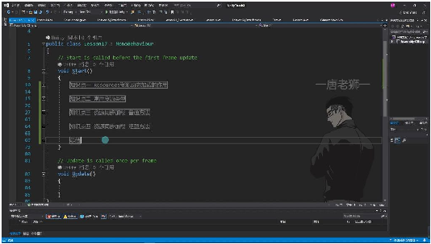
• •特殊⽂件夹：Resources是Unity中的特殊⽂件夹，名称必须准确⽆误 •主要作⽤： o动态加载：通过代码动态加载Resources⽂件夹下指定路径资源 o简化操作：避免在Inspector窗⼝⼿动拖拽关联资源的繁琐操作（特别适⽤于项⽬ 中有⼤量资源需要关联的情况） 2. 常⽤资源类型 01:53
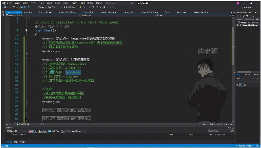
• •预设体对象：对应GameObject类型，加载后需要实例化才能使⽤ •⾳效⽂件：对应AudioClip类型（⾳效切⽚格式） •⽂本⽂件：对应TextAsset类型（⽀持特定格式如XML、JSON等） •图⽚⽂件：对应Texture类型 •其他类型：根据具体需求使⽤对应类型（如动画系统⽂件等）
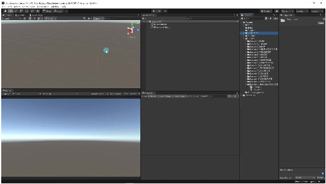
• •重要区别： o预设体必须实例化后才能使⽤

## Page 2
o其他资源类型⼀般可直接使⽤ 3. 资源同步加载普通⽅法 04:08 1）预设体对象加载 04:37
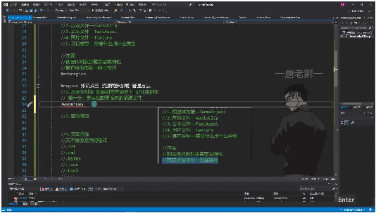
• •加载步骤： o加载资源⽂件：使⽤Resources.Load("Cube")加载预设体资源⽂件（本质是加载配 置数据到内存） o实例化对象：必须通过Instantiate(obj)将加载的预设体实例化到场景中 •注意事项： o预设体必须放在Resources⽂件夹下（⼯程中可存在多个同名Resources⽂件夹） o加载后必须实例化才会出现在场景中（实例化对象名称会带有"(Clone)"后缀） o打包时所有Resources⽂件夹内容都会整合在⼀起
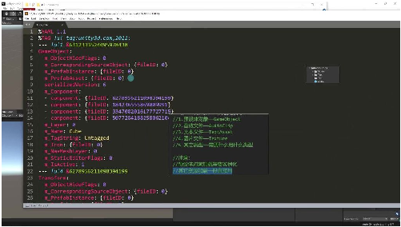
o •⽂件本质：预设体是包含模型关联资源、⽗⼦关系等信息的配置⽂件 2）⾳效/⽂本/图⽚资源加载 09:07
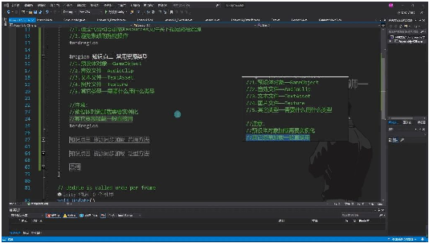
• •主要资源类型： o预设体对象：GameObject（需实例化） o⾳效⽂件：AudioClip o⽂本⽂件：TextAsset（⽀持.txt/.xml/.bytes/.json/.html格式） o图⽚⽂件：Texture o其他类型：按需使⽤对应类型

## Page 3
•加载区别： o预设体需要先加载后实例化 o其他资源加载后可直接使⽤ 3）多Resources⽂件夹处理
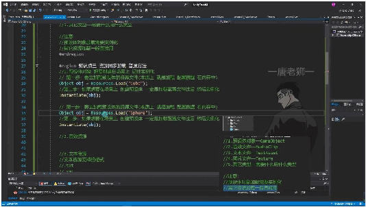
• •⼯程规范： o允许存在多个同名Resources⽂件夹（如Assets/Resources和 Assets/Plugins/Resources） oAPI会⾃动搜索所有Resources⽂件夹 o打包时会合并所有Resources⽂件夹内容 •加载示例： 4. ⾳效资源加载 11:31 1）⾳效⽂件准备 11:41
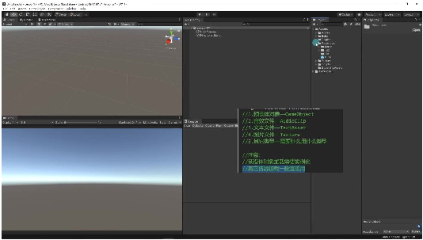
• •存放位置：⾳效⽂件需存放在Resources⽂件夹下，可以建⽴⼦⽂件夹如Music进⾏管 理 •⽂件格式：⽀持常⻅的⾳频格式如.mp3、.wav等 •准备流程：在⼯程中找到合适的⾳效⽂件，拷⻉到Resources/Music⽬录下 2）⾳效资源加载步骤 12:12 •加载⽅法：使⽤Resources.Load()⽅法加载⾳效资源 •路径规则： o多层⽂件夹使⽤斜杠"/"分隔 o不需要包含⽂件扩展名 o示例：Resources.Load("Music/BKMusic") •两步流程： o加载资源到内存：Object obj3 = Resources.Load("Music/BKMusic") o类型转换：audioS.clip = obj3 as AudioClip 3）⾳效资源使⽤ 13:20

## Page 4
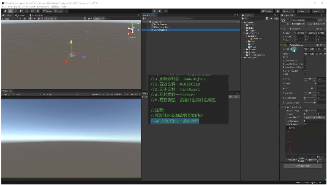
• •组件要求：场景中需要有AudioSource组件 •赋值⽅式： o⼿动拖拽：将⾳效⽂件拖到AudioSource的Clip属性 o代码赋值：audioS.clip = obj3 as AudioClip •播放控制：通过代码audioS.Play()启动播放 •重要区别： o预设体资源需要实例化(Instantiate) o⾳效资源直接赋值即可使⽤ 4）⾳效播放测试 16:51
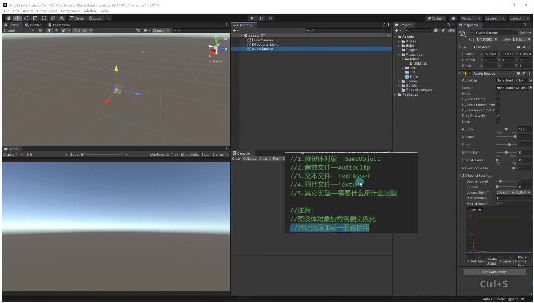
• •测试步骤： o确保AudioSource组件已关联脚本 o运⾏程序观察Clip属性是否⾃动填充 o检查⾳效是否⾃动播放 •常⻅问题： o路径错误导致加载失败 o忘记赋值导致⾳效未播放 o类型转换失败 •关键注意：资源加载后必须使⽤，否则只是占⽤内存⽆实际效果 5. ⽂本资源加载 18:30 1）⽂本资源加载⽅法

## Page 5
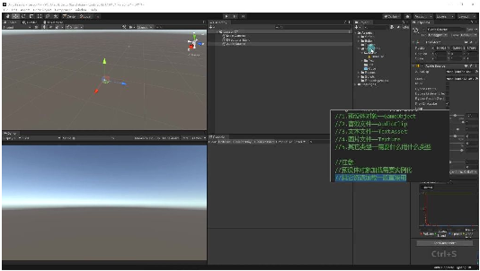
• •加载步骤： o使⽤Resources.Load("路径")加载⽂本资源 o将返回的Object对象转换为TextAsset类型 o通过TextAsset的text属性获取⽂本内容 •示例代码： 2）⽂本资源⽀持格式
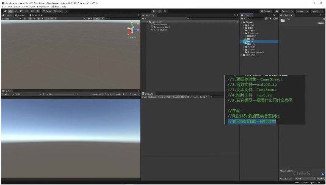
• •⽀持格式： o.txt（普通⽂本⽂件） o.xml o.bytes（字节⽂件） o.json o.html（使⽤较少） o.csv（使⽤较少） •注意事项： oUnity只⽀持特定后缀的⽂本⽂件 o最常⽤的是前四种格式（.txt/.xml/.bytes/.json） o其他格式的⽂本⽂件⽆法被识别和加载 3）⽂本资源使⽤⽅式
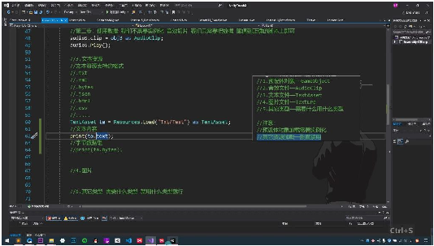
•

## Page 6
•内容获取： otext属性：获取⽂本字符串内容 obytes属性：获取字节数组（⽤于⼆进制数据） •实际应⽤： o⽂本内容可直接⽤于UI显示或逻辑处理 o字节数组可⽤于需要⼆进制处理的场景 •示例： 4）例题：⽂本资源加载使⽤ 19:53
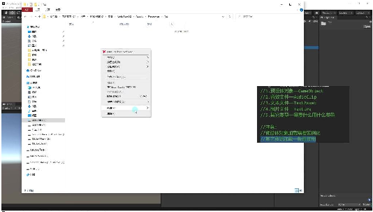
•
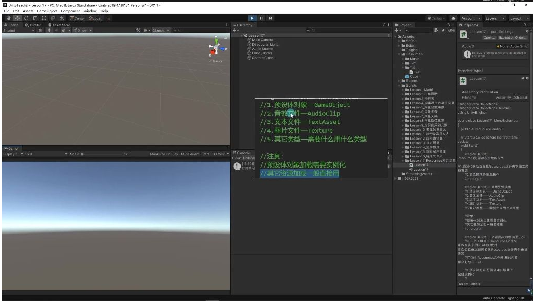
• •实现步骤： o在Resources⽂件夹下创建Txt⼦⽂件夹 o新建test.txt⽂件并写⼊内容（如"唐⽼师好好学习，天天向上"） o使⽤Resources.Load加载并转换为TextAsset o通过ta.text获取并打印⽂本内容 •验证结果： o运⾏后控制台正确输出⽂本内容 o证明资源加载和使⽤流程正确 •注意事项： o路径要正确（区分⼤⼩写） o必须使⽤as进⾏类型转换 o⽂件后缀必须是Unity⽀持的格式 6. 图⽚资源加载 23:15 1）图⽚资源加载⽅法 23:47

## Page 7
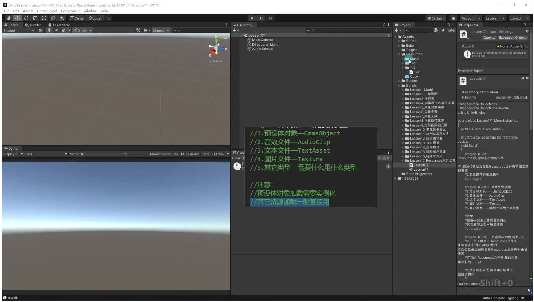
• •加载路径：必须准确填写Resources⽂件夹下的相对路径，路径错误将导致加载失败 •类型转换：使⽤Resources.Load加载出来的内容都是Object类型，需要as转换成对应类 型（如Texture） •示例代码： 1 Texture tex = Resources.Load("Tex/TestJPG") as Texture; •显示⽅法：可通过GUI.DrawTexture⽅法显示加载的图⽚资源 2）资源加载注意事项
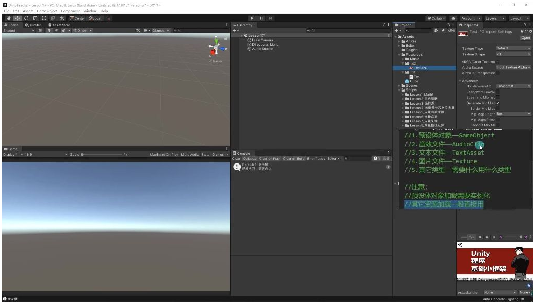
• •常⻅资源类型： o预设体对象(GameObject) o⾳效⽂件(AudioClip) o⽂本⽂件(TextAsset) o图⽚⽂件(Texture) o其他特定类型资源 •加载区别： o预设体：需要先加载再实例化 o其他资源：加载后可直接使⽤ •路径规范：路径中不要包含⽂件扩展名 3）同名资源处理
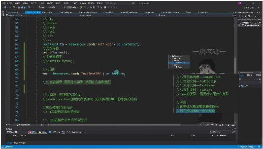
•

## Page 8
•问题：Resources.Load加载同名资源时⽆法准确识别 •解决⽅案： o使⽤指定类型加载API o加载指定名字的所有资源 •推荐做法：避免资源同名，保持资源命名唯⼀性 4）资源加载流程示例
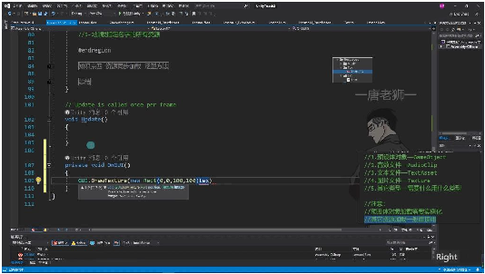
• •完整步骤： o声明Texture类型变量 o使⽤Resources.Load加载图⽚ o类型转换为Texture o在OnGUI中使⽤GUI.DrawTexture显示 •关键点： o资源必须放在Resources⽂件夹下 o加载和显示分为两个步骤 o需要处理可能的加载失败情况 ⼆、资源同名问题 26:25
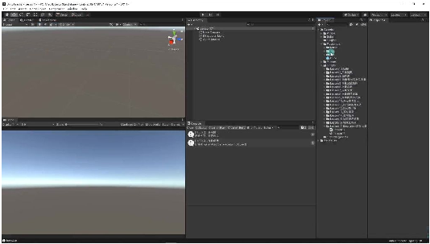
• •问题描述：在Unity中，当同⼀⽂件夹下存在同名但类型不同的资源⽂件时（如 TestJPG.png和TestJPG.txt），使⽤Resources.Load⽅法加载会出现⽆法准确识别的问 题。 •产⽣原因：Resources.Load默认只根据路径加载，⽆法⾃动区分同名⽂件的不同类型。 1. 加载指定类型的资源 27:30

## Page 9
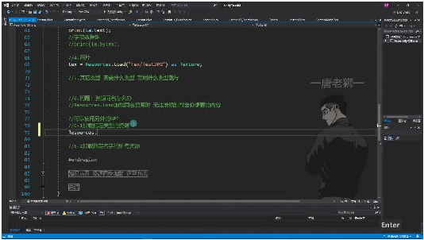
• •解决⽅法：使⽤Resources.Load的重载⽅法，传⼊类型参数 oAPI格式：Resources.Load(path, typeof(Type)) o示例代码： •实现原理：通过System.Type参数明确指定要加载的资源类型 •注意事项： o返回值仍是Object类型，需要as转换为⽬标类型 o路径必须正确，包含Resources⽂件夹下的相对路径 2. 加载指定名字的所有资源 30:13
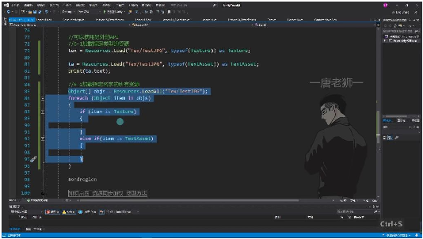
• •替代⽅案：使⽤Resources.LoadAll⽅法 oAPI特点：返回包含所有同名资源的Object数组 o示例代码： •适⽤场景：当需要同时处理同名资源的所有类型时 •对⽐选择： oLoad指定类型：适合明确知道所需资源类型的情况 oLoadAll：适合需要处理多种类型或不确定类型的情况 三、资源同步加载 31:24 1. 资源同步加载普通⽅法 32:13
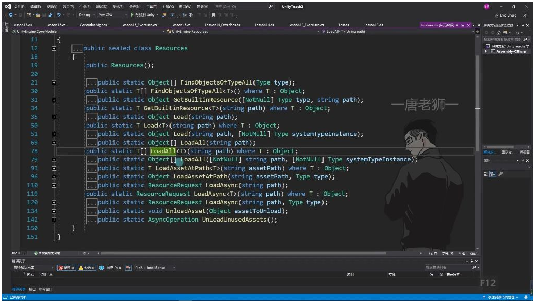
•

## Page 10
•核⼼原则：资源加载后必须使⽤，否则会造成内存浪费 •预设体加载： o第⼀步：通过Resources.Load("资源路径")加载配置数据到内存 o第⼆步：使⽤Instantiate()实例化到场景中 •⾳效资源加载： o直接加载后赋值给AudioSource组件，⽆需实例化 •⽂本资源⽀持格式： o.txt/.xml/.bytes/.json/.html/.csv等 o通过TextAsset类型获取⽂本内容或字节数组 •同名资源处理： o使⽤Load(path, type)指定类型精确加载 o或使⽤LoadAll(path)加载所有同名资源后遍历筛选
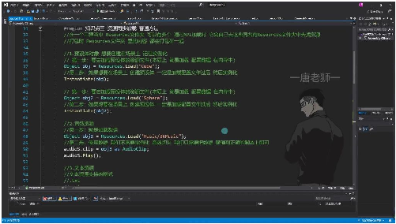
o •性能注意： oLoadAll会加载所有资源，遍历处理性能消耗⼤ o推荐优先使⽤指定类型加载⽅式 2. 资源同步加载泛型⽅法 31:40
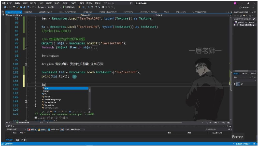
• •优势： o⽆需类型转换（省去as操作） o直接返回指定泛型类型的结果 o代码更简洁，类型安全 •使⽤⽅法： •推荐场景： o明确知道要加载的资源类型时 o需要简化代码，避免类型转换时

## Page 11
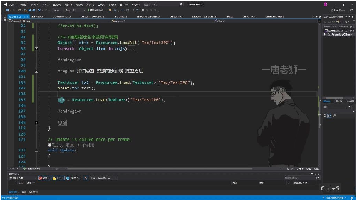
o •与传统⽅法对⽐： o传统：Texture tex = Resources.Load("路径") as Texture o泛型：Texture tex = Resources.Load<Texture>("路径") •核⼼改进： o泛型⽅法将类型检查和转换内置到API中 o减少代码量，提⾼可读性和安全性 四、Resources资源动态加载 34:54
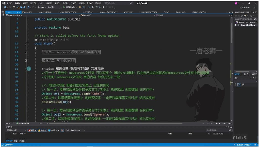
• 1. 作⽤与优势 •拓展性增强：通过代码动态加载资源，可根据配置⽂件灵活加载不同资源，避免硬编 码 •操作便捷性：相⽐拖拽关联⽅式更加⼀劳永逸，减少重复操作 •多⽂件夹⽀持：⼯程中可存在多个Resources⽂件夹，API会⾃动搜索同名⽂件夹 2. 常⽤资源类型
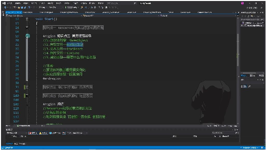
• •预设体对象：GameObject类型，需实例化后才能使⽤ •⾳效⽂件：AudioClip类型，需关联到AudioSource组件 •⽂本⽂件：TextAsset类型，可⽤于配置读取等场景 •图⽚⽂件：Texture类型，需赋值给材质或UI组件 •其他类型：根据具体需求选择对应资源类型

## Page 12
3. 同步加载⽅法 1）普通加载⽅法 1 // 预设体加载示例 2 Object obj = Resources.Load("cube"); // 加载资源配置 3 Instantiate(obj); // 必须实例化才能使⽤ 4 5 // 其他资源加载示例 6 Object obj2 = Resources.Load("Sphere"); •加载本质：将资源配置数据加载到内存中 •使⽤要点：预设体必须实例化，其他资源需正确赋值使⽤ 2）泛型加载⽅法 •提供类型安全的加载⽅式，避免类型转换 •语法更简洁，推荐使⽤ 4. 注意事项 •资源必须使⽤：加载后必须有实际使⽤场景，不能只加载不使⽤ •预设体特殊处理：GameObject类型必须实例化才能显示在场景中 •⾳效关联：AudioClip需要关联到AudioSource组件才能播放 •格式规范：需严格遵循资源路径和命名规范 5. 练习题
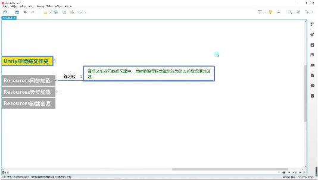
• •改造要求：将之前四元数练习中的散弹发射逻辑改为动态加载资源⽅式 •练习重点：掌握Resources.Load和Instantiate的配合使⽤ 五、知识⼩结 知识点核⼼内容考试重点/易混难度系数 淆点 Resources1. 通过代码动态加载Resources⽂件夹下易混淆点：⭐⭐ 资源动态指定路径的资源Resources⽂件 加载的作2. 避免繁琐的拖拽操作（如预设体、⾳效夹可多级嵌 ⽤等关联）套，且⼯程中 允许多个同名 ⽂件夹 常⽤资源1. 预设体→GameObject重点：预设体⭐⭐⭐ 类型2. ⾳效→AudioClip需实例化，其 3. ⽂本→TextAsset（⽀持TXT/XML/JSON他资源直接赋 等）值使⽤ 4. 图⽚→Texture 资源同步1. Resources.Load(path)加载任意资源易错点：路径⭐⭐⭐ 加载普通（返回Object）需从Resources⭐ ⽅法

## Page 13
2. Resources.Load(path, typeof(T))指定类下级开始，且 型加载区分⼤⼩写 3. Resources.LoadAll(path)加载同名所有 资源 资源同步Resources.Load<T>(path)：直接返回泛型重点：推荐使⭐⭐ 加载泛型类型，⽆需强制转换⽤泛型⽅法， ⽅法（如避免类型转换 Resources.Load<Texture>("Tex/test.jpg")⻛险 ） 同名资源1. 通过类型参数区分（如对⽐维度：性⭐⭐⭐ 处理typeof(Texture)）能（泛型⽅法 2. 使⽤LoadAll遍历判断类型更优） vs 灵活 性（LoadAll可 批量处理） 特殊规则1. Resources⽂件夹可存在于⼯程任意位注意：路径错⭐⭐ 置误会导致加载 2. 打包时⾃动整合所有Resources内容失败（返回 null）
