# Resources资源异步加载

> 来源：Resources资源异步加载.pdf

---

## Page 1
以下为AI⽣成的图⽂笔记的内容 ⼀、资源异步加载 00:08 1. 异步加载是什么 00:29
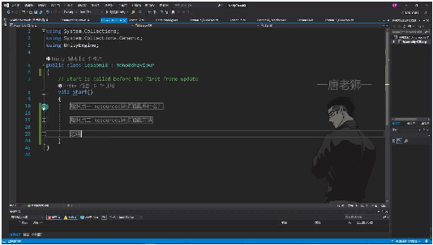
• 1）同步加载的问题 •卡顿原因：从硬盘读取数据到内存需要计算，资源越⼤耗时越⻓，导致掉帧卡顿。例 如加载30MB资源时，耗时可能超过单帧时间（60帧游戏每帧约16.66ms） •表现现象：同步加载会阻塞主线程，必须完全加载完成后才能继续执⾏后续逻辑，导 致帧率下降（如从60帧降⾄30帧） 2）异步加载原理
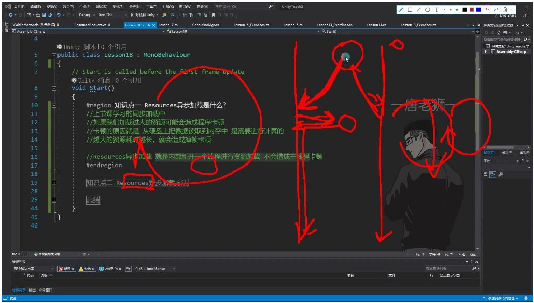
• •多线程机制：内部新开独⽴线程专⻔加载资源，主线程继续执⾏其他逻辑 •数据交互：通过公共内存区域传递加载完成的资源，避免多线程直接访问Unity主线程 对象 •优缺点对⽐： o优点：彻底解决主线程卡顿问题 o缺点：不能⽴即使⽤资源，必须等待加载完成 3）实现特点 •延迟使⽤：⾄少需要等待⼀帧后才能获取加载完成的资源 •线程安全：虽然Unity限制多线程直接操作引擎对象，但通过中间存储区实现安全交互 •适⽤场景：特别适合加载⼤型资源（如场景、⾼清贴图、视频等） 2. 异步加载⽅法 05:31 1）通过异步加载中的完成事件监听使⽤资源 06:07 •知识点⼀：Resources异步加载是什么？ 06:17

## Page 2
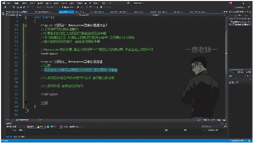
o o同步加载问题：上节课学习的同步加载中，如果加载过⼤的资源可能会造成程序 卡顿。卡顿的原因是从硬盘读取数据到内存需要进⾏计算，资源越⼤耗时越⻓， 会造成掉帧卡顿。 o异步加载优势：Resources异步加载是内部新开⼀个线程进⾏资源加载，不会造成 主线程卡顿。主线程继续执⾏其他逻辑，资源加载完成后通过回调通知主线程。 •知识点⼆：Resources异步加载⽅法 06:27
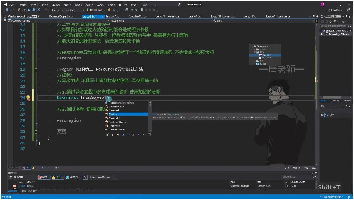
o o加载特性： 异步加载不能⽴即得到资源，⾄少需要等待⼀帧 有两种使⽤⽅法：完成事件监听和协程⽅式 oAPI说明： 使⽤Resources.LoadAsync<T>⽅法进⾏异步加载 该⽅法有泛型和⾮泛型两种重载，推荐使⽤泛型⽅法避免同名资源冲突 •例题1：通过异步加载中的完成事件监听使⽤资源 07:01
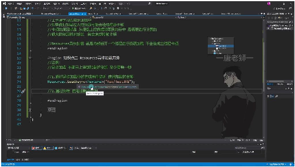
o o实现步骤： 调⽤Resources.LoadAsync<Texture>("Tex/TestJPG")开始异步加载 获取返回的ResourceRequest对象 通过completed事件监听加载完成 在回调函数中处理加载完成的资源 o关键代码： 1 ResourceRequest rq = Resources.LoadAsync<Texture>("Tex/TestJPG"); 2 rq.completed += LoadOver;

## Page 3
3 4 private void LoadOver(AsyncOperation rq) { 5 tex = (rq as ResourceRequest).asset as Texture; 6 print("加载结束"); 7 } •注意事项： o不能直接在加载语句后⽴即使⽤资源，必须等待加载完成 o回调函数的参数类型必须匹配Action<AsyncOperation>委托 o需要通过类型转换获取具体资源类型
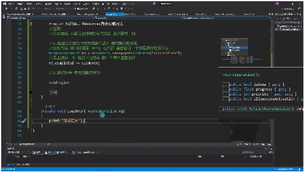
o •内部机制： oUnity内部会创建新线程进⾏资源加载 o主线程继续执⾏其他逻辑 o加载完成后⾃动调⽤注册的回调函数 o通过ResourceRequest.asset获取加载完成的资源 •常⻅错误： o错误：直接在加载语句后使⽤rq.asset o原因：资源尚未加载完成，此时asset为null o正确做法：必须在回调函数中使⽤加载完成的资源
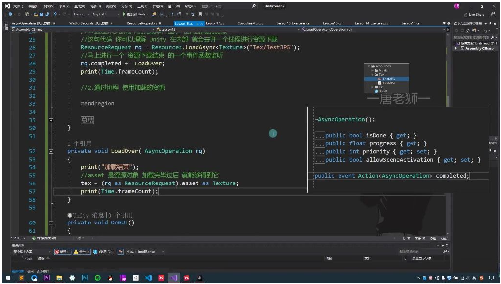
o •时序验证： o在开始加载时打印当前帧数：print(Time.frameCount) o在回调函数中再次打印帧数 o两次数值⾄少相差1，证明异步加载⾄少需要等待⼀帧 2）通过协程使⽤资源 16:48 •协程与资源加载 16:51

## Page 4
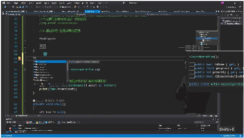
o o协程函数要求：必须声明为迭代器接⼝返回类型，函数名可⾃定义（如示例中的 Load函数） o异步加载原理：Resources.LoadAsync⽅法内部会新开线程进⾏资源加载，避免主 线程卡顿 •协程的组成与原理 17:11
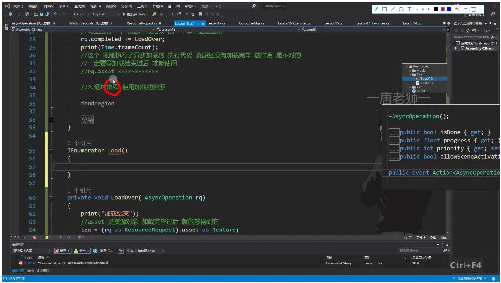
o o两⼤组成部分： 迭代器函数：通过yield return实现分步执⾏ 携程协调器：Unity内置在MonoBehaviour中的调度系统 o执⾏特点：遇到yield return会暂停执⾏，协调器根据返回值决定后续执⾏时机 •协程与Unity携程协调器 17:53
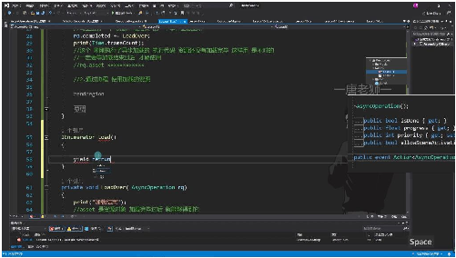
o o返回值类型： yield return null：下⼀帧继续执⾏ yield return new WaitForSeconds(2f)：等待2秒后继续 o分段执⾏：每个yield return将代码逻辑分成多个部分依次执⾏ •异步加载资源的⽅法 19:38

## Page 5
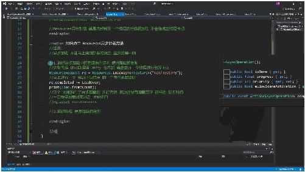
o o核⼼⽅法：ResourceRequest rq = Resources.LoadAsync<Texture>("Tex/TestJPG") o注意事项： 不能⽴即获取资源，⾄少需要等待⼀帧 资源加载进度通过rq.progress获取（0-1范围） •协程中判断资源加载完毕 20:41
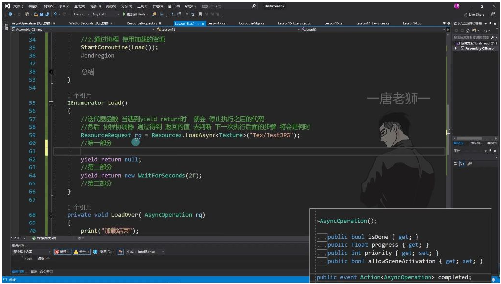
o o⾃动判断：直接yield return rq时Unity会⾃动检测加载完成状态 o⼿动检测： o基类关系：AsyncOperation和WaitForSeconds都继承⾃YieldInstruction •协程与事件监听的对⽐ 27:21
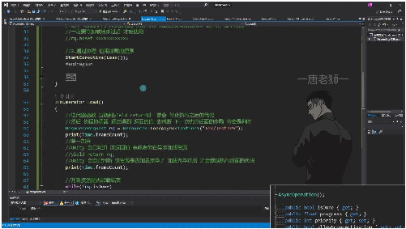
o o事件监听⽅式： 优点：写法简单 缺点：只能在加载完成后处理，⽆法中途⼲预 o协程⽅式： 优点：可处理复杂逻辑（如多资源并⾏加载、进度更新） 缺点：代码结构稍复杂 •协程异步加载的总结 27:36

## Page 6
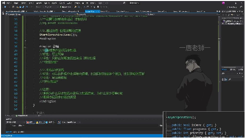
o o关键理解： 异步加载为什么不能⽴即完成（⾄少需要⼀帧） 协程异步加载的内部原理（Unity⾃动检测机制） o应⽤场景： 简单加载使⽤事件监听 复杂逻辑使⽤协程⽅式 ⼆、知识⼩结 知识点核⼼内容考试重点/易难度系数 混淆点 Resources异通过新开线程加载资源，避同步加载与⭐⭐⭐ 步加载的概免主线程卡顿，但资源需加异步加载的 念载完成后才能使⽤。本质区别 （主线程阻 塞 vs 后台线 程加载）。 异步加载不 能⽴即使⽤ 资源，需等 待完成。 异步加载的使⽤Resources.LoadAsync错误⽤法：⭐⭐ 实现⽅法并监听completed事件，在直接在同帧 （事件监回调函数中处理加载完成的访问asset 听）资源。（资源未加 载完成）。 正确逻辑： 通过事件回 调确保资源 就绪。 异步加载的在协程中返回协程分阶段⭐⭐⭐⭐ 实现⽅法ResourceRequest对象，执⾏：yield （协程）Unity⾃动判断加载完成状return控制 态；可结合isDone和加载等待。 progress实现进度监控。多资源并⾏ 处理优势： 协程更适合 复杂逻辑 （如同时加

## Page 7
载多个资源 并拼接）。 同步 vs 异步同步加载导致主线程卡顿性能影响：⭐⭐⭐ 加载对⽐（⼤资源耗时＞16.6ms会掉同步加载的 帧），异步加载通过线程分帧时间计 离解决卡顿。算。 异步缺点： 资源延迟可 ⽤性。 协程与事件事件监听：简单单资源加设计选择：⭐⭐⭐ 监听的适⽤载。线性任务 vs 场景协程：多资源协作、进度条并⾏任务需 更新等复杂逻辑。求。
