# 特殊文件夹

> 来源：特殊文件夹.pdf

---

## Page 1
以下为AI⽣成的图⽂笔记的内容 ⼀、特殊⽂件夹 00:04 1. ⼯程路径获取 00:50
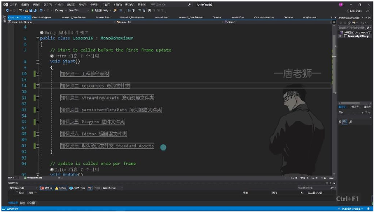
• 1）获取⽅法
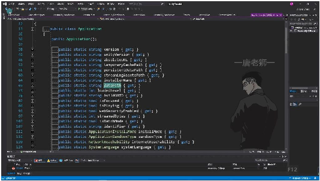
• •核⼼API: 使⽤Application.dataPath获取⼯程路径 o该属性是Application类的静态属性 o返回值为字符串类型，表示⼯程资源⽂件夹路径 o路径末尾不包含斜杠符号 2）使⽤示例
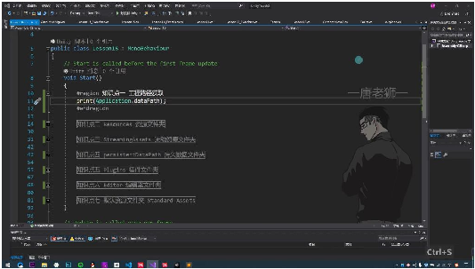
• •打印路径: o输出示例：C:/Users/MECHREVO/Desktop/Unity Teach2/Assets o实际指向Project窗⼝中的Assets⽂件夹 3）注意事项

## Page 2
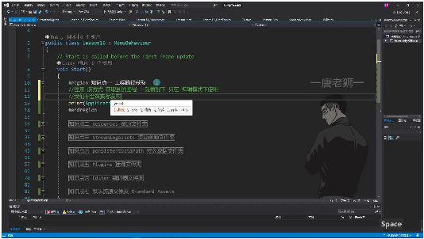
• •使⽤限制: o仅在编辑模式下有效 o发布后路径不可⽤（会被打包加密） o主要⽤于开发阶段的测试⽤途 •路径特点: o开发阶段对应实际资源⽂件夹 o发布后资源会被压缩到包内 o⽆法通过常规⽂件操作访问 2. Resources资源⽂件夹 03:04
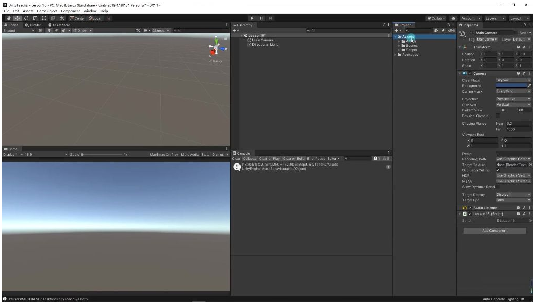
• •创建要求：必须⼿动在Assets⽂件夹下创建，⽂件夹名称必须严格拼写 为"Resources"（复数形式），否则⽆法通过API加载资源 •命名注意：拼写错误将导致后续⽆法通过API加载资源，创建时需特别注意复数形式和 ⼤⼩写 1）资源⽂件夹的创建 03:12
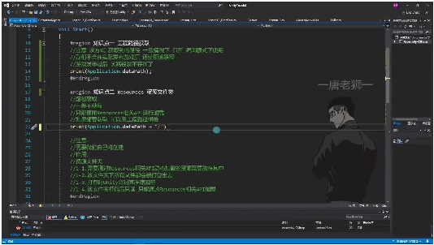
• •路径获取⽅式：可通过⼯程路径拼接Application.dataPath + "/Resources"获取 •路径使⽤限制：仅在编辑模式下有效，发布后该路径不存在，实际开发中不建议使⽤ 路径获取⽅式 2）资源⽂件夹的路径获取 03:53

## Page 3
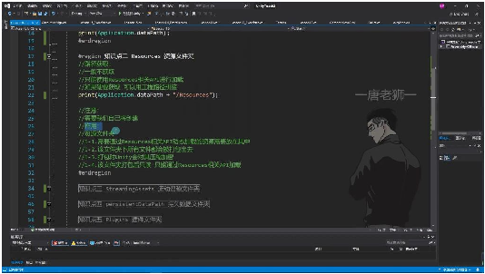
• •加载限制：只能使⽤Resources.Load等专⽤API进⾏资源加载 •路径拼接示例：print(Application.dataPath + "/Resources")可打印完整路径（仅⽤于调 试） 3）资源⽂件夹的打包与加密 05:37 •打包特性： o所有⽂件都会被打包发布 oUnity会进⾏压缩加密处理 o打包后变为只读状态 •使⽤建议：不要存放所有资源，只放置需要动态加载的关键资源，避免包体过⼤ 4）资源⽂件夹的加载⽅式 06:05
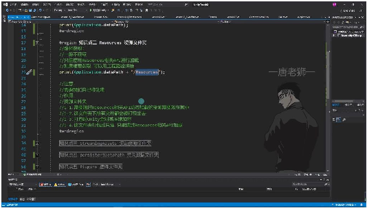
• •核⼼功能：专⻔⽤于存放需要通过Resources API动态加载的资源 •最佳实践： o建议新建专⻔的美术资源⽂件夹进⾏分类管理 o避免将⾮必要资源放⼊其中导致包体膨胀 o实际开发中主要使⽤Resources.Load等API进⾏资源加载⽽⾮路径访问 3. StreamingAssets流动资源⽂件夹 07:00
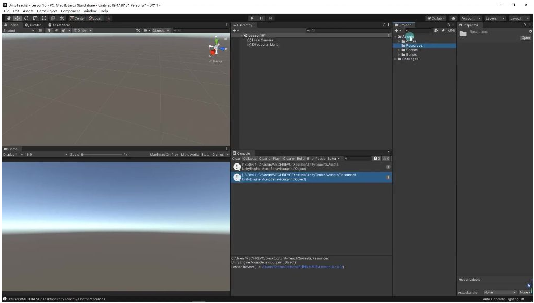
• •⼿动创建：需要⼿动在Assets⽬录下创建名为"StreamingAssets"的⽂件夹 •命名规范：必须严格使⽤"StreamingAssets"作为⽂件夹名称，区分⼤⼩写

## Page 4
1）StreamingAssets路径获取 07:23
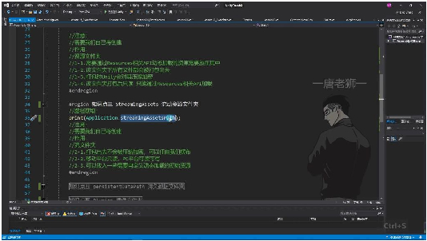
• •正确⽅法：使⽤Application.streamingAssetsPath获取路径 •错误示范：不能使⽤Application.dataPath + "/StreamingAssets"拼接路径 •平台差异：在不同平台下打包后路径会变化，拼接⽅式会导致路径错误 •打印测试：运⾏时打印结果为Assets/StreamingAssets 2）StreamingAssets与Resources的区别 08:46
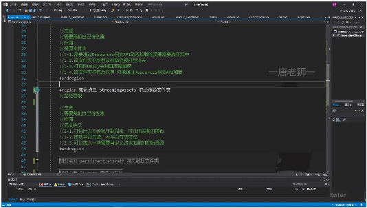
• •压缩加密： oResources：打包时会被Unity压缩加密 oStreamingAssets：保持原始状态不压缩加密 •加载⽅式： oResources：必须使⽤Resources API加载 oStreamingAssets：可使⽤C#原⽣⽂件操作API加载 •可⻅性： oResources：所有内容强制打包 oStreamingAssets：内容保持原始⽂件形式 3）StreamingAssets⽂件夹的读写权限 10:28
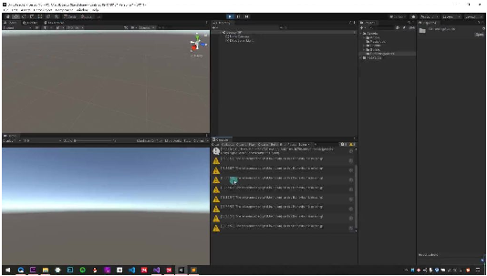
• •移动平台：iOS/Android平台下为只读 •PC平台：Windows/Mac/Linux平台可读可写

## Page 5
•编辑模式：在Unity编辑器内显示为可读写 •重要限制：打包后Application.dataPath路径将失效 4）StreamingAssets⽂件夹的⽤途 10:47
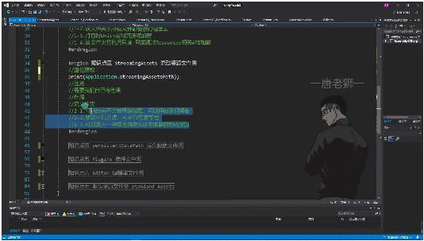
• •初始资源：存放需要⾃定义加载的初始资源 •配置⽂件：适合放置XML/JSON等配置⽂件 •热更新准备：为资源热更新提供基础⽀持 •特殊格式：存放Unity不直接⽀持的特定格式⽂件 •开发建议：适合存放不需要Unity处理的原始资源⽂件 4. persistentDataPath持久数据⽂件夹 11:24
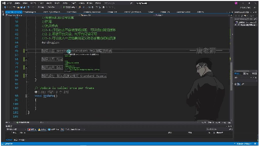
• 1）⽂件夹特性 11:26 •⾃动创建：不需要⼿动创建该⽂件夹，Unity会⾃动⽣成 •平台差异性：在不同平台下路径不同，⽆法在Unity编辑器中直接查看 •存储位置：存储在设备本地（如PC的C盘⽤户⽬录或⼿机存储中），与⽤户名相关 2）⽂件夹获取⽅式 11:52
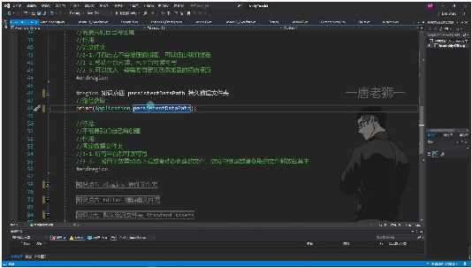
• •代码获取：通过Application.persistentDataPath获取路径 •打印示例：print(Application.persistentDataPath); 3）⽂件夹路径差异 12:01 •PC平台示例：C:\Users\[⽤户名]\AppData\LocalLow\DefaultCompany\UnityTeach2

## Page 6
•移动平台：路径会随设备不同⽽变化 •不可⻅性：路径不在项⽬Assets⽂件夹下，⽽是存储在设备本地 4）⽂件夹作⽤ 12:32 •主要⽤途：存储持久化数据 •具体功能： o保存玩家游戏数据 o热更新资源存储 o动态下载内容存储 5）⽂件夹读写权限 12:52 •全平台⽀持：所有平台都可读可写 •与StreamingAssets对⽐：StreamingAssets是只读的，⽽persistentDataPath可读写 6）⽂件夹应⽤场景 13:04 •动态⽂件存储：适合放置动态下载或动态创建的⽂件 •游戏数据存储：游戏中创建或获取的⽂件都应放在其中 •典型⽤例： o玩家存档数据 o下载的游戏资源 o运⾏时⽣成的⽂件 7）与其他⽂件夹对⽐ 13:54
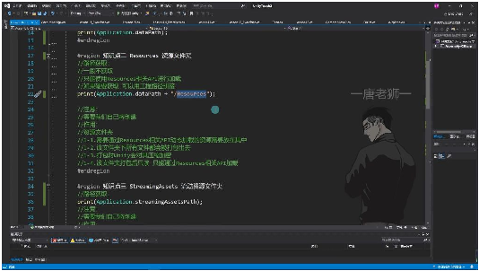
• •与Resources对⽐： oResources只读且加密，persistentDataPath可读写 oResources需要通过特定API加载，persistentDataPath可直接操作 •与StreamingAssets对⽐： oStreamingAssets只读，persistentDataPath可读写 oStreamingAssets移动平台只读，PC平台可读可写 opersistentDataPath在所有平台都可读写 5. Plugins插件⽂件夹 14:41
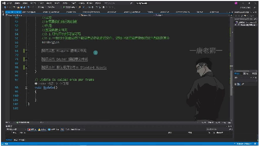
• •创建⽅式：需要⼿动在Assets⽂件夹下创建，路径为Assets/Plugins

## Page 7
•使⽤频率：在开发初期和基础学习阶段很少会⽤到这个⽂件夹 •主要作⽤：存放不同平台的插件相关⽂件 •典型应⽤： oiOS和Android平台的特定功能插件 o第三⽅SDK集成⽂件 o原⽣平台开发的功能包
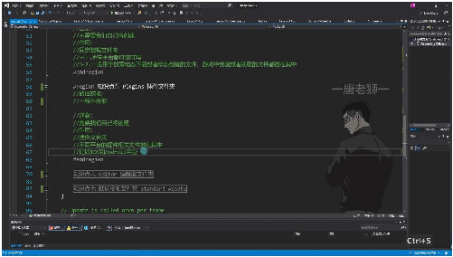
o •平台适配： o⽤于存放针对不同平台的特定实现 o例如iOS的定位功能、Android的⽀付SDK等 •开发流程： o原⽣平台开发功能包 o以插件形式集成到Unity中 o通过C#代码调⽤插件功能 •实际应⽤场景： o企业项⽬中常⻅，⽤于集成第三⽅服务 o需要调⽤平台特有功能时使⽤ o例如：定位服务、⽀付系统、社交分享等
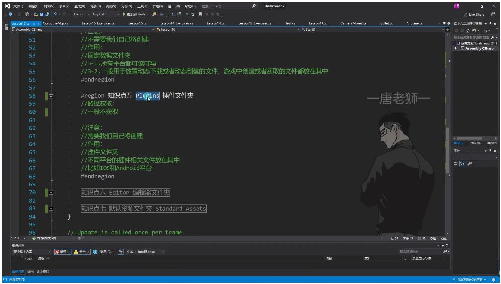
o •学习建议： o现阶段只需了解其基本概念 o实际应⽤会在SDK接⼊专题中详细讲解 •特殊说明： o⽂件夹需要⼿动创建 o⼀般不直接获取或操作该⽂件夹路径 o主要⽤于存放跨平台开发的插件⽂件 6. Editor编辑器⽂件夹 16:30

## Page 8
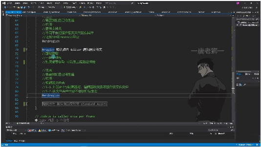
• •创建⽅式：需要⼿动在Assets⽂件夹下创建，命名为"Editor" •路径获取： o⼀般不主动获取路径 o特殊需求时可使⽤⼯程路径拼接：print(Application.dataPath + "/Editor") •核⼼作⽤： o存放Unity编辑器开发相关的脚本⽂件 o典型应⽤场景：开发⾃定义Inspector窗⼝、编辑器菜单扩展等 •打包特性： o该⽂件夹内容不会被打包到最终产品中 o仅⽤于编辑器环境开发 •注意事项： o必须⼿动创建，Unity不会⾃动⽣成 o编辑器功能代码必须放在此⽂件夹才能正常⼯作 7. 默认资源⽂件夹 18:11
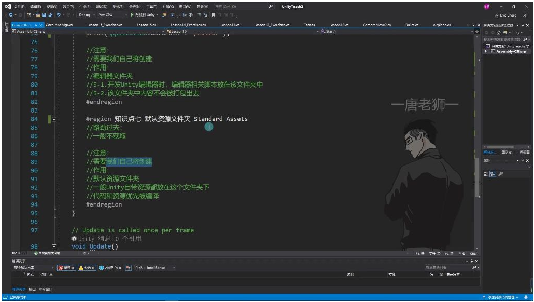
• •创建⽅式：需要⼿动创建，命名为"Standard Assets" •典型内容： oUnity官⽅提供的默认资源 o从Asset Store下载的标准资源包 •编译特性： o该⽂件夹下的代码和资源会优先编译 o资源加载具有更⾼优先级 •使⽤现状： o商业项⽬中较少使⽤ o主要⽤于学习或快速原型开发 •注意事项： o与Resources⽂件夹不同，采⽤不同的加载机制 o官⽅资源导⼊时会⾃动创建此⽂件夹 8. 内容总结 19:25

## Page 9
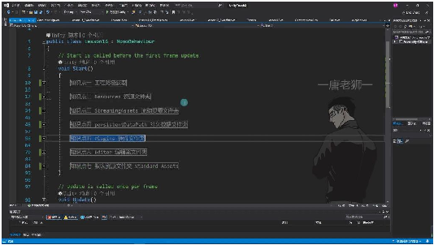
• •核⼼知识点： oResources：动态加载资源（只读） oStreamingAssets：存放默认资源（只读） oPersistentDataPath：可读写持久化数据存储 •辅助知识点： oPlugins：跨平台插件存放 oEditor：编辑器扩展开发 oStandardAssets：Unity默认资源 •重点区分： o只读⽂件夹：Resources、StreamingAssets o可读写⽂件夹：PersistentDataPath o开发专⽤⽂件夹：Editor、Plugins •记忆要点： o必须⼿动创建的⽂件夹：Resources、Editor、StandardAssets o⾃动⽣成的路径：PersistentDataPath o打包排除的⽂件夹：Editor ⼆、知识⼩结 知识点核⼼内容考试重点/易混淆点难度系数 ⼯程路径获取通过 注意：发布后路径不可⽤，⭐⭐ Application.dataPa仅⽤于开发测试。 th 获取⼯程路径 （仅限编辑模式下 有效，发布后路径 失效）。 Resources资源⽂⼿动创建 易错点：⽂件夹名称必须为 ⭐⭐⭐ 件夹Resources ⽂件Resources（复数形式）。 夹，⽤于动态加载重点：仅存放需动态加载的 资源（需通过 资源，避免包体过⼤。 Resources API 加 载）。 - 打包时加密压 缩，只读。 - 所有⽂件默认打 包，需谨慎放置资 源。 StreamingAssets流⼿动创建 注意：路径需通过 ⭐⭐⭐ 动资源⽂件夹StreamingAssets Application.streamingAssetsP

## Page 10
⽂件夹，存放初始ath 获取，不可拼接 资源（如配置⽂dataPath。 件）。 - 打包后不加密， 可通过⽂件IO读 取。 - 移动端只读，PC 端可读写。 PersistentDataPath⾃动⽣成路径（⽆重点：唯⼀可写⼊的⽂件⭐⭐⭐ 持久数据⽂件夹需⼿动创建），⽤夹，适⽤于动态数据存储。⭐ 于存储运⾏时数据 （如玩家存档、热 更新⽂件）。 - 全平台可读写。 Plugins插件⽂件夹⼿动创建 Plugins适⽤场景：SDK接⼊或跨平台⭐⭐ ⽂件夹，存放平台功能扩展。 相关插件（如 iOS/Android原⽣ 库）。 Editor编辑器⽂件⼿动创建 Editor ⽂⽤途：Unity编辑器功能开发⭐⭐ 夹件夹，存放编辑器（如⾃定义⼯具窗⼝）。 拓展脚本。 - 不打包到发布版 本。 StandardAssets默Unity官⽅资源包注意：资源优先编译，商业⭐ 认资源⽂件夹默认存放路径（现项⽬罕⻅。 较少使⽤）。
