# 协同程序1

> 来源：协同程序1.pdf

---

## Page 1
以下为AI⽣成的图⽂笔记的内容 ⼀、协同程序 00:04 1. 知识点⼀ Unity是否⽀持多线程 00:47
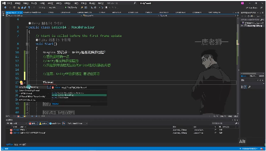
• •⽀持情况：Unity是⽀持多线程的，但新开的线程⽆法访问Unity相关对象的内容 •注意事项：Unity中的多线程必须记住关闭，否则会造成资源泄漏 •实现⽅法： o使⽤C#的Thread类，需引⽤System.Threading命名空间 o线程应作为成员变量声明，便于后续管理 o线程构造函数需要传⼊委托函数作为参数 o通过Start()⽅法启动线程 2. 知识点⼆ 协同程序是什么 01:04
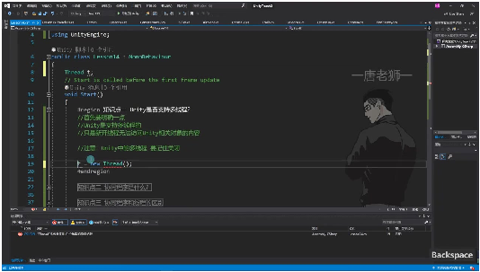
• •定义：协同程序简称协程，是⼀种"假"的多线程 •本质：并⾮真正的多线程，⽽是在主线程上分时执⾏的逻辑 •主要作⽤： o将代码分时执⾏，避免主线程卡顿 o把耗时逻辑分步执⾏，提⾼程序响应性 •使⽤场景： o异步加载⽂件 o异步下载⽂件 o场景异步加载 o批量创建对象时防⽌卡顿 3. 知识点三 协同程序和线程的区别 01:56

## Page 2
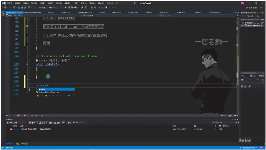
• •线程特性： o独⽴管道，与主线程并⾏执⾏ o可以访问系统资源但⽆法直接操作Unity对象 •协程特性： o在主线程上运⾏，通过分时复⽤实现"伪并发" o可以直接访问和修改Unity对象 •执⾏⽅式： o线程是真正的并⾏执⾏ o协程是顺序执⾏但通过yield实现逻辑上的分时 4. 知识点四 协程的使⽤ 02:27
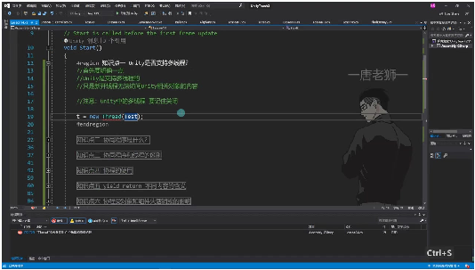
• •声明⽅式： o返回类型必须为IEnumerator o使⽤yield return控制执⾏流程 •启动⽅法： o通过StartCoroutine()⽅法启动 o可以传⼊⽅法名或直接传⼊IEnumerator •停⽌⽅法： oStopCoroutine()停⽌特定协程 oStopAllCoroutines()停⽌所有协程 •注意事项： o协程不是线程，不会⾃动并⾏执⾏ o需要合理使⽤yield控制执⾏时机 5. 知识点五 yield return 不同内容的含义 03:08

## Page 3
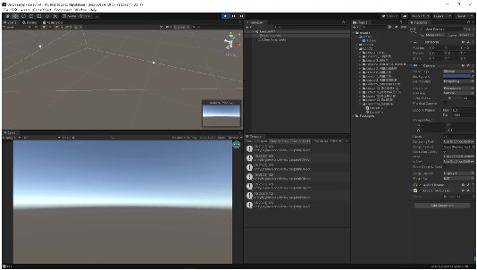
• •线程死循环实现计时：通过创建线程死循环并配合Thread.Sleep(1000)⽅法，可实现每 隔1秒执⾏⼀次循环内容 •打印效果展示：线程会持续打印"123"，在控制台中表现为不断叠加的⽇志输出（展开 后可⻅逐条记录） •编辑器线程特性： oUnity编辑器环境下线程会持续运⾏，即使停⽌游戏也不会⾃动终⽌ o本质原因是线程与编辑器进程共⽣，只要Unity软件未关闭或脚本未修改，线程就 会持续执⾏ •重要注意事项： o必须⼿动关闭Unity中创建的多线程，否则会造成资源泄漏 o典型实现⽅式：在OnDestroy等⽣命周期函数中调⽤线程终⽌⽅法
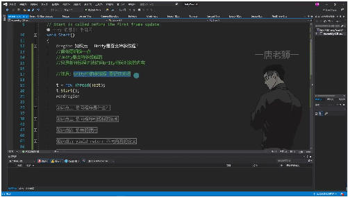
o •多线程⽀持确认： oUnity明确⽀持多线程编程 o限制条件：新开线程不能直接访问Unity相关对象和组件 •线程管理规范： o创建：通过new Thread()实例化并调⽤Start()启动 o销毁：必须实现线程资源的主动释放机制 o典型错误：未关闭的线程会导致编辑器持续占⽤系统资源 6. 知识点六 04:32 1）Unity多线程关闭⽅法

## Page 4
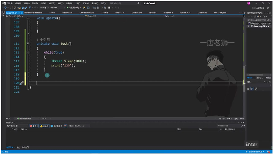
• •⽣命周期函数选择: 使⽤OnDestroy()⽣命周期函数来关闭线程，因为当对象移除或编辑 器关闭时，该函数会⾃动执⾏。 •线程关闭⽅法: o通过Thread对象的Abort()⽅法来终⽌线程执⾏ o关闭后需要将线程对象置为null，完全释放资源占⽤ •关键代码示例: 2）多线程使⽤注意事项
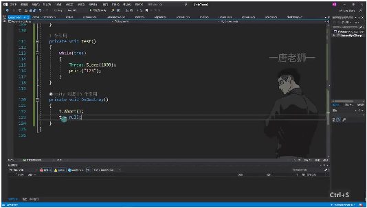
• •必要性: Unity中开启的多线程必须⼿动关闭，否则会持续占⽤系统资源 •资源占⽤: 未关闭的线程会与编辑器共⽣，即使停⽌运⾏也会继续执⾏ •验证⽅法: 通过打印⽇志可以观察到线程是否仍在运⾏（如示例中的"123"循环打印） 3）线程关闭验证
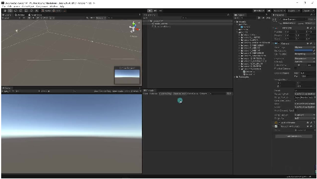
• •验证过程: o运⾏程序时线程会持续执⾏（如打印"123"） o停⽌运⾏后，由于OnDestroy()的执⾏，线程会被正确终⽌ •重要性: 这种验证⽅式可以确保线程管理机制的有效性 7. Unity多线程与协程 05:38 1）Unity多线程⽀持与限制 05:46

## Page 5
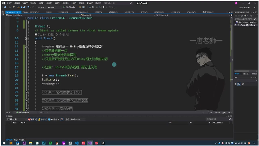
• •⽀持情况：Unity确实⽀持多线程，可以创建并运⾏新线程 •关键限制： o新线程⽆法访问Unity相关对象的内容（如Transform、GameObject等） o尝试访问会抛出"get_transform can only be called from the main thread"异常 •注意事项： o必须⼿动关闭创建的多线程（在OnDestroy中使⽤t.Abort()） oUnity⼤部分API都不能在⾮主线程中调⽤ 2）多线程数据交互⽅案 09:12
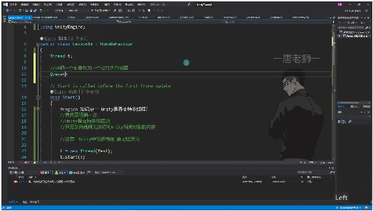
• •交互原理： o使⽤共享容器（如Queue）作为线程间数据交换的中间媒介 o⼦线程负责计算，主线程负责使⽤计算结果 •实现步骤： o声明公共队列：Queue<Vector3> queue = new Queue<Vector3>() o⼦线程计算并存⼊：queue.Enqueue(计算结果) o主线程检查并使⽤：if(queue.Count>0) transform.position = queue.Dequeue() •适⽤场景： o复杂算法计算（如A*寻路） o⽹络通信和下载 o批量对象创建 3）协程基本概念 17:11

## Page 6
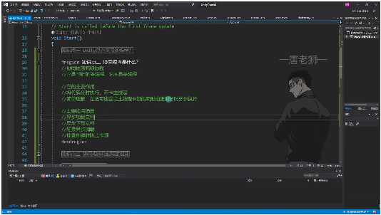
• •本质： o不是真正的多线程，⽽是在主线程上分时分步执⾏的迭代器 o通过yield return控制执⾏流程 •核⼼作⽤： o将耗时逻辑分步执⾏，避免主线程卡顿 •典型应⽤： o异步加载资源 o场景异步切换 o批量对象创建时的性能优化 4）协程与线程的区别 18:24
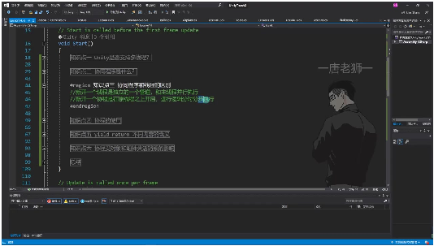
• •执⾏⽅式： o线程：独⽴管道，与主线程并⾏执⾏ o协程：在主线程上分时分步执⾏ •执⾏控制： o线程：执⾏过程不可控 o协程：可通过yield精确控制每⼀步的执⾏时机 •资源访问： o线程：不能直接访问Unity对象 o协程：可以⾃由访问所有Unity对象 •性能开销： o线程：创建和切换开销较⼤ o协程：开销极⼩，适合⾼频使⽤ 5）多线程使⽤建议

## Page 7
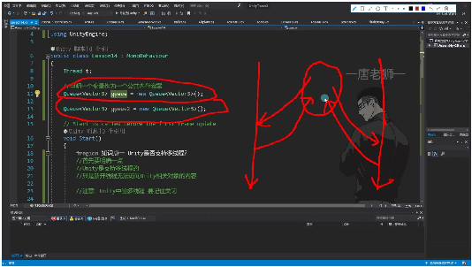
• •适⽤情况： o需要执⾏复杂计算且不涉及Unity API o需要⻓时间运⾏的后台任务（如⽹络通信） •注意事项： o必须通过共享容器与主线程交互数据 o避免在⼦线程中使⽤任何Unity引擎API o确保线程在对象销毁时正确关闭 •替代⽅案： o对于需要访问Unity对象的异步操作，优先考虑使⽤协程 o对于简单延时操作，使⽤Invoke⽅法更简便 ⼆、知识⼩结 知识点核⼼内容考试重点/易混淆难度系数 点 Unity多线程⽀持多线程但主线程与副线程数⭐⭐⭐⭐ ⽀持有限制：新线据交互⽅式（通过 程⽆法访问公共容器） Unity对象，主 要⽤于复杂算 法计算 协同程序本分时分步执⾏与线程的本质区别⭐⭐⭐ 质的迭代器：⾮（单线程内分步 vs 多线程，代码多线程并⾏） 分段执⾏控制 线程与携程线程：独⽴管携程的挂起机制与⭐⭐⭐⭐ 对⽐道并⾏执⾏执⾏条件控制 携程：主线程 内逻辑分⽚执 ⾏ 多线程应⽤算法计算/⽹副线程禁⽌调⽤⭐⭐⭐⭐ 场景络通信：A*寻Unity API的限制 路、⽹络消息 收发通过公共 队列交互数据 携程核⼼作防⽌主线程卡yield return不同返⭐⭐⭐ ⽤顿：异步加载回值的含义控制

## Page 8
/下载、批量 创建场景 线程⽣命周必须⼿动关线程休眠⭐⭐⭐⭐ 期管理闭：通过(Thread.Sleep)与主 OnDestroy终⽌线程Time.deltaTime 线程，避免编区别 辑器共⽣
