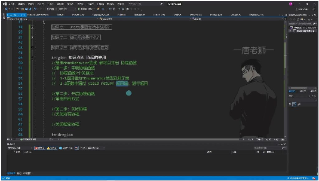
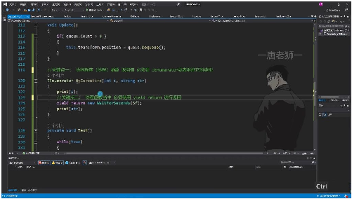
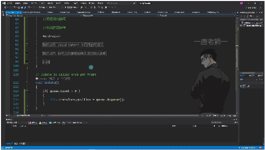
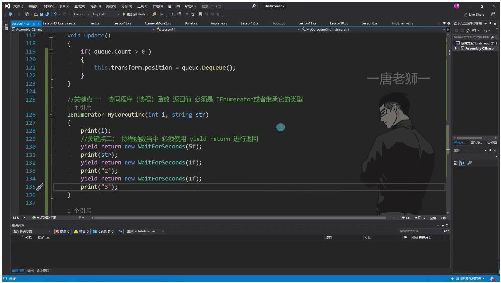
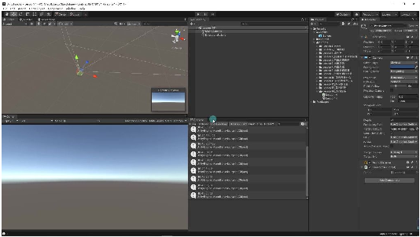
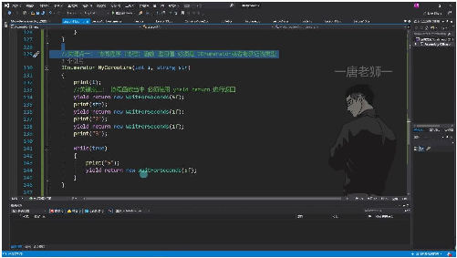
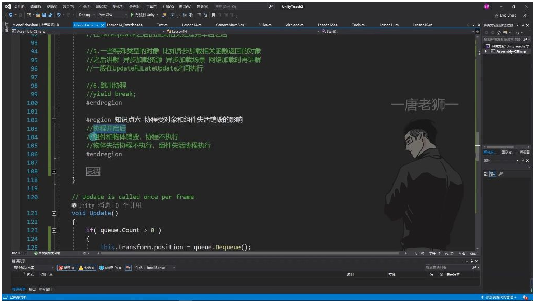
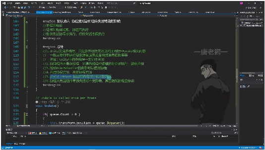
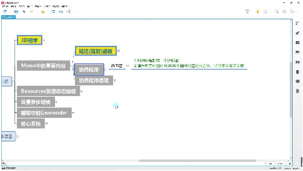

# 协同程序2

> 来源：协同程序2.pdf

---

## Page 1
以下为AI⽣成的图⽂笔记的内容 ⼀、协同程序 00:04 1. 协程的使⽤ 01:06

• •声明要求： o继承MonoBehavior的类都可以开启协程函数 o返回值必须是IEnumerator类型或其⼦类 o函数中必须通过yield return返回值进⾏返回

o •关键点⼀：协同程序函数返回值必须是IEnumerator或者继承它的类型 •关键点⼆：协程函数当中必须使⽤yield return进⾏返回 o示例：yield return new WaitForSeconds(5f);表示等待5秒 1）开启携程函数 05:29

• •开启⽅法： o不能直接调⽤协程函数，必须使⽤StartCoroutine o推荐⽅式：StartCoroutine(MyCoroutine(1, "123")) o替代⽅式：先获取IEnumerator对象再传⼊StartCoroutine

## Page 2

o •执⾏原理： o遇到yield return会将逻辑分成多部分执⾏ o每个yield return后的内容决定等待时间 o示例中分成4部分执⾏：打印i→等待5秒→打印str→等待1秒→打印"2"→等待1秒 →打印"3" 2）关闭携程函数 12:36

• •关闭所有协程：StopAllCoroutines() •关闭指定协程： o通过StartCoroutine返回的Coroutine对象关闭 o示例：StopCoroutine(c1) o不推荐使⽤字符串⽅式关闭，可能不准确

o •特殊⽤法： o协程内可以写死循环⽽不会卡死主线程 o示例：while(true){ yield return new WaitForSeconds(5f); } o每5秒执⾏⼀次循环体内容 2. 协程受对象和组件失活销毁的影响 25:06

## Page 3

• •执⾏条件: o组件和物体销毁时，协程⽴即停⽌执⾏ o物体失活时，协程⽴即停⽌执⾏ o仅组件失活时，协程仍会继续执⾏ •实验验证: o删除挂载协程的GameObject后，协程⽴即终⽌ o禁⽤GameObject时，协程输出⽴即中断 o仅禁⽤脚本组件时，协程仍按原计划每5秒输出⼀次 •对⽐延迟函数: o与Invoke等延迟函数表现⼀致，说明这是Unity事件系统的统⼀⾏为 3. 总结 27:52

• •多线程⽀持: o限制: 新线程不能访问Unity主线程内容 o⽤途: 适合复杂运算和⽹络通信 o注意: 必须⼿动关闭创建的线程 •协程本质: o⾮多线程，采⽤分时执⾏逻辑避免卡顿 o所有MonoBehaviour派⽣类均可使⽤ •控制⽅法: o开启：StartCoroutine() o关闭：StopCoroutine()/StopAllCoroutines() •yield返回值: o不同类型决定不同等待时机 o如WaitForSeconds实现定时，WaitForFixedUpdate等待物理帧 •执⾏稳定性: o仅组件单独失活不影响执⾏ o其他情况（物体销毁/失活）都会终⽌协程

## Page 4

o •实践建议: o使⽤协程实现计秒器功能 o通过协程优化⼤规模对象⽣成（如10万个⽴⽅体） o注意区分组件失活与物体失活的不同影响 ⼆、知识⼩结 知识点核⼼内容考试重点/难度系数 易混淆点 Unity⽀持多线程但新线程⽆法访问主线程Unity必须记住关⭐⭐⭐⭐ 多线程内容，主要⽤于复杂运算/⽹络消息接收闭线程 协同程在主线程内分时分步执⾏的函数，通过与线程的本⭐⭐⭐ 序概念yield return分段，避免卡顿主线程质区别：⾮ 并⾏执⾏ 携程声1. 返回值必须为IEnumerator接⼝错误示例：⭐⭐⭐⭐ 明规范2. 函数内必须包含yield return语句直接调⽤携 程函数⽆效 携程启- 开启：StartCoroutine()关键区别：⭐⭐⭐ 停控制- 关闭：字符串传参 StopCoroutine()/StopAllCoroutines()⽅式不推荐 使⽤ yield返1. null/数字：下⼀帧执⾏执⾏时机差⭐⭐⭐⭐ 回类型2. WaitForSeconds：延迟指定秒异：不同返⭐ 3. WaitForFixedUpdate：物理帧更新时回类型对应 执⾏不同事件阶 4. WaitForEndOfFrame：渲染完成后执⾏段 5. yield break：⽴即终⽌ ⽣命周- 物体销毁/失活：携程终⽌与Invoke⭐⭐⭐⭐ 期影响- 组件单独失活：携程继续执⾏延迟函数的 控制差异 死循环携程内可通过while(true)+yield实现定时优势：不阻⭐⭐⭐⭐ 应⽤循环逻辑塞主线程
