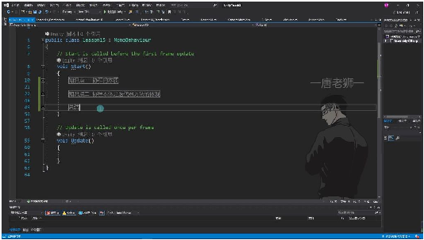
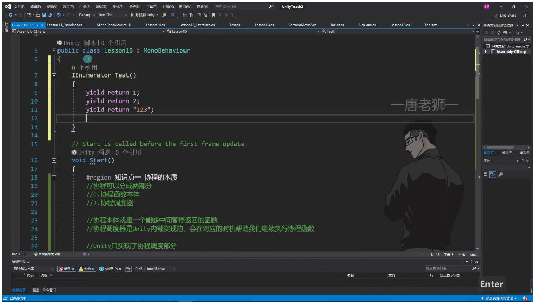
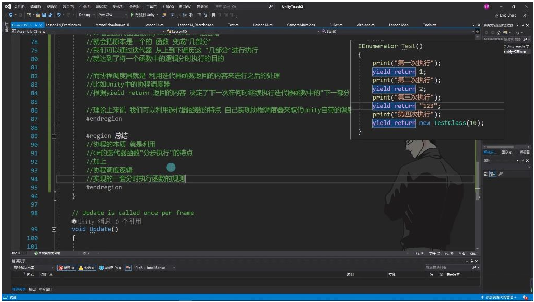

# 协同程序原理

> 来源：协同程序原理.pdf

---

## Page 1
以下为AI⽣成的图⽂笔记的内容 ⼀、协同程序原理 00:00 1. 协同程序 00:21 1）携程的本质 00:33

• •组成结构：协同程序可以分成两部分 o1.协程函数本体 o2.协程调度器 •函数本体特性：协程本体就是⼀个能够中间暂停返回的函数 •调度器功能：协程调度器是Unity内部实现的，会在对应的时机帮助我们继续执⾏协程 函数 •实现范围：Unity只实现了协程调度部分，协程的本体本质上就是⼀个C#的迭代器⽅法 2）携程本体是迭代器⽅法的体现 02:01

• •⼿动执⾏原理： o如果不通过开启协程⽅法执⾏协程，Unity的协程调度器不会管理协程函数 o但可以⾃⼰执⾏迭代器函数内容 •迭代器⼯作机制： oMoveNext()会执⾏函数中内容直到遇到yield return为⽌的逻辑 oCurrent属性可以得到yield return返回的内容 oMoveNext返回值代表是否到了结尾（迭代器函数是否执⾏完毕） •执⾏示例： •调度器原理：继承MonoBehavior后开启协程，相当于把协程函数（迭代器）放⼊Unity 的协程调度器中管理执⾏ 3）总结 15:19

## Page 2

• •核⼼机制： o利⽤C#的迭代器函数"分步执⾏"的特点 o加上协程调度逻辑 o实现⼀套分时执⾏函数的规则 •分步与分时： o迭代器函数实现"分布"概念 o协程调度器实现"分时"概念 •⾃定义可能性：理论上可以利⽤迭代器函数特点⾃⼰实现协程调度器来取代Unity⾃带 的调度器 ⼆、知识⼩结 知识点核⼼内容考试重点/易混淆点难度系数 协程的本协程由两部分组成：- 直接调⽤协程函数不⭐⭐⭐ 质1. 协程函数本体（可暂停并返会执⾏，需通过 回的迭代器⽅法）StartCoroutine触发 2. 协程调度器（Unity内部实- 调度器逻辑由Unity实 现，管理执⾏时机）现，开发者仅需关注迭 代器⽅法 协程与迭协程本质是C#迭代器⽅法：- ⼿动执⾏迭代器：通⭐⭐⭐⭐ 代器的关- 通过yield return分步执⾏过MoveNext()逐步触 系- IEnumerator.MoveNext()发逻辑 控制执⾏流程- 返回值类型：yield - Current获取yield return返return可返回任意对象 回值（如int、⾃定义类） Unity协程Unity根据yield return内容决- 调度器不可⻅：Unity⭐⭐⭐ 调度规则定后续执⾏时机：内部管理迭代器执⾏时 - 如yield return null等待下⼀机 帧- 关键⽅法： - ⾃定义类需Unity预定义规则StartCoroutine将迭代 处理器交给Unity管理 ⼿动模拟通过while循环+MoveNext()- 对⽐Unity调度器：⼿⭐⭐⭐⭐ 协程调度完整执⾏迭代器：动调度缺少时间控制逻 - MoveNext()返回bool标识辑 是否结束- 易错点：忽略 - Current获取分步返回值MoveNext()返回值导 致⽆限循环

## Page 3
协程的核实现函数逻辑的分时执⾏：- 应⽤场景：延迟执⭐⭐⭐ ⼼价值- 迭代器函数：分步执⾏（空⾏、异步任务、复杂状 间维度）态机 - 调度器：控制时机（时间维 度）
