# 延迟函数

> 来源：延迟函数.pdf

---

## Page 1
以下为AI⽣成的图⽂笔记的内容 ⼀、延迟函数 00:04 1. 什么是延迟函数 00:40
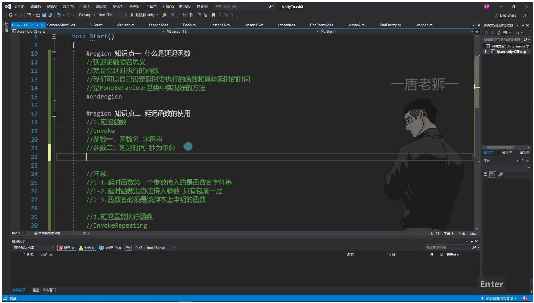
• •定义：延迟函数是MonoBehaviour基类提供的可以延时执⾏的函数 •特点： o可以⾃定义要执⾏的函数和延迟时间 o继承MonoBehaviour后即可使⽤ o通过反射机制根据函数名查找并执⾏对应⽅法 1）延迟函数的使⽤ 01:20 •延迟函数Invoke
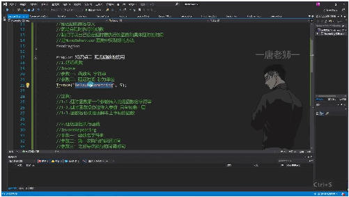
o o基本⽤法： Invoke("函数名", 延迟时间) 第⼀个参数为字符串形式的函数名 第⼆个参数为延迟秒数（如5表示5秒后执⾏） o例题:Invoke调⽤延迟执⾏函数 03:04
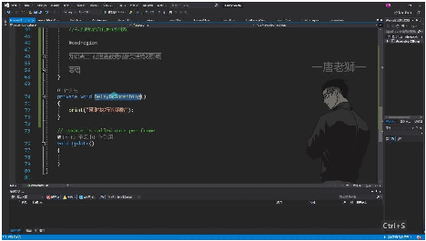
 实现步骤： •声明⼀个⽆参函数private void DelayDoSomething() •在Start中调⽤Invoke("DelayDoSomething", 5)

## Page 2
•5秒后会执⾏打印"延时执⾏的函数" 注意事项： •函数名准确性：必须完全匹配，否则会报错"⽆法调⽤⽅法" •参数限制：⽆法直接传递参数，需通过包裹层间接传参 •作⽤域限制：只能调⽤本脚本中声明的函数
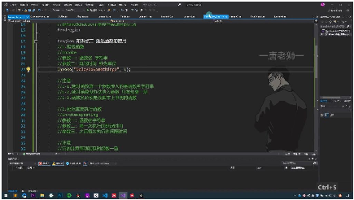
• 参数传递技巧： •延迟重复执⾏函数InvokeRepeating 09:33
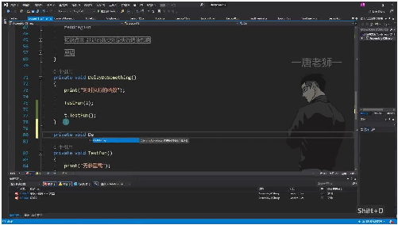
o o基本⽤法： InvokeRepeating("函数名", ⾸次延迟, 间隔时间) 示例：InvokeRepeating("DelayRe", 5, 1)表示5秒后⾸次执⾏，之后每1秒执⾏ ⼀次 o例题:InvokeRepeating使⽤ 09:55
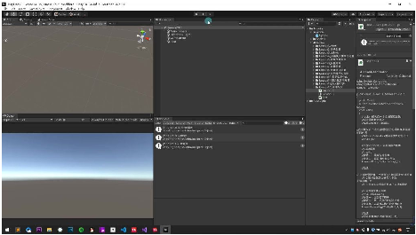
 实现步骤： •声明⽆参函数private void DelayRe() •调⽤InvokeRepeating("DelayRe", 5, 1) •运⾏后会先等待5秒，然后每隔1秒重复执⾏ 共享特性： •同样需要函数名准确 •同样⽆法直接传参 •同样只能调⽤本脚本函数 •取消⽅法：CancelInvoke("函数名")

## Page 3
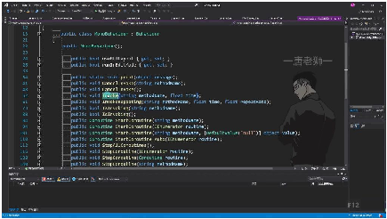
• 底层原理：这些⽅法都继承⾃MonoBehaviour基类，通过反射机制实现 2. 取消延迟函数 12:14 1）取消所有延迟函数 12:43
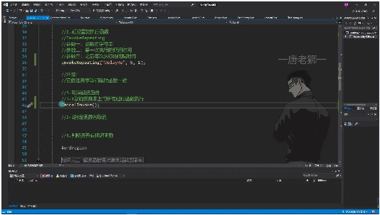
• •⽅法调⽤：使⽤CancelInvoke()可以取消当前脚本上所有正在执⾏的延迟函数 •执⾏效果：调⽤后会⽴即停⽌所有通过Invoke或InvokeRepeating设置的延迟函数 •使⽤场景：适⽤于需要完全停⽌所有延迟执⾏的情况，如游戏暂停或场景切换时 •注意事项：该⽅法不需要任何参数，会⽆差别取消所有延迟函数 2）指定函数名取消 13:33
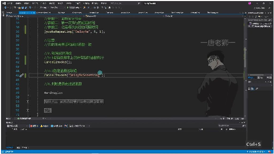
• •⽅法重载：CancelInvoke("函数名")可以取消指定名称的延迟函数 •参数要求：传⼊字符串形式的函数名，必须与延迟函数设置的名称完全⼀致 •执⾏特点：会取消该函数名的所有延迟调⽤，⽆论之前开启了多少次 •使⽤示例： •注意事项： o函数名必须是在当前脚本中声明的 o⽆法通过该⽅法取消其他脚本上的延迟函数 o取消操作是⽴即⽣效的 3）判断延迟函数 •判断⽅法：可以使⽤IsInvoking⽅法检查特定延迟函数是否正在执⾏ •两种形式： oIsInvoking()：检查脚本上是否有任何延迟函数在执⾏

## Page 4
oIsInvoking("函数名")：检查特定函数是否有延迟在执⾏ •返回值：返回布尔值，true表示有延迟函数正在执⾏或等待执⾏ 3. 延迟函数的使⽤ 1）基本延迟函数
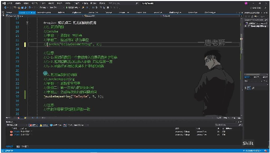
• •调⽤⽅式: 使⽤Invoke("函数名", 延迟时间)⽅法 •参数说明: o参数⼀：需要延迟执⾏的函数名字符串 o参数⼆：延迟时间（秒为单位） •注意事项: o函数名必须为字符串形式 o⽆法直接传⼊参数，需要通过包裹函数实现 o函数必须在该脚本中声明 2）重复延迟函数
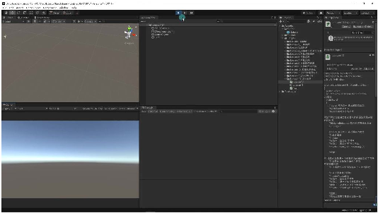
• •调⽤⽅式: 使⽤InvokeRepeating("函数名", ⾸次延迟时间, 间隔时间)⽅法 •参数说明: o参数⼀：需要重复执⾏的函数名字符串 o参数⼆：第⼀次执⾏前的延迟时间 o参数三：之后每次执⾏的间隔时间 •注意事项: 与基本延迟函数⼀致 3）取消延迟函数

## Page 5
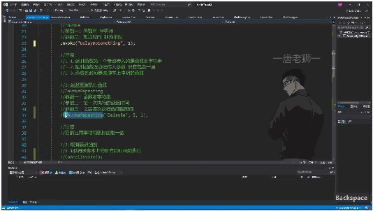
• •全部取消: 使⽤CancelInvoke()取消脚本上所有延迟函数 •指定取消: 使⽤CancelInvoke("函数名")取消特定函数的延迟执⾏ •安全特性: o取消不存在的延迟函数不会报错 o取消指定函数会同时取消该函数的所有延迟执⾏实例 4）判断延迟函数
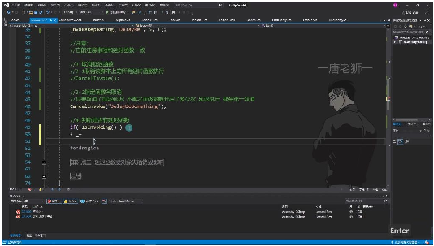
• •全局判断: 使⽤IsInvoking()判断脚本是否有任何延迟函数在执⾏ •特定判断: 使⽤IsInvoking("函数名")判断特定函数是否有延迟执⾏ •返回值: 布尔值，配合if语句使⽤ •实际应⽤: o判断功能使⽤频率较低 o取消操作本⾝具有安全性，⽆需预先判断 5）使⽤示例
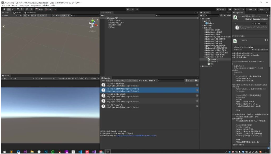
• •代码示例: 1 // 开启延迟 2 Invoke("DelayDoSomething", 1); 3 InvokeRepeating("DelayRe", 5, 1); 4 5 // 取消延迟

## Page 6
6 CancelInvoke(); 7 CancelInvoke("DelayDoSomething"); 8 9 // 判断延迟 10 if(IsInvoking()){ 11 print("存在延迟函数"); 12 } 13 if(IsInvoking("DelayDoSomething")){ 14 print("存在DelayDoSomething延迟"); 15 } 4. 延迟函数受对象失活销毁的影响 19:03 1）对象状态对延迟函数的影响
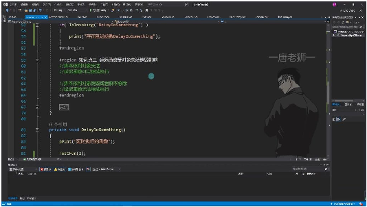
• •对象失活时: o脚本依附对象失活或脚本⾃⼰失活时，延迟函数可以继续执⾏不受影响 o举例：当游戏对象被设为inactive时，已启动的延迟函数仍会继续执⾏打印⽇志 •对象销毁时: o脚本依附对象销毁或脚本被移除时，延迟函数将⽆法继续执⾏ o举例：删除游戏对象或移除脚本组件后，延迟函数⽴即停⽌执⾏ 2）⽣命周期函数控制延迟函数
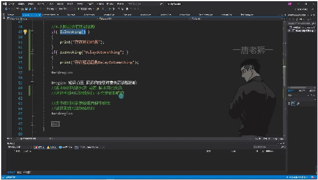
• •控制⽅法: o在OnEnable()中开启延迟函数：对象激活时⾃动启动延迟执⾏ o在OnDisable()中停⽌延迟函数：对象失活时⾃动取消延迟执⾏ •实现原理: o利⽤CancelInvoke()在⽣命周期函数中精确控制延迟函数的启停 o弥补了对象失活不会⾃动停⽌延迟函数的特性缺陷 5. 延迟函数总结 23:47

## Page 7
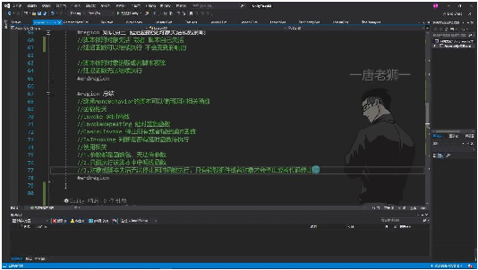
• •核⼼API: oInvoke：单次延迟执⾏ oInvokeRepeating：重复延迟执⾏ oCancelInvoke：停⽌延迟执⾏ oIsInvoking：检测延迟函数状态 •使⽤限制: o参数必须为函数名字符串，⽆法直接传参 o只能执⾏当前脚本中声明的函数 o需要通过包裹函数实现参数传递 •执⾏特性: o不受对象/脚本失活影响 o会被对象销毁/脚本移除终⽌ o可通过代码主动取消执⾏ ⼆、知识⼩结 知识点核⼼内容考试重点/易混淆点难度系数 延迟函数概通过MonoBehaviour函数名需为字符串且必⭐⭐ 念提供的Invoke⽅法，须存在，⽆法直接传参 指定函数延迟执⾏时 间 延迟函数使Invoke("函数名", 延迟参数传递需包裹⽆参函⭐⭐⭐ ⽤秒数)，需声明⽆参函数，仅能调⽤当前脚本 数内函数 重复延迟函InvokeRepeating("函⾸次执⾏后按间隔循环⭐⭐ 数数名", ⾸次延迟, 间隔调⽤，取消需显式调⽤ 时间)CancelInvoke 取消延迟函CancelInvoke()取消所取消后⽆报错，即使函⭐⭐ 数有，CancelInvoke("函数未开启 数名")取消指定 延迟函数状IsInvoking()检测是否失活对象不影响执⾏，⭐⭐ 态判断有延迟函数，但销毁对象或移除脚本 IsInvoking("函数名")会终⽌ 检测指定函数 对象状态影失活对象/脚本仍执需通过⭐⭐⭐⭐ 响⾏延迟函数，销毁对OnEnable/OnDisable⽣命 象或移除脚本则终⽌周期⼿动控制启停

## Page 8
封装调⽤外通过⽆参函数包裹其⽆法直接跨对象调⽤延⭐⭐⭐ 部函数他对象的带参⽅法迟函数
