# LineRenderer

> 来源：LineRenderer.pdf

---

## Page 1
以下为AI⽣成的图⽂笔记的内容 ⼀、unity基础画线功能 00:04 1. 知识点⼀、LineRenderer是什么 00:29
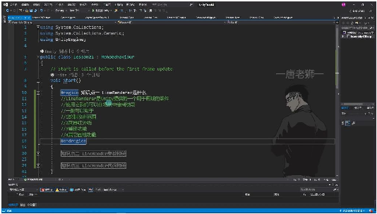
• •组件功能: Unity提供的专⻔⽤于画线的组件，可在场景中绘制线段 •主要⽤途: o绘制攻击范围 o武器红外线 o辅助功能 o其他画线需求（如圆形、⽅形或不规则线段） •本质理解: 通过设置多个点坐标，将这些点连接起来形成线段 2. 知识点⼆、LineRender参数相关 01:04 1）核⼼参数
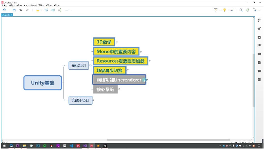
• •Loop: o作⽤：控制线段⾸尾是否⾃动相连 o效果：勾选后会将终点和起点⾃动连接形成闭合图形 •Positions: o作⽤：设置构成线段的各个点坐标 o特点：默认使⽤世界坐标系（除⾮取消勾选Use World Space） o示例：两点构成直线，多个点可构成复杂图形 •Width: o作⽤：调整线段宽度曲线 o功能：可设置开始和结束宽度，添加曲线实现渐变效果 o注意：通常保持默认，特殊需求才调整 •Color: o作⽤：设置线段颜⾊渐变 o特点：可调整透明度和颜⾊过渡效果 o注意：需要配合材质才能显示效果

## Page 2
2）圆⻆参数
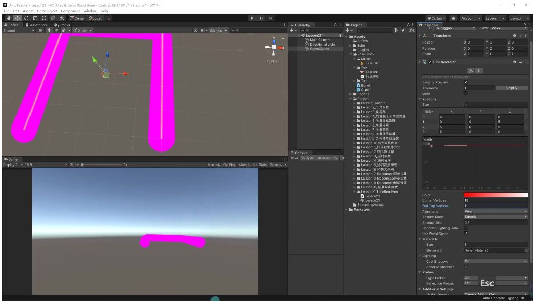
• •Corner Vertices: o作⽤：控制线段转⻆处的圆滑度 o原理：通过增加额外顶点使转⻆更平滑 o建议值：3-5即可达到较好效果，过⾼影响性能 •End Cap Vertices: o作⽤：控制线段终点的圆⻆效果 o区别：与Corner Vertices分别控制不同位置的圆⻆ 3）坐标系与材质
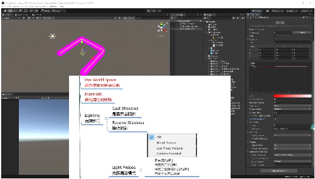
• •Use World Space: o关键作⽤：决定线段是否随物体移动 o效果：取消勾选后线段会跟随物体坐标系移动 •Materials: o作⽤：设置线段使⽤的材质球 o注意事项： 需要创建专⻔材质 受光材质需开启"Generate Lighting Data" 贴图模式影响材质显示效果 4）光照与渲染
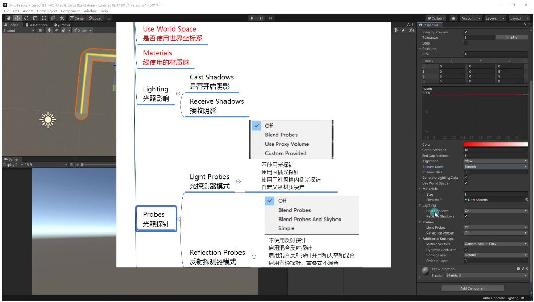
•

## Page 3
•Lighting: oCast Shadows：控制是否投射阴影 oReceive Shadows：控制是否接收阴影 •Probes: o光照探针：影响光照效果的⾼级设置 o反射探针：控制反射效果的模式 o注意：这些参数通常保持默认即可 5）新版本编辑功能
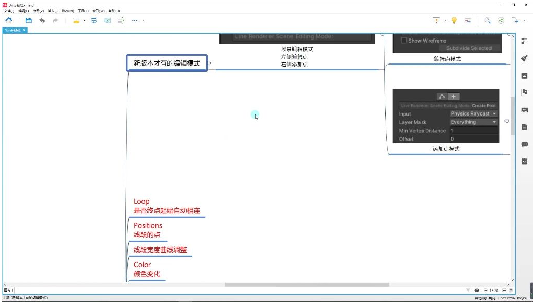
• •Simplify Preview: o作⽤：显示⻩⾊辅助线便于观察 •编辑模式: o左侧编辑点：可调整现有点位置 o右侧添加点：⽀持多种添加⽅式 物理射线检测（最常⽤） ⿏标位置检测（较少使⽤） o最⼩顶点距离：控制连续绘制时的点密度 •使⽤建议：代码绘制更常⽤，此功能适合特定场景 3. 知识点三、LineRender代码相关 05:25 1）动态添加线段 25:36
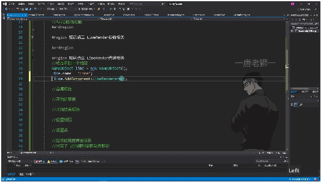
• •创建⽅法：通过代码动态创建线段对象，⽆需预先在场景中放置物体 •实现步骤： o使⽤GameObject line = new GameObject()创建空物体 o通过line.name = "Line"设置对象名称 o添加LineRenderer组件：LineRenderer lineRenderer = line.AddComponent<LineRenderer>() •组件特性：LineRenderer是Unity引擎内置组件，属于UnityEngine命名空间 2）⾸尾相连 27:16

## Page 4
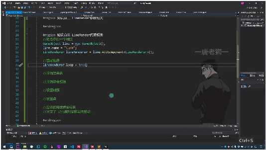
• •关键参数：通过lineRenderer.loop = true实现线段⾸尾⾃动连接 •参数说明： otrue：起点和终点⾃动连接形成闭合图形 ofalse：保持线段开放状态（默认值） •参数查看⽅法：可通过F12查看LineRenderer类的所有可⽤参数，与Inspector⾯板显示 内容⼀致
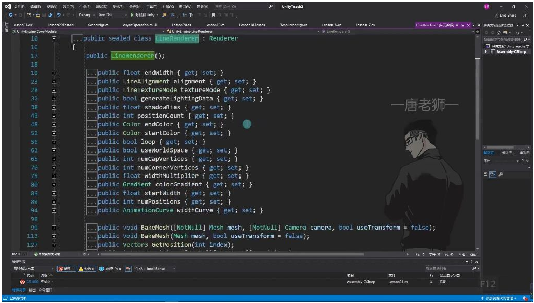
• •其他重要参数： ostartWidth/endWidth：控制线段起⽌宽度 ostartColor/endColor：设置线段起⽌颜⾊ ouseWorldSpace：决定线段是否随对象移动⽽移动 3）开始结束宽 27:54
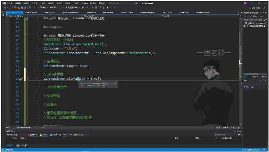
• •设置⽅法：通过代码lineRenderer.startWidth和lineRenderer.endWidth分别设 置线段开始和结束的宽度 •取值范围：⼀般设置在0到1之间，0.02f已经是⾮常细的线宽 •同步设置：建议将开始和结束宽度设为相同值（如0.02f），这样线段从头到尾宽度 ⼀致 •视觉效果：当线宽设置过⼩时，在场景中可能难以直观观察到宽度差异

## Page 5
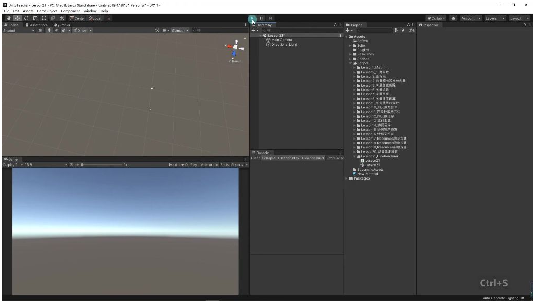
• •调试技巧：运⾏代码后可在场景视图中观察线段实际渲染效果 •常⻅问题：若未正确设置线宽可能导致线段显示异常或不可⻅ •参数关联：线宽设置需配合材质等其他参数才能完整呈现线段效果
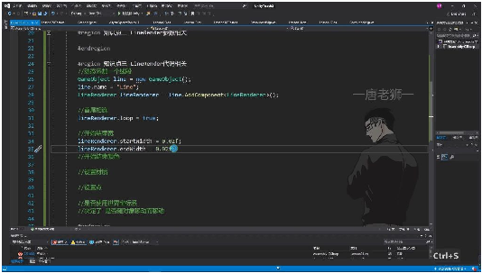
• •代码规范： •命名建议：创建LineRenderer对象时应赋予明确名称（如"Line"）便于后续管理 •组件添加：通过AddComponent<LineRenderer>()⽅法动态添加线段渲染组件 4）开始结束颜⾊ 29:13
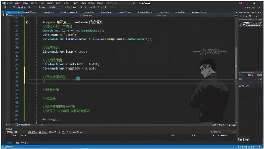
• •颜⾊渐变特性：LineRenderer的颜⾊⽀持从开始到结束的渐变效果，可以通过代码控 制起始和结束颜⾊ •Color结构体：Unity提供了内置的Color结构体，包含预定义颜⾊和RGBA通道设置

## Page 6
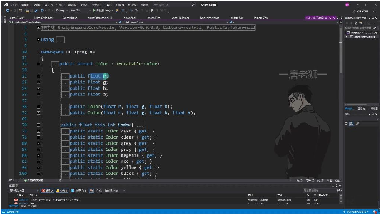
• •RGBA组成： oR：红⾊通道（取值范围0-1） oG：绿⾊通道（取值范围0-1） oB：蓝⾊通道（取值范围0-1） oA：透明度通道（取值范围0-1） •预定义颜⾊：Color结构体包含多个静态属性可直接使⽤： owhite（⽩⾊） ored（红⾊） oblack（⿊⾊） oyellow（⻩⾊） ogray/grey（灰⾊） ocyan（⻘⾊） omagenta（品红⾊） oclear（透明） •代码设置⽅法： •注意事项： o必须配合材质使⽤，单独设置颜⾊⽆效 o颜⾊值采⽤浮点数表示（0-1范围） o透明度通道A为1表示完全不透明，0表示完全透明
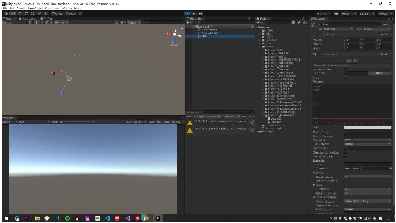
o 5）设置材质 30:03 •LineRenderer基础设置

## Page 7
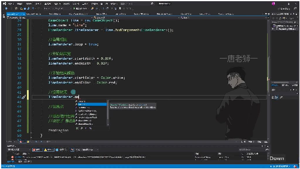
o o创建对象：通过GameObject line = new GameObject()创建新游戏对象 o命名对象：使⽤line.name = "Line"为对象命名 o添加组件：通过AddComponent<LineRenderer>()添加线渲染器组件 o⾸尾相连：设置lineRenderer.loop = true可使线条⾸尾相连 o宽度设置：使⽤startWidth和endWidth属性设置线条粗细，如0.02f o颜⾊设置：通过startColor和endColor属性设置线条颜⾊，⽀持渐变效果 •材质动态加载
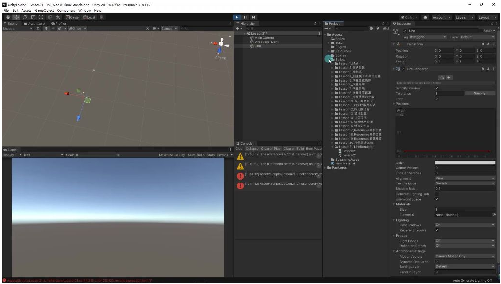
o o资源准备：将材质球放⼊Resources⽂件夹，命名为"M" o加载⽅法：使⽤Resources.Load<Material>("M")动态加载材质 o赋值材质：将加载的材质赋值给LineRenderer的material属性 o类型指定：加载时需要明确指定资源类型为Material o代码示例： •材质设置注意事项
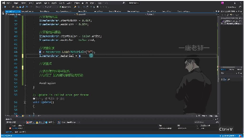
o o资源路径：材质必须放在Resources⽂件夹下才能被加载 o类型匹配：加载时要确保类型与实际资源类型⼀致 o赋值时机：建议在Start或Awake⽅法中进⾏材质加载和赋值 o效果验证：即使未设置点坐标，也可通过Inspector窗⼝验证材质是否成功应⽤ o调试技巧：可通过打印⽇志或断点调试确认材质是否加载成功 6）设置点 31:44 •设置点个数 31:50

## Page 8
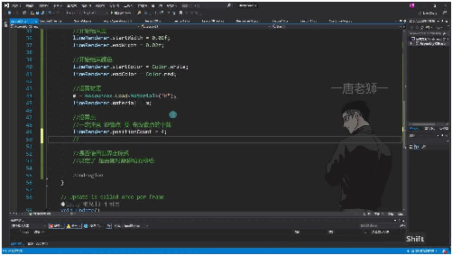
o o关键步骤：必须先设置点的个数再设置具体点坐标，相当于声明数组容量 o代码示例：lineRenderer.positionCount = 4; 表示准备设置4个点 o类⽐说明：类似数组初始化，需要先确定容量才能存储元素 •点的两种设置⽅式 32:16
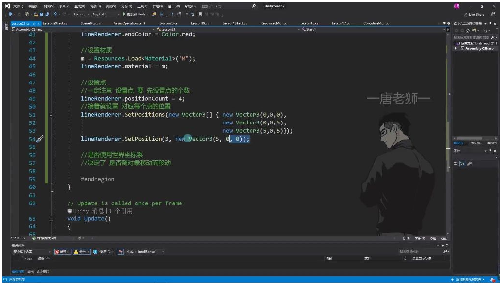
o o批量设置： 使⽤SetPositions⽅法传⼊Vector3数组 示例：lineRenderer.SetPositions(new Vector3[] { new Vector3(0,0,0), new Vector3(0,0,5), new Vector3(5,0,5) }); 数组顺序：数组索引对应点的顺序（0→第⼀个点，1→第⼆个点...） o单点设置： 使⽤SetPosition⽅法指定索引和坐标 示例：lineRenderer.SetPosition(3, new Vector3(5,0,0));设置第4个点 索引规则：从0开始计数，最后⼀个点索引为positionCount-1 •示例：在Unity中设置点并测试 33:23
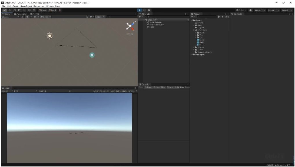
o o测试案例1： 设置4个点但只赋值3个点 结果：未赋值的点默认为(0,0,0)，形成三⻆形 o测试案例2： 完整设置4个点(0,0,0)、(0,0,5)、(5,0,5)、(5,0,0) 结果：当loop为true时形成闭合正⽅形，false时形成不闭合折线

## Page 9
•注意事项：点数量与赋值 33:36
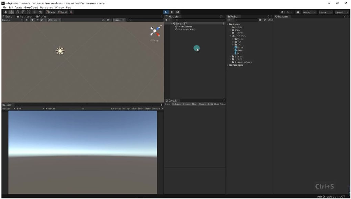
o o必须匹配：设置的positionCount必须与实际赋值的点数⼀致 o默认值⻛险：未赋值的点会⾃动设为(0,0,0)，可能导致意外连线 o调试建议： 检查Inspector中positions属性确认各点坐标 修改loop参数验证闭合效果 o操作顺序：positionCount→SetPositions/SetPosition→检查效果 7）是否使⽤世界坐标系 35:43
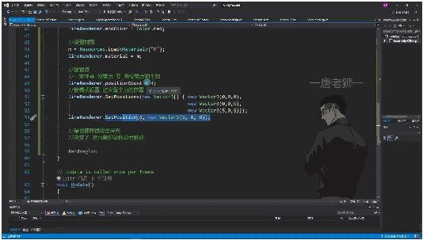
• •基本概念 o作⽤原理：决定LineRenderer绘制的线段是否随对象移动⽽移动 o默认状态：useWorldSpace参数默认勾选（true） o代码设置：通过lineRenderer.useWorldSpace = false取消世界坐标系 •实际效果演示
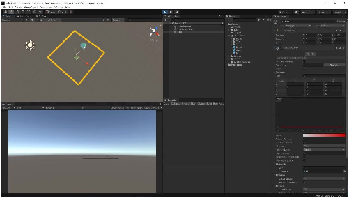
o o勾选状态： 移动对象时线段保持世界坐标不变 表现为线段位置固定，不随对象移动 o取消状态： 线段会跟随对象移动 需要显式设置useWorldSpace = false •光照数据处理

## Page 10
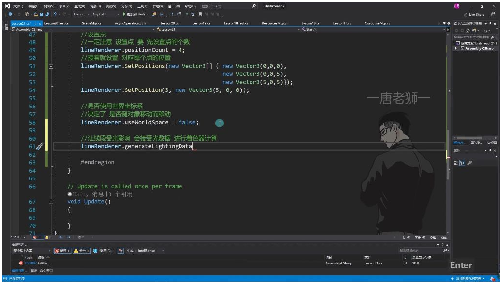
o o⿊⾊线段问题：材质可能未正确接收光照数据 o解决⽅法： 设置lineRenderer.generateLightingData = true 使线段能接收光照数据进⾏着⾊器计算 o效果验证：设置后线段会显示正确材质颜⾊⽽⾮⿊⾊ •使⽤注意事项 o设置顺序： 必须先设置positionCount确定点数 再通过SetPositions设置各点坐标 o坐标设置： o材质加载：使⽤Resources.Load<Material>("M")加载材质资源 ⼆、LineRenderer的功能 37:28
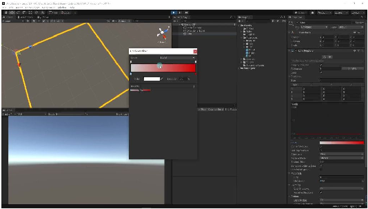
• •基本功能: Unity提供的划线脚本组件，⽤于在3D空间中绘制线段 •材质特性: o某些材质不会受到颜⾊设置的影响（如演示中设置红⾊但未⽣效的情况） o需要特定材质才能正确显示颜⾊效果 三、通过代码控制LineRenderer 37:50 1. 动态创建LineRenderer
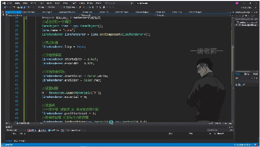
•

## Page 11
•创建步骤: i.创建新GameObject并命名 ii.添加LineRenderer组件 iii.设置基本参数： loop = true 使线段⾸尾相连 startWidth/endWidth = 0.02f 设置线宽 startColor/endColor 设置颜⾊渐变 •材质加载: o使⽤Resources.Load<Material>("M")加载材质 o通过material属性赋值给LineRenderer 2. 关键参数设置
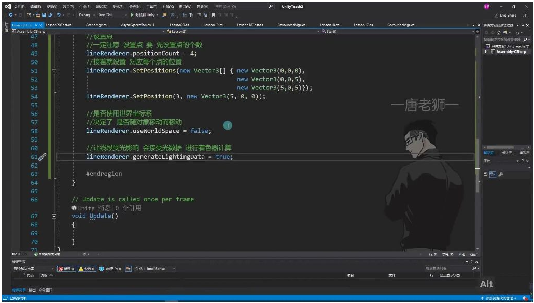
• •点设置顺序: o必须先设置positionCount确定点数 o再通过SetPositions或SetPosition设置具体坐标 •坐标系选择: ouseWorldSpace = false使⽤局部坐标系，会随对象移动 o设置为true则使⽤世界坐标系 •光照影响: ogenerateLightingData = true使线段接受光照着⾊计算 3. 重要参数总结
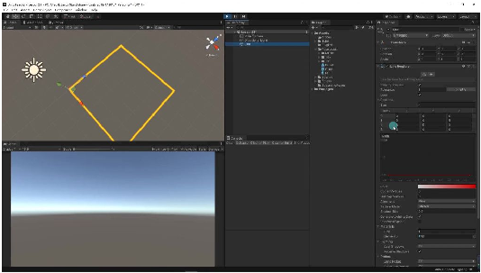
• •核⼼参数: oPositions：定义线段的各个顶点位置 oWidth：控制线段粗细 oColor：设置颜⾊渐变效果 oLoop：是否⾸尾相连 •⾼级设置: oCorner Vertices：控制转⻆圆滑度 oEnd Cap Vertices：控制端点圆滑度

## Page 12
oAlignment：线段对⻬⽅式（⾯向摄像机或Z轴） oTexture Mode：纹理映射⽅式 四、课程内容总结 38:28 •三⼤要点: oLineRenderer是Unity提供的专业划线⼯具 o掌握所有重要参数的含义和设置⽅法 o学会通过代码动态控制LineRenderer 1. 练习题
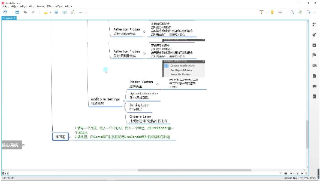
• •编写⽅法：根据中⼼点和半径⽤LineRenderer画圆 •实现功能：在Game窗⼝⽤⿏标轨迹画线 2. 重点提醒 •代码控制要点: o所有参数都可通过代码动态修改 o重点掌握位置点设置、颜⾊、宽度等核⼼属性 o注意设置点的顺序：先设数量再设位置 五、知识⼩结 知识点核⼼内容重点/易混淆难度系数 点 Liner Unity提供的专⽤画线组件，可绘制攻与普通⭐⭐ Renderer组件击范围、武器红外线等Renderer的 作⽤区别 Loop参数控制线段⾸尾是否⾃动连接勾选后⾃动⭐⭐ 闭合图形 Positions参数定义线段顶点坐标数组世界坐标系⭐⭐⭐ 与本地坐标 系切换 Width曲线控制线段粗细变化曲线调整影⭐⭐⭐ 响整体过渡 效果 Color渐变设置线段颜⾊过渡需配合材质⭐⭐ 才能显示效 果 Corner 调整转⻆圆滑度值越⼤转⻆⭐⭐ Vertices越平滑

## Page 13
End Cap控制端点圆⻆独⽴于转⻆⭐⭐ Vertices参数 Use World坐标系切换开关决定线段是⭐⭐⭐ Space否随⽗物体⭐ 移动 材质设置需配合贴图使⽤受光材质需⭐⭐⭐ 开启Lighting Data 动态创建代AddComponent<LineRenderer>(必须先设置⭐⭐⭐ 码)顶点数再赋⭐ 值 SetPositions批量设置顶点坐标未赋值顶点⭐⭐⭐ ⽅法默认为(0,0,0) 编辑模式功新版场景直接编辑⼯具物理射线检⭐⭐ 能测添加顶点
