# 场景异步加载

> 来源：场景异步加载.pdf

---

## Page 1
以下为AI⽣成的图⽂笔记的内容 ⼀、场景异步切换 00:04 1. 回顾场景同步切换 00:33
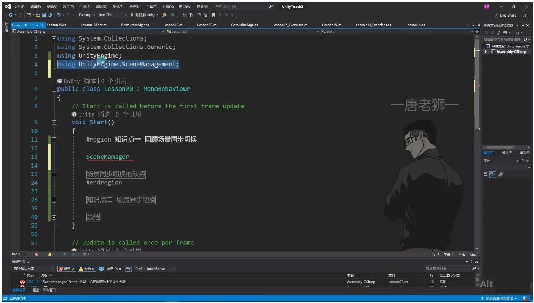
• •命名空间引⽤：使⽤SceneManager前需添加using UnityEngine.SceneManagement;命 名空间，可通过Alt+Enter快捷键快速添加引⽤ •核⼼⽅法：通过SceneManager.LoadScene("场景名")实现同步场景切换，参数为场景 名称字符串 •准备⼯作： o需在Build Settings中添加待切换场景（将场景⽂件拖⼊列表） o建议为不同场景设置明显视觉差异（如修改摄像机Clear Flags为Solid Color） •实现步骤： o创建两个测试场景（示例中为Lesson20和Lesson20Test） o挂载包含切换代码的脚本到场景对象（如摄像机） o在Start()中调⽤LoadScene⽅法 •特点： o同步执⾏：会阻塞主线程直到场景加载完成 o简单直接：适合⼩场景快速切换 o⽆过渡效果：可能造成画⾯卡顿感 2. 场景异步切换
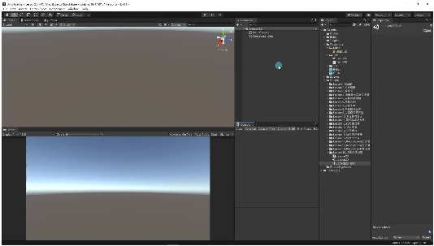
• •必要性：当场景资源较⼤时，同步加载会导致明显卡顿 •实现⽅式： o协程⽅式：使⽤SceneManager.LoadSceneAsync()配合yield return o事件回调：通过AsyncOperation的completed事件 •注意事项： o需⼿动清理当前场景⽆⽤对象（⾮必须对象） o协程中部分代码可能在场景卸载后⽆法执⾏

## Page 2
o建议保留场景加载必需的资源对象 •优化建议： o显示加载进度条（通过AsyncOperation.progress） o预加载关键资源 o分帧加载⼤型资源 3. 同步与异步对⽐
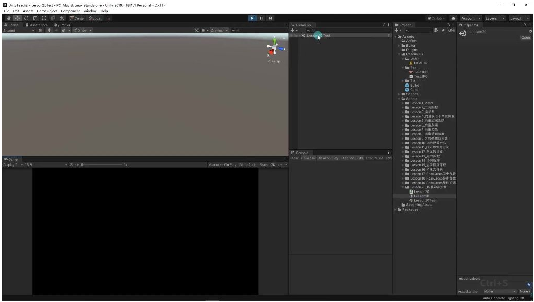
• •性能影响： o同步：主线程阻塞，帧率下降明显 o异步：资源后台加载，保持画⾯响应 •使⽤场景： o同步：⼩场景/快速原型开发 o异步：正式项⽬/⼤型场景 •视觉反馈： o同步：瞬时切换⽆过渡 o异步：可添加加载动画 •示例差异： o同步切换示例中两个场景分别使⽤天空盒和纯⾊背景 o异步切换需要额外处理对象⽣命周期 4. 场景同步切换的缺点 02:49 1）⼯作原理
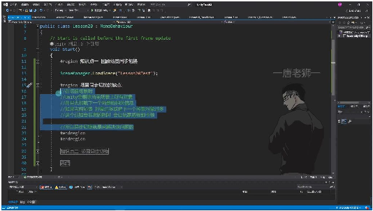
• •执⾏过程：当调⽤SceneManager.LoadScene()时，Unity主线程会： o删除当前场景所有对象 o加载并解析新场景配置⽂件 o实例化新场景对象 •性能瓶颈：这两步操作都在主线程同⼀帧内完成，若处理时间超过16.66ms（60帧标 准），就会造成帧率下降 2）具体问题

## Page 3
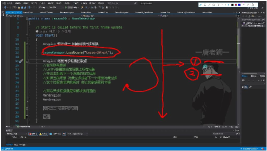
• •耗时因素： o当前场景对象过多导致删除耗时 o新场景对象过多导致加载耗时 •⽤户体验：玩家会感受到明显卡顿，尤其在商业游戏中场景复杂度⾼时 3）场景⽂件示例 05:27
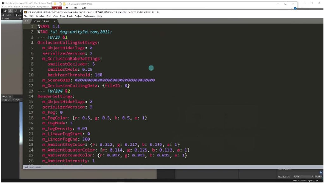
• •⽂件本质：与预设体类似，包含： o场景中所有物体的层级关系 o每个物体挂载的组件及参数配置 o组件属性数据（如Transform的坐标、旋转值）
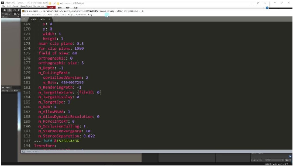
o •加载开销： o配置⽂件越⼤解析时间越⻓ o每个对象需要单独实例化和初始化 o组件越多创建过程越耗时（如光照、碰撞体等特殊组件） 4）解决⽅案 •异步加载原理： o将加载过程分配到其他线程执⾏ o主线程保持流畅运⾏ o加载完成后通过回调通知主线程 •实现⽅式：

## Page 4
o事件回调函数（类似Resources.LoadAsync） o协程⽅式加载（更灵活的进度控制） 5. 场景异步切换 06:45 1）通过事件回调函数异步加载 07:28
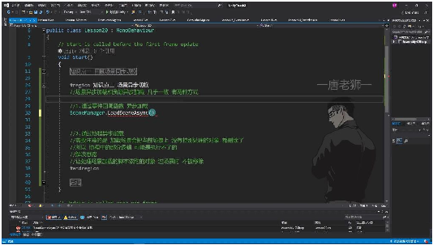
• •两种实现⽅式：与资源异步加载原理相同，提供事件回调和协程两种实现⽅式 •核⼼⽅法：SceneManager.LoadSceneAsync("场景名")，返回AsyncOperation对象 •特殊处理：加载新场景会删除当前场景未特殊处理的对象，需通过 DontDestroyOnLoad保留必要对象 •异步加载的返回值与事件监听 09:42
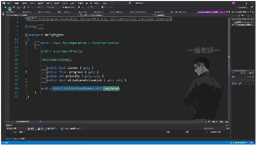
o o返回值类型：继承⾃YieldInstruction的AsyncOperation类 o关键属性： isDone：判断加载是否完成 progress：获取加载进度（0-1） allowSceneActivation：控制是否允许⾃动激活场景 o事件监听：通过completed事件注册回调⽅法，⽀持lambda表达式和独⽴函数两 种写法 •加载结束后的处理逻辑 12:11
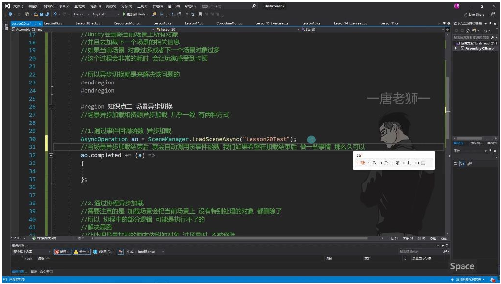
o o回调执⾏时机：场景资源加载完成后⾃动触发注册的事件处理函数 o典型应⽤场景：

## Page 5
打印加载完成⽇志（如示例中的"加载结束"提示） 动态⽣成场景内容（商业项⽬中常⻅） 触发后续游戏流程逻辑 o多回调⽀持：可同时注册多个事件处理⽅法，按注册顺序依次执⾏ •商业项⽬中的场景异步加载应⽤ 12:26

o o空场景加载模式：先加载基础空场景，再通过配置⽂件动态⽣成内容 o优势： 解耦场景资源和游戏逻辑 ⽀持⾃定义地图编辑器 提⾼加载过程的灵活性 o实现要点： 在回调函数中解析配置⽂件 按需实例化场景对象 处理对象间的依赖关系 2）通过携程异步加载 14:21
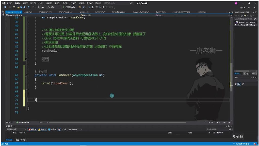
• •场景对象删除机制：加载新场景时，当前场景上未特殊处理的对象都会被删除 •携程执⾏中断⻛险：由于对象删除可能导致携程中的部分逻辑⽆法执⾏ •解决⽅案：让处理场景加载的脚本依附的对象通过DontDestroyOnLoad⽅法在场景切换 时不被移除 •携程异步加载的实现 15:19
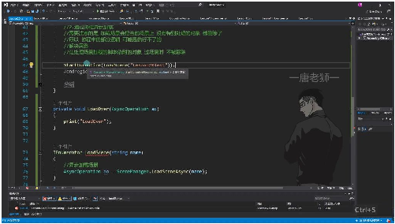
o

## Page 6
o迭代器函数：必须使⽤IEnumerator作为返回值类型 o异步加载⽅法：通过SceneManager.LoadSceneAsync(name)进⾏异步加载 o等待机制：使⽤yield return ao让Unity协程协调器等待异步加载完成 1 IEnumerator LoadScene(string name) { 2 AsyncOperation ao = SceneManager.LoadSceneAsync(name); 3 yield return ao; // 等待加载完成 4 } •与事件回调的区别 17:33
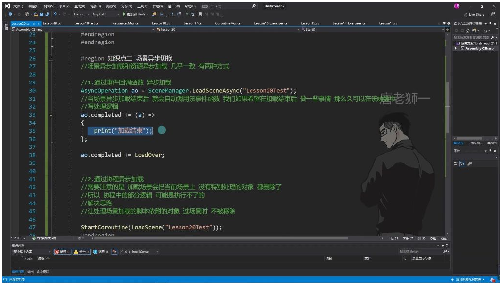
o o事件回调特点： 只能在加载完成后执⾏逻辑 使⽤C#事件机制存储函数引⽤ 即使对象被删除，回调函数仍能执⾏ o携程特点： 可在加载过程中处理逻辑（如更新进度条） 依赖Unity协程机制 对象删除会导致携程中断 •进度条更新策略 24:38
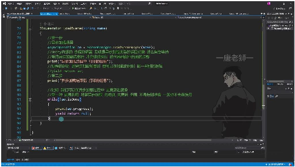
o o内置进度检测： o⾃定义进度规则： 场景加载完成更新20% 动态加载怪物后再更新20% 加载场景模型后顶满进度条 最后隐藏进度条 •实际应⽤技巧 30:10 o过渡效果设计：在加载过程中显示动画（如云朵开合）掩盖加载卡顿 o性能优化：在进度条遮挡时可以使⽤同步加载后续资源 o对象管理：必须使⽤DontDestroyOnLoad保护核⼼加载对象 3）总结 31:19

## Page 7
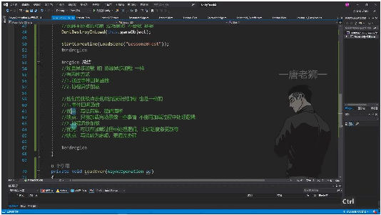
• •事件回调⽅式： o优点：写法简单，逻辑清晰 o缺点：⽆法处理加载过程中的逻辑 •携程⽅式： o优点：⽀持加载过程处理（如进度条） o缺点：实现较复杂，需处理对象保留问题 •选择建议：根据具体需求选择，需要过程控制时⽤携程，只需完成后处理⽤事件回调 ⼆、知识⼩结 知核⼼内容考试重点/易混淆点难度系数 识 点 场使⽤SceneManager.LoadScene⽅法易混淆点：需提前在⭐⭐ 景直接切换场景，主线程阻塞式加Build Settings中添加场 同载，适⽤于简单场景切换。景，否则⽆法切换。 步 切 换 场通过重点：回调函数不受场⭐⭐⭐ 景SceneManager.LoadSceneAsync异景销毁影响，适合加载 异步加载，利⽤completed事件回调处后初始化逻辑。 步理加载完成后的逻辑（如动态⽣成 切场景对象）。 换 （ 事 件 回 调 ） 场协程中调⽤LoadSceneAsync，通过易错点：默认协程随场⭐⭐⭐ 景yield return分步控制加载流程，⽀景销毁终⽌，需通过⭐ 异持进度条更新和分段加载（如先加DontDestroyOnLoad保 步载场景再加载怪物）。留脚本对象。 切 换 （

## Page 8
协 程 ） 同同步：简单但卡顿⻛险⾼；异步：重点：商业游戏常⽤异⭐⭐⭐ 步 ⽆卡顿但逻辑更复杂。关键差异：步+进度条掩盖加载耗 vs 异步允许加载中处理其他逻辑（如时。 异UI更新）。 步 对 ⽐ 性异步加载通过⼦线程处理资源解易忽略点：场景配置⽂⭐⭐⭐ 能析，避免主线程阻塞。核⼼指标：件（.unity⽂件）复杂度⭐ 优帧率稳定性（如60帧需每帧直接影响加载耗时。 化≤16.6ms）。 原 理
