# 射线检测

> 来源：射线检测.pdf

---

## Page 1
以下为AI⽣成的图⽂笔记的内容 ⼀、物理系统之射线检测 00:04 1. 射线检测应⽤ 00:12 2. 什么是射线检测 00:32
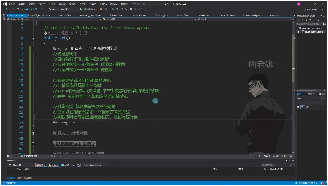
• •物理系统回顾: o碰撞检测：需要⾄少⼀个刚体和两个碰撞器 o范围检测：仅需要碰撞器即可 •应⽤场景: o⿏标选择场景物体 oFPS射击游戏（⽆弹道设计） •核⼼功能: o从指定点发射指定⽅向射线 o判断与碰撞器的相交情况 o获取相交对象进⾏后续处理 1）绝地求⽣开枪示例 01:55
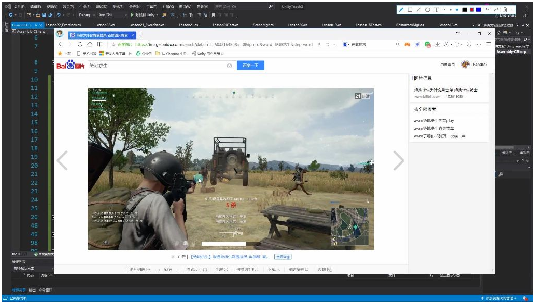
• •实现原理: o枪⼝发射⽆限延⻓的射线 o射线与敌⽅碰撞器进⾏相交检测 o相交即判定为击中⽬标 •游戏效果处理: o减⾎计算 o死亡判定 o特效播放 o击⻜效果 •典型应⽤游戏: o绝地求⽣（吃鸡）

## Page 2
o反恐精英CS o穿越⽕线CF 3. 射线检测基础 03:44 1）射线检测概述
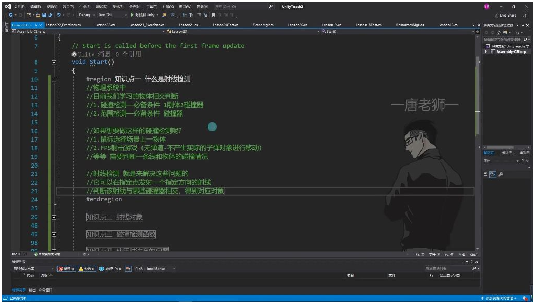
• •应⽤场景： o⿏标选择场景物体 oFPS射击游戏（⽆弹道判断） o其他需要判断线与物体碰撞的情况 •基本原理：在指定点发射指定⽅向射线，判断与碰撞器的相交情况 2）射线对象 06:24 •3D世界中的射线
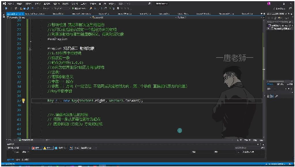
o o声明⽅法： o参数说明： 起点：第⼀个参数为起点坐标（如(1,0,0)） ⽅向：第⼆个参数为⽅向向量（如Vector3.forward表示z轴正⽅向） o注意事项： 第⼆个参数是⽅向向量⽽⾮终点坐标 可通过r.origin获取起点，r.direction获取⽅向 •摄像机发射的射线
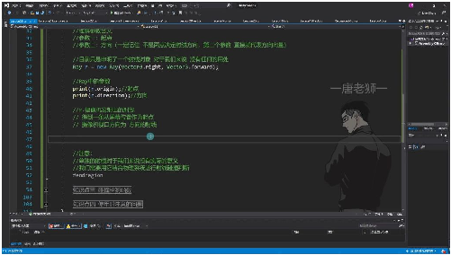
o

## Page 3
o声明⽅法： o特点： 起点为屏幕位置（如⿏标位置） ⽅向为摄像机视⼝⽅向 o应⽤场景：常⽤于实现⿏标点击选中3D物体 3）射线检测函数 •基本检测函数
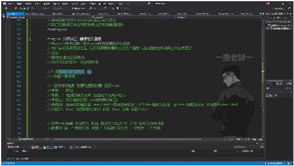
o o核⼼函数： o参数说明： 最⼤距离：超出该距离不检测（如1000单位） 层级过滤：指定检测层级（如1 << LayerMask.NameToLayer("Monster")） 触发器处理：UseGlobal/Collide/Ignore三种模式 o返回值：布尔值，仅表示是否碰撞到对象 •变体重载
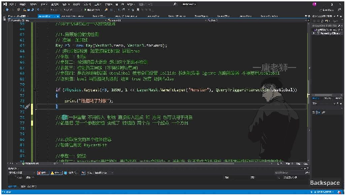
o o简化形式： o特点： ⽆需预先创建Ray对象 参数顺序：起点→⽅向→其他参数 o检测特性： 瞬时检测（执⾏代码时进⾏⼀次） 可通过16种重载适应不同需求 4）注意事项 •射线对象本⾝⽆意义：必须结合物理系统进⾏碰撞判断 •参数理解关键：⽅向参数是向量⽽⾮终点坐标 •性能考虑：合理设置检测距离和层级过滤 4. 碰撞检测函数 11:04 1）射线检测应⽤ •基础射线检测

## Page 4
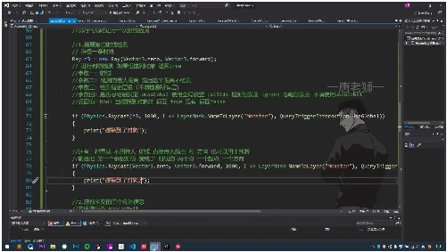
o o基本实现： 创建射线对象：Ray r3 = new Ray(Vector3.zero, Vector3.forward) 检测⽅法：Physics.Raycast()第⼀个参数传⼊射线对象 简化重载：可直接传⼊起点和⽅向代替射线对象 o关键参数： 最⼤检测距离：超出该距离不进⾏检测（示例中为1000） 层级过滤：通过LayerMask.NameToLayer("Monster")指定只检测怪物层 触发器处理：QueryTriggerInteraction枚举控制是否检测触发器 o返回值：布尔类型，碰撞到对象返回true •层级检测注意事项
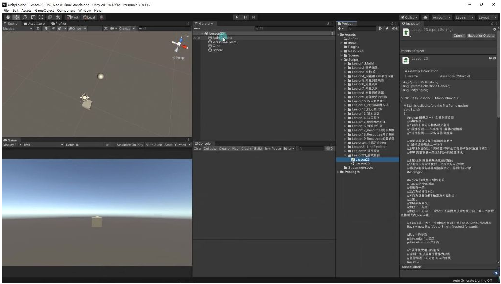
o o必要条件：被检测对象必须设置为指定层级（示例中为Monster层） o验证⽅法：将测试球体层级改为Default后不再触发碰撞检测 o代码绑定：需要将检测脚本挂载到主摄像机等游戏对象上 •获取碰撞信息
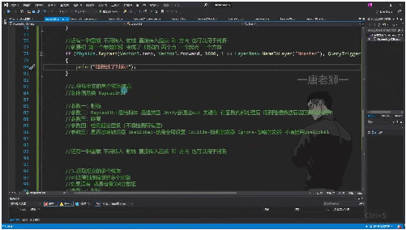
o o信息获取：通过RaycastHit结构体存储碰撞详细信息 o参数特性： 使⽤out关键字返回处理后的碰撞数据 可获取碰撞点、法线、碰撞物体等信息 o多对象检测：使⽤Physics.RaycastAll()可返回碰撞到的所有对象数组 •实际应⽤演示

## Page 5
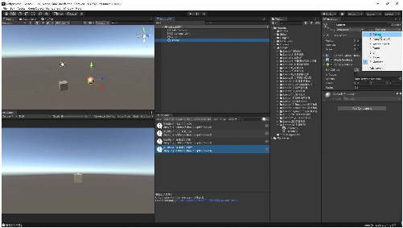
o o验证⽅式：通过控制台打印"碰撞到了对象"确认检测⽣效 o典型应⽤： FPS游戏中判断⼦弹是否命中⽬标 解决"⼀条线和物体相交"的碰撞判断问题 3D世界中从固定点沿指定⽅向发射检测射线 2）获取相交的单个物体信息 18:35 •物体信息类RaycastHit的关键参数 23:27
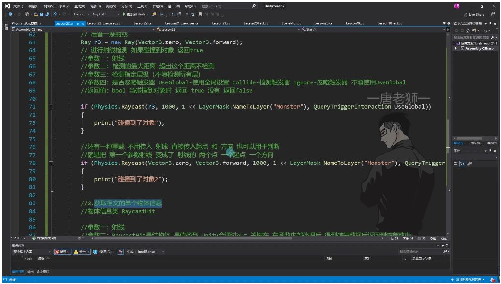
o o基本API: Physics.Raycast(射线, 最⼤距离, 层级, 触发器设置)返回布尔值 重载版本可直接传⼊起点和⽅向代替射线对象 注意参数顺序：层级是第4个参数，触发器设置是第5个参数
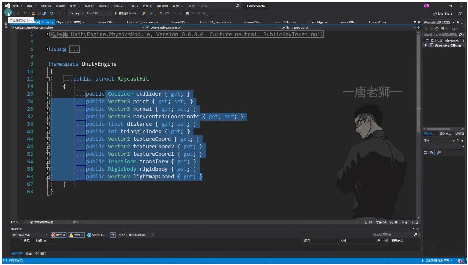
 o碰撞器信息: 通过hitInfo.collider获取碰撞器 可进⼀步获取游戏对象信息如hitInfo.collider.gameObject.name 意义：得到碰撞器就等于得到了对象的所有信息 o碰撞点信息: hitInfo.point获取射线与碰撞器的交点坐标 应⽤场景：在射击游戏中创建弹孔/⾎迹特效时确定精确位置 原理：射线检测实际是在碰撞器边缘相交时就返回true

## Page 6
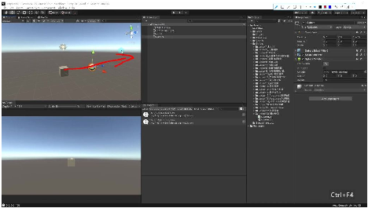
 o法线信息: hitInfo.normal获取碰撞点处的法线向量 法线是垂直于碰撞器表⾯的向量 应⽤：调整贴图⻆度使特效看起来更⾃然 示例：⼈物模型上的弹孔需要根据法线调整贴图⽅向 o位置信息: hitInfo.transform.position获取碰撞对象的位置 注意：这是对象transform的位置，不是碰撞点的位置 o距离信息: hitInfo.distance获取射线起点到碰撞点的距离 应⽤：计算弹道下坠、伤害衰减等 示例：FPS游戏中可通过距离计算⼦弹下坠量
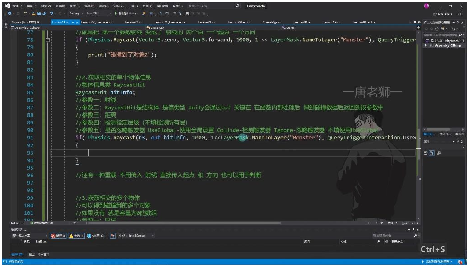
 o使⽤注意: 必须使⽤out关键字传递RaycastHit参数 结构体是值类型，需要out/ref才能在⽅法内修改 ⾃动补全提示可能不准确，需确认API重载版本 返回值仍是布尔值，需配合if语句判断是否碰撞成功 o其他参数: 纹理坐标等参数在游戏开发中较少使⽤ 刚体信息可通过hitInfo.rigidbody获取 三⻆形索引可⽤于⾼级3D编程 5. RaycastHit类对于我们的意义总结 31:42

## Page 7
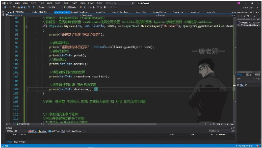
• •对象信息获取：通过RaycastHit可以获取碰撞到的游戏对象信息，包括： o碰撞器名称：hitInfo.collider.gameObject.name o碰撞点坐标：hitInfo.point o碰撞⾯法线：hitInfo.normal o对象位置：hitInfo.transform.position o碰撞距离：hitInfo.distance •实际应⽤场景： oFPS游戏中计算弹痕位置和⾃由落体轨迹 o根据碰撞点播放特效 o获取对象脚本实现伤害计算等游戏逻辑 o通过法线信息确定表⾯朝向
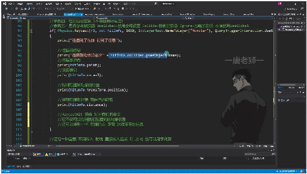
o •核⼼价值：不仅获取碰撞对象，还能得到丰富的空间关系数据，为游戏物理效果和交 互提供基础⽀持 6. 射线检测的重载⽅法 33:23 1）使⽤射线参数的重载
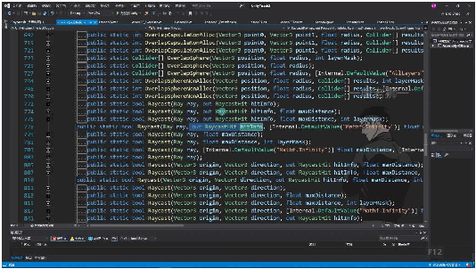
• •基本参数： o参数1：射线对象Ray o参数2：out RaycastHit⽤于接收碰撞信息 o参数3：检测距离（默认⽆限远）

## Page 8
o参数4：层级过滤（默认所有层） o参数5：触发器处理⽅式（UseGlobal/Collide/Ignore） •特点： o需要预先创建射线对象 o后三个参数为可选参数 oUnity会通过out关键字返回碰撞数据 2）使⽤起点⽅向的重载
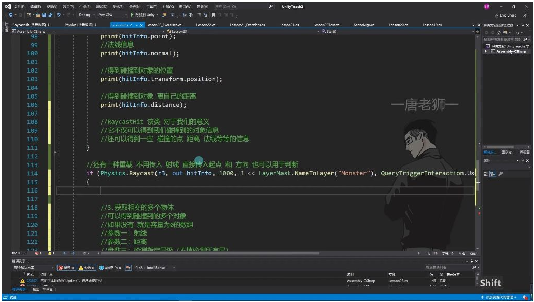
• •参数变化： o将射线参数替换为起点(Vector3)和⽅向(Vector3) o其他参数与射线版本完全⼀致 •优势： o⽆需显式创建射线对象 o适合简单场景的快速检测 o示例：Physics.Raycast(Vector3.zero, Vector3.forward, ...) 3）多物体检测⽅法
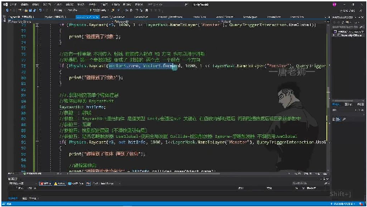
• •实现⽅式： o使⽤Physics.RaycastAll获取所有碰撞物体 o返回值为RaycastHit[]数组 o⽆碰撞时返回空数组⽽⾮null •注意事项： o性能开销⼤于单物体检测 o需要合理设置检测距离和层级过滤 o适⽤于需要同时检测多个碰撞体的场景 7. 获取相交的多个物体 34:07

## Page 9
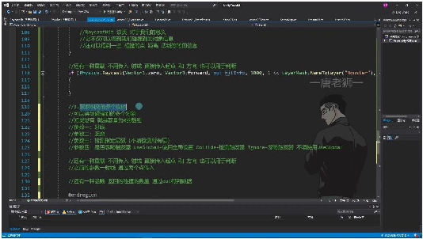
• •API功能：Physics.RaycastAll⽅法可以获取射线路径上所有碰撞到的物体信息，返回 RaycastHit数组 •参数说明： o参数⼀：射线Ray对象 o参数⼆：检测最⼤距离（float类型） o参数三：检测指定层级（int类型，使⽤LayerMask.NameToLayer转换） o参数四：触发器处理⽅式（QueryTriggerInteraction枚举） •返回值特性：若⽆碰撞则返回空数组（容量为0），数组顺序按碰撞先后排列 •应⽤场景：适⽤于需要穿透效果的场景，如穿甲弹、激光武器等需要连续伤害计算的 情况 1）例题:射线检测应⽤ 35:16
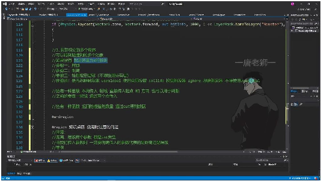
• •实现⽅法： o使⽤Physics.RaycastAll替代单物体检测的Physics.Raycast o通过for循环遍历返回的RaycastHit数组 o示例代码： •重载⽅法： o可直接传⼊起点(Vector3.zero)和⽅向(Vector3.forward)替代射线对象 o示例代码： •⾼级⽤法： o使⽤RaycastNonAlloc通过out参数获取碰撞数量 o性能优化：可复⽤预分配的RaycastHit数组 o示例代码： •注意事项： o距离和层级参数都是int类型，需明确参数含义 o层级参数需要使⽤位运算1 << LayerMask.NameToLayer() o触发器处理⽅式默认为UseGlobal，可显式指定Collide或Ignore 8. 使⽤时注意的问题 40:38 1）参数传递注意事项 40:57

## Page 10
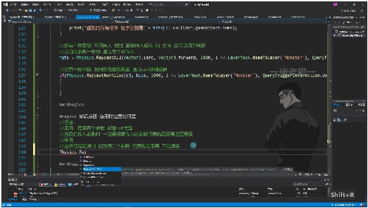
• •参数类型陷阱：距离和层级两个参数都是int类型，但代表不同含义，传⼊时需明确区 分 •典型错误示例： •参数顺序规律：通常第⼆个参数是距离，层级参数位于距离参数之后 •调试建议：当检测失效时，⾸先检查参数顺序是否正确
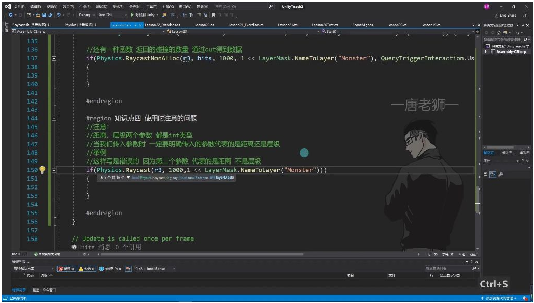
• •数值隐式转换⻛险：由于距离和层级都是数值类型，编译器不会报错，但逻辑会出错 •实际影响：错误传参会返回异常⼩的检测值，导致射线检测功能失效 •正确写法示范： 2）射线检测核⼼要点 •基本原理：通过数学射线与场景物体碰撞体进⾏相交检测 •核⼼价值： o获取碰撞物体信息（名称、位置等） o计算碰撞点坐标和法线⽅向 o测量物体间精确距离 •API使⽤要点： o掌握基础重载形式即可，其他均为参数变体 o重点区分单物体检测(Raycast)和多物体检测(RaycastAll) o注意out参数在获取碰撞信息时的⽤法
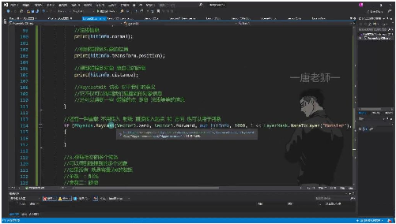
o •常⽤重载类型：

## Page 11
o通过射线对象检测： o通过起点+⽅向检测： o多物体检测： ⼆、结束 43:04 1. 练习题布置
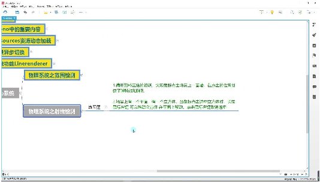
• •练习题1：⼦弹特效实现 o要求：使⽤资料区提供的资源，实现⿏标点击场景中的墙⾯时，在点击位置创建 ⼦弹特效和弹孔 o实现要点：需要处理⿏标点击事件，进⾏射线检测确定点击位置，实例化特效预 制体 •练习题2：物体拖拽功能 o要求：场景包含平⾯和⽴⽅体，点击选中⽴⽅体后，⻓按⿏标左键可拖动⽴⽅体 在平⾯上移动，右键取消选中 o实现要点：需要处理⿏标点击/⻓按事件，实现物体跟随⿏标移动的逻辑，注意 平⾯坐标系的转换 2. 练习说明 •练习⽅式：建议先⾃⾏尝试完成练习题，可以截图记录练习过程 •解答安排：练习题的具体实现⽅法将在下⼀个视频中进⾏详细讲解 •学习建议：在观看解答视频前，最好先独⽴尝试实现，这样能更好地理解物理系统的 实际应⽤ 三、知识⼩结 知识点核⼼内容考试重点/易难度系数 混淆点 射线检测概通过指定点发射指定⽅向射线判断与FPS游戏⽆弹⭐⭐ 念碰撞器相交情况道设计的实 现原理 射线对象创1. 3D世界射线：new Ray(起点,⽅向向⽅向向量与⭐⭐ 建量)终点坐标的 2. 屏幕射线：区分 Camera.main.ScreenPointToRay(⿏标位 置) 基础检测APIPhysics.Raycast(射线,最⼤距离,层级)参数顺序混⭐⭐ 仅返回布尔值判断是否碰撞淆（距离/层 级）

## Page 12
碰撞信息获RaycastHit结构体包含：法线向量在⭐⭐⭐ 取- collider（碰撞器）特效⽣成中 - point（碰撞点坐标）的应⽤ - normal（法线向量） - distance（碰撞距离） 多物体检测Physics.RaycastAll返回碰撞物体数组数组元素按⭐⭐⭐⭐ Physics.RaycastNonAlloc通过out参数返碰撞顺序排 回列 检测注意事1. 瞬时检测特性距离参数与⭐⭐ 项2. 必须包含碰撞器组件层级参数的 3. 层级掩码左移运算误⽤ 实战应⽤场1. ⿏标拾取物体⼦弹下坠的⭐⭐⭐⭐ 景2. FPS枪击判定抛物线模拟 3. 弹道模拟（距离计算）
