# 范围检测

> 来源：范围检测.pdf

---

## Page 1
以下为AI⽣成的图⽂笔记的内容 ⼀、物理系统之范围检测 00:22 1. 知识回顾物理系统之碰撞检测 00:24
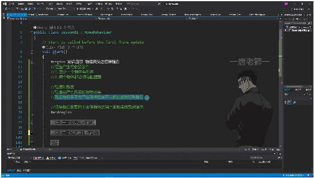
• •必要条件: o⾄少⼀个物体有刚体 o两个物体都必须有碰撞器 •碰撞与触发区别: o碰撞效果: 会产⽣实际的物理效果（如物体反弹） o触发效果: 不会产⽣物理碰撞效果，但可通过函数监听相交状态 o应⽤场景: 碰撞检测⽤于实体物体间需要物理效果的场景（如⽴⽅体相撞） 触发检测⽤于需要穿透效果但需判断相交的场景（如⼦弹穿透⽬标） 2. 范围检测 01:45 1）基本概念 •定义: 检测特定区域内是否存在符合条件物体的⽅法 •特点: 不需要实际物理碰撞即可判断物体位置关系 2）实现⽅法 •核⼼函数: oPhysics.OverlapSphere：球形范围检测 oPhysics.OverlapBox：⽴⽅体范围检测 •参数说明: o需指定检测中⼼点坐标 o需设置检测范围半径/尺⼨ o可设置层级过滤（LayerMask） •返回值: 返回碰撞器数组，包含范围内所有符合条件的物体 3. 知识总结
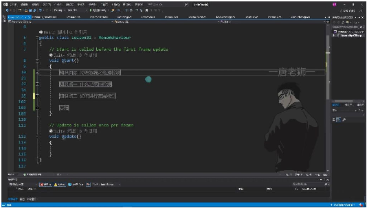
•

## Page 2
•选择依据: o需要物理效果 → 使⽤碰撞检测 o仅需位置关系判断 → 使⽤范围检测 •性能考量: o范围检测消耗低于持续碰撞检测 o适合⽤于⾮实时检测场景 4. 范围检测 1）范围检测概念 01:50
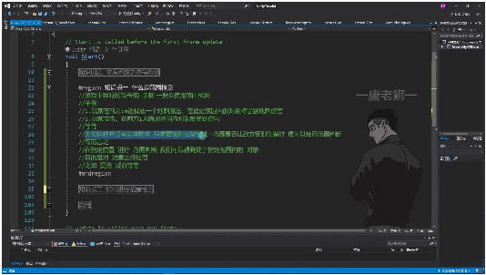
• •定义：游戏中瞬时的攻击范围判断技术，⽤于检测指定位置范围内是否存在⽬标对象 •典型应⽤： o玩家在前⽅5⽶处释放地刺魔法，检测范围内对象并施加伤害 o玩家攻击时检测前⽅1⽶圆形范围内的伤害⽬标 •本质特征： o瞬时性：只在执⾏代码时进⾏⼀次检测 o虚拟性：不产⽣实际碰撞器，仅进⾏碰撞计算 o⽆实体要求：不需要持续存在的物理实体 •必备条件
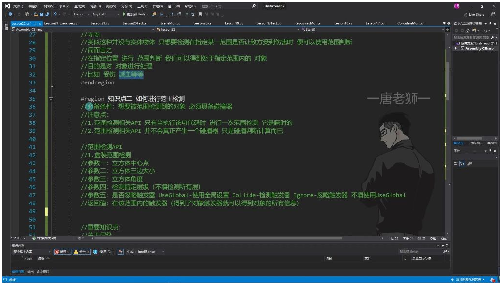
o o检测对象要求： 必须具有碰撞器组件（Collider） 不要求具备刚体组件（Rigidbody） o核⼼特点： 瞬时检测：API执⾏时⽴即完成检测计算 虚拟计算：仅进⾏数学上的碰撞判断，不⽣成实际碰撞器 •盒状范围检测API

## Page 3
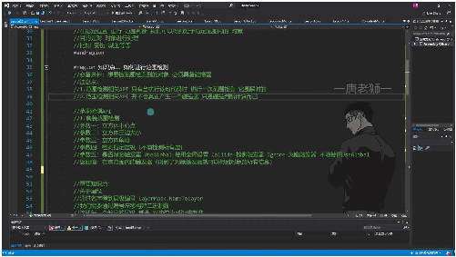
o oAPI路径：Physics.OverlapBox() o关键参数： 中⼼点：⽴⽅体检测区域的中⼼坐标 三边⼤⼩：⽴⽅体X/Y/Z轴向的尺⼨ 旋转⻆度：⽴⽅体的欧拉旋转⻆度 层级过滤：通过LayerMask指定检测层级 触发器处理：UseGlobal/Collide/Ignore三种模式 o返回值：碰撞器数组，可通过获取碰撞器访问对应游戏对象 o层级处理技巧： 使⽤LayerMask.NameToLayer获取层级编号 通过位运算构建层级过滤掩码 •实现原理
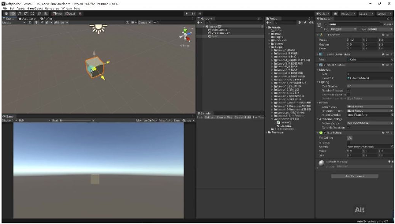
o o⼯作流程： 在指定位置创建虚拟碰撞体（⽴⽅体/球形/胶囊体） Unity⾃动遍历场景中所有碰撞器 计算虚拟碰撞体与实际碰撞器的相交情况 返回所有相交的碰撞器信息 o设计优势： 避免⼿动计算位置关系的复杂数学运算 ⽀持多种基本⼏何形状的检测 提供层级过滤等实⽤功能 2）范围检测与盒状范围检测 03:15 •范围检测API 06:38 o盒装范围检测 06:48 ⽴⽅体中⼼点 07:56

## Page 4
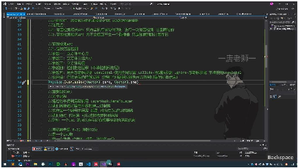
• •定义：⽴⽅体范围检测的中⼼坐标点，决定检测区域的基准位置 •参数类型：使⽤Vector3三维向量表示 •示例： o原点：Vector3.zero表示(0,0,0) o⾃定义点：如Vector3(1,2,3)表示x=1,y=2,z=3的位置 ⽴⽅体三边⼤⼩ 08:17
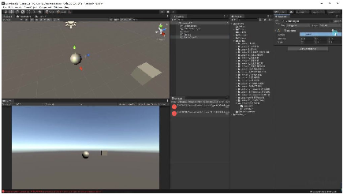
• •定义：⽴⽅体/⻓⽅体的⻓、宽、⾼尺⼨ •参数特点： o使⽤Vector3表示三轴⽅向的半边⻓ o可创建正⽅体（三边相等）或⻓⽅体（三边不等） •常⽤值： o单位⽴⽅体：Vector3.one即(1,1,1) o⾃定义尺⼨：如Vector3(2,1,3)表示⻓2、宽1、⾼3的⻓⽅体 ⽴⽅体⻆度 09:33
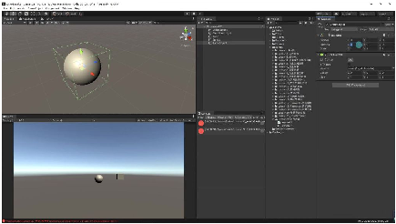
• •旋转表示：使⽤四元数Quaternion控制⽴⽅体朝向 •参数设置： o默认不旋转：Quaternion.identity o轴⻆对形式：如Quaternion.AngleAxis(45,Vector3.up)表示绕Y 轴旋转45度 •实际效果： o旋转后的检测区域会同步改变⽅向 o示例：Y轴旋转45度会使检测⽴⽅体对⻆线对⻬世界坐标轴 检测指定层级 11:00

## Page 5
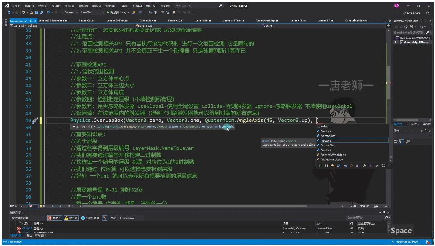
• •层级系统： oUnity内置32个层级（0-31） o对象通过Inspector窗⼝分配层级 •层级筛选： oAPI：LayerMask.NameToLayer获取层级编号 o位运算：通过左移操作构建⼆进制掩码 示例：1<<layerNumber将层级编号转换为位掩码 o组合检测：使⽤按位或运算组合多个层级 •参数特点： o不填参数时默认检测所有层级 o通过int类型存储多个层级检测配置 范围检测与层级系统 •范围检测基础
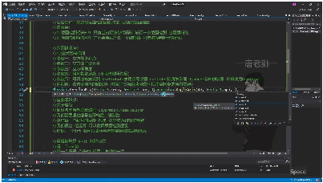
o o必备条件：想要被范围检测到的对象必须具备碰撞器组件 o检测特性： 范围检测API是瞬时执⾏的，只在代码执⾏时进⾏⼀次检测 不会真正产⽣碰撞器，仅进⾏碰撞判断计算 •盒状范围检测API
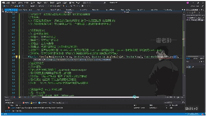
o o参数说明： 中⼼点：⽴⽅体检测区域的中⼼坐标 三边⼤⼩：⽴⽅体三个轴向的尺⼨ ⻆度：⽴⽅体的旋转⻆度（使⽤四元数表示） 检测层级：指定要检测的层级（可选参数） 触发器处理：UseGlobal（默认）/Collide/Ignore三种选项 o返回值：返回检测范围内的所有碰撞器数组

## Page 6
•层级系统原理
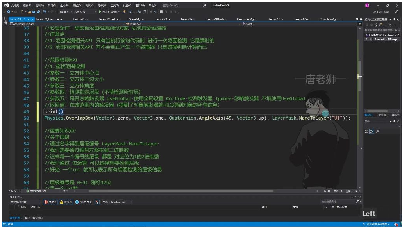
o o层级编号： 每个层都有唯⼀编号0-31，共32个层级 可通过LayerMask.NameToLayer("层名")获取层级编号 o⼆进制表示： 每个层级对应⼀个⼆进制位（如第5层 =00000000000000000000000000100000） 使⽤1左移运算构建：1<<n（n为层级编号） •层级检测的正确⽅法
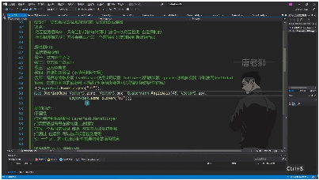
o o错误做法：直接传⼊层级编号（如传5检测UI层） o正确⽅法： 必须使⽤位运算构建检测掩码 示例：检测UI层(5)应传⼊1<<5（即32） o组合检测： 使⽤位或运算组合多个层级：(1<<5)|(1<<8) 可通过LayerMask.GetMask("层名1","层名2")快捷获取 •实际应⽤示例
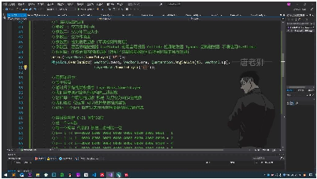
o o单层检测： o层级编号左移构建⼆进制数 14:30 层级检测原理

## Page 7
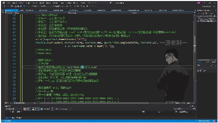
• •层级编号获取：通过LayerMask.NameToLayer("层级名")获取0-31的层级 编号 •⼆进制构建⽅法：使⽤1 << 层级编号构建对应位为1的⼆进制数 •位运算优势：⼀个int(32位)可表示所有要检测的层级组合 层级编号与⼆进制对应关系
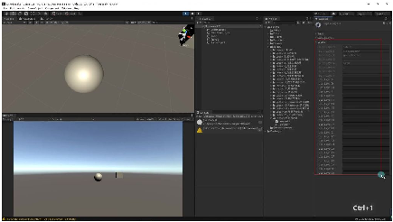
• •编号0：1<<0 →00000000000000000000000000000001_2= 1 •编号1：1<<1 →00000000000000000000000000000010_2= 2 •编号2：1<<2 →00000000000000000000000000000100_2= 4 •编号5(UI层)：1<<5 →00000000000000000000000000100000_2= 32 多层检测实现⽅法
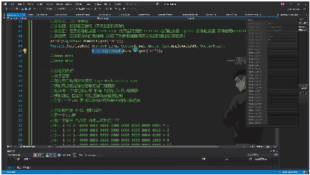
• •或运算组合：使⽤|运算符组合多个层级 o范围检测API
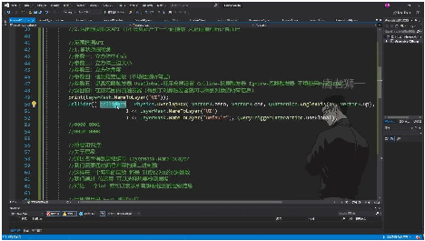
 基本功能：⽤于瞬时检测指定范围内的碰撞器对象 必备条件：被检测对象必须具备碰撞器组件 核⼼⽅法：Physics.OverlapBox()

## Page 8
盒状范围检测
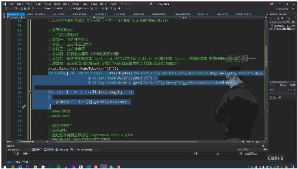
• •参数说明： o中⼼点：⽴⽅体中⼼的世界坐标（Vector3.zero表示原点） o三边⼤⼩：⽴⽅体三个轴向的尺⼨（Vector3.one表示1x1x1） o旋转⻆度：使⽤四元数表示⽴⽅体旋转（示例中绕Y轴旋转45度） o层级过滤：通过位运算组合检测层级（示例检测UI和Default层） o触发器处理：QueryTriggerInteraction.UseGlobal使⽤全局设置 •返回值：Collider[]数组，包含范围内所有碰撞器 o通过colliders[i].gameObject可获取完整游戏对象信息 o示例打印对象名称：print(colliders[i].gameObject.name) 层级检测原理
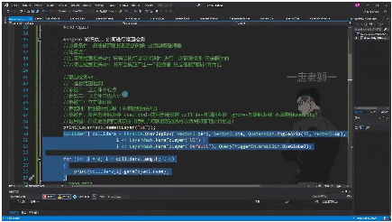
• •层级编号：0-31共32个层级，对应32位整数的各位 •位运算技巧： oLayerMask.NameToLayer("层级名")获取层级编号 o1 << 层级编号 构建对应⼆进制位 o示例：UI层(5)和Default层(0)组合检测：(1<<5) | (1<<0) 使⽤注意事项
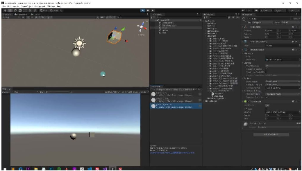
• •瞬时性：仅在执⾏代码时检测⼀次，不会持续检测 o如需持续检测需放⼊Update⽅法（但不推荐⾼频使⽤） o⾼频检测应改⽤触发器碰撞检测 •⾮实体性：不会实际创建碰撞器组件，仅内部计算 •典型应⽤： o技能伤害判定（如爆炸范围） o物品拾取检测

## Page 9
o场景交互检测 实际测试案例
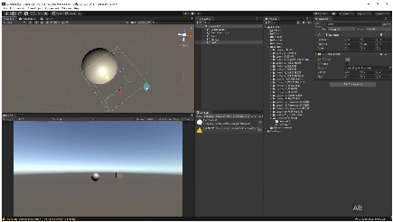
• •测试对象： o⽴⽅体(test)：尺⼨1x1x1，旋转45度 o球体(sphere)：与检测范围相交 o其他⽴⽅体：位于检测范围外 •检测结果： o正确输出相交对象名称：test和sphere o不相交对象不会被检测到 o动态移动对象需重新执⾏检测才能更新结果 o另⼀个API 29:20
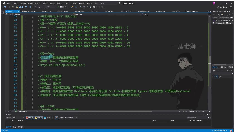
 OverlapBoxNonAlloc特点： •返回值是碰撞到的碰撞器数量（int类型） •需要预先声明数组作为参数传⼊存储结果 •相⽐OverlapBox更节省内存，避免频繁创建新数组 •典型⽤法：int count = Physics.OverlapBoxNonAlloc(center, halfExtents, results) o物理球形范围检测 29:44
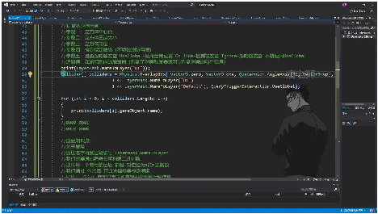
 核⼼参数： •中⼼点：球体的三维坐标位置 •球半径：检测范围的半径值 •层级过滤：通过位运算选择检测层级（可不填） •触发器处理：UseGlobal/Collide/Ignore三种模式

## Page 10
返回值：包含范围内所有碰撞器信息的数组 位运算技巧： •层级编号0-31对应32位int •通过1 << layerNumber构建⼆进制掩码 •示例：1 << 3得到00001000（⼗进制8） o物理胶囊范围检测 29:57
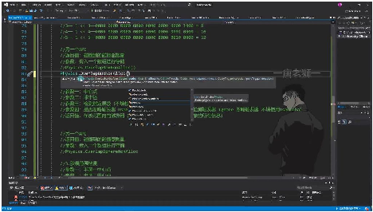
 关键参数： •半圆中⼼点：胶囊体两端半球中⼼坐标 •半径：胶囊截⾯半径 •⾼度：两个半圆中⼼点之间的距离 •⽅向：胶囊体的空间朝向 优化技巧： •使⽤NonAlloc版本避免GC开销 •通过返回值快速判断是否有碰撞（if(count > 0)） •层级掩码组合：1<<Layer1 | 1<<Layer2 ⼆、范围检测 31:06 1. 盒状范围检测 31:22
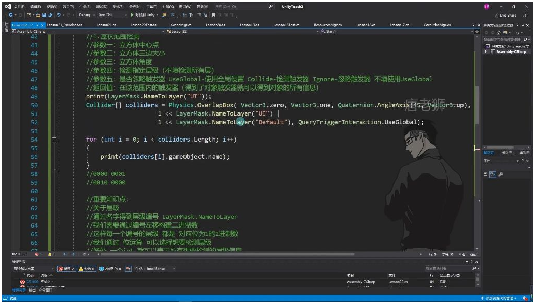
• •API⽅法: Physics.OverlapBox() •参数详解: o中⼼点: ⽴⽅体的中⼼坐标(Vector3) o三边⼤⼩: ⽴⽅体XYZ三个⽅向的尺⼨(Vector3) o旋转⻆度: 使⽤Quaternion指定⽴⽅体旋转 o检测层级: 通过LayerMask指定检测层级(可选) o触发器处理: QueryTriggerInteraction枚举控制触发器检测⾏为 •返回值: 返回Collider[]数组，包含范围内所有碰撞器 1）重要知识点

## Page 11
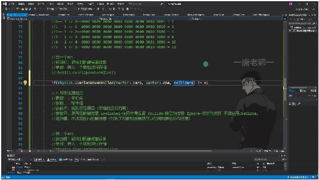
• •层级编号获取: LayerMask.NameToLayer("层级名")获取层级编号 •位运算应⽤: o通过1<<层级编号构建⼆进制掩码 o使⽤位或(|)运算组合多个层级 •优势: 单个int值可表示复杂的层级检测组合 2）关于层级 31:31
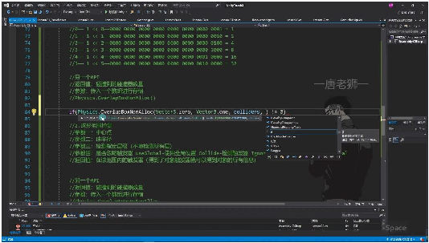
• •编号范围: Unity中层级编号为0-31，共32位 •⼆进制表示: 每个层级对应⼆进制数中⼀个位 o如层级3: 1<<3 = 8 (⼆进制00001000) o层级5: 1<<5 = 32 (⼆进制00100000) •组合检测: 如检测UI和Default层: (1<<UI层)|(1<<Default层) 2. 球形范围检测 32:04
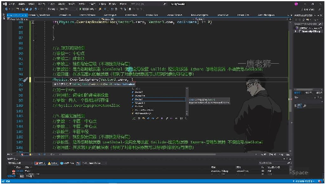
• •API⽅法: Physics.OverlapSphere() •参数区别: o半径替代尺⼨: 只需指定球体半径(float) o⽆旋转参数: 球体旋转不影响检测结果 •其他参数: 层级检测和触发器处理与盒状检测⼀致 •应⽤场景: 适合爆炸范围、声⾳传播等圆形区域检测

## Page 12
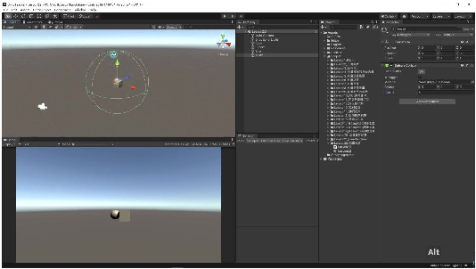
• •中⼼点调整: 可设置任意位置为中⼼点(如Vector3(0,0,5)) •可视化理解: 在Unity中创建Sphere Collider辅助理解检测范围 3. 胶囊范围检测 35:54
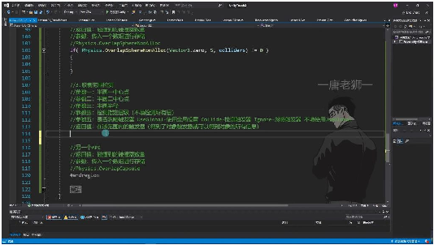
• •API⽅法: Physics.OverlapCapsule() •关键参数: o两点定义: 两个半圆中⼼点确定胶囊⽅向和⾼度 o半径参数: 统⼀控制圆柱半径和半球半径 •⻆度控制: 通过两点位置间接控制胶囊⻆度 •结构组成: 中间圆柱体+两端半球体的组合形状
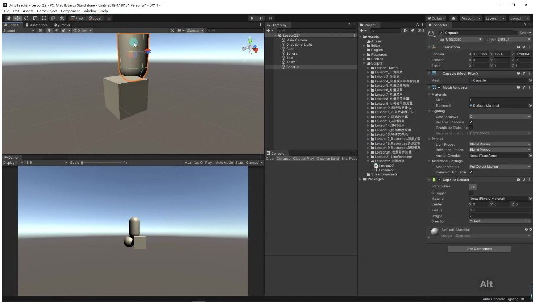
• •上半圆中⼼: 第⼀个参数点位置 •下半圆中⼼: 第⼆个参数点位置 •圆柱⾼度: 两点间距离决定 •半径统⼀: 单个参数控制整体粗细 4. 通⽤API特性

## Page 13
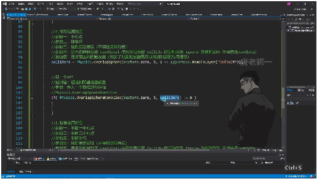
• •内存优化版: 所有检测都有NonAlloc版本(如OverlapBoxNonAlloc) •使⽤区别: o需预分配Collider[]数组作为参数传⼊ o返回碰撞数量⽽⾮数组，需配合if判断 o避免频繁GC，适合⾼频调⽤的场景 •推荐⽤法: if(Physics.OverlapXNonAlloc(...)!=0){处理逻辑} 5. 总结 41:03
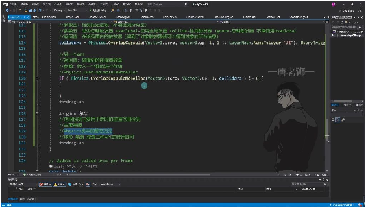
• •核⼼⽤途: 瞬时碰撞范围检测(⾮持续检测) •三类API: o盒状(OverlapBox): 适合⽅形区域 o球形(OverlapSphere): 适合圆形区域 o胶囊(OverlapCapsule): 适合柱形区域 •参数共性: o都⽀持层级过滤 o都⽀持触发器处理设置 o都有基础版和NonAlloc版 •必备条件: 被检测对象必须带有Collider组件 三、知识⼩结 知识点核⼼内容考试重点/易混难度系数 淆点 物理系统之范围Unity中⽤于瞬时碰撞判断的技层级检测的⼆⭐⭐⭐ 检测术，包含盒状/球形/胶囊三种进制运算逻辑⭐ 检测⽅式（1<<n位运 算） 盒状范围检测中⼼点+三边尺⼨+旋转⻆度构返回值是碰撞⭐⭐⭐ (OverlapBox)成检测区域器数组 vs

## Page 14
NonAlloc版本返 回数量 球形范围检测中⼼点+半径构成检测区域参数结构与盒⭐⭐ (OverlapSphere)状检测⾼度相 似 胶囊范围检测两点确定圆柱轴线+半径构成检通过两点坐标⭐⭐⭐ (OverlapCapsule)测区域隐式包含⻆度 信息 层级掩码通过位运算组合检⭐⭐⭐ (LayerMask)1<<LayerMask.NameToLayer构测多层（|运算⭐ 建⼆进制标识符） 触发器检测控制QueryTriggerInteraction枚举控全局设置路⭐⭐ 制检测⾏为径： Edit>Project Settings>Physics 瞬时检测特性只在执⾏API时单次检测，⾮持与触发器碰撞⭐⭐⭐ 续监测检测的应⽤场 景差异
